---
# required metadata

title: How to add data fields in tax configurations
description: This topic explains how to customize tax configuration with data fields.
author: kailiang
manager: beya
ms.date: 02/04/2021
ms.topic: article
ms.prod: 
ms.service: dynamics-ax-applications
ms.technology: 

# optional metadata

ms.search.form:
audience: Application user
# ms.devlang: 
ms.reviewer: kfend
ms.search.scope: Core, Operations
# ms.tgt_pltfrm: 
ms.custom: 
ms.search.region: Global
# ms.search.industry: 
ms.author: wangchen
ms.search.validFrom: 2021-04-01
ms.dyn365.ops.version: 10.0.18
---
# How to add data fields in tax configurations

This topic provides information about how to customize **Tax configuration** with [the data fields added in the tax integration](tax-service-how-to-add-data-fields-in-tax-integration-by-extension.md).

## Microsoft Dynamics Regulatory Service setup

### Customize tax data model

1.  Go to **Electronic Reporting** \>\> **Tax configurations**.

2.  Select "Tax Data Model - Europe", Click **Create configuration**.

3.  Click "Taxable document model derived from Name: Tax Data Model -- Europe, Microsoft", Enter **Name**, click **Create configuration**.

[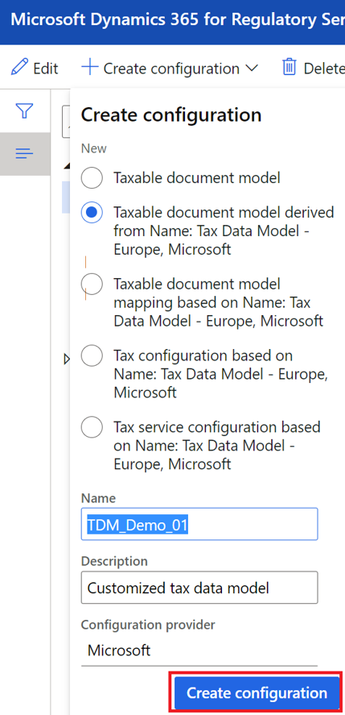](./media/tax-service-customize-image4.png)

4.  Select the created Tax data model, Click **Designer**.

[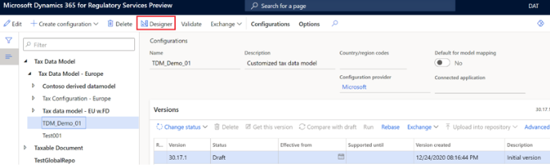](./media/tax-service-customize-image5.png)

5.  Expend the data model, select Lines, click **New**.

6.  **Create node**

[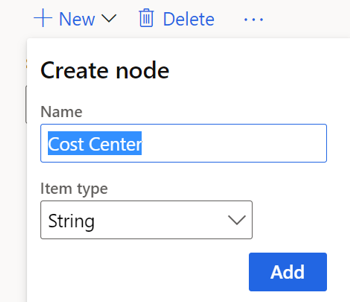](./media/tax-service-customize-image7.png)

[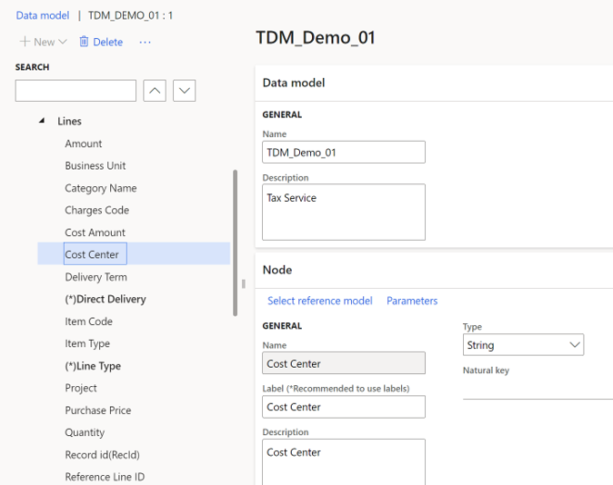](./media/tax-service-customize-image8.png)

7.  After adding required columns, **Save** and **Complete** your tax data model.

[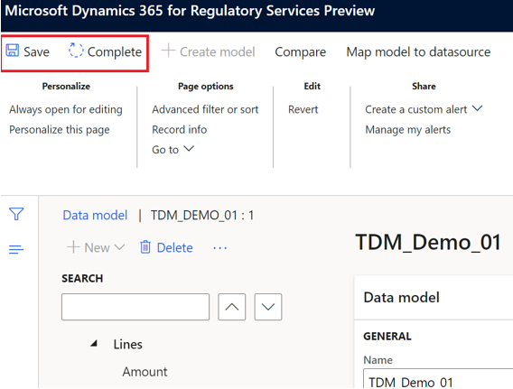](./media/tax-service-customize-image9.png)

8.  Close the page, check the latest "Completed" version of your tax data model.

[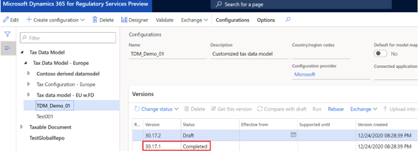](./media/tax-service-customize-image10.png)

### Customize tax configuration

9.  Select "Tax Configuration -- Europe", click **Create configuration**.

[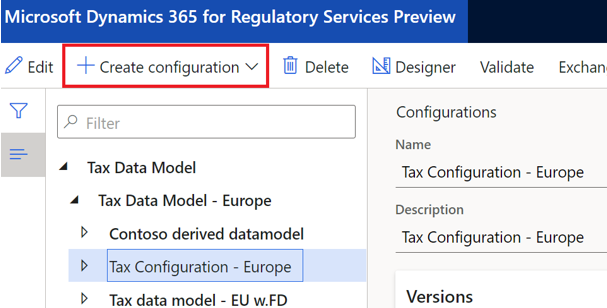](./media/tax-service-customize-image11.png)

10. Select "Tax service configuration derived from Name: Tax Configuration -- Europe, Microsoft", enter **Name**, Click **Create configuration**.

[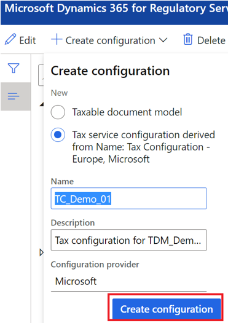](./media/tax-service-customize-image12.png)

11. Select the created Tax configuration, click **Designer**.

[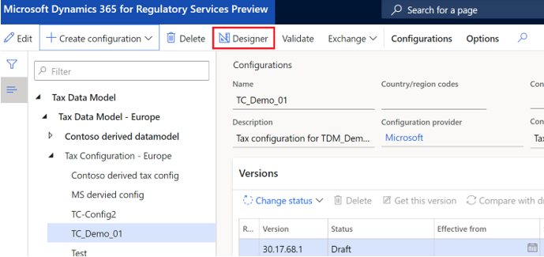](./media/tax-service-customize-image13.png)

12. In **Data model**, Select your customized tax data model.

[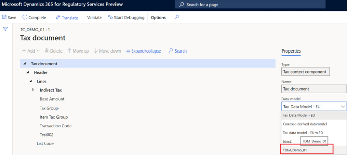](./media/tax-service-customize-image14.png)

13. In **Data model version**, select the completed version of the tax data model.

[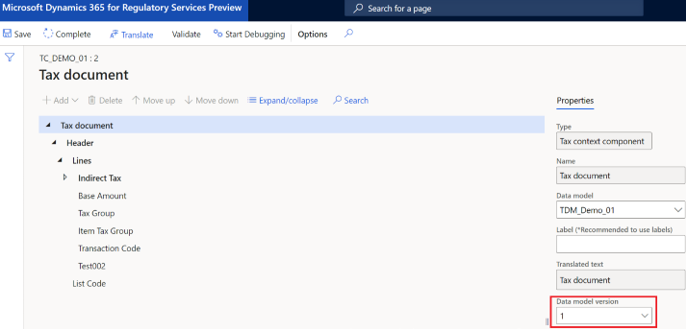](./media/tax-service-customize-image15.png)

14. **Add** tax measures in "Tax document".

[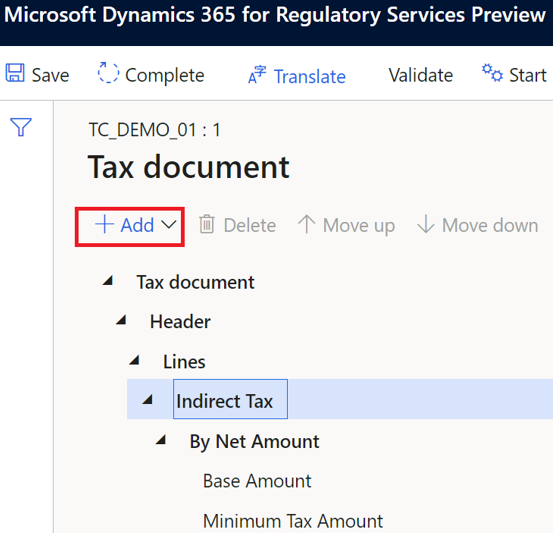](./media/tax-service-customize-image16.png)

15. After adding required tax measures, **Save** and **Complete** the tax configuration.

[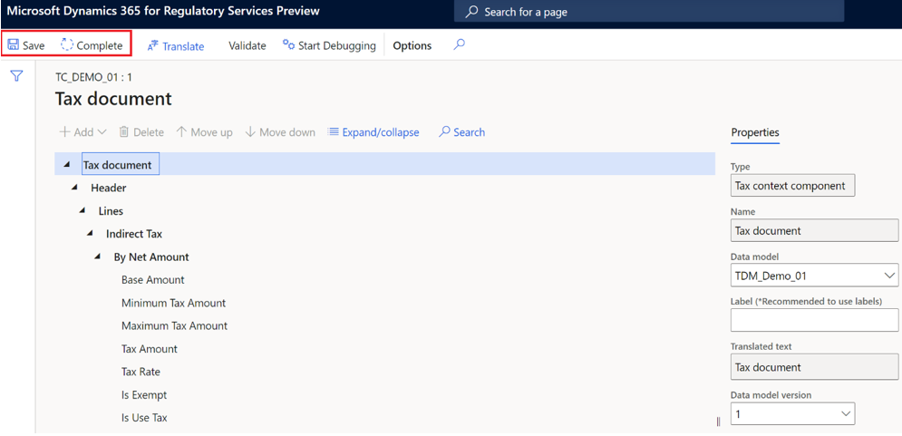](./media/tax-service-customize-image17.png)

16. Close page and check the latest "Completed" version of your tax configuration.

[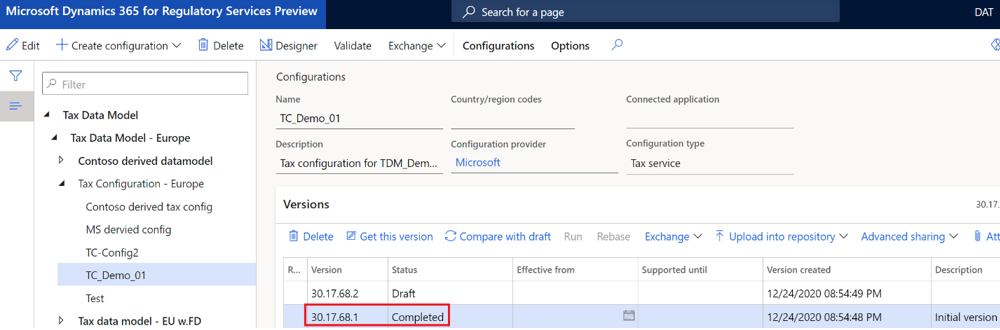](./media/tax-service-customize-image18.png)

### Implement tax features on the customized tax configurations

17. Go to **Globalization Features** \>\> **Tax**.

[[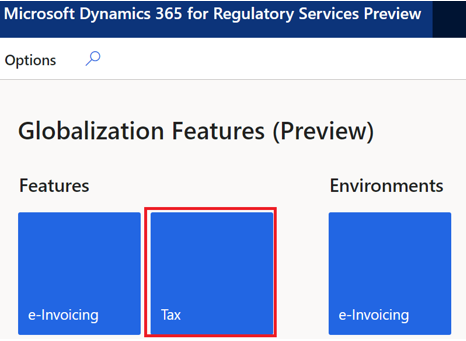](./media/tax-service-customize-image19.png)](./media/tax-service-customize-image19.png)

18. Create a new Tax feature, click **Create feature.**

[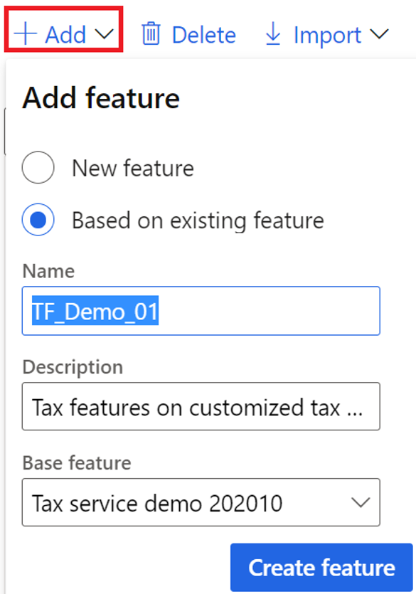](./media/tax-service-customize-image20.png)

19. Click **Edit**.

[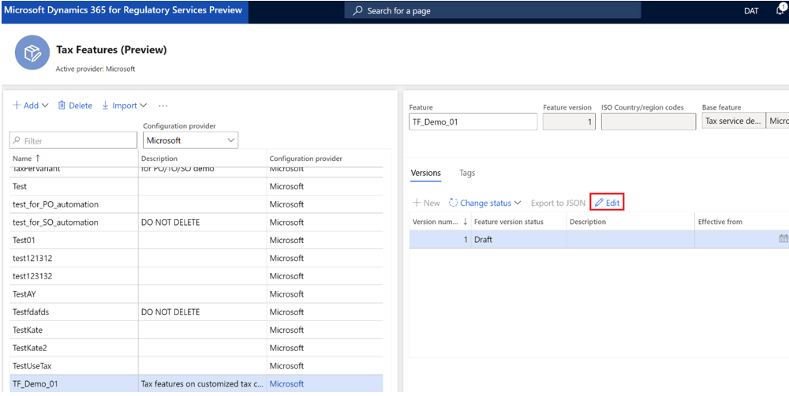](./media/tax-service-customize-image21.png)

20. In **General**, **Configuration version**, select the customized tax configuration and version.

[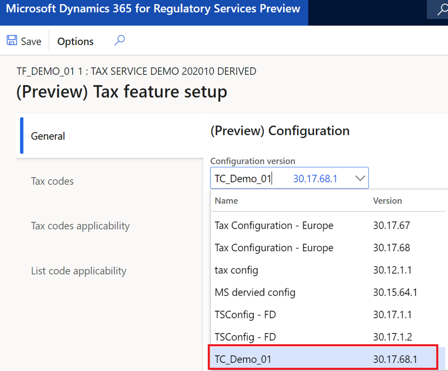](./media/tax-service-customize-image22.png)

21. You shall now be able to configure your tax features with customized columns and tax measures in the "Tax codes applicability" table.

