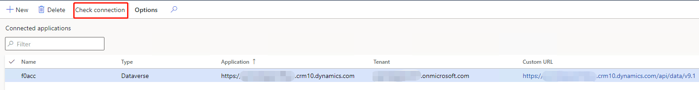
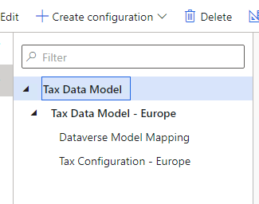
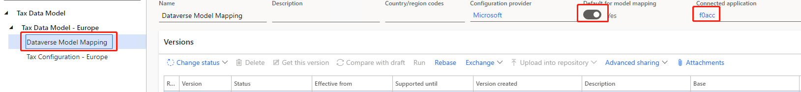

---
# required metadata

title: Enable master data lookup for tax calculation configuration
description: This topic explains how to set up and enable the tax calculation master data lookup functionality.
author: kai-cloud
ms.date: 11/22/2021
ms.topic: article
ms.prod: 
ms.technology: 

# optional metadata

ms.search.form:
audience: Application user
# ms.devlang: 
ms.reviewer: kfend
ms.search.scope: Core, Operations
# ms.tgt_pltfrm: 
ms.custom: 
ms.search.region: Global
# ms.search.industry: 
ms.author: pashao
ms.search.validFrom: 2021-04-01
ms.dyn365.ops.version: 10.0.18
---

# Enable master data lookup for tax calculation configuration 

[!include [banner](../includes/banner.md)]

This topic explains how to set up and enable the tax calculation master data lookup functionality. A drop-down list is available to select values in the tax calculation configuration for fields such as **Legal entity**, **Vendor account**, **Item code**, and **Delivery term**. These values come from the connected Microsoft Dynamics 365 Finance environment using the Microsoft Dataverse datasource.

> [!NOTE] 
> The tax calculation master data lookup functionality is optional functionality. You can skip the following steps if you disable the **Tax Service Dataverse datasourcese support** feature in Regulatory Configuration Service (RCS). However, in that case, the drop-down list won't be available in the tax calculation configuration.

1. Set up the Microsoft Power Platform integration in Microsoft Dynamics Lifecycle Services (LCS). For more information, see [Microsoft Power Platform integration - Add-ins overview](../../fin-ops-core/dev-itpro/power-platform/add-ins-overview.md). After you complete this step, the name of a Microsoft Power Platform environment will appear in the **Power Platform Integration** section.
2. Go to the [Microsoft Power Platform admin center](https://admin.powerplatform.microsoft.com/environments), and select the environment name. The environment URL is provided.
3. Set up Dynamics 365 Finance and Dataverse. For more information, see [Getting the virtual entity solution](../../fin-ops-core/dev-itpro/power-platform/admin-reference.md#get-virtual-entity-solution) and [Authentication and authorization](../../fin-ops-core/dev-itpro/power-platform/admin-reference.md#authentication-and-authorization).
4. Set up the following entities. For more information, see [Enable Microsoft Dataverse virtual entities](../../fin-ops-core/dev-itpro/power-platform/enable-virtual-entities.md).

    - CompanyInfoEntity
    - CurrencyEntity
    - CustCustomerV3Entity
    - DeliveryTermsEntity
    - EcoResProductCategoryEntity
    - EcoResReleasedProductV2Entity
    - LogisticsAddressCityEntity
    - LogisticsAddressCountryRegionTranslationEntity
    - LogisticsAddressStateEntity
    - PurchProcurementChargeCDSEntity
    - SalesChargeCDSEntity
    - TaxGroupEntity
    - TaxItemGroupHeadingEntity
    - VendVendorV2Entity

5. Set up Regulatory Configuration Service (RCS). Open the **Feature management** workspace, and enable the following features:

    - Electronic reporting Dataverse datasources support
    - Tax Service Dataverse datasources support
    - Globalization features

6. Sign in to RCS using a tenant admin account.
7. Go to **Electronic reporting** > **Connected applications**. 
8. Select **New** to add a record, and enter the following field information. 

    - In the **Name** field, enter a name.
    - In the **Type** field, select **Dataverse**.
    - In the **Application** field, enter your Dataverse URL.
    - In the **Tenant** field, enter your tenant.
    - In the **Custom URL** field, enter your Dataverse URL and append it with "/api/data/v9.1".

9. Select **Check connection**, and finish the connection process. 

    

10. Go to **Electronic reporting** > **Tax configurations**, and import tax configurations from [Tax configurations](https://go.microsoft.com/fwlink/?linkid=2158352).

    

11. Go to the **Taxable document model mapping**, or **Dataverse Model Mapping** if you are using a Microsoft configuration, and in the **Connected application** field, select the record that you created in step 7.
12. Set **Default for model mapping** to **Yes**.

    

[!INCLUDE[footer-include](../../includes/footer-banner.md)]
