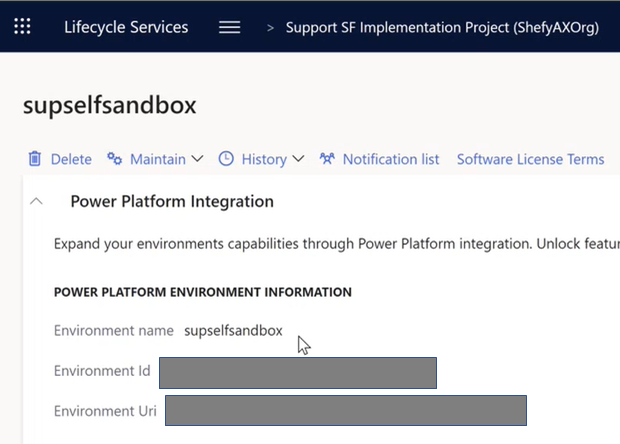
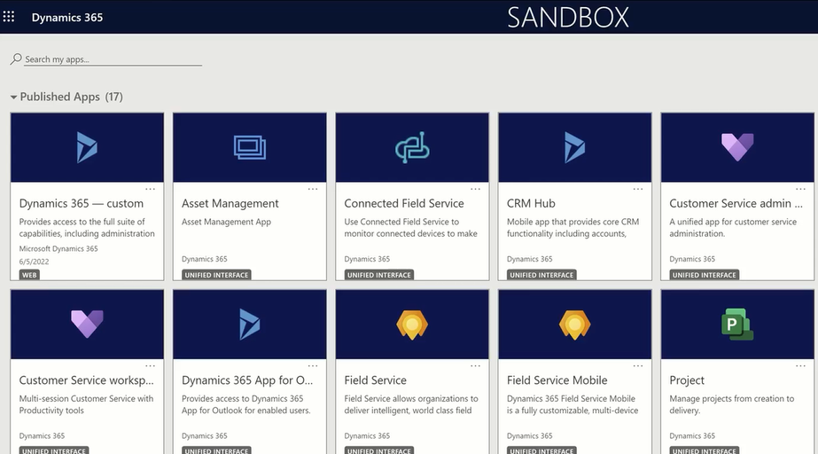
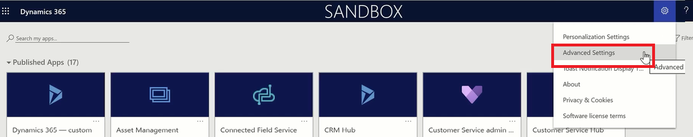
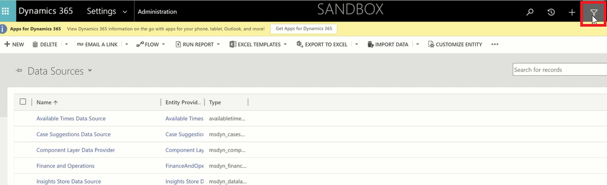
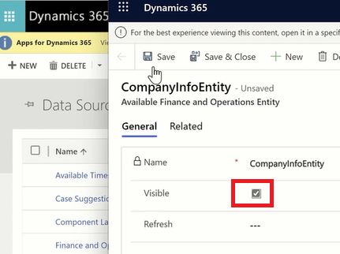

---
# required metadata

title: Enable master data lookup for tax calculation configuration
description: This article explains how to set up and enable the tax calculation master data lookup functionality.
author: kai-cloud
ms.date: 11/22/2021
ms.topic: article
ms.prod: 
ms.technology: 

# optional metadata

ms.search.form:
audience: Application user
# ms.devlang: 
ms.reviewer: kfend

# ms.tgt_pltfrm: 
ms.custom: 
ms.search.region: Global
# ms.search.industry: 
ms.author: pashao
ms.search.validFrom: 2021-04-01
ms.dyn365.ops.version: 10.0.18
---

# Enable master data lookup for tax calculation configuration 

[!include [banner](../includes/banner.md)]

This topic explains how to set up and enable the tax calculation master data lookup functionality. A drop-down list is available to select values in the tax calculation configuration for fields such as **Legal entity**, **Vendor account**, **Item code**, and **Delivery term**. These values come from the connected Microsoft Dynamics 365 Finance environment using the Microsoft Dataverse datasource.

> [!NOTE] 
> The tax calculation master data lookup functionality is optional functionality. You can skip the following steps if you disable the **Tax Service Dataverse datasources support** feature in Regulatory Configuration Service (RCS). However, in that case, the drop-down list won't be available in the tax calculation configuration.

To enable the drop-down list in the feature version configuration of Tax Calculation, you must complete the following steps:
1. Enable Microsoft Power Platform integration and open the Dataverse environment.
2. Install Finance and Operation Virtual Entity solution.
3. Register azure AD application.
4. Grant app permissions.
5. Configure the virtual entity data source.
6. Enable Microsoft Dataverse virtual entities.
7. Setup the connected application for Tax Calculation.
8. Import and setup Dataverse Model Mapping.

## Step 1 - Enable Microsoft Power Platform integration and open the Dataverse environment
By default, all Finance and Operations apps environments that are managed by Microsoft Dynamics Lifecycle Services (LCS) will receive a linked Power Platform environment without Dataverse.
  1. In LCS, in your *Finance and Operations environment*, under **Power Platform Integration** section, find and note down the linked **Environment name**. 
  2. Follow the [link](https://admin.powerplatform.microsoft.com/environments) to Microsoft Power Platform admin center. In the **Environments** tab, click on the enviroment which matches the name you just noted.
  3. In the **Details** page, you can find the **Environment URL** of the Dataverse environment. Make a note of the **Environment URL** value, because you will need it the [Step 7 - Setup the connected application for Tax Calculation]().
  4. Make sure that you can open the Dataverse environment in your browser via clicking the **Environment URL**.
    

  > [!Note]
  > Keep the Dataverse environment open in your browser, because you'll need it for [Step 5 - Configure the virtual entity data source]().

For more information, see [Enable the Microsoft Power Platform integration](https://docs.microsoft.com/en-us/dynamics365/fin-ops-core/dev-itpro/power-platform/enable-power-platform-integration).

## Step 2 - Install Finance and Operation Virtual Entity
The Dataverse solution for Finance and Operations virtual entities must be installed from Microsoft AppSource virtual entity solution.
1. Follow the [link](https://appsource.microsoft.com/en/product/dynamics-365/mscrm.finance_and_operations_virtual_entity) to find the **Finance and Operations Virtual Entity** in Microsoft AppSource.
2. Click **Get it now**
3. In the **Select an environment** field, enter the **Environment name** you noted down in above steps.
4. Tick the check boxes and click **Install**.

When the installation is completed, you shall be able to find the **Finance and Operation Virtual Entity** app in  [Microsoft Power Platform admin center](https://admin.powerplatform.microsoft.com/) under **Resources** > **Dynamics 365 apps**.

For more information, see [Getting the virtual entity solution](https://docs.microsoft.com/en-us/dynamics365/fin-ops-core/dev-itpro/power-platform/admin-reference#get-virtual-entity-solution).
   
## Step 3 - Register Azure AD application
Register an Azure AD application on the same tenant as the Finance and Operations apps. You will need this application for Dataverse to call Finance and Operations apps.
1.  Go to <https://portal.azure.com> **\> Azure Active Directory \> App registrations**.

2.  Select **New Registration**. Enter the following information:

    - **Name** - Enter a unique name.

    - **Account type** - Enter **Any Azure AD directory** (single or multi-tenant).

    - **Redirect URI** - Leave blank.

    - Select **Register**.

    - Make a note of the **Application (client) ID** value, because you will need it later. 

3.  Create a symmetric key for the application.

    - Select **Certificates & secrets** in the newly created application.

    - Select **New client secret**.

    - Provide a description and an expiration date.

    - Select **Save**. A key will be created and displayed. Copy this value for later use.

For more information, see [Register Azure AD application](https://docs.microsoft.com/en-us/dynamics365/fin-ops-core/dev-itpro/power-platform/admin-reference#register-the-app-in-the-azure-portal).

## Step 4 - Grant app permissions in Finance and Operations apps.
The Azure AD application that you created will be used by Dataverse to call Finance and Operations apps. Therefore, it must be trusted by Finance and Operations apps and associated with a user account that has the appropriate rights. A special service user that has rights **only** to the virtual entity functionality must be created in Finance and Operations apps. This service user must have no other rights. After you complete this step, any application that has the secret of the Azure AD application that you created will be able to call this Finance and Operations apps environment and access the virtual entity functionality.

1.  In Finance and Operations, go to **System Administration \> Users \> Users**.

2.  Select **New** to add a new user. Enter the following information:

    - **User ID** - Enter **dataverseintegration** (or a different value).

    - **User name** - Enter **dataverse integration** (or a different value).

    - **Provider** - Set to **NonAAD**.

    - **Email** - Enter **dataverseintegration** (or a different value, does *not* need to be a valid email account).

    - Assign the security role **CDS virtual entity application** to this user.

    - Remove all other roles including **System user**.

3.  Go to **System Administration \> Setup \> Azure Active Directory applications** to register Dataverse. 

    - Add a new row.

    - **Client ID** - The **Application (client) ID** created above

    - **Name** - Enter **Dataverse Integration** (or a different name).

    - **User ID** - The user ID created above.

For more information, see [Grant app permissions in Finance and Operations apps](https://docs.microsoft.com/en-us/dynamics365/fin-ops-core/dev-itpro/power-platform/admin-reference#grant-app-permissions-in-finance-and-operations-apps)

## Step 5 - Configure the virtual entity data source
The next step in the process is to provide Dataverse with the Finance and Operations instance to connect to. The following steps walk through this part of the process.
1.  In your Dataverse environment (see [Step 1 - Enable Microsoft Power Platform integration and open the Dataverse environment]()).
   
2.  Go to **Advanced Settings**. 
   
3.  Click the **Settings** drop-down menu, and open **Administration**. 

4.  Click the **Virtual Entity Data Sources**. 
   
5.  Select the data source named "Finance and Operations". 

6.  Fill in the information from the steps above.

    - **Target URL** - The URL at which you can access Finance and Operations.

    - **OAuth URL** - https://login.windows.net/

    - **Tenant ID** - Your tenant, it can be the domain name of your company email (such as contoso.com).

    - **AAD Application ID** - The **Application (client) ID** created above.

    - **AAD Application Secret** - The secret generated above.

    - **AAD Resource** - Enter 00000015-0000-0000-c000-000000000000 (this is the Azure AD application representing Finance and Operations, and should always be this same value).

7.  Save the changes.
   
8.  Close the page and get back to the **Administration** page for [Step 6 - Enable Microsoft Dataverse virtual entities]() 

For more information, see [Configure the virtual entity data source](https://docs.microsoft.com/en-us/dynamics365/fin-ops-core/dev-itpro/power-platform/admin-reference#configure-the-virtual-entity-data-source)

## Step 6 - Enable Microsoft Dataverse virtual entities
The visibility of the virtual entities from Finance and Operations apps must be set to **Yes** before it can be consumed by the Tax Calculation configuration.
> [!Note] Above release 10.0.26 @jiahui, you can skip this step by enabling the Tax Calculation related virtual entities in [Step 8 - Setup the connected application for Tax Calculation]() with just one click.

1. In the **Administration** page, click on the filter button on the right-up corner.

2. In the **ADVANCED FIND** window, Select **Available Finance and Operations Entites** in the **Look for** option.
   
3. Add a rule, **Name Contains CompanyInfoEntity**, click **Results**. 
   
4. Click the **CompanyInfoEntity** in the search result, tick the **Visible** check box and click **Save**. 

5. Repeat above steps for the following entities which are referred in the configuration of Tax Calculation.
   - CompanyInfoEntity
   - CurrencyEntity
   - CustCustomerV3Entity
   - DeliveryTermsEntity
   - EcoResProductCategoryEntity
   - EcoResReleasedProductV2Entity
   - LogisticsAddressCountryRegionTranslationEntity
   - LogisticsAddressStateEntity
   - PurchProcurementChargeCDSEntity
   - SalesChargeCDSEntity
   - TaxGroupEntity
   - TaxItemGroupHeadingEntity
   - VendVendorV2Entity
   - InventOperationalSiteV2Entity
   - TaxExemptCodeEntity
   - InventWarehouseEntity
   > [!Note]
   > Only the first 5000 records of an entity can be retrieved by Dataverse and be made available in the drop-down list of tax calculation configuration.
  
For more information, see [Enable Microsoft Dataverse virtual entities](https://docs.microsoft.com/en-us/dynamics365/fin-ops-core/dev-itpro/power-platform/enable-virtual-entities)

## Step 7 - Setup the connected application for Tax Calculation
1. In Regulatory Configuration Service (RCS), open the **Feature management** workspace, and enable the following features:
    - Electronic reporting Dataverse datasources support
    - Tax Service Dataverse datasources support
    - Globalization features
2. Go to **Electronic reporting** > **Connected applications**. 
3. Select **New** to add a record, and enter the following field information.
   - In the Name field, enter a name.
   - In the Type field, select Dataverse.
   - In the Application field, enter your (Dataverse) **Environment URL** which you noted down in [step 1 - Enable Microsoft Power Platform integration and open your Dataverse environment]().
   - In the Tenant field, enter your tenant.
   - In the Custom URL field, enter your Dataverse URL and append it with "/api/data/v9.1".

4. Select **Check connection**, in the pop-up dialog, follow the **Click here to connect to selected remote application** link.
   
5. Make sure you receive the **Success!** message. The connection is successfully established.
   

## Step 8 - Import and setup Dataverse Model Mapping
Microsoft provides default model mapping configurations for entities from Finance and Operations apps to Tax Calculation.
1. In Regulatory Configuration Service (RCS), go to **Electronic reporting**.
2. In **Configuration providers**, find **Microsoft**, select **Repositories**
   
3. Select the **Global configuration repository** record, select **Open**.
4. Find the **Dataverse Model Mapping** configuration under **Tax Data Model** > **Tax Calculation Data Model**.
5. Select a version which matches to your Finance and Operations version, select **Import**.
   

   > [!Note] 
   > The **Dataverse Model Mapping** is effective only on its highest imported version. It means you should not import a higher version of **Dataverse Model Mapping** than the to-be-implemented **Tax Calculation Configuration** version.
   E.g. If you plan to implement the "40.50.225" **Tax Calculation configuration** version, you should only import the "40.50.13" **Dataverse Model Mapping** version. You should not import version "40.54.14" which would cause the data model mismatching in the configuration.

6. Go back to **Electronic reporting**, select the **Tax configurations** tile.
7. Select the imported **Dataverse Model Mapping** configuration, select **Edit**.
8. Switch **Default for model mapping** to **Yes**.
9. In **Connected application** field, select the connected application you just setup in [Step 7 - Setup the connected application for Tax Calculation]()
10. Above release 10.0.26, the switch button **Set virtual table visibility** is available after the **Connected application** is maintained. Switch it to **Yes** to set all Tax Calculation related virtual entities to visible.

You have completed the setup for master data lookup function. The drop-down list of **Legal entity**, **Vendor account**, **Item code**, **Delivery term**, and etc. from your Dynamics 365 Finance shall be now enabled in the **Tax Calculation FEATURE VERSION** setup. 

[!INCLUDE[footer-include](../../includes/footer-banner.md)]
