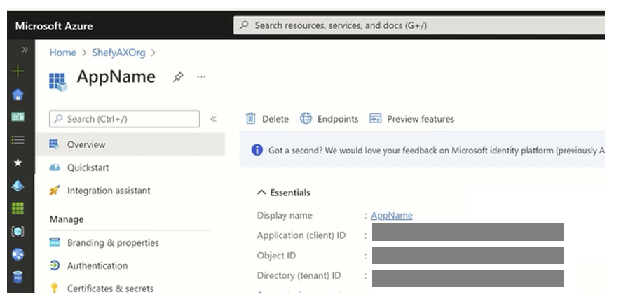
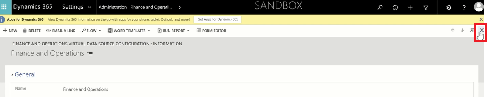
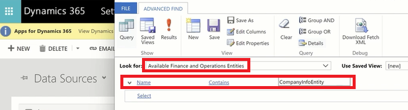
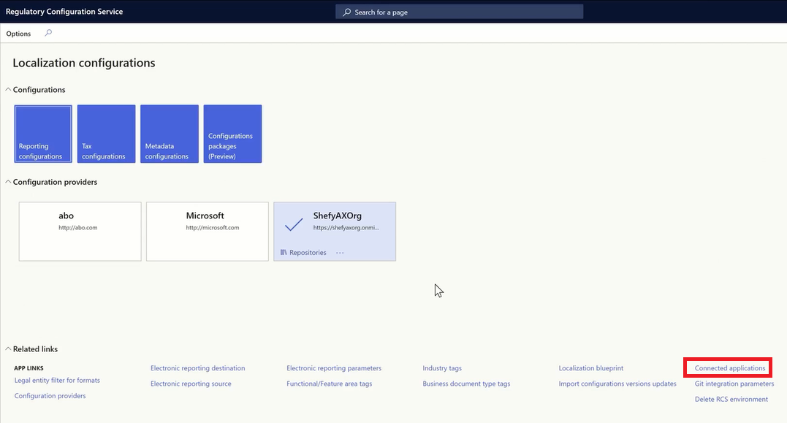
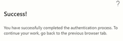
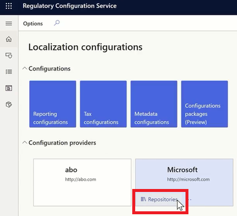
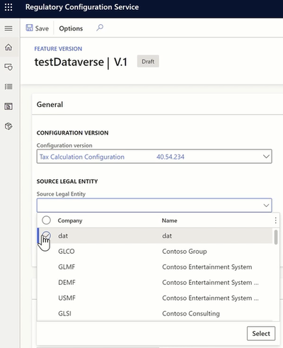

---
# required metadata

title: Enable master data lookup for tax calculation configuration
description: This article explains how to set up and enable the tax calculation master data lookup functionality.
author: kai-cloud
ms.date: 11/22/2021
ms.topic: article
ms.prod: 
ms.technology: 

# optional metadata

ms.search.form:
audience: Application user
# ms.devlang: 
ms.reviewer: kfend

# ms.tgt_pltfrm: 
ms.custom: 
ms.search.region: Global
# ms.search.industry: 
ms.author: pashao
ms.search.validFrom: 2021-04-01
ms.dyn365.ops.version: 10.0.18
---

# Enable master data lookup for tax calculation configuration 

[!include [banner](../includes/banner.md)]

This article explains how to set up and enable the tax calculation master data lookup functionality. A drop-down list is available to select values in the tax calculation configuration for fields such as **Legal entity**, **Vendor account**, **Item code**, and **Delivery term**. These values come from the connected Microsoft Dynamics 365 Finance environment using the Microsoft Dataverse datasource.

> [!NOTE] 
> The tax calculation master data lookup functionality is optional functionality. You can skip the following steps if you disable the **Tax Service Dataverse datasources support** feature in Regulatory Configuration Service (RCS). However, in that case, the drop-down list won't be available in the tax calculation configuration.

To enable the drop-down list in the feature version configuration of Tax Calculation, complete the following steps.

1. [Enable Microsoft Power Platform integration and open the Microsoft Dataverse environment.](#enable)
2. [Install the finance and operations virtual entities.](#install)
3. [Register an Azure AD application.](#register)
4. [Grant app permissions.](#grant)
5. [Configure the virtual entity data source.](#configure)
6. [Enable Dataverse virtual entities.](#virtual)
7. [Set up the connected application for Tax Calculation.](#set-up)
8. [Import and setup Dataverse Model Mapping.](#import)

##  Enable Microsoft Power Platform integration and open the Dataverse environment
The integration of finance and operations apps with Microsoft Power Platform can be enabled when you create a new finance and operations apps environment in Microsoft Dynamics Lifecycle Services (LCS). For more information, see [Microsoft Power Platform integration - Add-ins overview](../../fin-ops-core/dev-itpro/power-platform/add-ins-overview.md). After you complete it, the name of a Microsoft Power Platform environment will appear in the **Power Platform Integration** section.
  1. In LCS, in your finance and operations environment, under the **Power Platform Integration** section, find and note down the linked environment name. 
  
     
  
  2. In the [Power Platform admin center](https://admin.powerplatform.microsoft.com/environments), on the **Environments** tab, select the enviroment that matches the envrionment name you just noted in LCS.
  3. On the **Details** page, find the **Environment URL** of the Dataverse environment. Make a note of the **Environment URL** value, because you will need it in [Step 7. Set up the connected application for Tax Calculation](#set-up).
  4. Make sure you can open the Dataverse environment in your browser by selecting the **Environment URL**.
    
     

  > [!NOTE]
  > Keep the Dataverse environment open in your browser. Youll need it for [Step 5. Configure the virtual entity data source](#configure).

For more information, see [Enable the Microsoft Power Platform integration](../../fin-ops-core/dev-itpro/power-platform/enable-power-platform-integration.md).

## Install finance and operations virtual entities
The Dataverse solution for finance and operations virtual entities must be installed from Microsoft AppSource virtual entity solution.
1. Find the [Finance and operations virtual entity](https://appsource.microsoft.com/en/product/dynamics-365/mscrm.finance_and_operations_virtual_entity) in Microsoft AppSource.
2. Select **Get it now**.
3. In the **Select an environment** field, enter the **Environment name** you noted down earlier.
4. Select the check boxes and then select **Install**.

When the installation is complete, find the **Finance and operations virtual entity** app on the [Microsoft Power Platform admin center](https://admin.powerplatform.microsoft.com/) under **Resources** > **Dynamics 365 apps**.

For more information, see [Getting the virtual entity solution](../../fin-ops-core/dev-itpro/power-platform/admin-reference.md#get-virtual-entity-solution).
   
##  Register an Azure AD application
Register an Azure AD application on the same tenant as the finance and operations apps so that they can be called by Dataverse.

1. Go to <https://portal.azure.com> **\> Azure Active Directory \> App registrations**.
2. Select **New Registration** and enter the following information:

    - **Name** - Enter a unique name.
    - **Account type** - Enter **Any Azure AD directory** (single or multi-tenant).
    - **Redirect URI** - Leave this field blank.

3. Select **Register**.
4. Make a note of the **Application (client) ID** value as you will need it later. 

   

5. Create a symmetric key for the application.
6. Select **Certificates & secrets** in the new application.
7. Select **New client secret**.
8. Enter a description, select an expiration date, and then select **Save**. A key will be created and displayed. Copy this value for later use.

For more information, see [Register Azure AD application](../../fin-ops-core/dev-itpro/power-platform/admin-reference.md#register-the-app-in-the-azure-portal).

##  Grant app permissions in finance and operations apps
The Azure AD application that you create is used by Dataverse to call finance and operations apps. The application must be trusted by the finance and operations apps and associated with a user account that has the appropriate rights. A special service user that has rights **only** to the virtual entity functionality must be created in the finance and operations apps. This service user must have no other rights. After you complete this step, any application that has the secret of the Azure AD application that you created will be able to call this finance and operations apps environment and access the virtual entity functionality.

1. In your environment, go to **System Administration** > **Users** > **Users**.
2. Select **New** to add a new user. Enter the following information:

    - **User ID** - Enter **dataverseintegration** (or a different value).
    - **User name** - Enter **dataverse integration** (or a different value).
    - **Provider** - Set to **NonAAD**.
    - **Email** - Enter **dataverseintegration** (or a different value, doesn't have to be a valid email account).

3. Assign the security role **CDS virtual entity application** to this user.
4. Remove all other roles including **System user**.
5. Go to **System Administration** > **Setup** > **Azure Active Directory applications** to register Dataverse. 
6. Add a new row and in the **Client ID** field, enter the **Application (client) ID** you saved earlier.
7. In the **Name** field, enter a name. For example, **Dataverse Integration**.
8. In the **User ID** field, enter the user ID you created earlier. 

For more information, see [Grant app permissions in Finance and Operations apps](../../fin-ops-core/dev-itpro/power-platform/admin-reference.md#grant-app-permissions-in-finance-and-operations-apps).

##  Configure the virtual entity data source
The next step in the process is to provide Dataverse with the Finance and Operations instance to connect to. The following steps walk through this part of the process.

1. In your Dataverse environment (see [Step 1. Enable Microsoft Power Platform integration and open the Dataverse environment](#enable)).
2. Go to **Advanced Settings**. 
3. Click the **Settings** drop-down menu, and open **Administration**. 
4. Click the **Virtual Entity Data Sources**.   
5. Select the data source named "Finance and Operations". 
6. Fill in the information from the steps above.

    - **Target URL** - The URL at which you can access Finance and Operations.
    - **OAuth URL** - https://login.windows.net/
    - **Tenant ID** - Your tenant, it can be the domain name of your company email (such as contoso.com).
    - **AAD Application ID** - The **Application (client) ID** created above.
    - **AAD Application Secret** - The secret generated above.
    - **AAD Resource** - Enter 00000015-0000-0000-c000-000000000000 (this is the Azure AD application representing Finance and Operations, and should always be this same value).

7. Save the changes. 
8. Close the page and get back to the **Administration** page for [Step 6 - Enable Microsoft Dataverse virtual entities]() 

For more information, see [Configure the virtual entity data source](../../fin-ops-core/dev-itpro/power-platform/admin-reference.md#configure-the-virtual-entity-data-source).

##  Enable Microsoft Dataverse virtual entities
The visibility of the virtual entities from Finance and Operations apps must be set to **Yes** before it can be consumed by the Tax Calculation configuration.
> [!Note] You can skip this step by enabling the Tax Calculation related virtual entities in [Step 8 - Setup the connected application for Tax Calculation]() with just one click. But, it is recommended to enable at least one virtual entity manually, which indicates the connection between Finance and Operations apps and Dataverse is well established.

1. In the **Administration** page, click on the filter button on the right-up corner.

2. In the **ADVANCED FIND** window, Select **Available Finance and Operations Entites** in the **Look for** option.
   
3. Add a rule, **Name Contains CompanyInfoEntity**, click **Results**. 
   
4. Click the **CompanyInfoEntity** in the search result, tick the **Visible** check box and click **Save**. 

5. Repeat above steps for the following entities which are referred in the configuration of Tax Calculation.
   - CompanyInfoEntity
   - CurrencyEntity
   - CustCustomerV3Entity
   - DeliveryTermsEntity
   - EcoResProductCategoryEntity
   - EcoResReleasedProductV2Entity
   - LogisticsAddressCountryRegionTranslationEntity
   - LogisticsAddressStateEntity
   - PurchProcurementChargeCDSEntity
   - SalesChargeCDSEntity
   - TaxGroupEntity
   - TaxItemGroupHeadingEntity
   - VendVendorV2Entity
   - InventOperationalSiteV2Entity
   - TaxExemptCodeEntity
   - InventWarehouseEntity
   > [!Note]
   > Only the first 5000 records of an entity can be retrieved by Dataverse and be made available in the drop-down list of tax calculation configuration.
  
For more information, see [Enable Microsoft Dataverse virtual entities](https://docs.microsoft.com/en-us/dynamics365/fin-ops-core/dev-itpro/power-platform/enable-virtual-entities)

##  Setup the connected application for Tax Calculation
1. In Regulatory Configuration Service (RCS), open the **Feature management** workspace, and enable the following features:
    - Electronic reporting Dataverse datasources support
    - Tax Service Dataverse datasources support
    - Globalization features
2. Go to **Electronic reporting** > **Connected applications**. 
3. Select **New** to add a record, and enter the following field information.
   - In the Name field, enter a name.
   - In the Type field, select Dataverse.
   - In the Application field, enter your (Dataverse) **Environment URL** which you noted down in [step 1 - Enable Microsoft Power Platform integration and open your Dataverse environment]().
   - In the Tenant field, enter your tenant.
   - In the Custom URL field, enter your Dataverse URL and append it with "/api/data/v9.1".

4. Select **Check connection**, in the pop-up dialog, follow the **Click here to connect to selected remote application** link.
   
5. Make sure you receive the **Success!** message. The connection is successfully established.
   

##  Import and setup Dataverse Model Mapping
Microsoft provides default model mapping configurations for entities from Finance and Operations apps to Tax Calculation.
1. In Regulatory Configuration Service (RCS), go to **Electronic reporting**.
2. In **Configuration providers**, find **Microsoft**, select **Repositories**
   
3. Select the **Global configuration repository** record, select **Open**.
4. Find the **Dataverse Model Mapping** configuration under **Tax Data Model** > **Tax Calculation Data Model**.
5. Select a version which matches to your Finance and Operations version, select **Import**.
   

   > [!Note] 
   > The **Dataverse Model Mapping** is effective only on its highest imported version. It means you should not import a higher version of **Dataverse Model Mapping** than the to-be-implemented **Tax Calculation Configuration** version.
   E.g. If you plan to implement the "40.50.225" **Tax Calculation configuration** version, you should only import the "40.50.13" **Dataverse Model Mapping** version. You should not import version "40.54.14" which would cause the data model mismatching in the configuration.

6. Go back to **Electronic reporting**, select the **Tax configurations** tile.
7. Select the imported **Dataverse Model Mapping** configuration, select **Edit**.
8. Switch **Default for model mapping** to **Yes**.
9. In **Connected application** field, select the connected application you just setup in [Step 7 - Setup the connected application for Tax Calculation]()
10. Switch the **Set virtual table visibility** option to **Yes**, it sets all Tax Calculation related virtual entities to visible.

You have completed the setup for master data lookup function. The drop-down list of **Legal entity**, **Vendor account**, **Item code**, **Delivery term**, and etc. from your Dynamics 365 Finance shall be now enabled in the **Tax Calculation FEATURE VERSION** setup. 

[!INCLUDE[footer-include](../../includes/footer-banner.md)]
