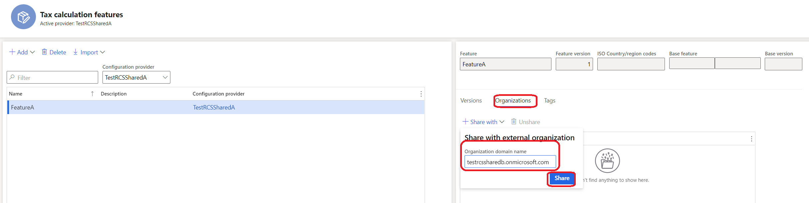

---
# required metadata

title: Empty tax feature list in Tax calculation parameters
description: This article explains how to troubleshoot an issue where the list of tax features on the Tax calculation parameters page is empty.
author: wangchen
ms.date: 03/04/2022
ms.topic: how-to
ms.prod: 
ms.technology: 

# optional metadata

ms.search.form: TaxIntegrationTaxServiceParameters
audience: Application User
# ms.devlang: 
ms.reviewer: kfend
# ms.tgt_pltfrm: 
# ms.custom:  
ms.search.region: Global
# ms.search.industry: 
ms.author: wangchen
ms.search.validFrom: 2021-10-26
ms.dyn365.ops.version: Version 10.0.21
---

# Empty tax feature list in Tax calculation parameters

[!include [banner](../includes/banner.md)]

## Symptom

You've published a feature in Regulatory Configuration Service (RCS), so that you can use it in Microsoft Dynamics 365 Finance. However, when you open Finance, go to **Tax** \> **Setup** \> **Tax configuration** \> **Tax calculation parameters**, and try to select a value in the **Feature setup name** field, the list of values is empty.

## Reason

This issue usually occurs because your Finance environment and RCS environment aren't under the same tenant.

### RCS tenant

Follow these steps to find the ID of your RCS tenant.

1. Copy the full RCS URL. For example, the URL might be `https://rcs-rts-sf-ed22b5aeea8-int-westus2.configure.global.int.dynamics.com/namespaces/817ff7a0-0d77-4aba-9360-3c9749e2c5de/?cmp=dat&mi=RCSFeatureDomainsWorkspace`.
2. Open an InPrivate browser window, paste the RCS URL into the Address bar, and then select **Enter**. You're directed to the sign-in page, where you can find the RCS tenant ID. For example, if the URL of the sign-in page is `https://login.microsoftonline.com/d335a570-a05b-4bc5-8eb3-c42c65f9560d`, the tenant ID is the information that appears after `https://login.microsoftonline.com/`, or **d335a570-a05b-4bc5-8eb3-c42c65f9560d**.

### Finance environment tenant ID

To find the tenant ID for your Finance environment, follow the same steps that you followed to find the RCS tenant. However, copy and paste the full URL of your Finance environment instead of the full RCS URL.

## Resolution

If the two tenants IDs differ, you're encountering the issue that is described in this article. If they are the same, you're encountering an unrelated issue. In this case, we recommend that you contact Microsoft Support.

### Solution 1

Sign your RCS environment in to the same tenant that your Finance environment is signed in to. Then create and publish the tax feature.

### Solution 2

Share the tax feature with the Finance tenant in RCS.

1. In RCS, go to **Globalization features** \> **Tax Calculation**.
2. Select the feature to share, and then, on the **Organizations** tab, select **Share with**.
3. In the **Organization domain name** field, enter a name. For example, enter **contoso.onmicrosoft.com**.
4. Select **Share**.

