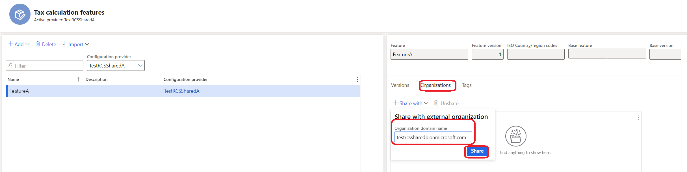

---
# required metadata 

title: Tax feature list is empty on tax calculation parameter
description: This topic explains how to set up tax codes in Tax Calculation Service. 
author: wangchen
ms.date: 11/17/2021
ms.topic: business-process  
ms.prod:  
ms.technology:  

# optional metadata 

ms.search.form: TaxIntegrationTaxServiceParameters    
audience: Application User 
# ms.devlang:  
ms.reviewer: kfend
# ms.tgt_pltfrm:  
# ms.custom:  
ms.search.region: Global
# ms.search.industry: 
ms.author: wangchen
ms.search.validFrom: 2021-10-26 
ms.dyn365.ops.version: Version 10.0.21 
---

# Tax feature list is empty on tax calculation parameter

[!include [banner](../includes/banner.md)]

[!include [banner](../includes/preview-banner.md)]

## Symptom

Let's say you have published a feature in the Regulatory configuration service (RCS) to use in Dynamics 365 Finance. When you open Finance and go to **Tax** > **Setup** > **Tax configuration** > **Tax calculation parameters** and select the **Feature setup name** drop-down list, the list is empty.

## Reason
This usually occurs because your Finance environment and RCS environment aren't under the same tenant.

### RCS tenant
Complete the following steps to locate your RCS tenant ID.

1. Open an InPrivate browser window.
2. Copy the full RCS url and enter it into the new Inprivate window and then press Enter. For example, the URL might be, https://rcs-rts-sf-ed22b5aeea8-int-westus2.configure.global.int.dynamics.com/namespaces/817ff7a0-0d77-4aba-9360-3c9749e2c5de/?cmp=dat&mi=RCSFeatureDomainsWorkspace. You will be directed to the login page where you can find the RCS tenant ID. For example, the tenant ID might be, https://login.microsoftonline.com/d335a570-a05b-4bc5-8eb3-c42c65f9560d. The tenant ID is the information that appears after https://login.microsoftonline.com, so it's **d335a570-a05b-4bc5-8eb3-c42c65f9560d**.

### Finance environment tenant ID
To find the tenant ID for your Finance environment, complete the same steps as for the RCS tenant, but instead of using the RCS full URL, use the full URL of your Finance environment. 

## Resolve
If the two tenants IDs are different, you are running to the issue described in this topic. If they are the same, the issue is unrelated and we recommend that you contant Microsoft support. 

### Solution 1
Sign your RCS environment in to the same tenant as your Finance environment, and then create and publish the tax feature.

### Solution 2
Share the tax feature to the Finance tenant in RCS.
1. In RCS go to **Globalization features** > **Tax Calculation**.
2. Select the feature you want to share, and on the **Organizations** tab, select **Share with**.

  
  
3. In the **Organization domain name** field, enter a name. For example, **contoso.onmicrosoft.com**.
4. Select **Share**.

