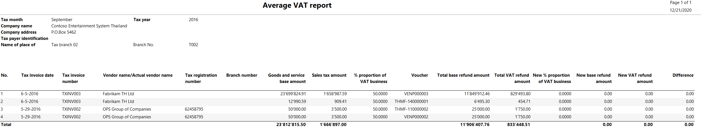
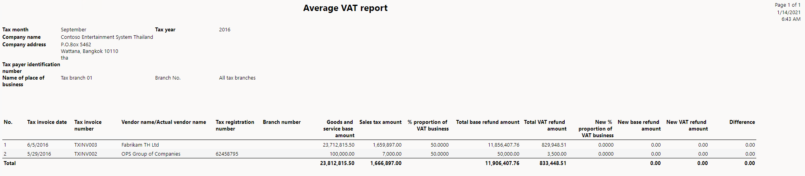
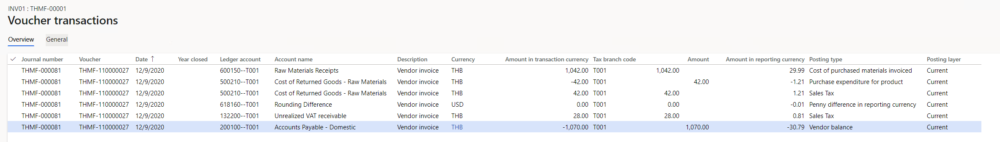
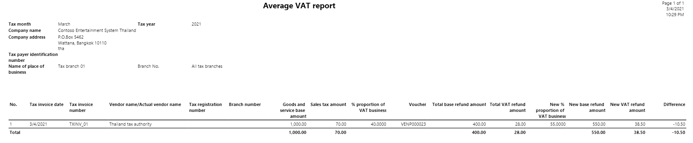

# Average VAT for purchase transactions

[!include [banner](../../includes/banner.md)]

An individual or legal entity might purchase goods or services that are
used by both value-added tax (VAT) businesses and non-VAT businesses. In
these cases, if there is no clear division of the proportion of the
purchase VAT amount between the different businesses, the purchase VAT
must be divided based on the actual usage of the purchased goods or
services in each business. The average VAT is the percentage of VAT that
is divided between the VAT businesses and the non-VAT businesses of a
legal entity. Average VAT is applied only to purchase transactions.

You can use multiple tax rates to manage the proportion of VAT between
the VAT businesses and the non-VAT businesses of a legal entity. You can
manage average VAT for a sales tax code by using the **Sales tax code
values** page.

## Set up average VAT

1.  Go to **Tax &gt; Setup &gt; Parameters &gt; General ledger
    parameters &gt; Sales tax**, and enable **Manage realized and
    unrealized VAT**.

2.  In the **Calculation method** field, select **Total**.

3.  Go to **Tax &gt; Indirect taxes &gt; Sales tax &gt; Sales tax
    codes**, and set up sales tax codes for average realized VAT.

    1.  In the **Tax type** field, select **Average realized**.

    2.  In the **Ledger posting group** field, select the ledger posting
        group for realized VAT.

    3.  On the Action Pane, on the **Sales tax code** tab, in the
 **Sales tax code** group, select **Values**.

    4.  On the **Sales tax code values** page, in the **Nondeductible
        %** field, enter the percentage of VAT for the non-VAT
        businesses.

    5.  In the **From date** and **To date** fields, define the date
        interval for the proportion.

4.  Go to **Tax &gt; Indirect taxes &gt; Sales tax &gt; Sales tax
    codes**, and set up sales tax codes for average unrealized VAT.

    1.  In the **Tax type** field, select **Average unrealized**.

    2.  In the **Ledger posting group** field, select the ledger posting
        group for unrealized VAT.

    3.  In the **Payment sales tax code** field, select the code for
        average realized VAT.

    4.  On the Action Pane, on the **Sales tax code** tab, in the
 **Sales tax code** group, select **Values**.

    5.  On the **Sales tax code values** page, in the **Nondeductible
        %** field, enter the percentage of VAT for the non-VAT
        businesses.

    6.  In the **From date** and **To date** fields, define the date
        interval for the proportion.

For more information, see [Thailand unrealized and realized VAT](apac-tha-unrealized-vat.md)
and [Set up sales tax codes](../../general-ledger/tasks/set-up-sales-tax-codes.md).

5.  Go to **Tax &gt; Indirect taxes &gt; Sales tax &gt; Sales tax
    groups**, and set up sales tax groups for average unrealized VAT and
    average realized VAT. For example, for average realized VAT, create
    an item sales tax group that is named **AVAT**. For average
    unrealized VAT, create an item sales tax group that is named
 **AUVAT**.

6.  Go to **Tax &gt; Indirect taxes &gt; Sales tax &gt; Item sales tax
    groups**, and set up item sales tax groups for average unrealized
    VAT and average realized VAT. For example, for average realized VAT,
    create an item sales tax group that is named **AItem**. For average
    unrealized VAT, create an item sales tax group that is named
 **AServ**.

## Work with average VAT

You can create the following transactions that have average unrealized
and realized VAT:

-   Purchase order for goods

-   Purchase order for services

-   Vendor invoice journal

The amount of VAT for the VAT businesses and the non-VAT businesses is
calculated based on the specified VAT ratio. When you post a purchase
order, the VAT for the VAT businesses is posted to either the unrealized
purchase VAT account or the realized purchase VAT account. The VAT for
the non-VAT businesses is posted either to the inventory account for an
item as part of the inventory amount or to the expense account for a
service as part of the expense.

For more information about unrealized and realized VAT, see [Tax invoice
for Thailand](apac-tha-tax-invoices.md).

### Post a vendor payment transaction when the VAT ratio is updated after the invoice is posted

You must manually calculate the VAT ratio every year. When the VAT ratio
is changed, you must update the VAT ratio and the date range. To update
the VAT ratio and date range for a sales tax code after the invoice that
the sales tax code applies to is posted, use the **Sales tax code**
page.

If realized purchase VAT was posted when you posted the invoice, you can
use the updated VAT ratio to make a payment for the vendor transaction
on the **Journal voucher** page. The VAT adjustment is automatically
posted for the realized purchase VAT, based on the updated VAT ratio.

If unrealized VAT was posted when you posted the invoice, when you
receive the tax invoice from the vendor, you can reverse the unrealized
VAT and post the realized VAT by using the **Reversal journal** page.

For more information, see [Reverse the posted unrealized purchase
VAT](apac-tha-unrealized-vat.md#reverse-the-unrealized-purchase-vat).

If the VAT ratio is updated for an advance payment transaction after you
post the invoice, you can manage the average VAT adjustment for the
transaction. When you receive the tax invoice from the vendor, determine
whether the VAT ratio is updated, reverse the advanced payment, and then
make a payment in the current year. The realized or unrealized VAT will
automatically be adjusted for the original transaction.

#### Example

A 7-percent VAT sales tax code is applicable to a purchase transaction
of 100.00 Thai baht (THB 100.00). When the invoice is posted, the VAT
ratio between the VAT businesses and the non-VAT businesses is 45
percent to 55 percent. However, in the new year, the VAT ratio between
the VAT businesses and the non-VAT businesses is updated to 50 percent
to 50 percent. Therefore, when the invoice is settled, the VAT ratio
between the VAT businesses and the non-VAT businesses is 50 percent to
50 percent.

The VAT is calculated and posted to different accounts, as shown in the
following table.

<table>
<tbody>
<tr>
<td>

<strong>VAT calculated and posted when the invoice is posted</strong>

</td>
<td>

<strong>VAT calculated and adjusted when the invoice is settled with updated VAT ratio</strong>

</td>
</tr>
<tr>
<td>

The invoice amount is THB 100.00.

The total VAT that is applicable to the invoice is 7 percent, and the calculated VAT amount is THB 7.00.

<ul>
<li><strong>VAT calculated for the VAT businesses:</strong> 45 percent of the 7-percent VAT = THB 3.15</li>
<li><strong>VAT calculated for the non-VAT businesses:</strong> 55 percent of the 7-percent VAT = THB 3.85</li>
</ul>

The following table shows the amounts that are posted to different accounts.

<table>
<tbody>
<tr>
<td width="99">

<strong>Account</strong>

</td>
<td width="99">

<strong>Debit (THB)</strong>

</td>
<td width="99">

<strong>Credit (THB)</strong>

</td>
</tr>
<tr>
<td width="99">

Inventory

</td>
<td width="99">

103.85

</td>
<td width="99">

&nbsp;

</td>
</tr>
<tr>
<td width="99">

Purchase VAT

</td>
<td width="99">

3.15

</td>
<td width="99">

&nbsp;

</td>
</tr>
<tr>
<td width="99">

Accounts payable

</td>
<td width="99">

&nbsp;

</td>
<td width="99">

107.00

</td>
</tr>
</tbody>
</table>
</td>
<td>

A payment of THB 100.00 is made to settle the invoice.

The total VAT that is applicable to the invoice is 7 percent, and the calculated VAT amount is THB 7.00.

<ul>
<li><strong>VAT calculated for the VAT businesses:</strong> 50 percent of the 7-percent VAT = THB 3.50</li>
<li><strong>VAT calculated for the non-VAT businesses:</strong> 50 percent of the 7-percent VAT = THB 3.50</li>
</ul>

The following table shows the amounts that are adjusted in different accounts.

<table>
<tbody>
<tr>
<td width="99">

<strong>Account</strong>

</td>
<td width="99">

<strong>Debit (THB)</strong>

</td>
<td width="99">

<strong>Credit (THB)</strong>

</td>
</tr>
<tr>
<td width="99">

Inventory

</td>
<td width="99">

&nbsp;

</td>
<td width="99">

0.35

</td>
</tr>
<tr>
<td width="99">

Purchase VAT

</td>
<td width="99">

&nbsp;

</td>
<td width="99">

3.15

</td>
</tr>
<tr>
<td width="99">

Purchase VAT

</td>
<td width="99">

3.50

</td>
<td width="99">

&nbsp;

</td>
</tr>
<tr>
<td width="99">

Accounts payable

</td>
<td width="99">

107.00

</td>
<td width="99">

&nbsp;

</td>
</tr>
<tr>
<td width="99">

Bank

</td>
<td width="99">

&nbsp;

</td>
<td width="99">

107.00

</td>
</tr>
</tbody>
</table>
</td>
</tr>
</tbody>
</table>

## Generate the Average VAT report

The **Average VAT** report includes the details of transactions that
have average VAT. You must submit the **Average VAT** report to the
Revenue Department of Thailand every month.

1.  Go to **Tax &gt; Inquiries and reports &gt; Sales tax reports &gt;
    Average VAT**.

2.  In the **Tax month** field, select the month to generate the report
    for.

3.  In the **Tax invoice number** field, enter the tax invoice number of
    the invoice that was received from the vendor, if you want the
    report to include the transactions.

4.  In the **Tax invoice date** field, enter the date when the tax
    invoice was generated by the vendor.

5.  In the **Tax invoice receipt date** field, enter the date when you
    received the tax invoice from the vendor.

6.  In the **Sales tax code** field, select the average VAT sales tax
    code that you want the report to include transactions for.

7.  In the **Tax branch** field, select the tax branch of the legal
    entity to generate the report for.

8.  In the **Detail level** field, select the level of detail that you
    want the report to include:

    - **Details** – Generate a detailed **Average VAT** report. In
        this case, each transaction is shown on separate line.

    - **Summary** – Generate a summarized **Average VAT** report. In
        this case, vendor invoices that have the same tax invoice number
        are summarized and shown as one line.

9.  Select **OK**, and review report results.

The following illustration shows an example of a detailed **Average
VAT** report.

The following illustration shows an example of a summarized **Average
VAT** report.

The following table explains the information that is shown on the
**Average VAT** report.

| Field | Description |
|-------------------------|-------------------------|
| Tax invoice date | The date when the tax invoice was received. |
| Tax invoice number | The tax invoice number of the invoice that was received from the vendor. |
| Vendor name/Actual vendor name | The name of the vendor account. |
| Tax registration number | The number of the vendor account. |
| Branch number | The number of the tax branch that was used during the transaction. |
| Goods and services base amount | The base amount of the transaction. |
| Sales tax amount | The calculated tax amount. |
| % proportion of VAT business | The percentage of VAT that is divided between the VAT businesses and the non-VAT businesses of a legal entity. |
| Voucher | The voucher number in the ledger. |
| Total base refund amount | The base amount for refund. |
| Total VAT refund amount | The calculated VAT amount for refund. |
| New % proportion of VAT business | The percentage of VAT that you've recalculated for the VAT businesses and the non-VAT businesses of a legal entity. |
| New base refund amount | The base amount for refund after you've recalculated the proportion for the VAT businesses and the non-VAT businesses of a legal entity. |
| New VAT refund amount | The calculated VAT amount for refund after you've recalculated the proportion for the VAT businesses and the non-VAT businesses of a legal entity. |
| Difference | The difference between the **Total base refund amount** value and the **New base refund amount** value. |

## Example

This example shows how to post a purchase order when there is unrealized
VAT at the end of the year, but the payment will be held in the new year
and will use the new proportion.

1.  Go to **Tax &gt; Indirect taxes &gt; Sales tax &gt; Sales tax
    codes**, and set up sales tax codes for average realized VAT.

    1.  In the **Sales tax code** field, enter **AVAT**.

    2.  In the **Name** field, enter **Average realized VAT**.

    3.  Set the **Percentage/Amount** field to **7**.

    4.  In the **Tax type** field, select **Average realized**.

    5.  In the **Ledger posting group** field, select the ledger posting
        group for realized VAT.

    6.  On the Action Pane, on the **Sales tax code** tab, in the
 **Sales tax code** group, select **Values**.

    7.  On the **Sales tax code values** page, enter the following
        information.

| Sales tax code | From date | To date | Minimum limit | Maximum limit | Value | Nondeductible % | VAT ratio |
|-------------------------|-------------------------|-------------------------|-------------------------|-------------------------|-------------------------|-------------------------|-------------------------|
| AVAT | 1/1/2020 | 12/31/2020 | 0.00 | 0.00 | 7.00 | 60.00 | 40.00 |
| AVAT | 1/1/2021 | 12/31/2021 | 0.00 | 0.00 | 7.00 | 45.00 | 55.00 |

2.  Set up sales tax codes for average unrealized VAT.

    1.  In the **Sales tax code** field, enter **AUVAT**.

    2.  In the **Name** field, enter **Average unrealized VAT**.

    3.  Set the **Percentage/Amount** field to **7**.

    4.  In the **Tax type** field, select **Average unrealized**.

    5.  In the **Ledger posting group** field, select the ledger posting
        group for realized VAT.

    6.  In the **Payment sales tax code** field, select **AVAT**.

    7.  On the Action Pane, on the **Sales tax code** tab, in the
 **Sales tax code** group, select **Values**.

    8.  On the **Sales tax code values** page, enter the following
        information.

| Sales tax code | From date | To date | Minimum limit | Maximum limit | Value | Nondeductible % | VAT ratio |
|-------------------------|-------------------------|-------------------------|-------------------------|-------------------------|-------------------------|-------------------------|-------------------------|
| AUVAT | 1/1/2020 | 12/31/2020 | 0.00 | 0.00 | 7.00 | 60.00 | 40.00 |
| AUVAT | 1/1/2021 | 12/31/2021 | 0.00 | 0.00 | 7.00 | 45.00 | 55.00 |

3.  Create a purchase order for THB 1,000.00.

4.  In the **Sales tax group** field, select the sales tax group for
    average unrealized VAT.

5.  In the **Item sales tax group** field, select the item sales tax
    group for average unrealized VAT.

6.  Post an invoice. Enter the following information:

- **Invoice number:** INV01

- **Invoice date:** 12/9/2020

- **Invoice receipt date:** 12/9/2020

The following transactions are created for the voucher:

- **Base VAT amount:** THB 1,000 × 7 percent = THB 70

- **Nondeductible VAT:** THB 70 × 60 percent = THB 42

- **Deductible VAT:** THB 70 × 50 percent = THB 28

    

7.  Go to **Accounts payable &gt; Payments &gt; Vendor payment
    journal**, and settle the transaction.

8.  Go to **Accounts payable &gt; Payments &gt; Reversal journal**, and
    reverse the unrealized VAT. Enter the following information:

- **Tax invoice number:** TXINV\_01

- **Tax invoice date:** 3/4/2021

- **Tax invoice receipt date:** 3/4/2021

For more information about reversal journals, see [Thailand unrealized
and realized VAT](apac-tha-unrealized-vat.md).

9.  Go to **Tax &gt; Inquiries and reports &gt; Sales tax reports &gt;
    Average VAT**.

10.  In the **Tax month** field, select **March 2021**, and review the
    report results:

- **Deductible VAT:** THB 70 × 55 percent = THB 38.50

The difference between the old nondeductible VAT and the new
nondeductible VAT amount is THB 10.50.

