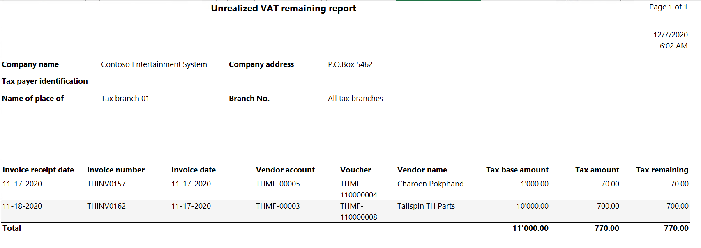
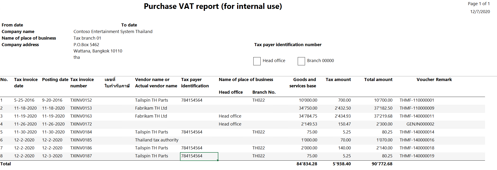
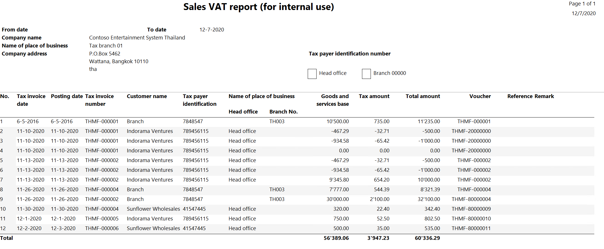
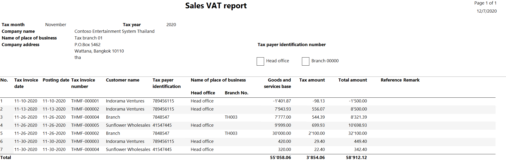

# VAT reports

[!include [banner](../../includes/banner.md)]

This article explains how to generate value-added tax (VAT) reports to submit to tax authorities in Thailand in Microsoft Dynamics 365 Finance.

## Generate the Purchase unrealized VAT remaining report

The *Unrealized VAT remaining* report includes transactions for which taxes haven't been realized.

To generate the Purchase unrealized VAT remaining report, follow these steps.

1. In Dynamics 365 Finance, go to **Tax** \> **Inquiries and reports** \> **Sales tax reports** \> **Purchase Unrealized VAT Remaining**.
1. In the **Tax branch code** field, select a tax branch to generate the report only for the selected tax branch. Learn more in [Tax branch page](apac-tha-tax-branch-dimensions.md).
1. Select **OK**, and review the report that is generated.

    

    The following table explains the information that is shown on the **Unrealized VAT remaining** report.

    | Field | Description |
    |-------------------------|-------------------------|
    | Invoice receipt date | The date when the invoice was received. |
    | Invoice number | The number of the invoice. |
    | Invoice date | The date when the invoice is due. |
    | Vendor account | The number of the vendor account. |
    | Vendor name | The name of the vendor account. |
    | Voucher | The voucher number in the ledger. |
    | Tax base amount | The base amount for tax calculation. |
    | Tax amount | The calculated tax amount. |
    | Tax remaining amount | The tax amount that isn't due. |

## Generate the Purchase VAT report for internal use

The *Purchase VAT* report for internal use includes transactions for which purchase VAT is realized. It also includes details of the VAT that the legal entity paid for the purchase of goods and services. This report is used internally to review the transactions for a specific period. It isn't submitted to the government.

Two versions of the Purchase VAT report are available. One version is for internal use only, and the other is submitted to the government.

To generate the Purchase VAT report for internal use, follow these steps.

1. In Dynamics 365 Finance, go to **Tax** \> **Inquiries and reports** \> **Sales tax reports** \> **Purchase VAT report (for internal use)**.
1. In the **Start date** and **End date** fields, define the period for which to generate the report.
1. In the **Tax branch** field, select a tax branch to generate the report only for the selected tax branch. Learn more in [Tax branch page](apac-tha-tax-branch-dimensions.md).
1. In the **Sales tax code** field, select a sales tax code to generate the report only for the selected sales tax code.
1. In the **Tax invoice number** field, enter the number of a tax invoice to generate the report only for the specified tax invoice.
1. In the **Tax invoice date** field, select the date when the vendor generated the tax invoice.
1. Select **OK**, and review the report that is generated.

    

    The following table explains the information that is shown on the **Purchase VAT** report for internal use.

    | Field | Description |
    |-------------------------|-------------------------|
    | Tax invoice date | The date when the invoice was received. |
    | Posting date | The date when the transaction was settled. |
    | Tax invoice number | The number of the tax invoice that was received from the vendor. |
    | เลขที่ใบกำกับภาษีต้นฉบับ (Original tax invoice number) | The number of the original invoice. |
    | Vendor name or Actual vendor name | The name of the vendor account. |
    | Tax payer identification | The vendor's identification number for tax purposes. |
    | Name of place of business – Head office | The value **Head office** is shown if the transaction was settled by using the Head office tax branch. |
    | Name of place of business – Branch No. | The number of the tax branch that was used during the transaction. |
    | Goods and services base amount | The base amount of the transaction. |
    | Tax amount | The calculated tax amount. |
    | Total amount | The total amount of goods and services. This amount includes calculated tax. |
    | Voucher | The number of the voucher for the transaction. |

## Generate the Purchase VAT report

The *Purchase VAT* report includes transactions for which purchase VAT is realized. It includes details of the VAT that the legal entity paid for the purchase of goods and services. This report is generated every month and submitted to the government.

To generate the Purchase VAT report, follow these steps.

1. In Dynamics 365 Finance, go to **Tax** \> **Inquiries and reports** \> **Sales tax reports** \> **Purchase VAT report**.
1. In the **Tax month** field, select the month for which to generate the report.
1. In the **Tax branch** field, select a tax branch to generate the report only for the selected tax branch. Learn more in [Tax branch page](apac-tha-tax-branch-dimensions.md).
1. In the **Sales tax code** field, select a sales tax code to generate the report only for the selected sales tax code.
1. In the **Tax invoice date** field, select the date when the vendor generated the tax invoice.
1. In the **Tax invoice number** field, enter the sales tax code for which the report should include transactions.
1. Select **OK**, and review the report that is generated.

    

    The following table explains the information that is shown on the **Purchase VAT** report.

    | Field | Description |
    |-------------------------|-------------------------|
    | Tax invoice date | The date when the invoice was received. |
    | Posting date | The date when the transaction was settled. |
    | Tax invoice number | The number of the tax invoice that was received from the vendor. |
    | เลขที่ใบกำกับภาษีต้นฉบับ (Original tax invoice number) | The number of the original invoice. |
    | Vendor name or Actual vendor name | The name of the vendor account. |
    | Tax payer identification | The vendor's identification number for tax purposes. |
    | Name of place of business – Head office | The value **Head office** is shown if the transaction was settled by using the Head office tax branch. |
    | Name of place of business – Branch No. | The number of the tax branch that was used during the transaction. |
    | Goods and services base amount | The base amount of the transaction. |
    | Tax amount | The calculated tax amount. |
    | Total amount | The total amount of goods and services. This amount includes calculated tax. |

## Generate the Sales VAT report for internal use

The *Sales VAT* report for internal use includes transactions for which sales VAT is realized. It also includes details of the VAT that the legal entity received for the sale of goods and services. This report is used internally to review the transactions for a specific period. It isn't submitted to the government.

Two versions of the Sales VAT report are available. One version is for internal use only, and the other is submitted to the government.

To generate the Sales VAT report for internal use, follow these steps.

1. In Dynamics 365 Finance, go to **Tax** \> **Inquiries and reports** \> **Sales tax reports** \> **Sales VAT report (for internal use)**.
1. In the **Start date** and **End date** fields, define the period for which to generate the report.
1. In the **Tax branch** field, select a tax branch to generate the report only for the selected tax branch. Learn more in [Tax branch page](apac-tha-tax-branch-dimensions.md).
1. In the **Sales tax code** field, select a sales tax code to generate the report only for the selected sales tax code.
1. In the **Tax invoice date** field, select the date when the vendor generated the tax invoice.
1. In the **Tax invoice number** field, enter the sales tax code for which the report should include transactions.
1. Select **OK**, and review the report that is generated.

    

    The following table explains the information that is shown on the **Sales VAT** report for internal use.

    | Field | Description |
    |-------------------------|-------------------------|
    | Tax invoice date | The date when the invoice is due. |
    | Posting date | The date when the transaction was settled. |
    | Tax invoice number | The number of the tax invoice that was received from the vendor. |
    | Customer name | The name of the customer account. |
    | Tax payer identification number | The customer's identification number for tax purposes. |
    | Name of place of business – Head office | The value **Head office** is shown if the transaction was settled by using the Head office tax branch. |
    | Name of place of business – Branch No. | The number of the tax branch that was used during the transaction. |
    | Goods and services base amount | The base amount of the transaction. |
    | Tax amount | The calculated tax amount. |
    | Total amount | The total amount of goods and services. This amount includes calculated tax. |
    | Voucher | The number of the voucher for the transaction. |

## Generate the Sales VAT report

The **Sales VAT** report includes transactions for which sales VAT is realized. It also includes details of the VAT that the legal entity received for the sale of goods and services. This report is generated every month and submitted to the government.

To generate the Sales VAT report, follow these steps.

1. In Dynamics 365 Finance, go to **Tax** \> **Inquiries and reports** \> **Sales tax reports** \> **Sales VAT report**.
1. In the **Tax month** field, select the month for which to generate the report.
1. In the **Tax branch** field, select a tax branch to generate the report only for the selected tax branch. Learn more in [Tax branch page](apac-tha-tax-branch-dimensions.md).
1. In the **Sales tax code** field, select a sales tax code to generate the report only for the selected sales tax code.
1. In the **Tax invoice date** field, select the date when the vendor generated the tax invoice.
1. In the **Tax invoice number** field, enter the sales tax code for which the report should include transactions.
1. Select **OK**, and review the report that is generated.

    

    The following table explains the information that is shown on the **Sales VAT** report.

    | Field | Description |
    |-------------------------|-------------------------|
    | Tax invoice date | The date when the tax invoice was received from the vendor. |
    | Posting date | The date when the transaction was settled. |
    | Tax invoice number | The number of the tax invoice that was received from the vendor. |
    | Customer name | The name of the customer account. |
    | Tax payer identification number | The customer's identification number for tax purposes. |
    | Name of place of business – Head office | The value **Head office** is shown if the transaction was settled by using the Head office tax branch. |
    | Name of place of business – Branch No. | The number of the tax branch that was used during the transaction. |
    | Goods and services base amount | The base amount of the transaction. |
    | Tax amount | The calculated tax amount. |
    | Total amount | The total amount of goods and services. This amount includes calculated tax. |

[!INCLUDE[footer-include](../../../includes/footer-banner.md)]
