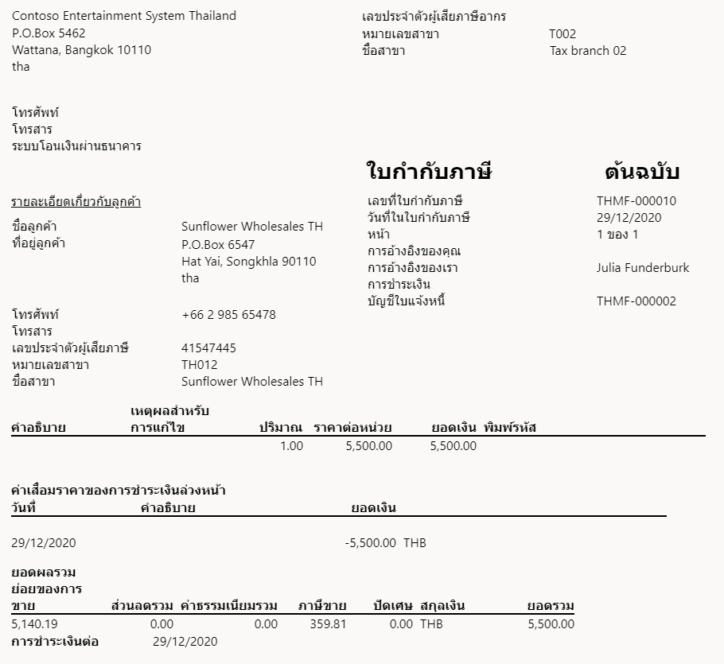
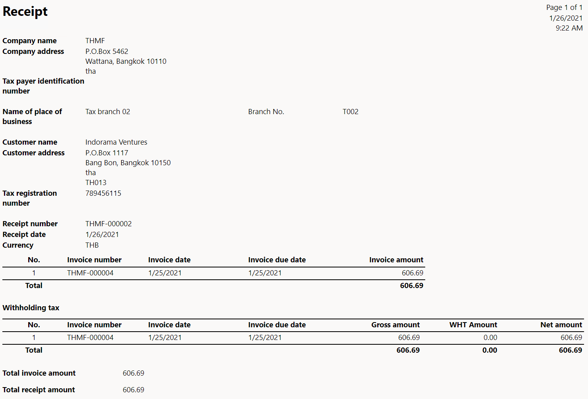
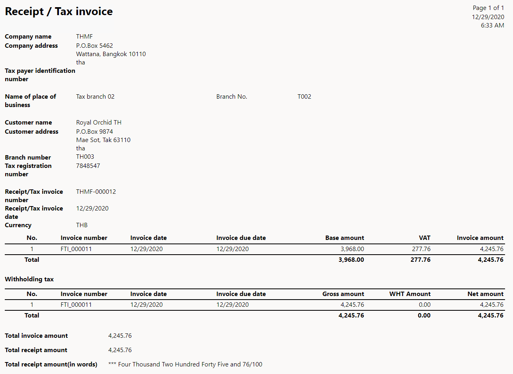

# Tax invoices

[!include [banner](../../includes/banner.md)]

This article explains how to set up tax invoices and when they are generated.

## Preliminary setup

This section provides information about general options that should be set up before you can start to work with tax invoices.

Go to **Accounts receivable** > **Setup** > **Accounts receivable parameters**, and then, on the **Number sequences** tab, set up number sequences for the following references:

   - Free text credit note
   - Free text credit note voucher
   - Sales credit note
   - Sales credit note voucher
   - Customer invoice
   - Customer invoice voucher

For more information, see [Number sequences overview](../../../fin-ops-core/fin-ops/organization-administration/number-sequence-overview.md).

## Setup

This section provides information about Thailand-specific options that should be set up before you can start to work with tax invoices.

1.  Go to **Accounts receivable** > **Setup** > **Accounts receivable parameters**, and then, on the **Number sequences** tab, set up number sequences for the following references.

    | **Reference** | **Description** |
    |-------------------------|-------------------------|
    | Free text debit note | The number sequence reference for the debit notes that are generated from free text invoices. |
    | Free text debit note voucher | The number sequence reference for the debit note transactions when debit notes are generated from free text invoices. |
    | Sales debit note | The number sequence reference for the debit notes that are generated from sales orders. |
    | Sales debit note voucher | The number sequence reference for the debit note transactions when debit notes are generated from sales orders. |
    | Customer tax invoice | The number sequence reference for the tax invoices that are generated from sales order invoices. |
    | Customer tax invoice voucher | The number sequence reference for customer tax invoice vouchers. |
    | Free text tax invoice | The number sequence reference for the tax invoices that are generated from free text invoices. |
    | Free text tax invoice voucher | The number sequence reference for free text tax invoice vouchers. |
    | Receipt | The number sequence reference for receipts. |
    | Receipt / Tax invoice | The number sequence reference for receipts or tax invoices. |

2.  Go to **Accounts payable** > **Setup** > **Accounts payable parameters**, and then, on the **Number sequences** tab, set up a number sequence for the **Vendor unrealized reversal ID** reference that you want to associate with the vendor.

## Work with tax invoices

Tax invoices are generated when value-added tax (VAT) is realized. Microsoft Dynamics 365 Finance automatically generates a tax invoice when a sales order, a purchase invoice, a purchase order, or a payment that generates a realized VAT entry is posted. If an unrealized VAT entry is generated, an invoice is generated instead of a tax invoice.

For more information, see [Thailand unrealized and realized VAT](apac-tha-unrealized-vat.md).

- If you receive payment from the customer when you post a sales order, follow these steps:

    1. Go to **Accounts receivable &gt; Orders &gt; All sales orders**.
    2. Select **New** to create a sales order.
    3. On the **Line details** FastTab, on the **Setup** tab, in the **Sales tax** section, in the **Item sales tax** **group** field, select the corresponding sales tax group for realized VAT.
    4. Select **Save**.
    5. On the **Invoice** FastTab, in the **Generate** section, select **Invoice**.
    6. In the **Print options** section, set the **Print invoice** option to **Yes**.

       A tax invoice is printed. Send this invoice to the customer.

- If you receive payment from the customer when you post a free text invoice, follow these steps:

    1. Go to **Accounts receivable &gt; Invoices &gt; All free text invoices**.
    2. In the **Invoice lines** section, in the **Sales tax** and **Item sales tax** **group** fields, select the corresponding sales tax group for realized VAT.
    3. On the Action Pane, select **Post** to post the invoice.
    4. In the **Post free text invoice** dialog box, in the **Parameters** section, set the **Print invoice** option to **Yes**.

     A tax invoice is printed. Send this invoice to the customer.

At any time, you can go back to the sales order or free text invoice to print the tax invoice.

- **For a sales order:** Open the order, and then, on the **Invoice** FastTab, in the **Journals** section, select **Invoice** to open the invoice. On the **Invoice** FastTab, in the **Document** section, select **View** to view the tax invoice or **Send** to send it.
- **For a free text invoice:** Open the free text invoice, and then, on the **Invoice** FastTab, in the **Document** section, select **View** to view the tax invoice or **Send** to send it.

    The following illustration shows an example of a printed tax invoice.

    

- If you receive payment from the customer after you post a sales order or a free text invoice, follow these steps:

    1. Create a sales order.
    2. On the **Line details** FastTab, on the **Setup** tab, in the **Sales tax** section, in the **Item sales tax** **group** field, select the corresponding sales tax group for unrealized VAT.
    3. Either generate an invoice for the order or create a free text invoice.
    4. In the **Invoice lines** section, in the **Sales tax** and **group** **Item sales tax** **group** fields, select the corresponding sales tax group for unrealized VAT.
    5. Go to **Accounts receivable &gt; Payments &gt; Customer payments journal**, and settle the payment. For more information, see [Customer payment overview](../../cash-bank-management/tasks/customer-payment-overview.md).
    6. Select **Print**, and then select **Payments**.

       A tax invoice or a receipt/tax invoice is printed.

    > [!NOTE]
    > If the lines on the invoice that a payment is settled to have a realized tax type, a receipt is printed. The receipt shows the invoice lines together with the realized tax type and the line total.
    >
    > If multiple lines on the settled invoice have realized and unrealized tax types, a receipt and a receipt/tax invoice are printed. The receipt/tax invoice shows the invoice lines together with the unrealized tax type and the line total.

    The following illustration shows an example of a printed receipt.

    

    The following illustration shows an example of a printed receipt/tax invoice.

    
