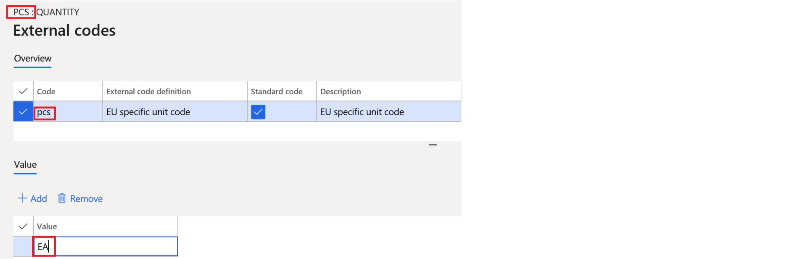
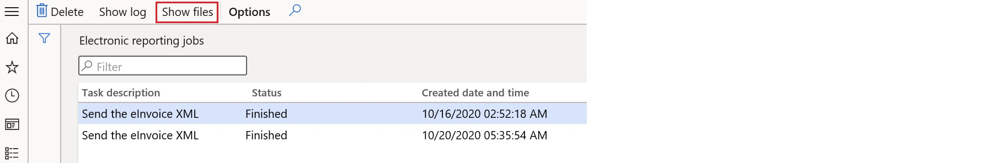

# Export of customer electronic invoices for Türkiye 
[!INCLUDE[banner](../../includes/banner.md)]

This article describes how to configure and use electronic invoices in Microsoft Dynamics 365 Finance for Türkiye. 
Microsoft Dynamics 365 Finance supports the generation of e-invoice documents in the required **UBL-TR** format.

## Prerequisites

Before you begin, ensure that the following prerequisites are met:

- Your legal entity’s primary address must be in Türkiye.
- To generate electronic invoice XML files in the UBL format, you must use Electronic Reporting (ER) configurations. These configurations define the necessary data models, mappings, and output formats required to structure and produce e-invoice documents in compliance with electronic invoicing standards.
- To enable the generation of electronic invoices in **UBL-TR** format version 1.2 and later, import the specified or later versions of the following Electronic reporting (ER) format configurations. For more information, see [Import Electronic reporting (ER) configurations from Dataverse](../../localizations/global/workspace/gsw-import-er-config-dataverse.md).

| Number | ER configuration name | Type | Description |
|---|---|---|---|
| 1 | Invoice model | Data model | It is a data model that standardizes the structure and components of an invoice. It serves as the foundational model for designing and generating various invoice-related electronic documents.  |
| 2 | Invoice model mapping | Model mapping | It is the process of linking a data model (like the Invoice model) to the application data sources (such as tables, views, or calculated fields) in Dynamics 365 Finance.  |
| 3 | UBL Sales invoice | Format | It is an **Electronic reporting (ER)** configuration in Dynamics 365 Finance that enables the generation of electronic invoices in a structured XML format.  |
| 4 | Peppol Sales Invoice | Format | It is an electronic invoicing format designed to comply with the Pan-European Public Procurement Online (Peppol) framework. The format is based on XML and ensures standardized, structured invoicing in EU.|
| 5 | E-Invoice (TR) | Format | It is a country/region-specific configuration designed to support electronic invoicing requirements in Türkiye. |

## Configure parameters

This sections provides details about how to configure the required code lists in Microsoft Dynamics 365 Finance.

To enable e-invoice processing in compliance with Turkish legal requirements, you must perform specific configurations within Dynamics 365 Finance. 
This includes importing Electronic reporting (ER) configurations, configuring legal entity and module parameters and master data, and defining certain mandatory code values that are published by the Turkish Revenue Administration (GİB), such as units of measure, tax type codes, and tax exemption reason codes. 

The code lists can be found in [e-invoice Legislation and Technical Architecture](https://ebelge.gib.gov.tr/efaturamevzuat.html). 

### Reference the imported ER format configurations

1. Go to **Accounts receivable > Setup > Accounts receivable parameters**.
2. On the **Electronic documents** tab, on the **Electronic reporting** FastTab, select the imported formats for electronic documents in the parameter below:

    - **Sales and Free text invoice**: E-Invoice (TR)

### Configure legal entity data

1. Go to **Organization administration** \> **Organizations** \> **Legal entities**, and select a legal entity.
2. On the **Addresses** FastTab, add a valid primary address for the legal entity.
3. In the **Bank account** field, enter the reference to the legal entity bank account.

> [!NOTE]
> Make sure that a valid International Bank Account Number (IBAN) is defined for the selected bank account.

### Configure customer data

1. Go to **Accounts receivable** \> **Customers** \> **All customers**, and select a customer.
2. On the **Addresses** FastTab, add a valid address for the customer.
3. On the **Invoice and delivery** FastTab, select **RegistrationIDs** in the **Tax exempt number** field for the customer. For more, see [Set up a legal entity for Türkiye](../../localizations/turkiye/emea-turkiye-set-up-legal-entity.md).
4. Set the **eInvoice** option to **Yes** to enable electronic invoices to be generated.
5. Set the **eInvoice attachment** option to **Yes** to attach a XML file to the electronic invoice, if an attachment is necessary.
6. On the **Sales demographics** FastTab, in the **Primary contact** field, select the person who is considered the customer's contact. All available contact persons must already be defined for the selected customer.
7. On the **Sales demographics** FastTab, in the **Employee responsible** field, select the person who is considered the vendor's contact.

> [!NOTE]  
> After **Registration IDs** are defined for customer and vendor accounts, the **Tax exempt number** field is automatically populated.  
> If needed, you can also select the value manually.

### Configure units of measure mapping

1. Go to **Organization administration** \> **Setup** \> **Units** \> **Units**.
2. Select a unit, and then select **External codes**.
3. On the **External codes** page, in the **Overview** section, in the **Code** column, enter a code that corresponds to the selected unit ID.
4. In the **Standard code** column, select the checkbox.
5. In the **Value** section, in the **Value** field, enter the external code to use as the [Units](https://unece.org/sites/default/files/2021-06/rec20_Rev17e-2021.xlsx) of measure code for international trade.

> [!NOTE]
> For scenarios where no specific units of measure are assumed, the default value **EA** (each) is used.

### Configure _TaxExemptionReasonCode_ mapping for sales tax codes

This section describes how to configure a **Sales tax group** in Dynamics 365 Finance for exemption scenarios in Türkiye to ensure that e-invoices generated in UBL-TR format contain the correct **TaxExemptionReasonCode** value.

The **TaxExemptionReasonCode** field are used in the UBL-TR format of e-invoice to provide standardized tax information;

**TaxExemptionReasonCode** explains why a transaction is exempt from tax (for example, exports or special exemptions).

1. Go to **Tax > Indirect taxes > Sales tax > Sales tax groups**.
2. Select an existing sales tax group which includes sales tax code for the exemption scenario.
3. On the **General** FastTab, set the **Exemption** option to **Yes**. This setting ensures that all transactions linked to this sales tax group will not calculate tax amounts.
4. In the **Exemption reason** field, enter the legal or business reason for the exemption. To access the UBL-TR code lists, see [e-invoice Legislation and Technical Architecture](https://ebelge.gib.gov.tr/efaturamevzuat.html).
5. Use wording that matches the official exemption list from the Turkish Revenue Administration (GİB) for consistency.
6. Go to **Tax > Indirect taxes > Sales tax > Sales tax codes** and select the tax code linked to this Sales tax group.
7. On the **External codes** page, in the **TaxExemptionReasonCode** field, define the appropriate GİB code for the exemption reason.

> [!NOTE]
> In Türkiye, the **Exemption** option should only be enabled for transactions that are legally tax exempt, such as export sales, sales to diplomatic missions, or sales under special VAT exemption clauses.

### Configure _TaxTypeCode_ mapping in Application specific parameters

This section describes how to set up the **TaxTypeCode** lookup in the **Application specific parameters** page for the **E-Invoice (TR)** ER format to ensure compliance with the Turkish Revenue Administration (GİB) requirements in **UBL-TR XML** output.

To create a **TaxTypeCode**, follow these steps; 

1. Go to **Organization administration > Electronic reporting > Configurations**.
2. In the list of ER formats, select **E-Invoice (TR)**.
3. On the Action Pane, select **Application specific parameters**.
4. Select the active ER format version and set the **State** to **Completed**.
5. In the **Lookups** section, select **TaxCodeLookUp**.
6. Add a new mapping line and set the **Lookup result** to the required **TaxTypeCode** from the official GİB code list such as _0015 – Gerçek Usulde Katma Değer Vergisi_.
7. Optionally, fill in the **Label** to match your internal naming and XML requirements.
8. In the **Code** field, select the appropriate sales tax code to map it to the corresponding **TaxTypeCode**, ensuring compliance with XML requirements.
9. Repeat for all required tax types.
10. Save your changes and ensure the mapping version state remains **Completed**.

You can review the list of **TaxTypeCode** values currently available in the system by going to **Organization administration > Electronic reporting > Format enumerations**, and then selecting the enumeration that is bound to the **TaxTypeCode** field in the **E-Invoice (TR)** format. 
This can help ensure that the values you configure in the Application specific parameters are aligned with the enumeration definitions in the ER format.

## Export of electronic invoices for customers

### Generate e-invoices

When an invoice is posted, you can generate an electronic invoice from any invoice journal. Select the invoice, and then, on the Action Pane, on the **Invoice** tab, in the **Document** group, select **Send** \> **Original**.

### View e-invoices

If ER destinations are defined for electronic invoice formats, the output files that are generated are sent to a related file destination that is configured for the ER destination. 
For more information about how to configure destinations for generated electronic documents, see [Electronic reporting destinations](../../../fin-ops-core/dev-itpro/analytics/electronic-reporting-destinations.md).

If no Electronic reporting (ER) destinations are defined for electronic invoice formats, output files for electronic invoices are generated on the Electronic reporting jobs page. 

To view these files;

1. Go to **Organization administration > Electronic reporting > Electronic reporting jobs**.
2. Select a job, and then select **Show files**.

    

3. Select **Open** to download the file that contains the electronic invoice.

If generation of the electronic invoices fails because of errors, select **Show log** \> **Message details** to view more details about the error message.

### Send e-invoices to ER destinations

You can set up ER destinations for electronic invoice formats. In this case, output XML files that contain electronic invoices are automatically sent to the defined destinations immediately after the invoices are posted. 
When you post the invoices, you must turn on the Print invoice parameter.

For more information about ER destinations, see [Electronic reporting destinations](../../../fin-ops-core/dev-itpro/analytics/electronic-reporting-destinations.md).

[!INCLUDE[footer-include](../../../includes/footer-banner.md)]
