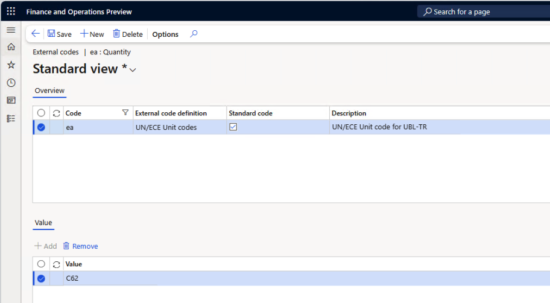
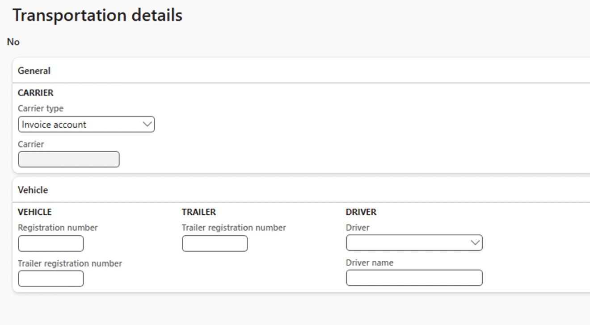

# Export customer electronic packing slips

[!INCLUDE[banner](../../includes/banner.md)]

This article describes how to configure and use **electronic packing slips (e-packing slips)** in Microsoft Dynamics 365 Finance for Türkiye.  
Microsoft Dynamics 365 Finance supports the generation of electronic packing slip XML file in the required **UBL-TR DespatchAdvice** format.

Before you begin, you must meet the following prerequisites:

- Your legal entity's primary address must be in Türkiye.
- The Electronic reporting (ER) configurations must be imported from Microsoft Dynamics Lifecycle Services (LCS) or Dataverse.
- A posted packing slip must exist for the sales order.
- ER destinations must be configured if you want XML files to be automatically sent to file locations, email, SharePoint, or other channels.

The following ER configurations are required to generate UBL-TR packing slip documents.

| Number | ER configuration name | Type | Description |
|--------|------------------------|------|-------------|
| 1 | Invoice model | Data model | The shared data model that standardizes the structure of sales documents. It acts as the base model for generating packing slip XML output. |
| 2 | Packing slip model mapping | Model mapping | Links the Invoice data model to application data sources related to packing slips. |
| 3 | UBL Packing slip (TR) | Format | Generates Turkish electronic packing slip XML documents in the UBL-TR DespatchAdvice format. This is the final output format used for e-packing slips. |

## Configure parameters

This section describes how to configure the mandatory setup for generating UBL-TR electronic packing slips.

### Reference the imported ER format configurations

To reference the imported ER format configurations, follow these steps:

1. Go to **Accounts receivable** > **Setup** > **Accounts receivable parameters**.
2. On the **Electronic documents** tab, on the **Electronic reporting** FastTab, select the **UBL Packing slip (TR)** in Packing slip parameter.

For more information, see [Import Electronic reporting (ER) configurations from Dataverse](../../localizations/global/workspace/gsw-import-er-config-dataverse.md).

### Configure legal entity data

To configure the legal entity for e-packing slip generation, follow these steps:

1. Go to **Organization administration** > **Organizations** > **Legal entities**, and select a legal entity.
2. On the **Addresses** FastTab, add a valid primary address for the legal entity.

   > [!NOTE]  
   > Unlike electronic invoices, electronic packing slips do not require bank information or IBAN to be configured.

### Configure customer account data

This section provides information about how to configure customer accounts for customer e-packing slips.

To configure customer account data, follow these steps.  

1. Go to **Accounts receivable** > **Customers** > **All customers**, and select a customer.
2. On the **Addresses** FastTab, add a valid address for the customer.
3. Specify the VAT ID of the customer. Learn more in [Set up VAT IDs of customers and vendors](../../localizations/turkiye/emea-turkiye-set-up-legal-entity.md#set-up-vat-ids-of-customers-and-vendors).
4. In the **Invoice and delivery** FastTab, set the **eInvoice** option to **Yes** to enable electronic invoices to be generated.
5. Set the **eInvoice attachment** option to **Yes** to attach an XML file to the electronic packing slip, if an attachment is necessary.

   > [!NOTE]  
   > After **Registration IDs** are defined for customer and vendor accounts, the **Tax exempt number** field is automatically populated.  
   > If needed, you can also select the value manually.
   
   > [!NOTE]  
   > The delivery address and delivery terms are essential because these values are mapped into the UBL-TR DespatchAdvice XML structure. 

### Set up unit of measure mappings for e-packing slips

This section explains how to set up unit of measure mappings in Finance so that internal unit codes (such as *EA*, *KG*, or *M*), are correctly converted to UN/ECE unit codes (such as *C62*, *KGM*, or *MTR*).  

To configure the mappings, follow these steps:

1. Go to **Organization administration** > **Setup** > **Units** > **Units**.
1. Select a unit, and then select **External codes**.
1. On the **External codes** page, in the **Overview** section, in the **Code** column, enter the **internal unit ID** (for example, *EA* for "each") that represents the unit used in Finance.
1. In the **Standard code** column, select the checkbox.
1. In the **Value** section, in the **Value** field, enter the **UN/ECE unit code** (for example, *C62* for "each").  
   This value is used as the **unitCode** attribute in the `<InvoicedQuantity>` element of the generated e-invoice XML.

   > [!NOTE]
   > The configured unit mapping determines the `unitCode` value that appears in the `<cbc:InvoicedQuantity>` element of the generated UBL-TR e-invoice XML.  
   > For example:
   >
   > ```xml
   > <cbc:InvoicedQuantity unitCode="C62">1.00</cbc:InvoicedQuantity>
   > ```
   >
   > In this example, the internal unit **EA** (each) defined in Finance is mapped to the international unit code **C62**, which is then written into the XML as the `unitCode` attribute.
   
   > [!TIP]
   > If no specific units of measure are defined, the default unit **EA** (each) is used in the UBL-TR e-invoice XML.

 :::image type="content" source="../media/emea-turkiye-unit-code-mapping.png" alt-text="Screenshot of the unit code mapping configuration page that shows internal unit codes mapped to UN/ECE unit codes.":::

   

## Configure transportation details for electronic packing slips

For electronic packing slips in Türkiye, transportation-related information must be specified on the sales order.  
This information is required to populate the vehicle, driver, and carrier sections of the UBL-TR DespatchAdvice XML.

Transportation details are maintained at the sales order level and must be completed before the packing slip is posted.

### Define transportation details on a sales order

To define transportation information for a sales order, follow these steps:

1. Go to **Accounts receivable** > **Orders** > **All sales orders**.
2. Select a sales order.
3. On the Action Pane, select **Pick and pack**.
4. Select **Transportation details**.

Use the **Transportation details** page to enter carrier, vehicle, and driver information that is required for electronic packing slip generation.

   

### Carrier information

Carrier information identifies the party that transports the goods.

The following table describes the carrier-related fields on the **Transportation details** page.

| Field | Description |
|------|-------------|
| Carrier type | Specifies the type of carrier that performs the transportation |
| Carrier | Identifies the transport company |

   > [!NOTE]  
   > Carrier information is mapped to the **CarrierParty** section of the UBL-TR DespatchAdvice XML and is mandatory for e-Packing slip documents in Türkiye.

### Vehicle and trailer information

Vehicle information identifies the transport vehicle used for delivery.

The following table describes vehicle-related fields.

| Field | Description |
|------|-------------|
| Registration number | Specifies vehicle plate number |
| Trailer registration number | Specifies trailer plate number |

This information is mapped to the **TransportMeans** elements in the UBL-TR DespatchAdvice XML.

   > [!NOTE]  
   > If no trailer is used, only the vehicle registration number is required.

### Driver information

Driver information identifies the person responsible for transporting the goods.

The following table describes driver-related fields.

| Field | Description |
|------|-------------|
| Driver | Reference to a predefined driver record |
| Driver name | Full name of the driver |

The driver name is included in the electronic packing slip XML as required by Turkish regulations.

### Effect on electronic packing slip generation

Transportation details are read from the sales order when the packing slip is posted.  
The values are then passed to the Electronic Reporting (ER) format during XML generation.

If required transportation information is missing or incomplete, the generated UBL-TR DespatchAdvice document may fail validation during submission.

## Generate electronic packing slips

Electronic packing slips can be generated after a packing slip is posted for a sales order.

To generate an electronic packing slip XML file, follow these steps.

1. Go to **Accounts receivable** > **Orders** > **All sales orders**.
2. Select a sales order that has a posted packing slip.
3. On the Action Pane, select **Packing slip**.
4. Select **Send** > **Original**.

If ER destinations are configured, the XML will automatically be delivered to the defined destination.  
If no destination is configured, the XML output will be stored in the **Electronic reporting jobs** page.


## View electronic packing slips

If ER destinations are defined for electronic packing slip formats, the output files that are generated are sent to a related file destination configured for the ER destination.
Learn about how to configure destinations for generated electronic documents in [Electronic reporting destinations](../../../fin-ops-core/dev-itpro/analytics/electronic-reporting-destinations.md).

If no Electronic reporting (ER) destinations are defined for electronic packing slip formats, output files for electronic packing slips are generated on the Electronic reporting jobs page.

To view these e-packing slip files, follow these steps.

1. Go to **Organization administration** > **Electronic reporting** > **Electronic reporting jobs**.
1. Select a job, and then select **Show files**.
1. Select **Open** to download the file that contains the electronic packing slip.

If generation of the electronic packing slip fails because of errors, to view more details about the error message select **Show log** \> **Message details**.

## Send electronic packing slips to ER destinations

You can set up ER destinations for electronic packing slip formats. In this case, output XML files that contain electronic packing slips are automatically sent to the defined destinations immediately after the invoices are posted.

When you post the invoices, you must turn on the **Print invoice** parameter.

Learn more about ER destinations in [Electronic reporting destinations](../../../fin-ops-core/dev-itpro/analytics/electronic-reporting-destinations.md).

[!INCLUDE[footer-include](../../../includes/footer-banner.md)]
