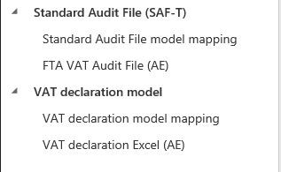
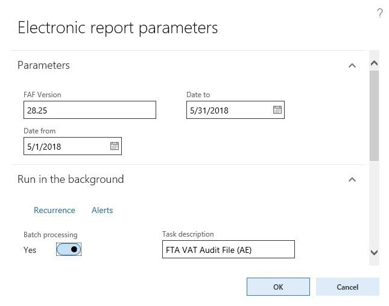

---
# required metadata

title: FTA Tax Audit File (FAF)
description: This article includes country-specific information about how to set up the FTA Tax Audit File (FAF) in TXT format for legal entities that have their primary address in the United Arab Emirates (UAE). 
author: liza-golub
ms.date: 31/05/2023
ms.topic: overview
ms.prod: 
ms.technology: 

# optional metadata

# ms.search.form: 
audience: Application User
# ms.devlang: 
ms.reviewer: kfend
# ms.tgt_pltfrm: 

ms.search.region: United Arab Emirates (UAE)
# ms.search.industry: 
ms.author: liza-golub
ms.search.validFrom: 2017-06-30
ms.dyn365.ops.version: July 2017 update

---

# FTA Tax Audit File (FAF) in TXT format for the United Arab Emirates

This article includes country-specific information about how to set up the FTA Tax Audit File (FAF) in TXT format for legal entities that have their primary address in the United Arab Emirates (UAE)

## Download and set up Electronic reporting configurations

The implementation of VAT reporting for the UAE is based on Electronic reporting (ER) configurations. For more information about the capabilities and concepts of configurable reporting, see [Electronic reporting](../../fin-ops-core/dev-itpro/analytics/general-electronic-reporting.md).

To use the VAT declaration and FAF functionality in UAE localizations, import the latest version of the following Electronic reporting (ER) configurations:

  - VAT declaration model
  - VAT declaration model mapping
  - VAT declaration Excel (AE)
  - Standard Audit File model mapping
  - Standard Audit File (SAF-T)
  - FTA VAT Audit file (AE)

For more information, see [Download ER configurations from the Global repository of Configuration service](../../fin-ops-core/dev-itpro/analytics/er-download-configurations-global-repo.md).

After all the configurations are uploaded, the configuration tree should be present in **Electronic reporting** > **Reporting configurations**.

## FTA VAT audit file

After you generate the file (**Tax** \> **Declarations** \> **FAF declaration**), if an FAF is requested, specify the required information in the **Electronic report parameters** dialog box. 

FAF declaration can be submitted trough multiple files submission. In case a large volume of transactions included in an auditing period, consider using batch processing to run the job that generates FAF declaration in the background. Also consider dividing the audited period into smaller intervals of months, weeks or days.

