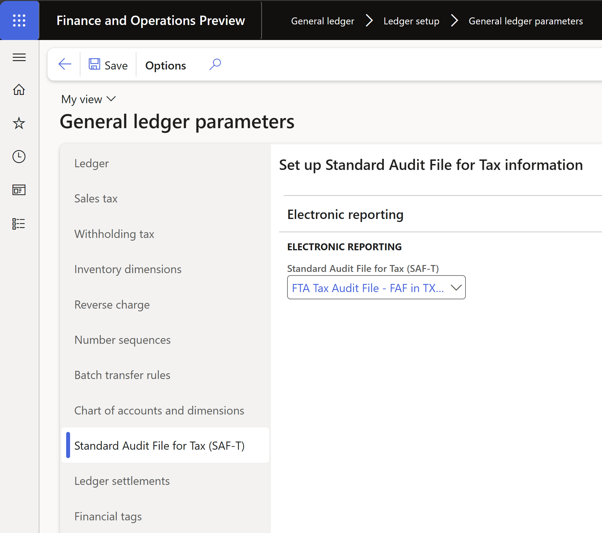
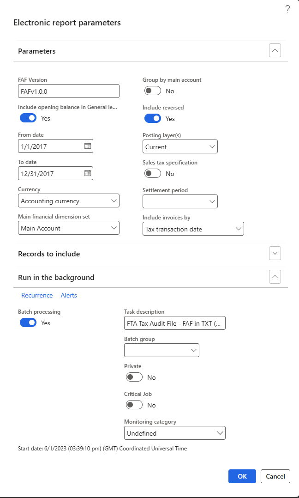

---
# required metadata

title: FTA Tax Audit File (FAF)
description: This article explains how to set up the FTA Tax Audit File (FAF) in TXT format for legal entities with a primary address in the United Arab Emirates (UAE). 
author: liza-golub
ms.date: 06/07/2023
ms.topic: overview
ms.prod: 
ms.technology: 

# optional metadata

# ms.search.form: 
audience: Application User
# ms.devlang: 
ms.reviewer: kfend
# ms.tgt_pltfrm: 

ms.search.region: United Arab Emirates (UAE)
# ms.search.industry: 
ms.author: liza-golub
ms.search.validFrom: 2017-06-30
ms.dyn365.ops.version: July 2017 update

---

# FTA Tax Audit File (FAF) in TXT format for the United Arab Emirates

This article includes country-specific information about how to set up the FTA Tax Audit File (FAF) in TXT format for legal entities that have their primary address in the United Arab Emirates (UAE).

> [!NOTE]
> The Electronic reporting (ER) format, \"FTA VAT Audit File (AE)\" that uses the **Standard Audit File** model mapping and the **FAF declaration** menu item is being deprecated. We will no longer support the Electronic reporting (ER) format, \"FTA VAT Audit File (AE)\" that uses the **Standard Audit File** model mapping and the **FAF declaration** menu item (**Tax** > **Declarations** > **FAF declaration**). A new ER format, **FTA Tax Audit File - FAF in TXT (AE)** which uses the **SAF-T General** model mapping\" can be used with [Standard Audit File for Tax (SAF-T) electronic report](../general-ledger/standard-audit-file.md). For more details, see [Removed or deprecated features in Dynamics 365 Finance](../get-started/removed-deprecated-features-finance).

## Prepare your environment to generate a FAF for UAE

To work with the FAF for UAE, you must complete the following tasks:

1. [Import Electronic reporting (ER) configurations](#import).
3. [Enable features in Feature management](#features).
4. [Select the ER configuration in General ledger parameters](#gl-param).
5. [Set up company information for the reporting header](#header-information).

### Import ER configurations

Before you generate a FAF for UAE, import the latest versions of the following ER configurations.

| ER configuration name | Type | Description | Recommended version |
|-----------------------|------|-------------|---------------------|
| Standard Audit File (SAF-T) | Model | The common data model for different audit reports. | Any version starting from 164. |
| SAF-T General model mapping | Model mapping | The model mapping that provides general data source mapping. | Any version starting from 164.357. |
| FTA Tax Audit File - FAF in TXT (AE) | Format | Federal Tax Authority Audit file for the United Arab Emirates text format. | Any version starting from 164.6. |

For more information about how to download ER configurations, see [Download ER configurations from the Global repository](../../fin-ops-core/dev-itpro/analytics/er-download-configurations-global-repo.md).

Import the most recent versions of the configurations. The version description usually includes the number of the Microsoft Knowledge Base (KB) article that explains the changes that were introduced in the configuration version. Use the **Issue search** section of the [Microsoft Dynamics Lifecycle Services (LCS)](https://lcs.dynamics.com/v2) portal to find and read information about specific versions of ER configurations.

> [!IMPORTANT]
> After all the ER configurations are imported, set **Default for model mapping** to **Yes** for the **SAF-T General model mapping** configuration.

### Enable features in Feature management

1. Open the **Feature management** workspace.
2. On the **All** tab, find and select the following features in the feature list. Note that enabling some of these features is optional.

    | Feature name | Mandatory or optional |
    |--------------|-----------------------|
    | [Standard Audit File for Tax (SAF-T) electronic report](../general-ledger/standard-audit-file.md) | Mandatory |
    | [Optimization of query data source creation time during execution of ER reports](../../fin-ops-core/dev-itpro/analytics/general-electronic-reporting.md) | Optional |
    | [Optimize datasets memory consumption at ER reports runtime](../../fin-ops-core/dev-itpro/analytics/er-reduce-fetched-fields-number.md) | Optional |

3. Select **Enable now**.

### Select the ER configuration in General ledger parameters

1. Go to **General ledger** \> **Setup** \> **General ledger parameters**.
2. On the **Standard Audit File for Tax (SAF-T)** tab, in the **Standard Audit File for Tax (SAF-T)** field, select **FTA Tax Audit File - FAF in TXT (AE)**.

    

### Set up company information for the reporting header

The first section of the FAF for the UAE represents the following information about the reporting legal entity:

- **[Taxable person name](#taxable-person-name)** – The taxable person name.
- **[TRN](#company-trn)** – The Tax Registration Number of the business user.
- **[Tax agency name, TAN, Tax agent name, TAAN](#tax-agency-name)** – The tax agency name, tax agency number, tax agent name, and tax agent approval number are required when electronic VAT reports are prepared by a contracted tax agent or vendor.

#### Taxable person name

The value of this field represents the name specified in the **Taxable person name** field on the **Legal entities** page. For more details, see [Configure VAT for a legal entity](uae-vat-setup-reporting.md#header-information).

#### TRN – Tax Registration Number

To report the TRN of the company that's reporting the FAF, the system retrieves the value from the registration ID. The registration ID is defined in the properties of the legal entity that's associated with the **VAT ID** registration category that's valid on the date specified for the **To date** parameter of the report. For more information, see [Registration type](emea-registration-ids.md#registration-type-creation) and [Registration category](emea-registration-ids.md#supported-registration-categories).

#### Tax agency Name, TAN, Tax agent name, TAAN

The values of these fields are collected from parameters set up in the respective fields on the **Legal entities** page. See [Configure VAT for a legal entity](uae-vat-setup-reporting.md#header-information).

## Generate a FAF for UAE

To generate a FAF for UAE, follow these steps.

1. Go to **General ledger** \> **Inquiries and reports** \> **Standard Audit File for Tax (SAF-T)** \> **Standard Audit File for Tax (SAF-T)**.
2. In the report dialog box, set the following fields.

    | Field name | Description |
    | ---------- | ----------- |
    | FAF Version | Specify the versio nof the FAF. Default value is `FAFv1.0.0`. |
    | Purchase and supply data in tax code currency | Select this checkbox to report the `PurchaseValueAED` and `VATValueAED` amounts in the **Purchase Listing Table** section of the report, and the `SupplyValueAED` and `VATValueAED` amounts in the **Supply Listing Table** section of the report, in the tax code currency. If this checkbox is cleared, these amounts are reported in the currency that's selected in the **Currency** field. |
    | Include opening balance in General ledger table | Select this check box if opening balance information must be included in the **General Ledger** section of the report. |
    | From date, To date | Select dates to specify the date interval for the report. You can select dates within one fiscal year. |
    | Currency | Select **Accounting currency** to report amounts in the **Debit**, **Credit**, and **Balance** columns of the **General Ledger Table** section of the report in the accounting currency. Select **Reporting currency** to report those amounts in the reporting currency. |
    | Main financial dimension set | Select the standard financial dimension set, including the main account that the report uses to calculate the opening balance by main account at the beginning of the reporting period. This parameter affects only the **General ledger table** section of the report when **Include opening balance in General ledger table** parameter is selected. For more information about financial dimension sets, see [Financial dimension sets](../general-ledger/financial-dimension-sets.md). |
    | Group by main account | Select this checkbox to group general ledger account entries by main account on the report. When this checkbox is selected, the amounts in the **General ledger table** section of the report that are reported for each main account are represented as aggregated amounts, where aggregation is done by the **TransactionDate** and **TransactionID** fields. |
    | Include reversed | Select this checkbox if a reversed transaction must be reported. This parameter affects only the **General ledger table** section of the report. |
    | Posting layer(s) | Select one or more posting layer transactions to include on the report. If you leave this field blank, all the posting layers are reported. This parameter affects only the **General ledger table** section of the report. |
    | Settlement period | Select a settlement period to filter sales tax transactions on the report. If you leave this field blank, sales tax transactions from all settlement periods are included on the report. |
    | Include invoices by | Data that is reported in the **Purchase listing table** and **Supply listing table** sections of the report is filtered according to the dates that are specified in the **From date** and **To date** fields. Use the **Include invoices by** parameter to define which field of the data this filter must be applied to. The following options are available: **Invoice date**, **Tax transaction date**, and **Date of VAT register**. The **Date of VAT register** option is available only when the [Date of VAT register](emea-tax-point-date.md) feature is enabled. |

3. Use the **Records to include** option to filter the data on the report by one or more main accounts. This parameter affects only the **General Ledger Table** section of the report.
4. On the **Run in the background** FastTab, specify the parameters of the batch job and run the report in batch mode. When an electronic report is generated in batch mode, find related batch information and the generated output file as an attachment by going to **Organization administration** \> **Electronic reporting** \> **Electronic reporting jobs**. For more information about how to configure a destination for each ER format configuration and its output component, see [Electronic reporting (ER) destinations](../../fin-ops-core/dev-itpro/analytics/electronic-reporting-destinations.md).

    

## Implementation details

### Special symbols in the value of text fields

A comma (\,) is a special symbol in the FAF. If it's used in the value of any text field of the report, it's replaced with a \";\".
 
If char(10) or char(13) is included in the value of any text field of the FAF, it's excluded for the value in reporting.

[!INCLUDE[footer-include](../../includes/footer-banner.md)]

