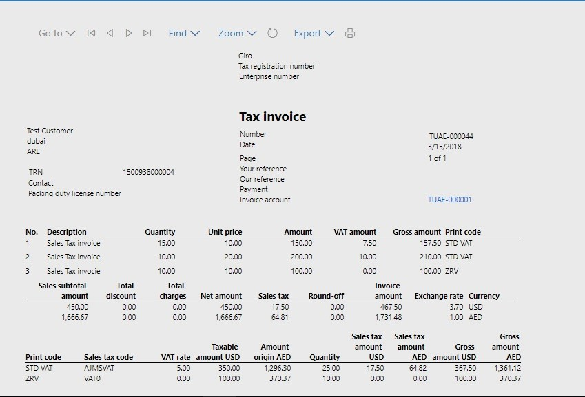

---
# required metadata

title: Print a sales invoice in the United Arab Emirates layout
description: This article includes country-specific information about how to print a sales invoice in the United Arab Emirates (UAE) layout. 
author: liza-golub
ms.date: 31/05/2023
ms.topic: overview
ms.prod: 
ms.technology: 

# optional metadata

# ms.search.form: 
audience: Application User
# ms.devlang: 
ms.reviewer: kfend
# ms.tgt_pltfrm: 

ms.search.region: United Arab Emirates (UAE)
# ms.search.industry: 
ms.author: liza-golub
ms.search.validFrom: 2017-06-30
ms.dyn365.ops.version: July 2017 update

---

# Print a sales invoice in the United Arab Emirates layout

This article includes country-specific information about how to print a sales invoice in the United Arab Emirates (UAE) layout.

In the UAE localization package, printouts for sales invoices and credit notes are included in the layout that is specified in the FTA requirements for accounting systems. 

The new printouts can be printed in two languages. The system will print one invoice in the language of UI. At the time, a second printout will be generated in the language of the customer, if the two languages differ.

To achieve consistent printout results, other data in the system should be set up so that it has translations. For example, on the **Released product** page, set up the names and descriptions of items in different languages. You should also consider setting up sales tax descriptions and exempt codes so that they have translations.

The following illustration shows an example of the printout for a free text invoice.

