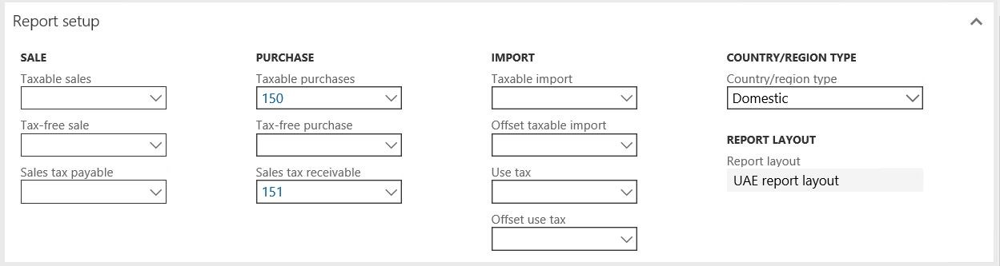
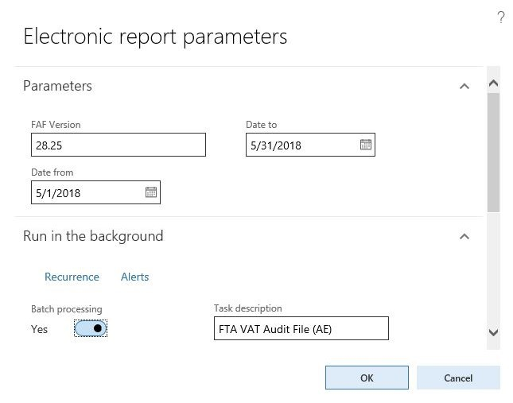
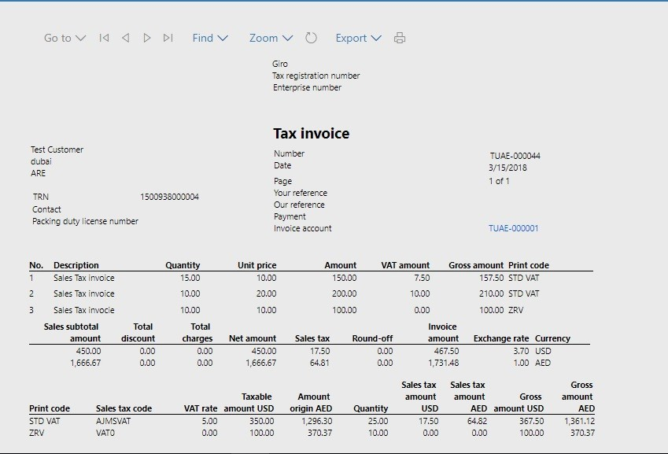

---
# required metadata

title: Set up and report Value Added Tax (VAT)
description: 
author: kfend
manager: AnnBe
ms.date: 11/22/2019
ms.topic: article
ms.prod: 
ms.service: dynamics-ax-applications
ms.technology: 

# optional metadata

ms.search.form: 
# ROBOTS: 
audience: Application User
# ms.devlang: 
ms.reviewer: kfend
ms.search.scope: Core, Operations
# ms.tgt_pltfrm: 
ms.custom: 272683
ms.search.region: UAE
# ms.search.industry: 
ms.author: v-elgolu
ms.dyn365.ops.version: Version 1611
ms.search.validFrom: 2019-05-29

---

# Set up and report Value Added Tax (VAT)

[!include [banner](../includes/banner.md)]

Value Added Tax (VAT) was introduced in the United Arab Emirates on 1 January 2018. Businesses in the UAE are responsible for carefully documenting their business income, costs, and associated VAT charges.

Registered businesses and traders will charge VAT to all their customers at the current rate, and will incur VAT on goods and services that they buy from suppliers. The difference between these sums is reclaimed or paid to the government. The issued Federal Decree Law No. (8) of 2017 on Value Added Tax, outlines the tax scope, rate, responsibility for tax, supply of goods and services in all cases, including supply in special cases, supply of more than one component, supply via agent, supply by government entities, and cases of deemed supply. For more detailed information about VAT regulations, see the [Federal Tax Authorities of United Arab Emirates website](https://government.ae/en/information-and-services/finance-and-investment/taxation/valueaddedtaxvat).

Microsoft Dynamics 365 for Finance and Operations is accredited and certified with the UAE Federal Tax Authorities as a tax accounting software provider. 

## Overview

Standard sales tax functionality in Dynamics 365 for Finance and Operations fulfills the majority of the legislation requirements of the United Arab Emirates VAT law. Following country-specific enhancements has been added for UAE VAT localization to align with UAE requirements for VAT reporting. These enhancements include:

- Legal entity configuration has been extended with additional fields that are required in VAT reporting.
- VAT reverse charge functionality has been enabled for UAE (ARE country context) to properly record taxable domestic operations within GCC territory.
- UAE country-specific sales invoice and credit notes printout layouts have been added with additional columns and VAT summary information.
- Sales invoice and credit notes for UAE can be printed in two languages including the new ar-AE Arabic language for user interface.
- The VAT return declaration report can be printed to an electronic file format that can be uploaded to the e-TAX FTA portal.
- Standard audit file functionality has been shared with UAE local functionality. Required by Federal Tax Authorities, the FTA VAT audit file (FAF) can be exported accordingly to the required comma separated file format.

For more detailed information about standard sales tax functionality, see the following topics:

- [Setting up sales tax authorities](../general-ledger/tasks/set-up-sales-tax-authorities.md)
- [Set up a sales tax settlement period](../general-ledger/tasks/set-up-sales-tax-settlement-periods.md)
- [Ledger posting groups](../general-ledger/tasks/set-up-ledger-posting-groups-sales-tax.,d)
- [Sales tax exempt codes](https://technet.microsoft.com/en-us/library/aa634356.aspx)
- [Sales tax reporting codes](../general-ledger/tasks/set-up-sales-tax-reporting-codes.md)
- [Setting up sales tax codes](../general-ledger/tasks/set-up-sales-tax-codes.md)
- [Setting up sales tax groups and item sales tax groups](../general-ledger/tasks/set-up-sales-tax-groups-item-sales-tax-groups.md)
- [Set up conditional sales taxes](https://technet.microsoft.com/EN-US/library/aa496600.aspx) - (used for cash accounting)
- [Set up a tax registration type](emea-registration-ids.md)

## Activate United Arab Emirates functionality

UAE country-specific functionality is activated by using the **Localized functionality region** configuration for legal entities. If **Localized functionality region** is detected by using the company address, make sure that the country code of the legal entity's primary address is set to ARE.

 
To learn more about the patterns used in localized solutions, see the [Localization and regulatory features website](../../dev-itpro/lcs-solutions/country-region.md).

## Configure VAT for a legal entity

VAT declaration and the FAF audit file require additional information must be to be set up in the configuration of a legal entity. In Finance and operations, go to **Organization administration** \> **Organizations** \> **Legal entities**, and in the **Value added tax** section, select following information:

- **Taxable person name**: Electronic VAT reports require the name of the taxable person. Names in English and Arabic will be populated in reports. If the legal entity UI language is set to English, the **Known as** field on the **Global address book** page can be used to store names in another language, such as Arabic.
- **Tax agency name** and **Tax agent name**: The Tax Agency Name, Tax Agency Number, Tax Agent Name, and Tax Agent Approval Number are required in electronic reporting for when VAT reports are prepared by a contracted tax agent or vendor.
- **Declarant name**: Information about the person preparing a VAT declaration will be included in the electronic report.
- **VAT refund required**: Select this option if a VAT refund is due and the company hasrequested to receive the VAT refund.
- **Profit margin scheme**: Select this option if the company operates in a special business scheme using Profit Margin scheme.
- **VAT on behalf of another person**: Select this option if your company operates as an agent who pays import VAT on behalf of another taxable person.

 

Learn more about VAT reporting requirements from the instructions at UAE Federal Tax Authorities website the in section dedicated to [Requirements Document for Tax Accounting Software](https://www.tax.gov.ae/pdf/requirement-document-for-tax-accounting-software.pdf).

## Configure tax authority

Federal tax authority must be set up as a sales tax authority. After the vendor account is associated with tax authority, the system creates automatic payments to vendor payables during the settlement process. 
Navigate to **Tax** \> **Sales tax** \> **Sales tax authorities** and set up the address information of your FTA office. Make sure to select the UAE specific report layout which corresponds with electronic VAT declaration. 

With Configured Tax Authority, you may proceed to associate Sales tax settlement periods with the tax authority you have just configured and Sales tax codes.

## Configure sales tax codes

The VAT declaration electronic report is based on the configuration of a specific sales tax UAE report layout which should be selected as default in the tax authority setup.
Follow the procedure for setting up Sales tax codes that aligns to the profile of your company business in Sales Tax section of the Help documentation.
To run the UAE report layout with electronic VAT declaration, you must first set up the appropriate number of reporting codes associated with each VAT declaration reporting amount.

Navigate to **Tax** \> **Indirect tax** \> **Sales tax** \> **Sales tax reporting codes** to create or update sales tax reporting codes according to the information in the following table:

| Sales Tax Code | VAT Reporting Code | Report Setup                 | Description                                                                             | VAT rate |
|----------------|--------------------|------------------------------|-----------------------------------------------------------------------------------------|----------|
| SRSAD          | 10                 | Sale>Taxable sales           | Standard rated supplies in Abu Dhabi                                                    | 5        |
|                | 11                 | Sale>Tax Payable             | Standard rated supplies in Abu Dhabi                                                                                         |   5       |
| SRSAD-A        | 15                 | Sale>Tax Payable             | Standard rated supplies in Abu Dhabi – Adjustment                                       |    5      |
| SRSD           | 20                 | Sale>Taxable sales           | Standard rated supplies in Dubai                                                        | 5        |
|                | 21                 | Sale>Tax Payable             | Standardrated supplies in Dubai                                                                                        |    5      |
| SRSD-A         | 25                 | Sale>Tax Payable             | Standard rated supplies in Dubai – Adjustment                                           |    5      |
| SRSS           | 30                 | Sale>Taxable sales           | Standard rated supplies in Sharjah                                                      | 5        |
|                | 31                 | Sale>Tax Payable             | Standard rated supplie in Sharjah                                                                                        |    5      |
| SRSS-A         | 35                 | Sale>Tax Payable             | Standard rated supplies in Sharjah – Adjustment                                         |    5      |
| SRSA           | 40                 | Sale>Taxable sales           | Standard rated supplies in Ajman                                                        | 5        |
|                | 41                 | Sale> Tax Payable            |  Standard rated supplies in Ajman                                                                                       |    5      |
| SRSA-A         | 45                 | Sale> Tax Payable            | Standard rated supplies in Ajman – Adjustment                                           |    5      |
| SRSRQ          | 50                 | Sale>Taxable sales           | Standard rated supplies in Umm Al Quwain                                                | 5        |
|                | 51                 | Sale>Tax payable             |  Standard rated supplies in Umm Al Quwain                                                                                      |    5      |
| SRSRQ-A        | 55                 | Sale>Tax payable             | Standard rated supplies in Umm Al Quwain – Adjustment                                   |          |
| SRSRK          | 60                 | Sale>Taxable sales           | Standard rated supplies in Ras Al Khaimah                                               | 5        |
|                | 61                 | Sale>Tax payable             |  Standard rated supplies in Ras Al Khaimah                                                                                       |    5      |
| SRSRK-A        | 65                 | Sale>Tax payable             | Standard rated supplies in Ras Al Khaimah – Adjustment                                  |    5      |
| SRSF           | 70                 | Sale>Taxable sales           | Standard rated supplies in Fujairah                                                     | 5        |
|                | 71                 | Sale> Tax Payable            | Standard rated supplies in Fujairah                                                                                        |    5      |
| SRSF-A         | 75                 | Sale>Tax payable             | Standard rated supplies in Fujairah – Adjustment                                        |    5      |
| TRPTS          | 80                 | Sale>Taxable sales           | Tax Refunds provided to Tourists                                                        | 5        |
|                | 81                 | Sale> Tax Payable            | Tax REfunds provided to Tourists                                                                                        |    5      |
| TRPTS-A        | 85                 | Sale>Tax payable             | Tax Refunds provided to Tourists – Adjustment                                           |    5      |
| SSRCP-R        | 90                 | Purchases>Taxable Purchases  | Supplies subject to the reverse charge provisions-Sales                                 | 5        |
|                | 91                 | Purchases>Taxable Receivable | Supplies sugject to the reverse charge provisions-Sales                                                                                        |   5       |
| SSRCP-R-A      | 95                 | Purchases>Taxable Receivable | Supplies subject to the reverse charge provisions-Sales – Adjustment                    |   5       |
| ZRS            | 100                | Sale> Taxable sales          | Zero rated supplies                                                                     | 0        |
| SOGSRC         | 110                | Sale> Taxable sales          | Supplies of goods and services to registered customers in other GCC implementing states | 5        |
| ES             | 120                | Sale> Taxable sales          | Exempt supplies                                                                         | 0        |
| GITUAE         | 170                | Purchases>Taxable Purchases  | Goods imported into the UAE                                                             | 5        |
|                | 171                | Purchases>Sales tax payable  | Goods imported into the UAE                                                                                         |   5       |
| GITUAE-R       | 130                | Sale>Taxable sales           | Goods imported into the UAE reverse charge                                              | -5       |
|                | 131                | Sale>Tax Payable             | Goods imported into the UAE reverse charge                                                                                      | -5        |
| SSRCP-R        | 90                 | Sale>Taxable sales           | Supplies subject to the reverse charge provisions                                       | -5       |
|                | 91                 | Sale>Tax Payable             | Supplies subject to the reverse charge provisions                                                                                         | -5         |
| SSRCP          | 170                | Sale>Taxable sales           | Supplies subject to the reverse charge provisions                                       | 5        |
|                | 171                | Sale>Tax Payable             | Supplies subject to the reverse charge provisions                                                                                        | 5         |
| SRE-A          | 160                | Purchases>Taxable Receivable | Standard rated expenses – Adjustment                                                    | 5        |
| SSRCP          | 170                | Sale>Taxable sales           | Supplies subject to the reverse charge provisions                                       |          |
|                | 171                | Sale>Tax Payable             | Supplies subject ot the reverse charge provisions                                                                                        | -5       |
| SSRCP-A        | 175                | Sale>Tax Payable             | Supplies subject to the reverse charge provisions – Adjustment                          |          |
| GTTKOB         | 180                | Sale>Taxable sales           | Goods transferred to the Kingdom of Bahrain                                             |          |
|                | 181                | Sale>Tax Payable             | Goods transferred to the Kingdom of Bahrain                                                                                         | 5        |
| GTTKOB-A       | 185                | Sale>Tax Payable             | Goods transferred to the Kingdom of Bahrain – Adjustment                                |          |
| GTTSOK         | 190                | Sale>Taxable sales           | Goods transferred to the State of Kuwait                                                |          |
|                | 191                | Sale>Tax Payable             | Goods transferred to the State of Kuwait                                                                                         | 5        |
| GTTSOK-A       | 195                | Sale>Tax Payable             | Goods transferred to the State of Kuwait – Adjustment                                   |          |
| GTTSOO         | 200                | Sale>Taxable sales           | Goods transferred to the Sultanate of Oman                                              |          |
|                | 201                | Sale>Tax Payable             | Goods transferred to the Sultanate of Oman                                                                                         | 5        |
| GTTSOO-A       | 205                | Sale>Tax Payable             | Goods transferred to the Sultanate of Oman – Adjustment                                 |          |
| GTTSOQ         | 210                | Sale>Taxable sales           | Goods transferred to the State of Qatar                                                 | 5        |
|                | 211                | Sale>Tax Payable             | Goods transferred to the State of Qatar                                                                                        |    5      |
| GTTSOQ-A       | 215                | Sale>Tax Payable             | Goods transferred to the State of Qatar – Adjustment                                    |   5       |
| GTTKOSA        | 220                | Sale>Taxable sales           | Goods transferred to the Kingdom of Saudi Arabia                                        |          |
|                | 221                | Sale>Tax Payable             | Goods transferred to the Kingdom of Saudi Arabia                                                                                         |          |
| GTTKOSA-A      | 225                | Sale>Tax Payable             | Goods transferred to the Kingdom of Saudi Arabia – Adjustment                           | 5        |
| RVPKOB         | 230                | Purchases>Taxable Purchases  | Recoverable VAT paid in the Kingdom of Bahrain                                          |          |
|                | 231                | Purchases>Taxable Receivable | Recoverable VAT paid in the Kingdom of Bahrain                                                                                        |          |
| RVPKOB-A       | 235                | Purchases>Taxable Receivable | Recoverable VAT paid in the Kingdom of Bahrain – Adjustment                             | 5        |
| RVPSOK         | 240                | Purchases>Taxable Purchases  | Recoverable VAT paid in the State of Kuwait                                             |          |
|                | 241                | Purchases>Taxable Receivable | Recoverable VAT paid in the State of Kuwait                                                                                        |          |
| RVPSOK-A       | 245                | Purchases>Taxable Receivable | Recoverable VAT paid in the State of Kuwait – Adjustment                                | 5        |
| RVPSOO         | 250                | Purchases>Taxable Purchases  | Recoverable VAT paid in the Sultanate of Oman                                           |          |
|                | 251                | Purchases>Taxable Receivable | Recoverable VAT paid in the Sultanate of Oman                                                                                         |          |
| RVPSOO-A       | 255                | Purchases>Taxable Receivable | Recoverable VAT paid in the Sultanate of Oman – Adjustment                              | 5        |
| RVPSOQ         | 260                | Purchases>Taxable Purchases  | Recoverable VAT paid in the State of Qatar                                              |          |
|                | 261                | Purchases>Taxable Receivable | Recoverable VAT paid in the State of Qatar                                                                                        |          |
| RVPSOQ-A       | 265                | Purchases>Taxable Receivable | Recoverable VAT paid in the State of Qatar – Adjustment                                 | 5        |
| RVPKOSA        | 270                | Purchases>Taxable Purchases  | Recoverable VAT paid in the Kingdom of Saudi Arabia                                     |          |
|                | 271                | Purchases>Taxable Receivable | Recoverable VAT paid in the Kingdom of Saudi Arabia                                                                                        |          |
| RVPKOSA-A      | 275                | Purchases>Taxable Purchases  | Recoverable VAT paid in the Kingdom of Saudi Arabia – in Adjustment                     | 5        |

 
The sales tax reporting codes configuration will display as a list in the **Sales tax reporting codes** page.
 

 
Using the instructions from the **Report setup** column in the table above, configure sales tax codes and associate them with sales tax reporting codes in the report setup section of each report that is relevant to your company business.
 

## Set up VAT reverse charge

When a taxable customer must pay tax on a supply received from a non-resident supplier, VAT should be calculated and paid to tax the authorities on a VAT reverse charge basis. The customer must calculate and report the output tax on the supply and relevant input tax.

In order to use reverse charge functionality, you must select the **Reverse charge** option on the **General ledger parameters** page.

Before setting the sales tax group for reverse charge, you should set up two sales tax codes: one for input sales tax and other for output sales tax. Output sales tax code should be set up with a negative value. For more information, see [Setting up sales tax codes](https://technet.microsoft.com/en-us/library/gg230668.aspx). 

You must select the **Reverse charge** check box on the line with the negative sales tax rate in the **Reverse charge** sales tax group. 

 

When the invoice line is posted with the **Reverse charge** sales tax group, the system will create two sales tax transactions: one with a sales tax receivable tax direction and other with a sales tax payable tax direction. 

## Download and set up Electronic reports configurations

Implementing VAT reporting for United Arab Emirates is based on Electronic Reporting configurations. 
For more information about the capabilities and concepts of configurable reporting, see [Electronic reporting](../../dev-itpro/analytics/general-electronic-reporting.md).

For PROD and UAT environments, follow the instructions in the topic, [Download Electronic reporting configurations from Lifecycle Services](../../dev-itpro/analytics/download-electronic-reporting-configuration-lcs.md) to download electronic reporting configurations.

The following configurations must be installed to use VAT declaration and FTA VAT audit file functionality in UAE localizations. Always use the highest available version number of a configuration file.

| Configuration file name                           | Configuration type                   |
|---------------------------------------------------|--------------------------------------|
| VAT declaration model.version.4.xml               | Data model                           |
| VAT declaration model mapping.version.4.4.xml     | Model mapping                        |
| VAT declaration Excel (AE).version.4.1.xml        | UAE specific Microsoft Excel output format  |
| Standard Audit File model mapping.version.6.7.xml | Data model                           |
| Standard Audit File (SAF-T).version.6.xml         | Model Mapping                        |
| FTA VAT Audit file (AE).version.6.5.xml           | UAE FTA audit file CSV output format |
 
In a Dev or Test environment, if direct access to a deployment virtual machine is available, you can download configurations from http://lcs.dynamics.com.  After you log in in to the LCS portal, select **Shared asset library**.

 

In the **Shared asset** library, select **GER configurations**, choose the required configurations as listed in the previous table, and download to a local disc.

In Finance and operations, navigate to the Electronic reporting workspace and select **Reporting configurations** \> **Exchange** \> **Load from XML file**, and upload all of the files in order listed in the previous table.

 [

With all configurations uploaded, the configuration tress should be present in Finance and operations.

 

 
## VAT declaration electronic reporting file

To generate the VAT declaration report in Excel, use the standard procedure for reporting sales tax for a settlement reporting period and print VAT declaration report.

To generate VAT Declaration after a settlement is complete, navigate to **Tax** \> **Sales Tax Inquires** \> **Sales Tax Payments**. Select required sales tax payment, and on the Action Pane, select **Print report** .

 
Follow VAT declaration report dialog and fill in required information.

 
A browser-specific dialog will open with a recommendation to save the downloaded VAT declaration excel file to your local machine. Save and verify the content of reported data.

According to FTA accounting systems requirements, an electronic reporting file can't be edited it is after generation from system. When a correction is needed, it has to happen in the system. After the corrections are made, generate a new reporting file. 

After sucessfully validating the repoting file, upload the file to the FTA e-Tax portal using procedures specific to your company registration with FTA.

## FTA VAT audit file

If an FTA VAT audit file is requested, after you generate the file (**Tax** \> **Declarations** \> **FAF Declaration**), complete the dialog questions. 

 
If you expected a large volume of transactions in the scope of the auditing period, you can deliver multiple FTA audit files. Consider running the FTA file generation in the background with batch processing and dividing the audited periods into smaller intervals of months, weeks, or days.
 
## Print a sales invoice in the UAE layout

With the UAE localization package, sales invoice and credit note printouts are included in the layout that is specified in FTA requirements for accounting systems. The following is an example of a free text invoice printout.
 

Printing in two languages was accommodated in the new printouts. System will print two Invoice printouts, first in language of user interface and simultaneously second printout will be generated in language of a customer in case those two languages are different.

To achieve consistent printout results other data in the system should be setup using translations like Name, Description of items in different languages in the Released product form. Additionally, Sales tax descriptions and Exempt code should also be considered for setup with translations.

