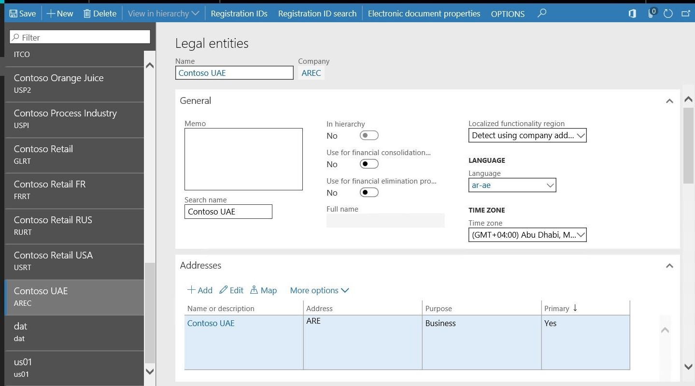

---
# required metadata

title: United Arab Emirates (UAE) overview
description: This article provides links to documentation resources for the United Arab Emirates (UAE). 
author: liza-golub
ms.date: 06/07/2023
ms.topic: overview
ms.prod: 
ms.technology: 

# optional metadata

# ms.search.form: 
audience: Application User
# ms.devlang: 
ms.reviewer: kfend
# ms.tgt_pltfrm: 

ms.search.region: United Arab Emirates (UAE)
# ms.search.industry: 
ms.author: liza-golub
ms.search.validFrom: 2017-06-30
ms.dyn365.ops.version: July 2017 update

---

# United Arab Emirates (UAE) overview

[!include [banner](../includes/banner.md)]

This article provides links to documentation resources for the United Arab Emirates (UAE). 

- [Set up and report value-added tax (VAT)](uae-vat-setup-reporting.md)
- [FTA Tax Audit File (FAF) in TXT format](uae-faf.md)
- [Print a sales invoice in the UAE layout](uae-sales-invoice-layout.md)

## Activate the UAE functionality

Country-specific functionality for the UAE is activated by using the **Localized functionality region** configuration for legal entities. If the company address is used to detect the **Localized functionality region** configuration, make sure that the country/region code of the legal entity's primary address is set to **ARE** on the **Legal entities** page.

For more information about the patterns that are used in localized solutions, see the [Localization and regulatory features website](../../fin-ops-core/dev-itpro/lcs-solutions/country-region.md).

[!INCLUDE[footer-include](../../includes/footer-banner.md)]
