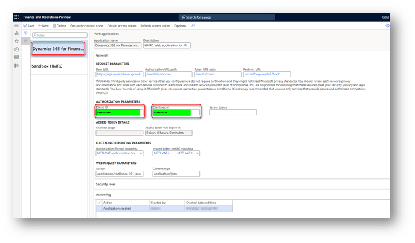
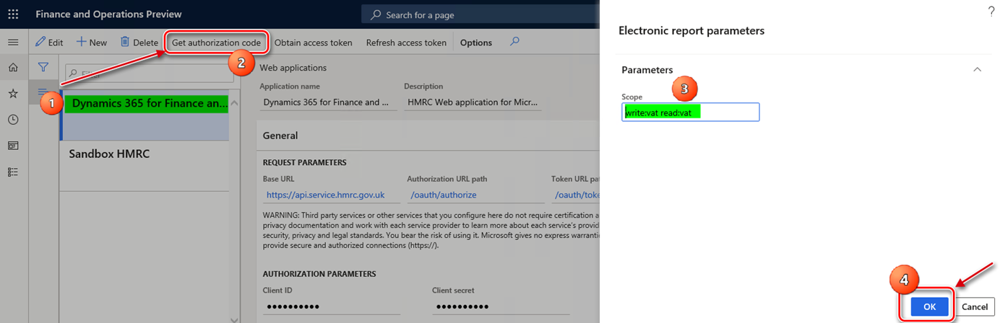
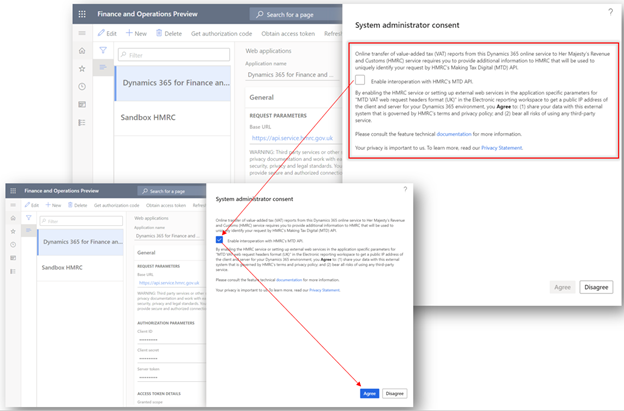
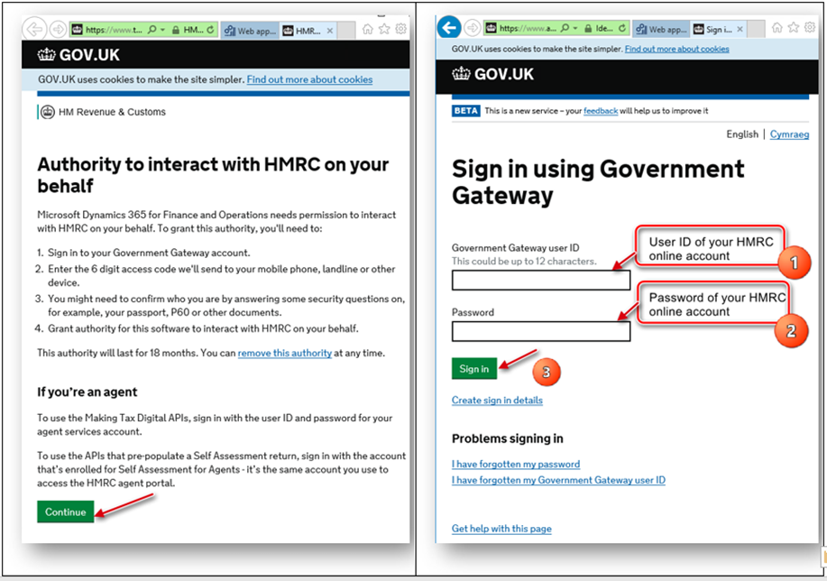

# Authorize your Finance environment to interoperate with HMRC's MTD web service

[!include [banner](../../includes/banner.md)]

This article explains how to authorize your Microsoft Dynamics 365 Finance environment to interoperate with the Making Tax Digital (MTD) web service of Her Majesty's Revenue and Customs (HMRC).

> [!NOTE]
> To meet security requirements, we are implementing modifications to the Dynamics 365 Finance direct system-to-system integration with the HMRC web service for submitting VAT returns for companies registered for VAT in the UK. This enhancement will involve the adoption of an Electronic Invoicing service as an intermediary, which will facilitate secure access to the storage of credentials essential for software authorization within the HMRC APIs. **Please note that these services will not be accessible from on-premises deployments by June 6, 2025**.
>
> By June 6, 2025, we plan to no longer support **batch mode for submission** of VAT return in the Making Tax Digital feature. It will still be possible to generate in batch the report (VAT 100) in Excel and JSON formats. 

Two parameters uniquely identify each web application on the HMRC side:

- **Client ID** – The unique identifier of the web application.
- **Client secret** – The secret passphrase that is used to authorize the web application.

These parameters are used when requests are sent to HMRC. They must be filled in before you start the authorization process for a web application.

For the production web application (**Dynamics 365 Finance**), Microsoft delivers these parameters through the [package of data entities](emea-gbr-mtd-vat-integration-setup.md#entities), and they are stored in the system in an encrypted format. These parameters are imported when you import the predefined setup of Electronic messages functionality for Making Tax Digital for value-added tax (MTD VAT). No additional manual actions are required. After the parameters are imported, the production web application is ready for authorization.

> [!IMPORTANT]
> When you use the MTD VAT feature that is provided by Microsoft, you don't have to request production credentials from HMRC. All the required web application credentials are imported into your system during setup of the MTD VAT feature.

- Go to **Tax** \> **Setup** \> **Electronic messages** \> **Web applications**, and verify that the **Client ID** and **Client secret** fields are set for the **Dynamics 365 Finance** web application. Don't change these values.

    

You don't have to create a web application of the production type on the HMRC side, because the **Dynamics 365 Finance** web application is ready to interoperate with the production MTD service for VAT. Complete the procedures in the next section to obtain an authorization code and an access token.

## Obtain an authorization code for the production environment

When your company is [registered for VAT](https://www.gov.uk/vat-registration) and ready to interoperate with MTD VAT in a production environment, you must [create an HMRC online account](https://www.gov.uk/guidance/help-and-support-for-making-tax-digital#sign-up-for-making-tax-digital-for-vat) if it doesn't already exist. This account is also known as a Government Gateway account. Next, link the [online account](https://www.gov.uk/send-vat-return) to the Finance application by selecting **Microsoft Dynamics 365 Finance** as the [MTD-compatible software](https://www.tax.service.gov.uk/making-tax-digital-software?_ga=2.124730698.1312416614.1630487369-812816713.1605853350). A user ID and password will be obtained and linked to your VAT registration number:

- **User ID** – The name that is used to access HMRC while an authorization code is being requested.
- **Password** – The password that is used to access HMRC while an authorization code is being requested.

After you obtain your user credentials, a web application of the production type can be authorized from within your Finance.

### Obtain an authorization code

Follow these steps to get an authorization code from HMRC.

1. In Finance, go to **Tax** \> **Setup** \> **Electronic messages** \> **Web applications**, and select the **Dynamics 365 Finance** web application.
2. On the Action Pane, select **Get authorization code** and select **Yes** to confirm that you want to initialize the authorization process.
3. In the **Electronic reporting parameters** dialog box, in the **Scope** field, enter **read:vat write:vat**. 
4. Select **OK**.

    

5. In the **System administrator consent** dialog box, select the checkbox to confirm that you want to enable interoperation with HMRC's MTD application programming interface (API) and use external web services. Your privacy is important to us. To learn more, read our [privacy notice](emea-gbr-mtd-vat-integration.md#privacy-notice).

    

6. Select **Agree** to continue, and then, in the HMRC portal, select **Continue** at the bottom of the page.
7. In the HMRC portal for authorization, on the **Sign in** page, enter the **User ID** and **Password** values that you obtained from HMRC during your subscription for MTD. Then select **Sign in**.

    

8. Select **Grant authority**.
9. The **Authorisation granted** page shows the authorization code that HMRC granted to you for your Finance environment. Copy this authorization code to the clipboard.

> [!IMPORTANT]
> The authorization code is valid for only 10 minutes. You must [obtain an access token](#obtain-an-access-token) during that time. If you don't obtain the access token within 10 minutes, and the authorization code expires, you can get a new authorization code.

### Obtain an access token

Follow these steps to initialize retrieval of an access token within 10 minutes after HMRC grants an authorization code.

1. In Finance, go to **Tax** \> **Setup** \> **Electronic messages** \> **Web applications**, and select the **Dynamics 365 Finance** web application.
2. On the **Web applications** page, on the Action Pane, select **Obtain access token** to request an access token from HMRC.
3. Paste the authorization code that you copied from the HMRC portal in the previous procedure. Then select **OK**. The access token request is sent to HMRC, and the access token from the response that is received is automatically saved in Finance. You can't view the access token from the user interface (UI). However, the **Access token will expire in** field shows the validity period of the access token.

Every access token is valid for four hours after HMRC creates it. During interoperation with HMRC, the system automatically handles the process of refreshing the access token. Therefore, you don't have to manually refresh it. However, if you want to manually refresh the access token, on the **Web applications** page, on the Action Pane, select **Refresh access token**. A refresh access token request is sent to HMRC, and a new access token from the response that is received is automatically saved in Finance.

[!INCLUDE[footer-include](../../../includes/footer-banner.md)]

