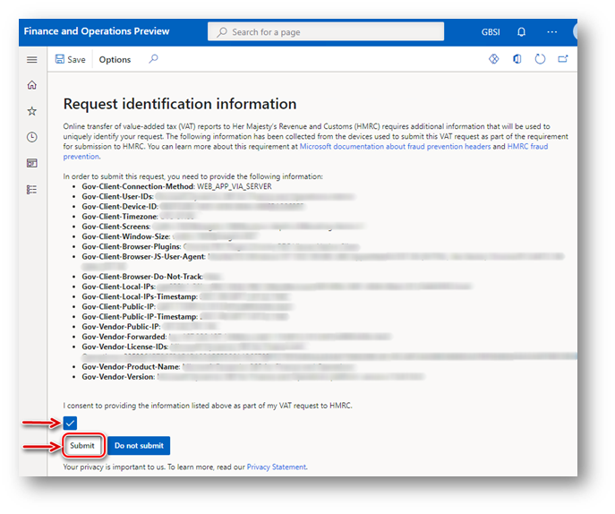

# Prepare your environment to interoperate with HMRC's MTD VAT web service

[!include [banner](../../includes/banner.md)]

> [!NOTE]
> To meet security requirements, we are implementing modifications to the Dynamics 365 Finance direct system-to-system integration with the HMRC web service for submitting VAT returns for companies registered for VAT in the UK. This enhancement will involve the adoption of an Electronic Invoicing service as an intermediary, which will facilitate secure access to the storage of credentials essential for software authorization within the HMRC APIs. **Please note that these services will not be accessible from on-premises deployments by June 6, 2025**.
>
> By June 6, 2025, we plan to no longer support **batch mode for submission** of VAT return in the Making Tax Digital feature. It will still be possible to generate in batch the report (VAT 100) in Excel and JSON formats. 

After your company is [signed up for the Making Tax Digital (MTD) service for value-added tax (VAT) in Her Majesty's Revenue and Customs (HMRC)](https://www.gov.uk/vat-record-keeping/sign-up-for-making-tax-digital-for-vat), complete the following tasks. These tasks will prepare your Microsoft Dynamics 365 Finance environment to interoperate with HMRC's web service to retrieve information about your company's VAT obligations and submit VAT returns.

- [Import and set up Electronic reporting (ER) configurations](#configurations).
- [Set up application-specific parameters for the VAT Declaration format](#declaration).
- [Set up application-specific parameters for Making Tax Digital for VAT (MTD VAT) web request headers format](#headers).
- [Import a package of data entities that includes a predefined Electronic messaging (EM) setup](#entities).
- [Set up the VAT registration number of the company that is reporting VAT](#vrn).
- [Generate the VAT statement (VAT 100 report) in paper format](#format).
- [Enable VAT return reporting for companies that report as a VAT group in the same system database](#vatgroup).
- [Define a sales tax settlement period](#settlement).
- [Set up number sequences for Electronic messages functionality](#sequences).
- [Set up document management parameters](#docmanagement).
- [Set up security roles for electronic message processing](#processing).
- [Set up security roles to interoperate with HMRC's MTD VAT web service](#application).
- [Send fraud prevention data](#sending-headers).

MTD VAT APIs require that you use TLS 1.2. For more information about how to enable TLS 1.2, see [How to enable TLS 1.2](/mem/configmgr/core/plan-design/security/enable-tls-1-2). 

## Import and set up ER configurations

To prepare Finance to interoperate with MTD VAT, import the following ER configurations.

| Number | ER configuration name | Type | Description |
|--------|-----------------------|------|-------------|
| 1      | Tax declaration model | Model | A generic model for different tax declarations. |
| 2      | Tax declaration model mapping | Model mapping | A generic model mapping for VAT declarations. |
| 3      | VAT Declaration JSON (UK) | Format (exporting) | A VAT return in JavaScript Object Notation (JSON) format for submission to HMRC. |
| 4      | VAT Declaration Excel (UK) | Format (exporting) | The **VAT 100** report (a declaration in Excel format). |
| 5      | MTD VAT interoperation (UK) | Format (exporting) | A format that is used to create a URL path for HMRC endpoints and request a test user. |
| 6      | MTD VAT importing model mapping (UK) | Model mapping (importing) | The importing model mapping for VAT obligations. |
| 7      | MTD VAT obligations importing JSON (UK) | Format (importing) | The format for importing VAT obligations that are retrieved from HMRC. |
| 8      | Electronic Messages framework model | Model | The model for the Electronic messages framework. |
| 9      | MTD VAT model mapping (UK) | Model mapping (exporting, importing) | A model mapping that supports interoperation for MTD VAT for the United Kingdom (UK). |
| 10     | MTD VAT return response importing JSON (UK) | Format (importing) | The importing ER format that is used for the response that is received from HMRC for the VAT declaration submission. This format is used to import the response into an electronic message. |
| 11     | MTD VAT web request headers format (UK) | Format (exporting) | A format that is used to create request header parameters for the Hypertext Transfer Protocol over Secure Sockets Layer (HTTPS) request. |
| 12     | MTD VAT authorization format (UK) | Format (exporting) | The request header parameters for the authorization code and access token. |
| 13     | MTD VAT import token format (UK) | Format (importing) | The ER format that is used to import the access token that is received from HMRC into the database. |

Import the latest versions of these configurations. The version description usually includes the number of the Microsoft Knowledge Base (KB) article that explains the changes that were introduced in the configuration version. Use the number of the KB in the [LCS Issue search portal](https://lcs.dynamics.com/v2) to learn more about the changes introduced. If the latest configuration version contains references to the objects that aren't available in your Finance version, the import process will be locked for that configuration version. In this case, import the latest version of the configuration that is available for your Finance version.

> [!NOTE]
> After all the ER configurations from the preceding table are imported, set the **Default for model mapping** option to **Yes** for the following configurations:
>
> - Tax declaration model mapping
> - MTD VAT model mapping (UK)
>
> 

For more information about how to download ER configurations from the Microsoft global repository, see [Download ER configurations from the Global repository](../../../fin-ops-core/dev-itpro/analytics/er-download-configurations-global-repo.md).

## Set up application-specific parameters for the VAT Declaration format

Nine boxes on the VAT declaration for the UK must contain values that are calculated based on the tax transactions that are relevant to the VAT settlement period that the company used during the reporting period.

Tax transactions can have different combinations of criteria, such as the transaction direction, the tax code, the country or region code of the tax code, and the tax type. The combination of criteria depends on the nature of the original business operation that caused tax transaction posting.

Application-specific parameters let users influence the collection of tax transactions that must be considered during the calculation of the reporting value in each box on the VAT declaration. For the VAT declaration for the UK, there is a **ReportFieldLookup** application-specific parameter. The following table describes the result values that are available for this parameter.

| Result value | Calculation that the result value is used in | Default setup of the classifier value |
|--------------|----------------------------------------------|---------------------------------------|
| VATDue       | <ul><li>Tax amount from the **vatDueSales** box.</li><li>Tax base amount from the **totalValueSalesExVAT** box.</li><li>Tax base amount from the **totalValueGoodsSuppliedExVAT** box. In addition, the reporting type of the item sales tax group isn't set to **Service**, and the country/region type of the sales tax code is set to **EU**.</li></ul> | <ul><li>Sales</li><li>SalesCreditNote</li><li>SalesReverseCharge</li><li>SalesReverseChargeCreditNote</li></ul> |
| VATDueEC     | <ul><li>Tax amount from the **vatDueAcquisitions** box and tax base amount from the **totalAcquisitionsExVAT** box. In addition, the reporting type of the item sales tax group isn't set to **Service**, and the country/region type of the sales tax code is set to **EU**.</li><li>Tax amount from the **vatReclaimedCurrPeriod** box.</li><li>Tax base amount from the **totalValuePurchasesExVAT** box.</li></ul> | <ul><li>UseTax</li><li>UseTaxCreditNote</li></ul> |
| ECSupplies   | <ul><li>Tax base amount from the **totalValueSalesExVAT** box.</li><li>Tax base amount from the **totalValueGoodsSuppliedExVAT** box. In addition, the reporting type of the item sales tax group isn't set to **Service**, and the country/region type of the sales tax code is set to **EU**.</li></ul> | <ul><li>SaleExempt</li><li>SalesExemptCreditNote</li></ul> |
| VATReclaimed | <ul><li>Deductible sales tax amount from the **vatReclaimedCurrPeriod** box.</li><li>Tax base amount from the **totalValuePurchasesExVAT** box.</li><li>Tax amount from the **vatDueAcquisitions** box. In addition, the reporting type of the item sales tax group isn't set to **Service**, and the country/region type of the sales tax code is set to **EU**.</li></ul> | <ul><li>Purchase</li><li>PurchaseCreditNote</li><li>PurchaseReverseCharge</li><li>PurchaseReverseChargeCreditNote</li><li>PurchaseExempt</li><li>PurchaseExemptCreditNote</li></ul> |
| Other        | Use the **Not blank** value for this result, and set it up at the end of your list of result values. | Not blank |

For each value, users can define a set of sales tax codes together with a classifier that is associated with the direction of the tax transaction and the credit note identifier. The following table provides a definition of this classifier.

| Classifier value                | Condition |
|---------------------------------|-----------|
| PurchaseCreditNote              | <ul><li>Credit note</li><li>Tax direction = Sales tax receivable</li></ul> |
| Purchase                        | <ul><li>Not credit note</li><li>Tax direction = Sales tax receivable</li></ul> |
| SalesCreditNote                 | <ul><li>Credit note</li><li>Tax direction = Sales tax payable</li></ul> |
| Sales                           | <ul><li>Not credit note</li><li>Tax direction = Sales tax payable</li></ul> |
| PurchaseExemptCreditNote        | <ul><li>Credit note</li><li>Tax direction = Tax-free purchase</li></ul> |
| PurchaseExempt                  | <ul><li>Not credit note</li><li>Tax direction = Tax-free purchase</li></ul> |
| SalesExemptCreditNote           | <ul><li>Credit note</li><li>Tax direction = Tax-free sales</li></ul> |
| SaleExempt                      | <ul><li>Not credit note</li><li>Tax direction = Tax-free sales</li></ul> |
| UseTaxCreditNote                | <ul><li>Credit note</li><li>Tax direction = Use tax</li></ul> |
| UseTax                          | <ul><li>Not credit note</li><li>Tax direction = Use tax</li></ul> |
| PurchaseReverseChargeCreditNote | <ul><li>Credit note</li><li>Tax direction = Sales tax receivable</li><li>ReverseCharge\_W = Yes</li></ul> |
| PurchaseReverseCharge           | <ul><li>Not credit note</li><li>Tax direction = Sales tax receivable</li><li>ReverseCharge\_W = Yes</li></ul> |
| SalesReverseChargeCreditNote    | <ul><li>Credit note</li><li>Tax direction = Sales tax payable</li><li>ReverseCharge\_W = Yes</li></ul> |
| SalesReverseCharge              | <ul><li>Not credit note</li><li>Tax direction = Sales tax payable</li><li>ReverseCharge\_W = Yes</li></ul> |

For more information about how boxes on the VAT declaration for the UK use the result values that are defined for the **ReportFieldLookup** application-specific parameter, see [VAT setup details for VAT declarations in the United Kingdom](emea-gbr-mtd-vat-integration-declaration.md).

Before you use the **VAT Declaration JSON (UK)** and **VAT Declaration Excel (UK)** formats, set up the **ReportFieldLookup** application-specific parameter. You can download an example of this setup from the [Shared asset library in Microsoft Dynamics Lifecycle Services (LCS)](https://lcs.dynamics.com/V2/SharedAssetLibrary) that includes the setup for the **Result values** which are provided in the **Default setup of the classifier value** column in the first table of this section.

1. In LCS, go to the [Shared asset library](https://lcs.dynamics.com/V2/SharedAssetLibrary), and select **Data package** as the asset type. Then find the **UK MTD VAT ReportFieldLookup** file in the list of data package files, and download it to your computer.

    

2. To set up the **ReportFieldLookup** application-specific parameter in the system, in Finance, open the **Electronic reporting** workspace, and then, in the configuration tree, under **Tax declaration model**, select the **VAT Declaration JSON (UK)** format.
3. On the Action Pane, on the **Configurations** tab, in the **Application specific parameters** group, select **Setup**, and then select the version of the format that you want to use. Usually, Finance runs the latest configuration version that is available in your system.
4. To use the example of this setup that you downloaded from the Shared asset library as a preliminary step, select **Import** on the Action Pane, and then select the file that you downloaded.
5. To manually define conditions, select **ReportFieldLookup** on the **Lookups** FastTab, and then specify criteria on the **Conditions** FastTab. You can also use the example file as a starting point to set up conditions. If you manually specify conditions for **ReportFieldLookup**, we recommend that you set up the **Other** value as the last condition in the list. Although this value isn't used in the **VAT Declaration JSON (UK)** format, it must be set to **Not blank** for both columns of the criteria.

    > [!IMPORTANT]
    > When you've finished setting up conditions, change the value of the **State** field to **Completed**, save your changes, and close the **Application specific parameters** page.
    >
    > 

    You can easily export the setup of application-specific parameters from one version of a report and import it into another version. You can also export the setup from one report and import it into another report, provided that both reports have the same structure of lookup fields.

6. When your setup of **ReportFieldLookup** for the **VAT Declaration JSON (UK)** format is ready, export it, and then import it into the **VAT Declaration Excel (UK)** format.
7. In the configuration tree, **Tax declaration model**, select the **VAT Declaration JSON (UK)** format.
8. On the Action Pane, on the **Configurations** tab, in the **Application specific parameters** group, select **Setup**, and then select the version of the format that you completed the setup of **ReportFieldLookup** for.
9. On the Action Pane, select **Export** to save your configuration in XML format, and then close the **Application specific parameters** page.
10. In the configuration tree, under the **VAT Declaration JSON (UK)** format, select the **VAT Declaration Excel (UK)** format.
11. On the Action Pane, on the **Configurations** tab, in the **Application specific parameters** group, select **Setup**, and then select the version of the format that you want to use.
12. On the Action Pane, select **Import**, select the file that you saved in step 6, and select **OK** to confirm the import.
13. Change the value of the **State** field to **Completed**, save your changes, and close the **Application specific parameters** page.

> [!IMPORTANT]
> - The setup of **ReportFieldLookup** is company specific.
> - Before you start to set up **ReportFieldLookup**, be sure to select the legal entity in which you want to generate the VAT declaration for the UK.
> - If you want to generate the VAT declaration for the UK from multiple legal entities in Finance, set up **ReportFieldLookup** for each legal entity.
> - The setup of **ReportFieldLookup** is mandatory for all legal entities that report VAT as a VAT group.

## Set up application-specific parameters for MTD VAT web request headers format

[By law](https://developer.service.hmrc.gov.uk/guides/fraud-prevention/), header data must be submitted for the MTD VAT application programming interfaces (APIs) in the UK. When the MTD VAT APIs are used, MTD-compatible software must submit HTTP fraud prevention headers that include the public IP address of the client and the public IP address of the server.

To enable Finance to collect client and server public IP addresses, as of 10.0.22 version, you must set up the **ExternalServiceEndpoints\_LOOKUP** application-specific parameter for the **MTD VAT web request headers format (UK)** format under **Electronic Messages framework model** in the **Electronic reporting** workspace.

1. In the **Electronic reporting** workspace, in the configuration tree, under **Electronic Messages framework model**, select the **MTD VAT web request headers format (UK)** format.
2. On the Action Pane, on the **Configurations** tab, in the **Application specific parameters** group, select **Setup**, and then select the version of the format that you want to use. Usually, Finance runs the latest configuration version that is available in your system.
3. On the **Lookups** FastTab, select **ExternalServiceEndpoints\_LOOKUP**. Then, on the **Conditions** FastTab, add criteria.
4. In the **Lookup result** field, select **Gov-Client-Public-IP**. In the **ExternalServiceEndpoint** field, specify the HTTPS address of the external web service that will be called when a request is initiated to HMRC's MTD VAT API to collect the client public IP address. Your privacy is important to us. To learn more, read our [privacy notice](emea-gbr-mtd-vat-integration.md#privacy-notice).
5. In the **Regex** field, specify a regular expression that is specific to the external web service that you specified in the **ExternalServiceEndpoint** field, and that will enable the IP address in IPv4 or IPv6 format to be extracted from the response of the web service.
6. On the **Conditions** FastTab, select **Add** to add another line.
7. In the **Lookup result** field, select **Gov-Vendor-Public-IP**. In the **ExternalServiceEndpoint** field, specify the HTTPS address of the external web service that will be called when a request is initiated to HMRC's MTD VAT API to collect the public IP address of the server. The length of this field's value is limited to 60 characters. Only HTTPS URLs are supported.

    The format for the Simple Traversal of User Datagram Protocol (UDP) through network address translation (NAT) server (STUN server) for Web Real-Time Communication (WebRTC) is just the STUN server address. When the endpoint doesn't start with **https://**, the system uses it as a STUN server.

8. Optional: In the **Regex** field, specify a regular expression that is specific to the external web service that you specified in the **ExternalServiceEndpoint** field, and that will enable the IP address in IPv4 or IPv6 format to be extracted from the response of the web service. The length of this field's value is limited to 60 characters.

    If you leave this field blank, the system automatically applies the following default regular expression to the response from the specified web service: **(\[0-9\]\{1,3\}(\\.\[0-9\]\{1,3\})\{3\})\|((\[0-9A-Fa-f\]\{0,4\}:)\{2,7\}(\[0-9A-Fa-f\]\{1,4\}))**.

    > [!NOTE]
    > When you use character escapes in a regular expression, backslashes (\\) must also be escaped (as \\\\). For example, the plain regular expression for IPv4, **(\[0-9\]\{1,3\}(\\.\[0-9\]\{1,3\})\{3\})**, must be transformed to **(\[0-9\]\{1,3\}(\\\\.\[0-9\]\{1,3\})\{3\})**.

9. For both **Gov-Client-Public-IP** and **Gov-Vendor-Public-IP**, add as many different web services as you require to ensure that the IP addresses will be obtained during requests to HMRC's MTD VAT API. The system will call the web services one by one until all the required IP addresses are collected.

    > [!IMPORTANT]
    > - When you've finished setting up conditions, change the value of the **State** field to **Completed**, save your changes, and close the **Application specific parameters** page.
    > - The **ExternalServiceEndpoint** application-specific parameter for the **MTD VAT web request headers format (UK)** format under **Electronic Messages framework model** must be set up for the legal entity that you will interoperate with HMRC's MTD VAT API from.

## Import a package of data entities that includes a predefined EM setup

The process of setting up the [Electronic messages](../../general-ledger/electronic-messaging-setup.md) (EM) functionality for MTD VAT has many steps. Because the names of some predefined entities are used in the ER configurations, use a set of predefined values that are delivered in a package of data entities for the related tables. Some records in the data entities in the package include a link to ER configurations. Before you start to import the data entities package, [import ER configurations](#configurations) into Finance.

1. In [LCS](https://lcs.dynamics.com/v2), go to the Shared asset library, and select **Data package** as the asset type. Then find **UK MTD VAT setup** in the list of data package files, and download it to your computer.
2. After the **UK MTD VAT setup** file is downloaded, in Finance, select the company that you will interoperate with HMRC's MTD VAT API from, and then go to **Workspaces** \> **Data management**.
3. Before you import setup data from the package of data entities, make sure that the data entities in your application are refreshed and synced. In the **Data management** workspace, go to **Framework parameters** \> **Entity settings**, and then select **Refresh entity list**. Wait for confirmation that the refresh has been completed. For more information about how to refresh the entity list, see [Entity list refresh](../../../fin-ops-core/dev-itpro/data-entities/data-entities.md#entity-list-refresh).
4. Validate that the source data and target data are correctly mapped. For more information, see [Validate that the source data and target data are mapped correctly](../../../fin-ops-core/fin-ops/data-entities/data-import-export-job.md#validate-that-the-source-data-and-target-data-are-mapped-correctly).
5. You can now import data from the **UK MTD VAT setup** file into the selected company. In the **Data management** workspace, select **Import**, and then, on the **Import** FastTab, in the **Group name** field, select a value.
6. On the **Selected entities** FastTab, select **Add file**.
7. In the **Source data format** field, select **Package**, and then select **Upload and add**. 
8. Find and select the **UK MTD VAT setup** file that you downloaded in step 1.
9. Wait until the data entities from the file are listed in the grid on the **Selected entities** FastTab, and then select **Close**.
10. On the Action Pane, select **Import** to start the import.

    

For more information, see [Data management](../../../fin-ops-core/dev-itpro/data-entities/data-entities-data-packages.md?toc=%2ffin-and-ops%2ftoc.json).

The **UK MTD VAT setup** package provides a setup for two sets of processing that can be used independently:

- **UK MTD VAT returns** – For interoperation with the **production** HMRC web service.
- **UK MTD VAT TEST** – For interoperation with the **sandbox** HMRC web service.

The **UK MTD VAT setup** package also provides a setup for two web applications that are used to interoperate with HMRC web services:

- **Dynamics 365 Finance** – For interoperation with the **production** HMRC web service.
- **Sandbox HMRC** – For interoperation with the **sandbox** HMRC web service.

When you import the setup of Electronic messages functionality for MTD VAT from the **UK MTD VAT setup** package that Microsoft provides, credentials for the **Dynamics 365 Finance** web application are imported into your system and stored in encrypted format. These credentials are provided by Microsoft and will be used for production interoperation with HMRC.

For more information about the predefined setup that is included in the data entities in the package for MTD VAT, see [Checklist for Electronic messages setup for MTD VAT](emea-gbr-mtd-vat-integration-em-setup-checklist.md).

## Set up the VAT registration number of the company that is reporting VAT

As of version 4 (KB4617940), the **UK MTD VAT setup** package provides the **Tax registration number** additional field for both **UK MTD VAT returns** and **UK MTD VAT TEST** EM processing. This field enables a VAT registration number that is independent of the legal entity's primary address and registration ID to be defined for the company that must report VAT returns by using the MTD VAT feature in Finance. Therefore, legal entities that have multiple VAT registrations can easily submit VAT returns that are specific to their VAT registration in the UK. For more information about how to support filing for multiple VAT registrations, see [Multiple VAT registration numbers](../global/emea-multiple-vat-registration-numbers.md).

Follow these steps to define the VAT registration number that the MTD VAT feature in Finance must use to interoperate with HMRC's MTD VAT API and submit VAT returns.

1. Go to **Tax** \> **Setup** \> **Electronic messages** \> **Electronic messages processing**, and select the **UK MTD VAT returns** processing.
2. On the **Message additional fields** FastTab, in the **Tax registration number** field, define the VAT registration number that should be used to send the VAT return to HMRC.
3. Save your changes.

If the VAT registration number isn't specified in the **Tax registration number** additional field of the **UK MTD VAT returns** processing, the system retrieves it from the registration ID that is defined in the properties of the legal entity that is associated with the **VAT ID** registration category. For more information, see [Registration type](../europe/emea-registration-ids.md#registration-type-creation) and [Registration category](../europe/emea-registration-ids.md#supported-registration-categories).

## Generate the VAT statement (VAT 100 report) in paper format

You can generate the **VAT 100** report in paper format by going to **Tax** \> **Declarations** \> **Sales tax** \> **Report sales tax for settlement period**. Alternatively, you can generate the statement for a selected sales tax payment transaction by going to **Tax** \> **Inquiries and reports** \> **Sales tax inquiries** \> **Sales tax payments**.

To generate the **VAT 100** report in Excel format instead of [SQL Server Reporting Services (SSRS) format](../../get-started/removed-deprecated-features-finance.md#vat-100-report-for-the-united-kingdom-in-ssrs-format), define an ER format on the **General ledger parameters** page.

1. Go to **Tax** \> **Setup** \> **General ledger parameters**.
2. On the **Sales tax** tab, in the **Tax options** section, in the **VAT statement format mapping** field, select **VAT Declaration Excel (UK)**.

## Enable VAT return reporting for companies that report as a VAT group in the same system database

This part of the setup for the MTD VAT feature is mandatory only for companies that report as a VAT group in the same system database.

To prepare Finance to report a VAT return for a VAT group, make sure that your business processes and the system setup meet the following conditions:

- Tax information from all the subsidiaries is registered in the same system (in this case, Finance).
- The system correctly reflects all the tax transactions in accordance with the rules and principles of the UK.
- Settlement periods for all the legal entities that are involved in the VAT group are identically defined according to the period intervals that are defined in the HMRC online account.
- VAT settlement, and the [Settle and post sales tax](../../general-ledger/tasks/create-sales-tax-payment.md) job, are completed in each subsidiary legal entity.
- [Application-specific parameters for the VAT Declaration format](#declaration) are setup for each subsidiary legal entity. The setup configurations are completed for both **VAT Declaration JSON (UK)** and **VAT Declaration Excel (UK)** formats.
- A [**VAT 100** report](#format) is correctly generated in paper format in each subsidiary legal entity.
- One legal entity is set up for interoperation with HMRC according to the information in this article, and users can request VAT obligations from this legal entity for the VAT group.
- [Sales tax settlement periods for the **Populate VAT return records** action](#settlement) are defined for each subsidiary legal entity. 

To enable Finance to report VAT returns from multiple legal entities in the same system database, turn on the **Cross-company queries for the populate records actions** feature in Feature management. Go to **Workspaces** \> **Feature management**, find **Cross-company queries for the populate records actions** in the list, and then select **Enable now**.

## Define a sales tax settlement period

Electronic message processing that is defined for MTD VAT in the **UK MTD VAT setup** package is company-agnostic. Therefore, it can be implemented in any legal entity in Finance.

Both the **UK MTD VAT returns** processing for production and the **UK MTD VAT TEST** processing for testing purposes let you collect sales tax payment transactions in the legal entity. You can then generate a VAT return in JSON or Excel format, for either production or testing purposes. The collection of sales tax payment transactions is implemented by using the **Populate VAT return records** action of the **Populate record** type. To correctly collect sales tax payment transactions, you must define a sales tax settlement period for the **Populate VAT return records** action.

1. Go to **Tax** \> **Setup** \> **Electronic messages** \> **Populate records actions**, and select **Populate VAT return records**.
2. On the **Datasource setup** FastTab, select the **VAT payment** record, and then select **Edit query**.
3. For the **Settlement period** field of the **Sales tax payments** table, define the sales tax settlement period that is related to the tax transactions from the selected legal entity that must be reported to HMRC.

    

    If you don't set the **Settlement period** field, all tax transactions from the selected legal entity will be considered for reporting for MTD VAT.

If your company must report a VAT return as a VAT group, make sure that all the conditions that are described in the [Enable VAT return reporting for companies that report as a VAT group in the same system database](#vatgroup) section of this article are met. Set up the sales tax settlement period for all the legal entities that are included in the VAT group.

1. Go to **Tax** \> **Setup** \> **Electronic messages** \> **Populate records actions**. On the **Populate records action** page, the **Datasources setup** grid includes a **Company** field. For existing records that were created during the general setup of the MTD VAT feature, this field shows the identifier of the current legal entity. It's assumed that the settlement period for the current legal entity was set up during the general setup of the MTD VAT feature.
2. In the **Datasources setup** grid, add a line for each subsidiary legal entity that must be included in reporting for the VAT group. Set the following fields.

    | Field name             | Value |
    |------------------------|-------|
    | Name                   | Enter a text value that will help you understand where this record comes from. For example, enter **VAT payment of Subsidiary 1**. |
    | Message item type      | Select **VAT return**. This value is the only value that is available for all records. |
    | Account type           | Select **All**. |
    | Master table name      | Specify **TaxReportVoucher** for all the records. |
    | Document number field  | Specify **Voucher** for all the records. |
    | Document date field    | Specify **TransDate** for all the records. |
    | Document account field | Specify **TaxPeriod** for all the records. |
    | Company                | Select the ID of the subsidiary legal entity. |
    | User query             | This checkbox is automatically selected when you define criteria by selecting **Edit query**. |

3. For each new line, select **Edit query**, and specify a related settlement period for the legal entity that is specified in the **Company** field on the line.

    
    
For more information about how to populate records from multiple companies in EM, see [Populate records from multiple companies](../../general-ledger/electronic-messaging-setup.md#multiple-companies-populate).

## Set up number sequences for Electronic messages functionality

To work with the Electronic messages functionality, define the related number sequences.

1. Go to **Tax** \> **Setup** \> **General ledger parameters**.
2. On the **Number sequences** tab, set up two number sequences:

    - Message
    - Message item

## Set up document management parameters

Before you start to submit a VAT return to HMRC, make sure that the **JSON** and **Excel** file types are defined on the **File types** tab of the **Document management parameters** page (**Organization administration** \> **Document management** \> **Document management parameters**). If the **JSON** file type isn't in the list, add it.

## Set up security roles for electronic message processing

Different groups of users might require access to different electronic message processing (**UK MTD VAT TEST** or **UK MTD VAT return**). You can limit access to each type of processing, based on security groups that are defined in the system.

Follow these steps to limit access to the **UK MTD VAT TEST** processing.

1. Go to **Tax** \> **Setup** \> **Electronic messages** \> **Electronic message processing**.
2. Select the **UK MTD VAT TEST** processing, and add the security groups that must work with this processing for testing purposes. If no security group is defined for the processing, only a system admin can see the processing on the **Electronic messages** page.

Follow these steps to limit access to the **UK MTD VAT returns** processing.

1. Go to **Tax** \> **Setup** \> **Electronic messages** \> **Electronic message processing**.
2. Select the **UK MTD VAT returns** processing, and add the security groups that must work with this processing for real-life interoperation with the production HMRC environment. If no security group is defined for the processing, only a system admin can see the processing on the **Electronic messages** page.

If security roles aren't defined for electronic message processing, only a system admin can see the electronic message processing by going to **Tax** > **Inquiries and reports** > **Electronic messages** > **Electronic messages**.

## Set up security roles to interoperate with HMRC's MTD VAT web service

When an access token to each HMRC web application (production and sandbox) is retrieved from HMRC, the token is stored in the system database in an encrypted format. The access token must be used whenever a request of any type is sent to HMRC. For security reasons, access to the access token must be limited to the security groups that send requests to HMRC. If a user who isn't in one of those security groups tries to send a request to HMRC, a message notifies them that they aren't allowed to use the selected web application for interoperation.

Follow these steps to set up security groups that must have access to HMRC's access token for MTD VAT.

1. Go to **Tax** \> **Setup** \> **Electronic messages** \> **Web applications**.
2. Select the web application that you want to define security groups for, and on the **Security roles** FastTab, add those security groups which must be able to send requests to HMRC's API.

If security roles aren't defined for a web application, only a system admin can use the selected web application for interoperation.

## Send fraud prevention data

[By law](https://developer.service.hmrc.gov.uk/guides/fraud-prevention/), header data must be submitted for the MTD VAT APIs in the UK. When the MTD VAT APIs are used, MTD-compatible software must submit HTTP fraud prevention headers. These headers might include location information and other personal identifiers, such as IP addresses. Your privacy is important to us. To learn more, read our [privacy notice](emea-gbr-mtd-vat-integration.md#privacy-notice).

The MTD VAT feature in Finance supports the fraud prevention headers that HMRC requires for **WEB\_APP\_VIA\_SERVER** (for requests that are run in non-batch mode) and **BATCH\_PROCESS\_DIRECT** (for requests that are run in batch mode). As of Finance version 10.0.22, KB4623487, v.3.0 is supported.

To review the general implementation details for the fraud prevention headers, see the [Fraud prevention headers table](/dynamics/s-e/365business/fraud_prevent_header).

Each time that a user initiates a request to HMRC's MTD VAT API, Finance starts to collect values for all the fraud prevention headers. When the values are collected, Finance shows them to the user.

> [!NOTE]
> Finance provides an alternative to using external web addresses to retrieve public IP addresses of the client and server in cases where a system admin can manually identify and specify the values. Go to **Tax** \> **Setup** \> **Electronic messages** \> **Web applications**. On the **Supplementary headers** FastTab, manually define the values for the **Gov-Client-Public-IP** and **Gov-Vendor-Public-IP** headers. The system will then use those values if external web services aren't defined as described in the [Set up application-specific parameters for MTD VAT web request headers format](#headers) section of this article, or if the system didn't automatically obtain the IP addresses.
>
> The system admin can also define the value for the **Gov-Vendor-Forwarded** header. The system will then use that value if it was not able to obtain the IP address automatically. If the value of the **Gov-Vendor-Forwarded** header isn't specified, its value will be composed from the values of the **Gov-Client-Public-IP** and **Gov-Vendor-Public-IP** headers.
>
> 

To continue to submit your request, select the checkbox to consent to the transmission of the information on the page. The **Submit** button then becomes available. Select it to submit the request to HMRC.

If you cancel the transmission at this point by selecting **Do not submit**, the status of the electronic message changes to **Error**, and a description of the error is attached to the action log. Select **Send report** to continue the transmission of the same electronic message.

When a request to HMRC in a batch job is initiated, the fraud prevention headers are transmitted to HMRC, and information about the headers that were sent is attached to the batch job. To view this information, go to **System administration** \> **Inquiries** \> **Batch jobs**, and select your batch job. To review the log details, select **Batch job** \> **Log** on the Action Pane.

[!INCLUDE[footer-include](../../../includes/footer-banner.md)]

