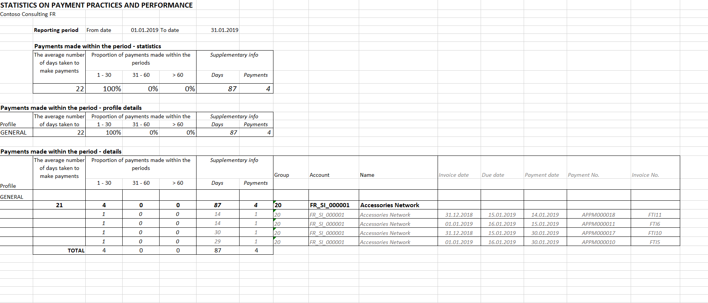
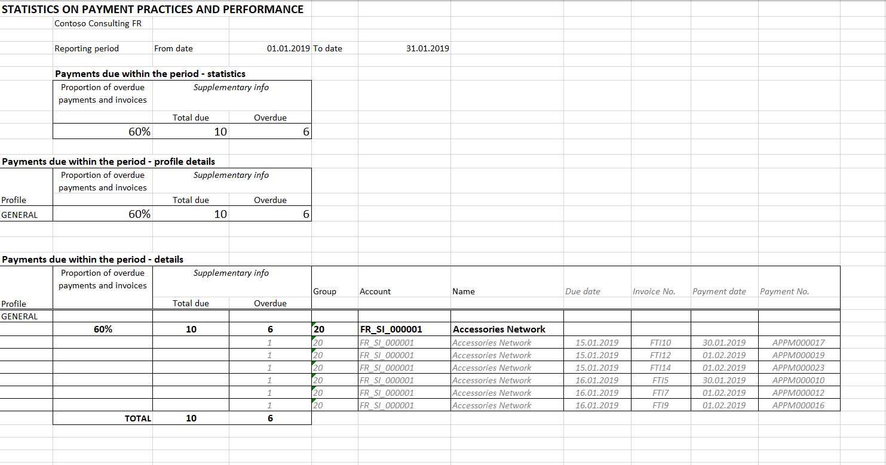

# Statistics on payment practices report

[!include [banner](../../includes/banner.md)]

In the scope of reporting requirements, businesses in the United Kingdom (UK) must prepare and publish, for each reporting period in the financial year, information about their payment practices and performance as they are related to qualifying contracts. The information for each reporting period must reflect the policies and practices that are applied during that period, and the business's performance for that period.

The report must be published on a web-based service that is provided by or on behalf of the government. It must be published within 30 days of the end of the reporting period.

In the scope of report, there are some narrative descriptions of reporting practices. There are also the following three statistics:

1. During the reporting period, the average number of days that passed between the date when invoices were received and the date when payments were made (in other words, the average number of days that was taken to make payments)
2. Of the payments that were made during the reporting period, the percentage that were made in 30 days or less, in 31 to 60 days, and in 61 days or more
3. Of the payments that were due during the reporting period, the percentage that were not paid according to the agreed-on terms

## Report

The **Statistics on payment practices (UK)** report is exported to Microsoft Excel and has two tabs:

- **Payments\_made** – This tab contains statistics of types 1 and 2 from the previous list. It also contains the details per vendor account. The detailed view also contains the details per payment that was made during a reporting period.
- **Payments\_due** – This tab contains statistics of type 3 from the previous list. It also contains the details per vendor account. The detailed view also contains details per invoice that was due during a reporting period.

Before you use this report, download the latest version of the **Statistics on payment practices (UK)** Electronic reporting (ER) configuration, the **Statistics on invoices** ER model, and the **Statistics on invoices model mapping** ER model mapping.

For more information, see [Download Electronic reporting configurations from Lifecycle Services](../../../fin-ops-core/dev-itpro/analytics/download-electronic-reporting-configuration-lcs.md).

## Post documents and define the date when the invoice is received

Before you generate the report, post and settle the appropriate invoices and payments. Payments that aren't settled can't be exported to the **Payments\_made** tab, because there is no information about the invoices that the payments are intended to pay. Additionally, the number of days that was taken to make payments can't be calculated.

You can specify the date when the purchase invoice was received and then use this date to calculate the number of days that was taken to make payments. Set the **Receive document date** field in the following places:

- When you create and post the new vendor invoice, set the **Receive document date** field in the **Invoice dates** section on the **Vendor invoice header** tab of the **Vendor invoice** page. By default, the value of the **Invoice date** field is used.
- When you create the Vendor invoice journal line, you can set the **Receive document date** field on the **General** tab.
- After the vendor invoice is posted but before it's fully settled, you can also set the **Receive document date** field on the **General** tab of the **Vendor transactions** page.
 
## Generate the report

1. Go to **Accounts payable** \> **Inquiries and reports** \> **Statistics** \> **Report on payment deadlines**.
2. In the **Report on payment deadlines** dialog box, in the **Format mapping** field, select **Statistics on payment practices (UK)**.
3. In the **Electronic report parameters** dialog box, set the following fields.

    | Field                         | Description |
    |-------------------------------|-------------|
    | **Date criteria**             | Select one of the following options: **Invoice accounting date**, **Invoice date**, or **Invoice receive date**. Depending on the option that you select, the number of days that was taken to make payments will be calculated by using the payment date and the corresponding type of date that is selected in the dialog box: **Transaction date**, **Invoice date**, or **Receive document date**. |
    | **From date** and **To date** | Specify the start and end dates of the reporting period. |
    | **Vendor posting profile**    | To generate a report for only a specific vendor profile, select the profile. |
    | **Print document details**    | Set the option to **Yes** to export details of invoice and payment documents to the report. |

4. Select **OK** to generate the report.
5. Review the **Payments made** tab.

    

6. Review the **Payments due** tab.

    
    
    > [NOTE]
    > This tab contains all invoices that are due, paid before the due date, and overdue. Only overdue invoices are visible by default. Excel rows with invoices paid before the due date are hidden. To view all invoices, unhide the Excel rows.

## Publish the reporting about payment practices

After you generate the **Statistics on payment practices (UK)** report in Excel, you can use the report data to prepare the final report about payment practices for publication.

[!INCLUDE[footer-include](../../../includes/footer-banner.md)]
