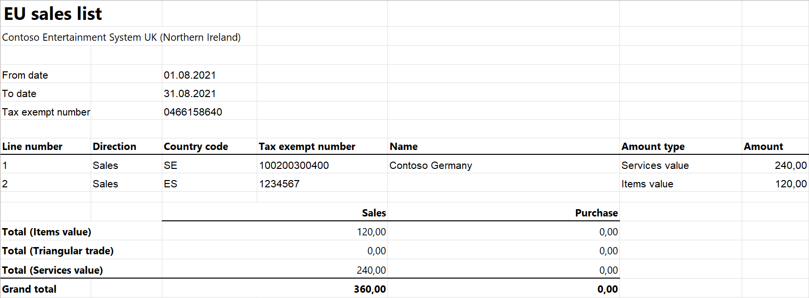

# EU Sales list for UK (Northern Ireland)

[!include [banner](../../includes/banner.md)]

This article provides information about the European Union (EU) sales list report for the UK (Northern Ireland). The UK (Northern Ireland) EU sales list report contains information about the sale of goods and services for reporting in text and XML formats. The following fields are included on the UK (Northern Ireland) EU sales list report:

- **EU sales list header:**
    - Company's tax registration number (only for the .txt file format)
    - Branch ID (only for the .txt file format)
    - The last month of the reporting period (only for the .txt file format)
    - Contact person
    - Currency code
    - Reporting year
    - Reporting month (only for the .xml file format)

- **EU sales list lines:**
    - Customer VAT ID
    - The total amount of items
    - The total amount of services
    - Total amount of the triangular trade
    - Transaction Indicator

## Setup

For general setup information, see [EU Sales list reporting](../europe/emea-eu-sales-list.md#prerequisites).

> [!NOTE] 
> The value from the **Tax registration number** field on the **Tax registration** FastTab of the **Legal entities** page is used in the .txt and .xlsx files for the EU sales list report.

### Set up information about the company

Create a registration type, and assign it to the **VAT ID** registration category for all the countries or regions that your company does business with, as described in Registration IDs.

### Import Electronic reporting configurations

- In [Microsoft Dynamics Lifecycle Services (LCS)](https://lcs.dynamics.com/Logon/Index), import the latest versions of the following Electronic reporting (ER) configurations for the EU sales list:

    - EU Sales list model
    - EU Sales list by columns report
    - EU Sales list by rows report
    - EU Sales list TXT (UK)
    - EU Sales list XML (UK)

For more information, see [Download Electronic reporting configurations from Lifecycle Services](../../../fin-ops-core/dev-itpro/analytics/download-electronic-reporting-configuration-lcs.md)

### Set up foreign trade parameters

1. In Microsoft Dynamics 365 Finance, go to **Tax** > **Setup** > **Foreign trade** > **Foreign trade parameters**.
2. On the **EU sales list** tab, set the **Report cash discount** option to **Yes** if a cash discount should be included in the value when a transaction is included in the EU sales list.
3. On the **Electronic reporting** FastTab, in the **File format mapping** field, select **EU Sales list TXT (UK)** or **EU Sales list XML (UK)**.
4. In the **Report format mapping** field, select **EU Sales list by rows report** or **EU Sales list by columns report**.
5. On the **Country/region properties** tab, select **New**, and specify the following information:
    - In the **Country/region** column, select **GBR**.
    - In the **Country/region type** column, select **Domestic**.
6. List all the countries or regions that your company does business with. For each country/region that is part of the EU, in the **Country/region type** field, select **EU**.

## Work with the EU sales list

For general information about the types of transactions that are included in the EU sales list, and how to generate the EU sales list report and close the EU sales list reporting period, see [EU Sales list reporting](../europe/emea-eu-sales-list.md#working-with-the-esl).

### Generate the EU sales list report

1. Go to **Tax**\> **Declarations** > **Foreign trade** > **EU sales list**.
2. Transfer transactions.
3. On the Action Pane, select **Reporting**.
4. In the **EU sales list reporting** dialog box, on the **Parameters** FastTab, set the following fields.

    | Field            | Description                                                                               |
    |------------------|-------------------------------------------------------------------------------------------|
    | Reporting period | Select **Monthly** or **Quarterly**.                                                      |
    | From date        | Select the start date for the report.                                                     |
    | Generate file    | Set this option to **Yes** to generate a .txt or .xml file for your EU sales list report. |
    | File name        | Enter the name of the .txt or .xml file.                                                  |
    | Generate report  | Set this option to **Yes** to generate an .xlsx file for your EU sales list report.       |
    | Report file name | Enter the name of the .xlsx file.                                                         |
    | Worker           | Select the contact for the person who is responsible for the report.                      |

5. Select **OK**, and review the generated reports.

## Example

For information about how to create a general setup, create postings, and transfer transactions by using the **DEMF** legal entity for the UK (Northern Ireland), see Example for generic EU Sales list. For this example, you must also create **0466158640** as the company's tax registration number.

**Create an EU sales list report**

1. Go to **Tax** > **Declarations** > **Foreign trade** > **EU sales list**.
2. On the Action Pane, select **Reporting**.
3. In the **EU sales list reporting** dialog box, on the **Parameters** FastTab, set the following fields:
    - In the **Reporting period** field, select **Monthly**.
    - In the **From date** field, select **8/1/2021** (August 1, 2021).
    - In the **Worker** field, select **Jodi Christiansen**.
4. Select **OK**, and review the report in text format that is generated. The following tables show the values on the example report.

    **EU sales list header**

    | Field                                  | Value             | Comment  |
    |----------------------------------------|-------------------|----------|
    | Company's tax registration number      | 0466158640        | This field exists only for the .txt file format.  |
    | Branch ID                              | 000               | This field exists only for the .txt file format.  |
    | Reporting year                         | 2021              | This field exists for the .txt and .xml file formats.  |
    | The last month of the reporting period | 08                | This field exists only for the .txt file format.  |
    | Currency code                          | EUR               | This field exists for the .txt and .xml file formats.  |
    | Contact name                           | Jodi Christiansen | This field exists for the .txt and .xml file formats.  |
    | Tax month                              | Aug               | This field exists only for the .xml file format. This field might be named **Tax quarter number** instead of **Tax month**. In this case, it reflects the number of the quarter. |
    | End of header identifier               | 0                 | This field exists only for the .txt file format.  |

    **EU sales list lines**

    | Field     | Line 1 value | Line 2 value | Comment   |
    |-----------|--------------|--------------|-----------|
    | Country/region code   | ES   | SE     |   &nbsp;    |
    | Customer VAT ID without country/region code | 1234567      | 100200300400 |  &nbsp;   |
    | Sum of all invoices by customer             | 120          | 240          |  &nbsp;   |
    | Transaction Indicator                       | 0            | 3            | The value is **3** for a service record, **0** for an item record, and **2** for a triangular trade record. |

5. Review the report in Excel format that is generated.

    

[!INCLUDE[footer-include](../../../includes/footer-banner.md)]
