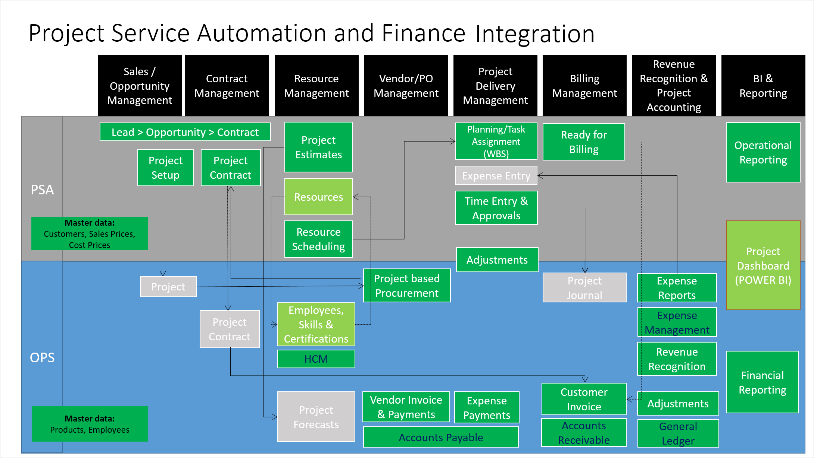

---
# required metadata

title: Project Service Automation overview
description: This topic provides information about the Dynamics 365 Project Service Automation to Dynamics 365 Finance integration solution.
author: KimANelson
manager: AnnBe
ms.date: 07/25/2019
ms.topic: article
ms.prod: 
ms.service: dynamics-ax-applications
ms.technology: 

# optional metadata

# ms.search.form: 
# ROBOTS: 
audience: Application User
# ms.devlang: 
ms.reviewer: josaw
ms.search.scope: Core, Operations
# ms.tgt_pltfrm: 
ms.custom: 87983
ms.assetid: b454ad57-2fd6-46c9-a77e-646de4153067
ms.search.region: Global
# ms.search.industry: 
ms.author: kfend
ms.search.validFrom: 2016-11-28
ms.dyn365.ops.version: AX 7.0.0

---

# Project Service Automation overview

[!include[banner](../includes/banner.md)]

The Project Service Automation to Finance integration solution uses the Data integration feature to synchronize data across instances of Dynamics 365 Finance and Dynamics 365 Project Service Automation via Common Data Service. The integration templates that are available with the Data integration feature enable the flow of projects, project contracts, project contract lines, project contract line milestones, project tasks, expense transaction categories, hour estimates, and expense estimates from Project Service Automation to Finance.

> [!NOTE]
> - If you're using version 7.3.0, you must install KB 4074835. You will then be able to integrate fixed price projects.
> - If you're using version 7.3.0, and you are bringing fee transactions over from Project Service Automation, you must install KB 4345320 in order to include those fees in the project invoice.
> - If you're using version 8.0, you will be able to use project task integration, expense transaction categories, hour estimates, expense estimates, and functionality locking.
> - If you're using version 8.0.1 or later, you will be able to synchronize actuals.

Before you can integrate Project Service Automation Finance, you must configure the Project Service Automation integration parameters. For more information, see [Project Service Automation integration parameters](PSA-parameters.md).

This integration solution enables direct synchronization in the following scenarios:

- Maintain project contracts in Project Service Automation, and synchronize them directly from Project Service Automation to Finance.
- Create projects in Project Service Automation, and synchronize them directly from Project Service Automation to Finance.
- Maintain project contract lines in Project Service Automation, and synchronize them directly from Project Service Automation to Finance.
- Maintain project contract line milestones in Project Service Automation, and synchronize them directly from Project Service Automation to Finance.
- Maintain project tasks in Project Service Automation, and synchronize them directly from Project Service Automation to Finance.
- Maintain expense transaction categories in Finance, and synchronize them directly from Finance to Project Service Automation.
- Create project hour estimates in Project Service Automation, and synchronize them directly from Project Service Automation to Finance.
- Create project expense estimates in Project Service Automation, and synchronize them directly from Project Service Automation to Finance.
- Create project time, expense, and fee actuals in Project Service Automation, and create project transactions in the Project Service Automation integration journal so that they can be posted in Finance.

## Data synchronization

The following illustration shows how data is synchronized as part of the integration between Project Service Automation and Finance.

> [!NOTE]
> Not all templates are currently available. Templates will be released as they are completed.

## System requirements for Finance

To use the Project Service Automation to Finance integration solution, you must install Enterprise edition 7.3 with Platform update 12 or later.

## System requirements for Project Service Automation

To use the Project Service Automation to Finance integration solution, you must install the following components:

- Dynamics 365 Project Service Automation version 9.0.0.0 or later
- Prospect to cash solution for Dynamics 365 Sales, version 1.14.0.0 (v14) or later
- Project Service Automation to Finance solution for Dynamics 365 Project Service Automation version 1.0.0.0 or later

## Install the Project Service Automation to Finance integration solution in your Project Service Automation instance

Download the Project Service Automation to Finance integration solution from [Microsoft Download Center](https://www.microsoft.com/download/details.aspx?id=57016), and follow the instructions that are included with the solution.
