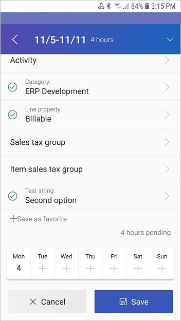
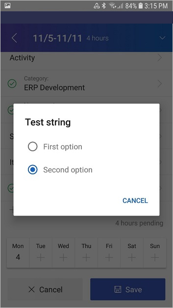
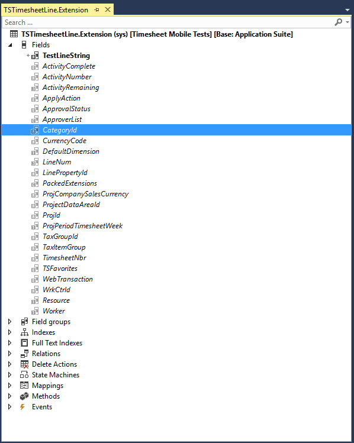
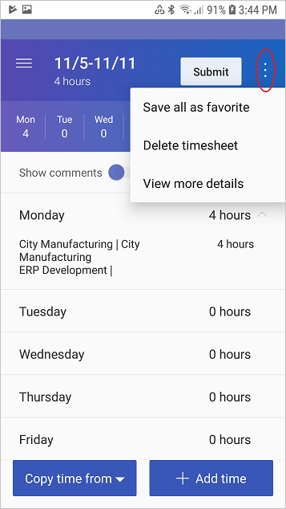
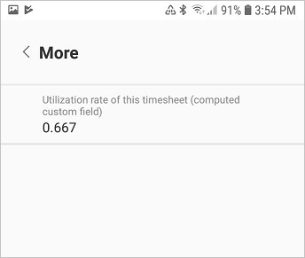
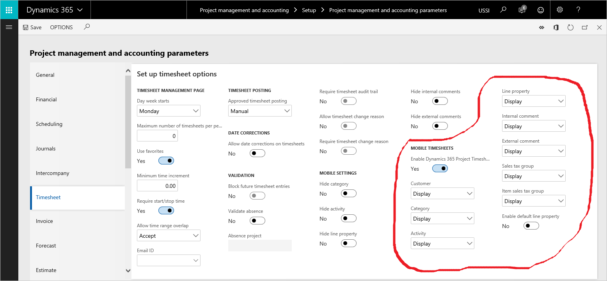

---
# required metadata

title: Implement custom fields for the Microsoft Dynamics 365 Project Timesheet mobile app on iOS and Android
description: This topic provides common patterns for using extensions to implement custom fields.
author: KimANelson
manager: AnnBe
ms.date: 05/29/2019
ms.topic: article
ms.prod: 
ms.service: dynamics-ax-applications
ms.technology: 

# optional metadata

# ms.search.form: 
# ROBOTS: 
audience: Application User
# ms.devlang: 
ms.reviewer: josaw
ms.search.scope: Core, Operations
# ms.tgt_pltfrm: 
ms.custom: 
ms.assetid: 
ms.search.region: Global
ms.search.industry: Service industries
ms.author: knelson
ms.dyn365.ops.version: 10.0.3
ms.search.validFrom: 2019-05-29

---

# Implement custom fields for the Microsoft Dynamics 365 Project Timesheet mobile app on iOS and Android

[!include [banner](../includes/banner.md)]

This topic provides common patterns for using extensions to implement custom fields. The following topics are covered:

- The various data types that the custom field framework supports
- How to show read-only or editable fields on timesheet entries, and save user-provided values back to the database
- How to show read-only fields on the timesheet header
- How to integrate other custom business logic to enter default values in fields and do additional validation

## Audience

This topic is intended for developers who are integrating their custom fields into the Microsoft Dynamics 365 Project Timesheet mobile application that is available for Apple iOS and Google Android. The assumption is that readers are familiar with X++ development and project timesheet functionality.

## Data contract – TSTimesheetCustomField X++ class

The **TSTimesheetCustomField** class is the X++ data contract class that represents information about a custom field for timesheet functionality. Lists of the custom field objects are passed on both the TSTimesheetDetails data contract and the TSTimesheetEntry data contract to show custom fields in the mobile app.

- **TSTimesheetDetails** - The timesheet header contract.
- **TSTimesheetEntry** - The timesheet transaction contract. Groups of these objects that have the same project information and **timesheetLineRecId** value constitute a line.

### fieldBaseType (Types)

The **FieldBaseType** property on the **TsTimesheetCustom** object determines the type of the field that appears in the app. The following **Types** values that are supported.

| Types value | Type              | Notes |
|-------------|-------------------|-------|
| 0           | String (and Enum) | The field appears as a text field. |
| 1           | Integer           | The value is shown as a number without decimal places. |
| 2           | Real              | The value is shown as a number that has decimal places.<p>To show the real value as a currency in the app, use the **fieldExtenededType** property. You can use the **numberOfDecimals** property to set the number of decimal places that are shown.</p> |
| 3           | Date              | Date formats are determined by the user's **Date, times, and number format** setting that is specified under **Language and country/region preference** in **User options**. |
| 4           | Boolean           | |
| 15          | GUID              | |
| 16          | Int64             | |

- If the **stringOptions** property isn't provided on the **TSTimesheetCustomField** object, a free-text field is provided to the user.

    The **stringLength** property can be used to set the maximum string length that users can enter.

- If the **stringOptions** property is provided on the **TSTimesheetCustomField** object, those list elements are the only values that users can select by using option buttons (radio buttons).

    In this case, the string field can act as an enum value for the purpose of user entry. To save the value to the database as an enum, manually map the string value back to the enum value before you save to the database by using chain of command (see the “Use chain of command on the TSTimesheetEntryService class to save a timesheet entry from the app back to the database” section later in this topic for an example).

### fieldExtendedType (TSCustomFieldExtendedType)

You can use this property to format real values as currency. This approach is applicable only when the **fieldBaseType** value is **Real**.

- **TSCustomFieldExtendedType:None** – No formatting is applied.
- **TSCustomFieldExtendedType::Currency** – Format the value as currency.

    When currency formatting is active, the **stringValue** field can be used pass the currency code that should be shown in the app. The value is a read-only value.

    The **realValue** field contains the money amount that should be saved to the database.

### fieldSection (TSCustomFieldSection)

You can use this property specify where the custom field should appear in the app.

- **TSCustomFieldSection::Header** – The field will appear in the **View more details** section in the app. These fields are always read-only.
- **TSCustomFieldSection::Line** – The field will appear after all the out-of-box line fields on timesheet entries. These fields can be either editable or read-only.

### fieldName (FieldNameShort)

This property identifies the field when values that the app provides are saved back to the database.

### tableName (TableNameShort)

This property identifies the field when values that the app provides are saved back to the database.

### isEditable (NoYes)

Set this property to **Yes** to specify that the field in the timesheet entry section should be editable by users. Set the property to **No** to make the field read-only.

### isMandatory (NoYes)

Set this property to **Yes** to specify that the field in the timesheet entry section should be mandatory.

### label (str)

This property specifies the label that is shown next the field in the app.

### stringOptions (List of Strings)

This property is applicable only when **fieldBaseType** is set to **String**. If **stringOptions** is set, the string values that are available for selection via option buttons (radio buttons) are specified by the strings in the list. If no strings are provided, free-text entry in the string field is allowed (see the “Use chain of command on the TSTimesheetEntryService class to save a timesheet entry from the app back to the database” section later in this topic for an example).

### stringLength (int)

This property specifies the maximum length for a string field. It's applicable only when **fieldBaseType** is set to **String**.

### numberOfDecimals (int)

This property specifies the number of decimal places that are shown for a real field. It's applicable only when **fieldBaseType** is set to **Real**.

### orderSequence (int)

This property controls the order in which the custom fields are shown in the app when more than one custom field is specified. Fields that have lower numbers are shown first.

### booleanValue (boolean)

For fields of the **Boolean** type, this property passes the Boolean value of the field between the server and the app.

### guidValue (guid)

For fields of the **GUID** type, this property passes the globally unique identifier (GUID) value of the field between the server and the app.

### int64Value (int64)

For fields of the **Int64** type, this property passes the int64 value of the field between the server and the app.

### intValue (int)

For fields of the **Int** type, this property passes the int value of the field between the server and the app.

### realValue (real)

For fields of the **Real** type, this property passes the real value of the field between the server and the app .

### stringValue (str)

For fields of the **String** type, this property passes the string value of the field between the server and the app. It's also used for fields of the **Real** type that are formatted as currency. For those fields, the property is used to pass the currency code to the app.

### dateValue (date)

For fields of the **Date** type, this property passes the date value of the field between the server and the app.

## Show and save a custom field in the timesheet entry section

Below is a screenshot from the mobile app of a timesheet entry creation. It shows the out-of-box fields and a custom field in the "Time entry" section called "Test string" with an enum value of "Second option" already set.




Below is a screenshot from the mobile app of the user selecting one of the enum options available for the "Test string" custom field.  The two options are "First option" and "Second option" shown as radio buttons. The second option is currently selected.




### Extend the TSTimesheetLine table so that it has a custom field

In typical scenarios, it's likely that the data for a custom field in the timesheet entry section will be saved to the TSTimesheetLine table. However, other tables can be used if the data can be retrieved based on a TSTimesheetTrans record that is provided, or if it doesn't have specific record context (for example, if the field is set as read-only in the project parameters).

Note that custom fields don't have to have any backing database records. They can be dynamically generated based on X++ logic. This approach can be useful in read-only scenarios (see the “Use chain of command on the TSTimesheetDetails class, buildCustomFieldListForHeader method to fill in timesheet details” section for an example of dynamically generated custom field values.)

Below is a screenshot from Visual Studio of the Application Object Tree. It shows an extension of the TSTimesheetLine table with the TestLineString field added as a custom field.



### Use chain of command on the buildCustomFieldList method of the TSTimesheetSettings class to show a field in the timesheet entry section

This code controls the display settings for the field in the app. For example, it controls the type of field, the label, whether the field is mandatory, and what section the field appears in.

The following example shows a string field on time entries. This field has two options, **First option** and **Second option**, that are available via option buttons (radio buttons). The field in the app is associated with the **TestLineString** field that is added to the TSTimesheetLine table.

Note the use of the **TSTimesheetCustomField::newFromMetatdata()** method to simplify the initialization of the custom field properties: **fieldBaseType**, **tableName**, **fieldname**, **label**, **isEditable**, **isMandatory**, **stringLength**, and **numberOfDecimals**. You can also set these parameters manually, as you prefer.

```xpp
...
[ExtensionOf(classStr(TsTimesheetSettings))]
final class TSTimesheetSettings_Extension
{
    protected List buildCustomFieldList()
    {
        List customFieldList = next buildCustomFieldList();
        TSTimesheetCustomField tsTimesheetCustomField;
        tsTimesheetCustomField =
        TSTimesheetCustomField::newFromMetadata(tableNum(TsTimesheetLine),
        fieldNum(TSTimesheetLine, TestLineString));
        tsTimesheetCustomField.parmFieldSection(TSCustomFieldSection::Line);
        tsTimesheetCustomField.parmOrderSequence(1);
        List stringOptions = new List(Types::String);
        stringOptions.addEnd('First option');
        stringOptions.addEnd('Second option');
        tsTimesheetCustomField.parmStringOptions(stringOptions);
        customFieldList.addEnd(tsTimesheetCustomField);
        return customFieldList;
    }
}
...
```

### Use chain of command on the buildCustomFieldListForEntry method of the TSTimesheetEntry class to enter values in a timesheet entry

The **buildCustomFieldListForEntry** method is used to enter values on the saved timesheet lines in the mobile app. It takes a TSTimesheetTrans record as a parameter. Fields from that record can be used to fill in the custom field value in the app.

```xpp
...
[ExtensionOf(classStr(TsTimesheetEntry))]
final class TsTimesheetEntry_Extension
{
    protected List buildCustomFieldListForEntry(TSTimesheetTrans _tsTimesheetTrans)
    {
        List customFieldList = next buildCustomFieldListForEntry(_tsTimesheetTrans);
        TSTimesheetLine tsTimesheetLine = _tsTimesheetTrans.timesheetLine();
        TSTimesheetCustomField tsTimesheetCustomField;
        tsTimesheetCustomField =
        TSTimesheetCustomField::newFromMetadata(tableNum(TsTimesheetLine),
        fieldNum(TSTimesheetLine, TestLineString));
        tsTimesheetCustomField.parmFieldSection(TSCustomFieldSection::Line);
        tsTimesheetCustomField.parmOrderSequence(1);
        tsTimesheetCustomField.parmStringValue(tsTimesheetLine.TestLineString);
        List stringOptions = new List(Types::String);
        stringOptions.addEnd('First option');
        stringOptions.addEnd('second option;);
        tsTimesheetCustomField.parmStringOptions(stringOptions);
        customFieldList.addEnd(tsTimesheetCustomField);
        return customFieldList;
    }
}
...
```

### Use chain of command on the TSTimesheetEntryService class to save a timesheet entry from the app back to the database

To save a custom field back to the database in typical usage, you must extend multiple methods:

- The **timesheetLineNeedsUpdating** method is used to determine whether the line record has been changed by the user in the app and must be saved to the database. If performance isn't a concern, this method can be simplified so that it always returns **true**.
- The **populateTimesheetLineFromEntryDuringCreate** and **populateTimesheetLineFromEntryDuringUpdate** methods can be extended so that they enter values in the TSTimesheetLine database record from the TSTimesheetEntry data contract record that is provided. In the example that follows, notice how the mapping between the database field and the entry field is manually done via X++ code.
- The **populateTimesheetWeekFromEntry** method can also be extended if the custom field that is mapped to the **TSTimesheetEntry** object must write back to the TSTimesheetLineweek database table.

> [!NOTE]
> The following example saves the **firstOption** or **secondOption** value that the user selects to the database as a raw string value. If the database field is a field of the **Enum** type, those values can be manually mapped to an enum value and then saved to an enum field on the database table.

```xpp
...
[ExtensionOf(classStr(TSTimesheetEntryService))]
final class TSTimesheetEntryService_Extension
{
    protected boolean timesheetLineNeedsUpdating(TSTimesheetLine _tsTimesheetLine,
    TsTimesheetEntry _tsTimesheetEntry)
    {
        boolean ret = next timesheetLineNeedsUpdating(_tsTimesheetLine,
        _tsTimesheetEntry);
        if (!ret)
        {
            */ Loop through custom fields to see if value needs updating*/
            ListEnumerator enumerator =  _tsTimesheetEntry.parmCustomFields().getEnumerator();
            while (enumerator.moveNext())
            {
                TSTimesheetCustomField customField = enumerator.current();
                if (customField.parmFieldName() == fieldId2Name(tableNum(TsTimesheetLine),
                fieldNum(TSTimesheetLine, TestLineString)))
                {
                    */ If Custom field value for TestLineString field has changed, We need to update the timesheet line.*/
                    if (_tsTimesheetLine.TestLineString != customField.parmStringValue())
                    {
                        ret = true;
                    }
                }
            }
        }
        return ret;
    }
    protected void populateTimesheetLineFromEntryDuringCreate(TSTimesheetLine
    _tsTimesheetLine, TSTimesheetEntry _tsTimesheetEntry)
    {
        next populateTimesheetLineFromEntryDuringCreate(_tsTimesheetLine,
        _tsTimesheetEntry);
        this.populateTimesheetLineFromCustomFields(_tsTimesheetLine,
        _tsTimesheetEntry);
        }
        protected void populateTimesheetLineFromEntryDuringUpdate(TSTimesheetLine
        \_tsTimesheetLine, TSTimesheetEntry _tsTimesheetEntry)
        {
            next populateTimesheetLineFromEntryDuringUpdate(_tsTimesheetLine,
            _tsTimesheetEntry);
            this.populateTimesheetLineFromCustomFields(_tsTimesheetLine,
            _tsTimesheetEntry);
        }
        private void populateTimesheetLineFromCustomFields(TSTimesheetLine
        _tsTimesheetLine, TSTimesheetEntry _tsTimesheetEntry)
        {
            ListEnumerator enumerator =
            _tsTimesheetEntry.parmCustomFields().getEnumerator();
            while (enumerator.moveNext())
            {
                TSTimesheetCustomField customField = enumerator.current();
                if (customField.parmFieldName() == fieldId2Name(tableNum(TsTimesheetLine),
                fieldNum(TSTimesheetLine, TestLineString)))
                {
                    _tsTimesheetLine.TestLineString = customField.parmStringValue();
                }
            }
        }
    }
...
```

## Show a custom field in the timesheet header section

Below is a screenshot from the mobile app of a user viewing a timesheet. The "More information" button has been selected in the upper-right corner to show the "View more details" option.  



Below is a screenshot from the mobile app showing the “More” section of a timesheet. A custom field called “Utilization rate of this timesheet (computed custom field)” has been added to the timesheet header section. A read-only value of "0.667" is set on the custom field.



### Extend the TSTimesheetTable table so that it has a custom field

In typical scenarios, it's likely that the data for a custom field in the header section will be pulled from the TSTimesheetHeader table. However, other tables can be used if the data can be retrieved based on a TSTimesheetTable record that is provided, or if it doesn't have specific record context (for example, if the field is set as read-only in the project parameters).

Note that custom fields don't have to have any backing database records. They can be dynamically generated based on X++ logic. The example that follows shows this approach.

Fields in the header section are always read-only in the app.

### Use chain of command on the buildCustomFieldList method of the TSTimesheetSettings class to show a field in the header section

This code controls the display settings for the field in the app. For example, it controls the type of field, the label, whether the field is mandatory, and what section the field appears in.

The following example shows a computed value in the header section in the app.

```xpp
...
[ExtensionOf(classStr(TsTimesheetSettings))]
final class TSTimesheetSettings_Extension
{
    protected List buildCustomFieldList()
    {
        List customFieldList = next buildCustomFieldList();
        TSTimesheetCustomField tsTimesheetCustomField;

        */ Computed utilization rate*/
        tsTimesheetCustomField = new TSTimesheetCustomField();
        tsTimesheetCustomField.parmFieldBaseType(Types::Real);
        tsTimesheetCustomField.parmLabel("Utilization rate of this timesheet (computed
        custom field)");
        tsTimesheetCustomField.parmFieldSection(TSCustomFieldSection::Header);
        tsTimesheetCustomField.parmOrderSequence(2);
        tsTimesheetCustomField.parmNumberOfDecimals(3);
        customFieldList.addEnd(tsTimesheetCustomField);
        return customFieldList;
    }
}
...
```

### Use chain of command on the buildCustomFieldListForHeader method of the TSTimesheetDetails class to fill in timesheet details

The **buildCustomFieldListForHeader** method is used to fill in the timesheet header details in the mobile app. It takes a TSTimesheetTable record as a parameter. Fields from that record can be used to fill in the custom field value in the app. The following example doesn't read any values from the database. Instead, it uses X++ logic to generate a computed value that is then shown in the app.


```xpp
...
[ExtensionOf(classStr(TSTimesheetDetails))]
final class TSTimesheetDetails_Extension
{
    protected List buildCustomFieldListForHeader(TSTimesheetTable
    _tsTimesheetTable)
    {
        List customFieldList = next buildCustomFieldListForHeader(_tsTimesheetTable);
        TSTimesheetCustomField tsTimesheetCustomField;

        */ Computed utilization rate*/
        tsTimesheetCustomField = new TSTimesheetCustomField();
        tsTimesheetCustomField.parmFieldBaseType(Types::Real);
        tsTimesheetCustomField.parmLabel("Utilization rate of this timesheet (computed
        custom field)");
        tsTimesheetCustomField.parmFieldSection(TSCustomFieldSection::Header);
        tsTimesheetCustomField.parmOrderSequence(2);
        tsTimesheetCustomField.parmNumberOfDecimals(3);
        real utilizationRate = 0;
        if (_tsTimesheetTable.totalHours() != 0)
        {
            utilizationRate = _tsTimesheetTable.totalHoursBillable() /
            _tsTimesheetTable.totalHours();
        }
        tsTimesheetCustomField.parmRealValue(utilizationRate);
        customFieldList.addEnd(tsTimesheetCustomField);
        return customFieldList;
    }
}
...
```

## Other configurability/extensibility opportunities

### Adding additional validation for the app

Existing logic for timesheet functionality at the database level will still work as expected. To interrupt the completion of save or submit operations and show a specific error message, you can add **throw error("message to user")** to the code via a chain of command extension. Here are three examples of useful extensible methods:

- If **validateWrite** on the TSTimesheetLine table returns **false** during a save operation for a timesheet line, an error message is shown in the mobile app.
- If **validateSubmit** on the TSTimesheetTable table returns **false** during timesheet submission in the app, an error message is shown to the user.
- Logic that fills in fields (for example, **Line Property**) during the **insert** method on the TSTimesheetLine table will still run.

### Hiding and marking out-of-box fields as read-only via configuration

From the project parameters, you can make out-of-box fields read-only or hidden in the mobile app. Set the options in the **Mobile timesheets** section on the **Timesheet** tab of the **Project management and accounting parameters** page.



### Changing the activities that are available for selection via extensions

The activities that are available for selection for a project are filled in via the **getActivitiesForProject()** and **getActivityQuery()** methods in the **TsTimesheetProjectService** class. You can use chain of command to change this behavior to match your business scenario for the activities that are available for selection for a specific project.

### Entering a default project category on timesheet entries

Entry of a default project category on timesheet entries occurs at three levels. You can use chain of command to extend the behavior at any or all of these levels to achieve the desired behavior. The following hierarchy is used:

1. The app tries to put the default category from the project resource. This default category is set in the **getCurrentUserResource** and **getDelegatedResourcesForCurrentUser** methods in the **TSTimesheetSettingsService** class.
2. If the default category isn't provided at the project resource level, the app tries to pull it from the project activity. This default category is set in the **getActivitiesForProject** method in the **TSTimesheetProjectService** class.
3. If the default category isn't provided at the project activity level, the default category it taken from the project parameters. This default category is set in the **getProjectDetailsbyRule** method in the **TSTimesheetProjectService** class.
