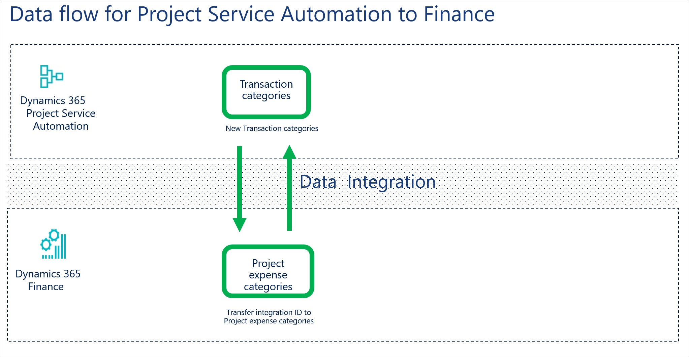
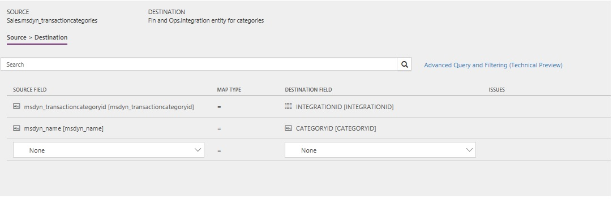

---
# required metadata

title: Synchronize project expense categories between Finance and Operations and Project Service Automation 
description: This topic describes the templates and underlying tasks that are used to synchronize project expense categories between Microsoft Dynamics 365 Finance and Dynamics 365 Project Service Automation.
author: KimANelson
manager: AnnBe
ms.date: 07/20/2018
ms.topic: article
ms.prod: 
ms.service: dynamics-ax-applications
ms.technology: 

# optional metadata

# ms.search.form: 
# ROBOTS: 
audience: Application User
# ms.devlang: 
ms.reviewer: josaw
ms.search.scope: Core, Operations
# ms.tgt_pltfrm: 
ms.custom: 87983
ms.assetid: b454ad57-2fd6-46c9-a77e-646de4153067
ms.search.region: Global
# ms.search.industry: 
ms.author: kfend
ms.search.validFrom: 2016-11-28
ms.dyn365.ops.version: AX 8.0.0

---

# Synchronize project expense categories between Finance and Operations and Project Service Automation

[!include[banner](../includes/banner.md)]

This topic describes the templates and underlying tasks that are used to synchronize project expense categories between Dynamics 365 Finance and Dynamics 365 Project Service Automation.

> [!NOTE]
> - Project task integration, expense transaction categories, hour estimates, expense estimates, and functionality locking are available in version 8.0.
> - Actuals integration is available in version 8.0.1 or later.
> - If you're using Enterprise edition 7.3.0, after you install KB 4132657 and KB 4132660, you will be able to use the templates to integrate project tasks, expense transaction categories, hour estimates, expense estimates, and actuals, and to configure functionality locking. If you must reset the accounting distributions, we recommend that you also install KB 4131710.

## Data flow for Project Service Automation and Finance

The Project Service Automation and Finance integration solution uses the Data integration feature to synchronize data across instances of Project Service Automation and Finance. The integration templates that are available with the Data integration feature enable the flow of data about project expense transaction categories between Finance and Project Service Automation.

If the project expense categories are mastered in Finance, the integration flow is first from Finance to Project Service Automation. The integration IDs of the project expense categories are then updated through synchronization from Project Service Automation to Finance.

If the project expense categories are mastered in Project Service Automation, the integration flow is first from Project Service Automation to Finance. The project categories must already be configured in Finance before the synchronization from Project Service Automation. Then synchronize from Finance back to Project Service Automation, and then from Project Service Automation to Finance again. In this way, you help guarantee that the categories are linked, and that no duplicates are created.

> [!NOTE]
> Typically, the project expense categories are mastered in Finance. However, if they aren't, or if expense categories have already been created in Project Service Automation, you must first synchronize by using the Project expense transaction categories (PSA to Fin and Ops) template. Then synchronize by using the Project expense transaction categories (Fin and Ops to PSA) template. You should then run the synchronization from Project Service Automation to Finance one more time.
>
> If you synchronize first from Project Service Automation, the following requirements must be met in Finance before the synchronization is run:
>
> - The shared category that matches the project category that is set up in Project Service Automation must exist, and it must be enabled for both **Project** and **Expense**.
> - For each Finance legal entity that must be integrated with, the following project categories must exist:
>
>     - **Project category** exists. 
>     - **Use in Expense** is enabled.
>     - **Active in journal** is enabled.
>     - **Transaction type** is set to **Expense**.

The following illustration shows how the data is synchronized between Project Service Automation and Finance.

## Project expense category synchronization from Finance to Project Service Automation

### Template and task

To access the template, in the Microsoft Power Apps admin center, select **Projects**, and then, in the upper-right corner, select **New project** to select public templates.

The following template and underlying task are used to synchronize project expense categories from Finance to Project Service Automation:

- **Name of the template in Data integration:** Project expense transaction categories (Fin and Ops to PSA)
- **Name of the task in the project:** Sync categories to PSA

### Entity set

| Finance                           | Project Service Automation |
|-----------------------------------|----------------------------|
| Integration entity for categories | Transaction categories     |

### Entity flow

Project expense categories are managed in Finance, and they are synchronized to Project Service Automation as transaction categories.

### Power Query

When you're synchronizing to Project Service Automation, you must use Microsoft Power Query for Excel to set the billing type on the transaction category. The Project expense transaction categories (Fin and Ops to PSA) template provides a default column and mapping. If you create your own template, you must add a conditional column in Power Query. Follow these steps.

1. Click the arrow to open the mapping of the project expense categories task in the Project expense transaction categories (Fin and Ops to PSA) template.
2. Click the **Advance Query and Filtering** link to open Power Query.
2. Select **Add Conditional Column**.
3. Enter a name for the new column, such as **BillingType**.
4. Enter the following condition: **if CATEGORYID not equal to null then 19235001, Otherwise null**.
5. Click **OK** on the column.
6. Be sure to map this new column on the mapping page.

The following illustration shows an example of the template task mapping in Data integration. The mapping shows the field information that will be synchronized from Finance to Project Service Automation.

## Project expense category synchronization from Project Service Automation to Finance

### Template and task

The following template and underlying task are used to synchronize project expense categories from Project Service Automation to Finance:

- **Name of the template in Data integration:** Project expense transaction categories (PSA to Fin and Ops)
- **Name of the task in the project:** Sync categories to Fin Ops

### Entity set

| Project Service Automation | Finance                           |
|----------------------------|-----------------------------------|
| Transaction categories     | Integration entity for categories |

### Entity flow

Project expense categories are managed in Finance, and they are synchronized to Project Service Automation as transaction categories. The synchronization back to Finance updates the project category in Finance with the integration ID from Project Service Automation.

### Template mapping in Data integration

The following illustration shows an example of the template task mapping in Data integration.

> [!NOTE]
> The mapping shows the field information that will be synchronized from Project Service Automation to Finance.

