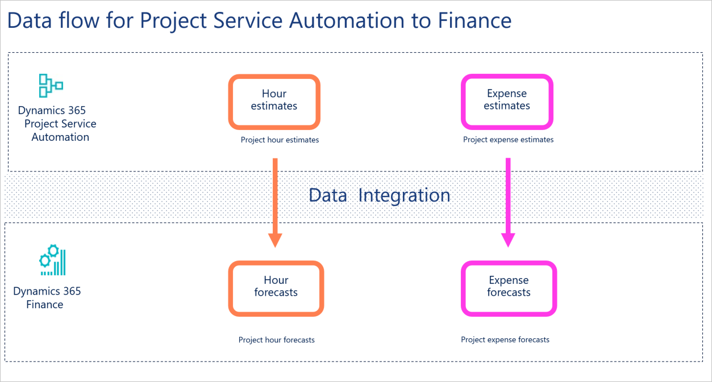
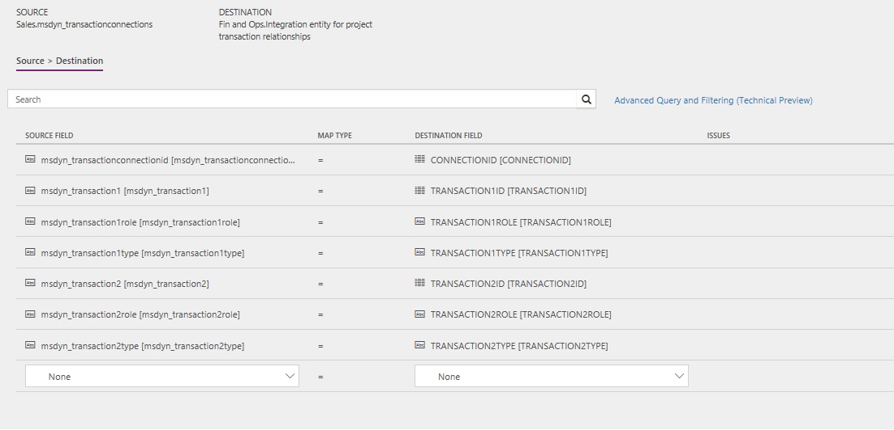

---
# required metadata

title: Synchronize project estimates directly from Project Service Automation to Finance and Operations
description: This topic describes the templates and underlying tasks that are used to synchronize project hour estimates and project expense estimates directly from Microsoft Dynamics 365 Project Service Automation to Dynamics 365 Finance.
author: KimANelson
manager: AnnBe
ms.date: 07/20/2018
ms.topic: article
ms.prod: 
ms.service: dynamics-ax-applications
ms.technology: 

# optional metadata

# ms.search.form: 
# ROBOTS: 
audience: Application User
# ms.devlang: 
ms.reviewer: josaw
ms.search.scope: Core, Operations
# ms.tgt_pltfrm: 
ms.custom: 87983
ms.assetid: b454ad57-2fd6-46c9-a77e-646de4153067
ms.search.region: Global
# ms.search.industry: 
ms.author: kfend
ms.search.validFrom: 2016-11-28
ms.dyn365.ops.version: AX 7.3.0

---
# Synchronize project estimates directly from Project Service Automation to Finance and Operations

[!include[banner](../includes/banner.md)]

This topic describes the templates and underlying tasks that are used to synchronize project hour estimates and project expense estimates directly from Dynamics 365 Project Service Automation to Dynamics 365 Finance.

> [!NOTE]
> - Project task integration, expense transaction categories, hour estimates, expense estimates, and functionality locking is available in version 8.0.
> - Actuals integration is available in version 8.0.1 or later.

## Data flow for Project Service Automation to Finance

The Project Service Automation to Finance integration solution uses the Data integration feature to synchronize data across instances of Project Service Automation and Finance. The integration templates that are available with the Data integration feature enable the flow of data about project hour estimates and project expense estimates from Project Service Automation to Finance.

The following illustration shows how the data is synchronized between Project Service Automation and Finance.

## Project hour estimates

### Template and tasks

To access the available templates, in the Microsoft Power Apps admin center, select **Projects**, and then, in the upper-right corner, select **New project** to select public templates.

The following template and underlying tasks are used to synchronize project hour estimates from Project Service Automation to Finance:

- **Name of the template in Data integration:** Project hour estimates (PSA to Fin and Ops)
- **Name of the tasks in the project:**

    - Transaction relationships
    - Expense estimates

### Entity set

| Project Service Automation | Finance                                       |
|----------------------------|-----------------------------------------------|
| Project tasks              | Integration entity for project hour estimates |

### Entity flow

Project hour estimates are managed in Project Service Automation, and they are synchronized to Finance as project hour forecasts.

### Prerequisites

Before synchronization of project hour estimates can occur, you must synchronize projects, project tasks, and project expense transaction categories.

### Power Query

In the project hour estimates template, you must use Microsoft Power Query for Excel to complete these tasks:

- Set the default forecast model ID that will be used when the integration creates new hour forecasts.
- Filter out any resource-specific records in the task that will fail the integration into hour forecasts.
- Filter out any empty transaction category rows. Failure to complete this task might result in incorrect hour forecasts.

#### Set the default forecast model ID

To update the default forecast model ID in the template, click the **Map** arrow to open the mapping. Then select the **Advanced Query and Filtering** link.

- If you're using the default Project hour estimates (PSA to Fin and Ops) template, select the **Inserted Condition** in the list of **Applied Steps**. In the **Function** entry, replace **O\_forecast** with the name of the forecast model ID that should be used with the integration. The default template has a forecast model ID from the demo data.
- If you're creating a new template, you must add this column. In Power Query, select **Add Conditional Column**, and enter a name for the new column, such as **ModelID**. Enter the condition for the column, where, if Project task is not null, then \<enter the forecast model ID\>; else null.

#### Filter out resource-specific records

The Project hour estimates (PSA to Fin and Ops) template has a default filter that removes any resource-specific records. If you create your own template, you must add this filter. Select the **Advanced Query and Filtering** link to filter on the **msdyn\_islinetask** column so that only **False** records are included.

#### Filter out empty transaction category rows

You must add a filter to remove any rows that have empty transaction categories. This task is required, regardless of whether you're using the default template or creating your own template. This filter removes any summary rows from Project Service Automation that might cause the hour forecasts in Finance to be incorrect. Select **Advanced Query and Filtering** link to filter out null records in the **msdyn\_transactioncategory\_value** column.

### Template mapping in Data integration

The following illustration shows an example of the template task mapping in Data integration. The mapping shows the field information that will be synchronized from Project Service Automation to Finance.

## Project expense estimates

### Template and tasks

The following template and underlying tasks are used to synchronize project expense estimates from Project Service Automation to Finance:

- **Name of the template in Data integration:** Project expense estimates (PSA to Fin and Ops)
- **Name of the tasks in the project:**

    - Transaction relationships 
    - Expense estimates

### Entity set

| Project Service Automation | Finance                                                  |
|----------------------------|----------------------------------------------------------|
| Transaction Connections    | Integration entity for project transaction relationships |
| Estimate Lines             | Integration entity for project expense estimates         |

### Entity flow

Project expense estimates are managed in Project Service Automation, and they are synchronized to Finance as project expense forecasts.

### Prerequisites

Before synchronization of project expense estimates can occur, you must synchronize projects, project tasks, and project expense transaction categories.

### Power Query

In the project expense estimates template, you must use Power Query to complete the following tasks:

- Filter to include only expense estimate line records.
- Set the default forecast model ID that will be used when the integration creates new hour forecasts.
- Transform the billing types.
- Transform the transaction types.

#### Filter to include only expense estimate lines

The Project expense estimates (PSA to Fin and Ops) template has a default filter that includes only expense lines in the integration. If you create your own template, you must add this filter. Select the **Transaction relationships** task, and then click the **Map** arrow to open the mapping. Select the **Advanced Query and Filtering** link. Filter the **msdyn\_transactiontype1** column so that it includes only **msdyn\_estimateline**.

#### Set the default forecast model ID

To update the default forecast model ID in the template, select the **Expense estimates** task, and then click the **Map** arrow to open the mapping. Select the **Advanced Query and Filtering** link.

- If you're using the default Project expense estimates (PSA to Fin and Ops) template, in Power Query, select the first **Inserted Condition** from the **Applied Steps** section. In the **Function** entry, replace **O\_forecast** with the name of the forecast model ID that should be used with the integration. The default template has a forecast model ID from the demo data.
- If you're creating a new template, you must add this column. In Power Query, select **Add Conditional Column**, and enter a name for the new column, such as **ModelID**. Enter the condition for the column, where, if Estimate line ID is not null, then \<enter the forecast model ID\>; else null.

#### Transform the billing types

The Project expense estimates (PSA to Fin and Ops) template includes a conditional column that is used to transform the billing types that are received from Project Service Automation during the integration. If you create your own template, you must add this conditional column. Select the **Advanced Query and Filtering** link and then select **Add Conditional Column**. Enter a name for the new column, such as **BillingType**. Then enter the following condition:

If **msdyn\_billingtype** = 192350000, then **NonChargeable**  
else if **msdyn\_billingtype** = 192350001, then **Chargeable**  
else if **msdyn\_billingtype** = 192350002, then **Complimentary**  
else **NotAvailable**

#### Transform the transaction types

The Project expense estimates (PSA to Fin and Ops) template includes a conditional column that is used to transform the transaction types that are received from Project Service Automation during the integration. If you create your own template, you must add this conditional column. Select the **Advanced Query and Filtering** link and then select **Add Conditional Column**. Enter a name for the new column, such as **TransactionType**. Then enter the following condition:

If **msdyn\_transactiontypecode** = 192350000, then **Cost**  
else if **msdyn\_transactiontypecode** = 192350005, then **Sales**  
else **null**

### Template mapping in Data integration

The following illustrations show examples of the template task mappings in Data integration. The mapping shows the field information that will be synchronized from Project Service Automation to Finance.

