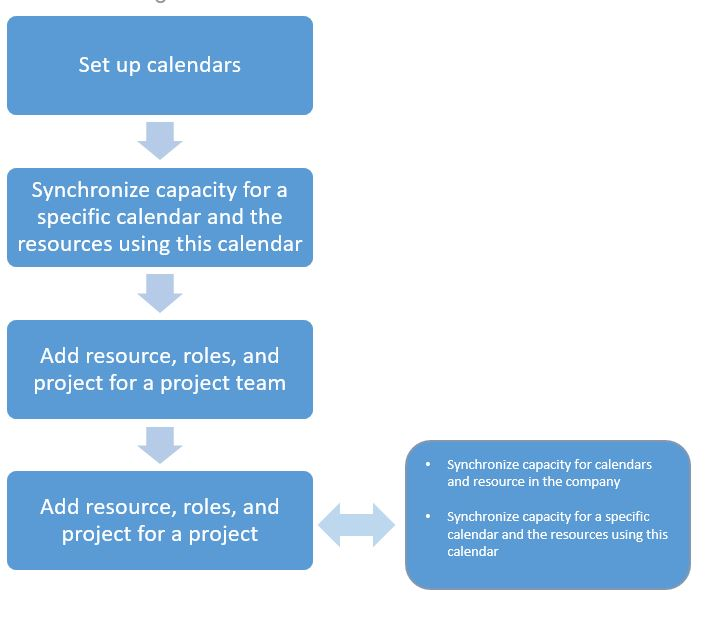

---
# required metadata

title: Synchronize resource capacity
description: This topic provides information about how to synchronize a resource's capacity across calendars and projects.
author: Yowelle
manager: AnnBe
ms.date: 09/01/2020
ms.topic: article
ms.prod: 
ms.service: dynamics-ax-applications
ms.technology: 

# optional metadata

ms.search.form: ProjProjectsListPage
# ROBOTS: 
audience: Application User
# ms.devlang: 
ms.reviewer: josaw
ms.search.scope: Core, Operations
# ms.tgt_pltfrm: 
ms.custom: 82022
ms.assetid: bd2fb375-84c6-428a-8e54-f0f719045898
ms.search.region: Global
# ms.search.industry: 
ms.author: kfend
ms.search.validFrom: 2016-02-28
ms.dyn365.ops.version: AX 7.0.0

---

# Synchronize resource capacity

[!include [banner](../includes/banner.md)]

The processes for resource synchronization help guarantee that information for the calendar and base calendar trickles down into project resource scheduling. If the calendar is changed, the processes make the required updates to the scheduling of project resources. The processes also help improve performance, because the calendar's resource information is synchronized in advance. Therefore, updates to resource scheduling information occur more quickly. We recommend that you schedule the processes as a batch instead of one at a time. Otherwise, there is a risk that someone will forget the inclusive dates when the information was last synchronized. If inclusive dates aren't used, gaps can occur during date synchronization.

## Synchronize resource capacity roll-ups

The synchronization process is designed to synchronize all resource calendar information. This information includes base calendar information about any changes to the project's Resource calendar capacity table. If new resources are added in the project, synchronization helps guarantee that the updated calendar information is available. This synchronization can be done at any time.

We recommend that you use a batch. The options are available during synchronization of capacity reservations.

1. Select **Project management and accounting** &gt; **Periodic** &gt; **Capacity synchronization** &gt; **Synchronize resources capacity roll-ups**.
2. Set the options in the following table.

    | Option      | Description |
    |-------------|-------------|
    | Period code | Optionally select the General ledger date interval code to set the start and end dates for the synchronization process for resource capacity roll-ups. |
    | Start date  | Enter the start date for the synchronization process for resource capacity roll-ups. |
    | End date    | Enter the end date for the synchronization process for resource capacity roll-ups. |

