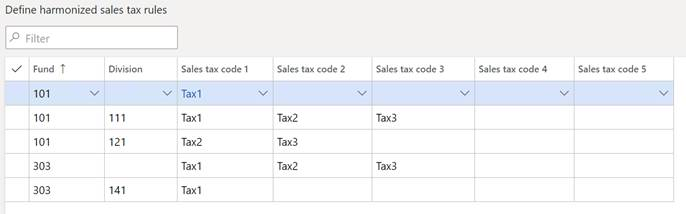

# Calculating Canadian Harmonized Sales Tax

[!include [banner](../includes/banner.md)]

This feature lets your organization comply with Canadian Harmonized Sales Tax (HST) rules. The HST helps public sector entities maintain compliance with Canadian tax policies. The HST is used by some Canadian provinces and is a combination of the Goods and Services Tax and the Provincial Sales Tax.
Portions of the HST can be recovered by public sector entities if the tax has been paid to vendors, depending on the intent of the purchase. The intent is designated by the financial dimension values and main account on a transaction line on a purchase document (for example, a purchase requisition, purchase order, or vendor invoice).
Note: This functionality does not apply to the Accounts payable Invoice journal.

## Enabling the HST feature

1. Go to **General ledger > Ledger setup >General ledger parameters > Sales tax group**.
2. Set the **Apply Canadian harmonized sales tax rules** to **Yes** to enable the feature.

## Define the dimensions for HST rules

1. Go to **Tax > Indirect taxes > Sales tax**, and then click **Harmonized sales tax dimensions**. 
2. In the **Harmonized sales tax dimensions** page, select and prioritize the financial dimensions (along with the main account, if appropriate) that you want to use for HST. The financial dimensions in the account structures are associated with the chart of accounts. The priority of dimensions helps dictate which tax gets applied if there are multiple possibilities. 

> [!Note] 
> Only the financial dimensions that are used in the current legal entity will be available.

## Set up HST rules

After you define dimensions for HST, you set up ledger dimension rules that apply. HST rules assign tax codes based on a document line’s account distributions. This is because different tax codes might be applied, based on the purpose of the purchase.
1. Go to **Tax > Indirect taxes > Sales tax**, and then click **Harmonized sales tax rules**. 
2. In the **Harmonized sales tax rules** page, the dimensions that you selected for HST appear in order of priority from left to right. The remaining columns are for sales tax codes associated with that dimension combination. 
3. On the Action Pane, click **New** to create a new record.
4. Define the dimension values. 

### Notes:
- No two rows can have identical settings.
- You can delete or modify existing rules.
- You can choose to leave a segment blank. It will function as a “wild card.” A totally blank row applies to all account combinations that do not have a more specific rule applied. You may want to add one row with all blank financial dimensions if there are sales tax codes which should apply when no rules match.

5. Select up to five sales tax codes that can be applied against the dimensions that have been selected for HST. 
Note
To be applied, the sales tax codes defined here must be present in the HST rule and in both the **Sales tax group** and **Item sales tax group** that are selected on the transaction document lines. 
6. Click **Save** to save your changes. 

### Notes:
- After you define rules for HST, you cannot modify the pre-existing dimensions for HST. To make changes, you must first remove all rules and sales tax codes in the **Harmonized sales tax rules** form.
- More than one tax code can apply to a rule.
- Only one rule applies to an account distribution.
- More than one rule can apply to a line in a transaction document that has multiple distributions.

## How rules are applied

The order in which rules are applied are somewhat complex. The following graphic illustrates the principle:

> 

The sales tax codes selected for the dimension line will be following if the transaction uses a Sales tax group and Item sales tax group with all of the tax codes included.

|Financial Dimensions                     |	Sales tax codes|
|-----------------------------------------|-----------------|   
|Fund 101, Any Division except 111 and 121|	Tax1            |
|	Fund 101, Division 111                  |	Tax1, Tax2, Tax3|
|	Fund 101, Division 121	                | Tax2, Tax3      |
|	Fund 303, Any Division except 141	      | Tax1, Tax2, Tax3|
|	Fund 303, Division 141	                | Tax1            |

[!INCLUDE[footer-include](../../includes/footer-banner.md)]
