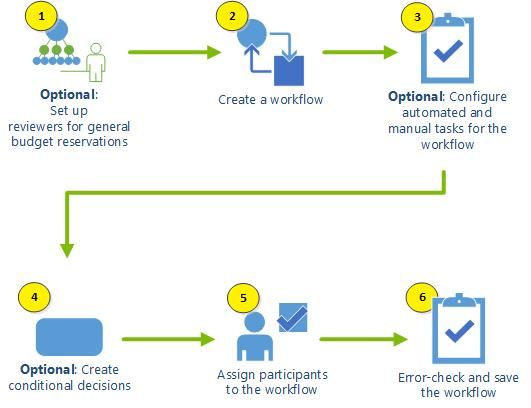

# Set up general budget reservations and submit them to a workflow

[!include [banner](../includes/banner.md)]

When a general budget reservation is set up to use a workflow, the document must first be submitted and approved through the workflow system. After the workflow is completed and the reservation is approved, you can still edit the document. Although the option to post the document is available, no other controls and fields on the page are available unless you select the option to edit the document. Note that if you edit an approved reservation, its workflow status is reset to **Draft**, and the option to post the document is no longer available. However, the other controls and fields on the page are available. After you change a reservation, you must resubmit it to the workflow system for approval.

The following illustration shows how to set up a workflow for general budget reservations. Each numbered step corresponds to a section of this article.

## Optional: Set up reviewers for general budget reservations

You can set up reviewer workflow elements to route general budget reservations for review. The workflow process uses the specified owner of the project role or financial dimension to determine who the expenditure should be routed to.

Alternatively, you can just assign a specific user or user group as a reviewer when you define the workflow. However, if you have a complex organization, you can improve the efficiency of the approval process by specifying reviewer elements. In that way, you won't have to change the workflow reviewer assignments every time that a reviewer changes job roles.

## Create a general budget reservation workflow

Workflows for general budget reservations are based on the reservation type. Therefore, you can create multiple general budget reservation workflows.

If a general budget reservation requires a purchase requisition, note that purchase requisitions require their own workflow. The workflow for the purchase requisition must be completed before the general budget reservation can reference it.

To create a general budget reservation workflow, follow these steps.

1. Go to **Budgeting \> Setup \> Basic budgeting \> Budgeting workflows**.
2. Select **New**.
3. In the **Create workflow** slider, select the **General budget reservation workflow** template.
4. In the workflow editor, in the **Workflow elements** pane, under **Approvals**, select **Approve general budget reservation**, and then drag it so that it's under the **Start** element on the canvas.
5. Drag the border of the **Start** element to create a connecting line to the approval element.
6. Select the approval element, and then select **Basic settings** to configure the element.

## Optional: Configure manual and automated tasks for a general budget reservation workflow

Configure manual and automated tasks for the general budget reservation workflow, so that the workflow reflects the approval or review tasks that are part of your business practice:

- A manual review of a general budget reservation
- An automated process to evaluate field values for a general budget reservation

You can use a combination of these tasks in the same workflow. Manual review tasks and approval workflow elements differ in the following way:

- If you assign the manual review task to multiple users, the workflow can continue after any one of those users completes the task.
- If you assign an approval workflow element to multiple users, you can specify whether all those users must approve the document before the workflow can continue.

You define the **Work item subject** and **Work item instructions** of the task and assign it to a user who is authorized to review the lines that are in the general budget reservation.

## Optional: Create conditional decisions

Create conditional decisions if your business processes require different workflow processes, depending on the amount of the general budget reservation. You can also create conditional decisions that are based on the accounting date, reservation type, reservation title, start or end date, and other criteria.

## Assign participants to workflow elements

You can associate workflow elements with the following groups of participants.

| User group                 | Description |
|----------------------------|-------------|
| Security role participants | Assign the workflow element to a Microsoft Dynamics 365 security role. You might use this option if a group of workers can approve general budget reservations, and it doesn't matter which person approves a particular document. |
| User group participants    | Assign the workflow element to a Dynamics 365 user group. You might use this option if a group of workers can approve general budget reservations, and anyone in that group can approve a particular document. |

Workflow elements can also be assigned based on a hierarchy or user.

## Save the workflow

When you've finished adding workflow elements, use the following procedure to check the workflow for errors and then save it.

The **Errors and warnings** pane at the bottom of the workflow editor shows messages that are generated for the workflow. To find the element where an error or warning occurs, double-click the error or warning message. All errors and warnings must be resolved before you can make the workflow active.

1. When the workflow is completed and free of errors, select **Save and close**.
2. In the **Save workflow** dialog box, select **OK**.
3. To activate the workflow now, in the **Activate workflow** dialog box, select **OK**.

    –or–

    To activate the workflow later, follow these steps at any time:

    1. Go to **Budgeting \> Setup \> Basic budgeting \> Budgeting workflows**.
    2. Select the workflow that you created.
    3. On the Action Pane, on the **Workflow** tab, in the **Manage** group, select **Versions**.
    4. In the **Workflow versions** slider, select the version of the workflow that you want.
    5. Select **Make active**, and then select **Close**.

## Submit a general budget reservation to the workflow system

To submit a general budget reservation to the workflow system, you must be the preparer. Before a reservation can be submitted, all required fields must be filled in, and the reservation must contain at least one line item. The reservation must have a workflow status of **Draft**.

To submit a general budget reservation to the workflow system, follow these steps.

1. Go to **Budgeting \> General budget reservations**.
2. Select the general budget reservation to submit to the workflow system.
3. On the Action Pane, select **Submit**.
4. Optional: In the **Comment** field, add a note.
5. Select **Submit**. The reservation status is moved to the next step of the workflow.
6. The **Submit** button on the Action Pane becomes a **Workflow** button. When you select this button, a menu appears. You can use this menu at any time to perform the following tasks:

    - View the history and see where the document is in the workflow process.
    - If the reservation is still in the workflow, recall the workflow status to **Draft** status. You can then make any required changes to the reservation and then resubmit it to the workflow system.

    As the reservation moves through the workflow, the reservation status and workflow status change and are reflected in the header of the general budget reservation.

7. When the workflow is completed, and the reservation status is **Approved**, you can post the document.

[!INCLUDE[footer-include](../../includes/footer-banner.md)]
