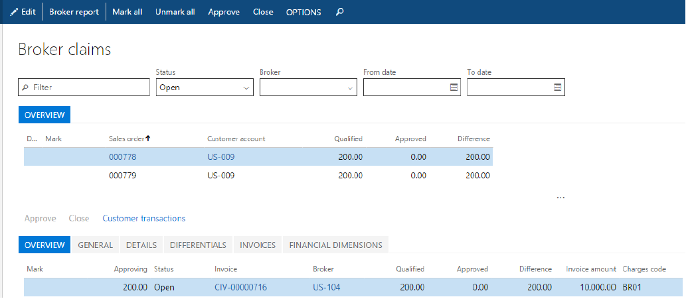

---
# required metadata

title: Broker contract management
description: This topic describes broker contract management for Microsoft Dynamics 365 for Finance and Operations.
author: t-benebo
manager: AnnBe
ms.date: 08/02/2018
ms.topic: article
ms.prod: 
ms.service: dynamics-ax-platform
ms.technology: 

# optional metadata

# ms.search.form:  
audience: IT Pro
# ms.devlang: 
ms.reviewer: shylaw
ms.search.scope: Operations
# ms.tgt_pltfrm: 
# ms.custom: 
ms.search.region: Global
# ms.search.industry: 
ms.author: t-benebo
ms.search.validFrom: 2018-01-31
ms.dyn365.ops.version: July 2017 update
---

# Broker contract management

[!include [banner](../includes/banner.md)]

Broker contract management helps companies better manage their brokerage agreements by automating tasks that are involved in administering, tracking, and paying the fees that are due to brokers.

This topic provides a broad overview of the typical process for handling broker fees:

- Registering details of the negotiated broker contract
- Running the negotiated contracts through ongoing sales and generating broker claims
- Approving the generated claims, so that they can be passed on to Accounts payable (A/P) for payment
- Handling situations for partial claim approval and differential accounting

## Audience and purpose

The information in this topic is intended for business decision makers in enterprise companies, in capacities such as sales manager, accounting manager, and A/P manager, who have the following responsibilities:

- Negotiating contracts with brokers
- Managing staff that processes broker claims and makes fee payments

People in these roles are looking for ways to achieve these goals:

- Flexibly accommodate various definitions of broker contracts and their conditions.
- Reduce the administrative burden and errors that are associated with tracking and processing broker claims.
- Improve cash flow forecasts by accruing for future payables.

## Review the details of a broken contract

A broker contract is a record of an agreement with a broker. It specifies the negotiated terms and conditions under which the brokerage company qualifies for a monetary reward in return for achieving preset sales targets.

Broker contracts are registered on the **Broker contracts** page. To open the **Broker contracts** page, select **Accounts payable** \> **Broker and royalties** \> **Broker contracts**.

The **Contract details** section shows the conditions and the item that qualifies for brokerage. The monetary reward that the broker will receive for achieving the sales objective is shown under **Break**.

The setup of the **Broker Fees** charge indicates that the customer won't incur the fee for the broker services. Instead, the selling company will incur the broker fee as a sales expense.

> [!NOTE]
> If a contract stipulates that the customer will incur the fee for the broker services, the associated charge must be set up so that the **Type** field in the **Debit** section is set to **Customer/Vendor**. In this case, the company first receives the fee payment from the customer and then pays its liability to the broker.

## Identify products that qualify for a broker commission and generate a claim

When you create a sales order that has lines that fulfill the requirements of the broker contract, you can view the related information on the **Sales order** page by selecting **Sales order line** \> **View** \> **Broker commissions**.

Because broker fee accruals are handled as a charge, you can also access the broker commission by opening the standard charges page from the sales order. Select the order line, and then select **Sales order line** \> **Financials** \> **Manage charges**.

When you post the invoice for the sales order, in addition to the regular sales invoice transactions, the following postings occur:

- The broker claim is generated for the invoice line.
- The accrued charge that represents the broker fee is posted to the interim liability and expense accounts, as appropriate.

## Review and process claims

After claims are either fully or partially approved, the vendor invoice is created and posted, if posting is supported by the A/P policy. In this way, the vendor credit is passed to the regular payable processing.

You can view all the claims on the **Broker claims** page. For each fee, the **Qualified** field specifies the amount of the fee that, after it's approved, will be paid to vendor for brokerage services.

Note that the fields in the lower section of the page specify details about the originating sales invoice, such as the invoice number, invoice line net amount, and associated customer transactions.

To approve a claim, in the **Mark** column, select the check box for the line. Then, on the Action Pane, select **Approve**.

Message bars inform the sales manager that the following events have occurred:

- An Expense journal posting has reversed the previous interim amount on both the accrual liability account and the accrual expense account.
- A broker claim (vendor) invoice for the approved broker fee amount has been created.

    > [!NOTE]
    > A broker claim invoice can be posted either automatically as part of the claim approval process or manually. The **Manual posting** field on the **Broker and royalty** tab of the **Accounts payable parameters** page specifies the policy that controls the posting behavior.

- As a result of posting the broker claim invoice, the expense account has been debited, and the vendor payable account has been credited.

    > [!NOTE]
    > The expense account number is specified for the procurement category when purchase expenditure for expense posting is set up for purchase orders. The procurement category itself is defined on the **Broker and royalty** tab of the **Accounts payable parameters** page.

## Partially process claims

If a customer returns some units of a sales order, the broker might no longer qualify for the fee that is related to the returned quantity. In this case, the second claim for the partial amount must be approved. Select **Accounts payable** \> **Broker and royalties** \> **Broker claims**, and select the claim. In the **Approving** field, enter the total quantity minus the returned units. Then, on the Action Pane, select **Approve**.

Note that the difference between the value in the **Approved** field and the value in the **Qualified** field is recorded in the **Difference** field. These values indicate that the claim is still outstanding, and that the difference must be handled before the claim can be considered closed.

The system identifies that the claim still has an outstanding number of units and prompts the user to enter the reason code that explains the difference.
