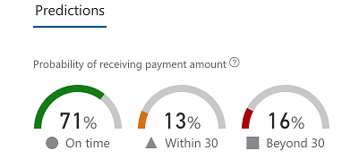
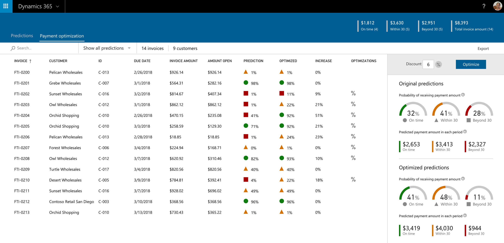

---
# required metadata

title: Customer payment insights (preview)
description: This topic describes how Customer payment insights can help predict when an invoice will be paid and help organizations to create optimization strategies that improve the probability of being paid on time.
author: ShivamPandey-msft
manager: AnnBe
ms.date: 07/17/2018
ms.topic: article
ms.prod: 
ms.service: dynamics-ax-applications
ms.technology: 

# optional metadata

# ms.search.form: 
audience: Application User
# ms.devlang: 
ms.reviewer: shylaw
ms.search.scope: 
# ms.tgt_pltfrm: 
# ms.custom: 
ms.search.region: Global 
# ms.search.industry: 
ms.author: shpandey
ms.search.validFrom: 2018-04-02
ms.dyn365.ops.version: AX 8.0.0

---

# Customer payment insights (preview)

[!include[banner](../includes/banner.md)]

> [!IMPORTANT]
> This feature is part of a targeted release and is only available to users who have opted into the Private Preview. This feature will be included in an upcoming general availability release.

# Overview

Organizations often find it challenging to predict when a customer will pay their invoices. This lack of insight can lead to inaccurate cash flow forecasts, inefficient collection processes, and the possibility of orders being released to customers who may pose a credit risk. Customer payment insights (preview) uses machine learning to predict when an invoice will be paid. It also provides optimization strategies that can be tailored to maximize the probability of customers paying on time.

## Predictions

Payment predictions allow organizations to improve their business processes by helping to:

-   Easily identify the invoices that are predicted to be paid late.
-   Take appropriate measures to improve chances of getting paid on time.

Customer payment insights (preview) uses machine learning to predict when an invoice will be paid. It uses historical invoice, payment, and customer data to create a machine learning model that is used to predict when an invoice will be paid.

For each open invoice, Customer payment insights (preview) predicts three payment probabilities:

-  Probability of payment being made on time (within the invoice due date).
-  Probability of payment being made within 30 days of the invoice due date.
-  Probability of payment being made beyond 30 days of the invoice due date.

The probability of payments can be viewed in the prediction section.

Each invoice is also assigned a winning probability of payment using one of the three predicted payment probabilities scenarios defined above. The scenario with the highest probability of payment is the winning scenario.

For example, let’s assume for an invoice the prediction shows a 71 percent probability that the invoice will be paid on time, 13 percent probability that the invoice will be paid within 30 days of due date, and 16 percent probability that the invoice will be paid beyond 30 days of the due date. The highest probability shows that the invoice will be in the on-time scenario, so the invoice will be tagged with the probability of being paid on time.

## Optimization strategies

In addition to payment predictions, the Customer Payment Insights (preview) can use optimization strategies to improve the chances of getting paid on time. This lets organizations do 'What if' analysis by allowing users to adjust invoice and customer parameters and then compare the corresponding effect on the probability of receiving payment on invoices on time.

For example, an organization may want to evaluate the effect of updating the cash discount on invoices on the probability of receiving the payment on time. When the invoices are optimized to use the new discount, the users can review the effect of applying the discount on the probability of receiving payments for those invoices on time. If the cost of applying the discount is minimal when compared to the benefit of collecting the payment on time, the organization may choose to apply the selected discount to all future open orders.

> [!NOTE] 
> Currently, only discount is available as an optimization strategy for Customer payment insights (preview).

## How to get Customer payment insights (preview)

If you are interested in trying Customer payment insights (preview), please email [Finance Insights Preview team](mailto:fiap@microsoft.com). 

## Privacy Statement

Previews store customer data in the United States. In addition, previews (1) may utilize less privacy and security measures than the Dynamics 365 for Finance and Operations service, (2) are not included in the service level agreement for this service, (3) should not be used to process personal data or other data that is subject to legal or regulatory compliance requirements, and (4) has limited support.
