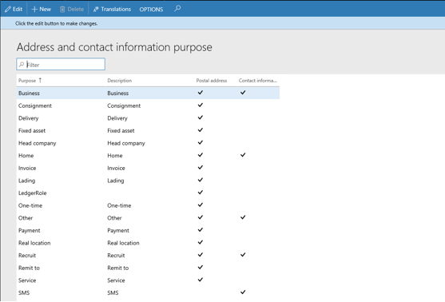
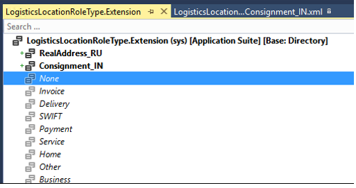
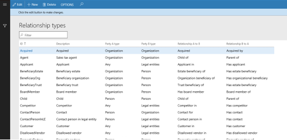

---
# required metadata

title: How to add a new location and party relationship type
description: This article explains how to correct a free text invoice that has been posted and reissue it as a corrected invoice.
author: ShivamPandey-msft
manager: AnnBe
ms.date: 05/01/2018
ms.topic: article
ms.prod: 
ms.service: dynamics-ax-applications
ms.technology: 

# optional metadata

ms.search.form: 
# ROBOTS: 
audience: Application User
# ms.devlang: 
ms.reviewer: twheeloc
ms.search.scope: Core, Operations
# ms.tgt_pltfrm: 
ms.custom: 13991
ms.assetid: 2a0a4789-8619-4974-bef9-0923cc848420
ms.search.region: Global
# ms.search.industry: 
ms.author: shpandey
ms.search.validFrom: 2018-05-02
ms.dyn365.ops.version: AX 8.0.0

---

# How to add new location roles, or Address and contact information, and party relationship types 

## Add new location roles 

There are two ways to add a new location role:

1.  Add it through the **Address and contact information purpose** page. The new role will be saved into LogisticsLocationRole table with type = 0, which indicates the role is not a system role define in LogisticsLocationRoleType enum and its extensions. User will be able to use it when creating address or contact information.

    

2.  Add it to LogisticsLocationRoleType enum extension, and let it populate through the dbsync process.

    1.  Create an extension to LogisticsLocationRoleType enum and add the new role in the extension. 
  
        

    2. Create a new resource file for the new role, and then assign value for its properties. 
        
    3.  Create data population class and provide a handler method to populate the new role. 

        

    4.  To test, you can create a runnable class, and call DirDataPopulation::insertLogisticsLocationRoles() in Main(). After it is
        completed, you should be able to see the new role populated in LogisticsLocationRole table with type \> 0, and the new role should show on the **Address and contact information purpose** page as well.

        

## Add new party relationship types to the system

There are 2 ways to add a new relationship type:

1.  Add it through the **Relationship types** page. The new relationship will be saved to DirRelationshipTypeTable with systemtype = 0.

    

2.  Add it to extension of DirSystemRelationshipType enum, and let it populate through DB sync process.

    1.  Create an extension to enum DirSystemRelationshipType and add the new relationship type.

    2. Create an initializer to this new type. You can find several examples in core code, one of them is  DirRelationshipTypeChildInitializer, that is an initializer class for party relationship type “Child”. You can start with your initializer by copy and paste this code and then update the yellow parts accordingly.

    3.  To test, you can create a runnable class, and call DirDataPopulation::insertDirRelationshipTypes() in Main(). After it is
        completed, you should be able to see the new relationship type populated in DirRelationshipTypeTable, and the new relationship type will be available in the **Relationship types** page.

        
