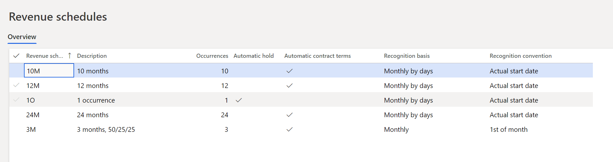
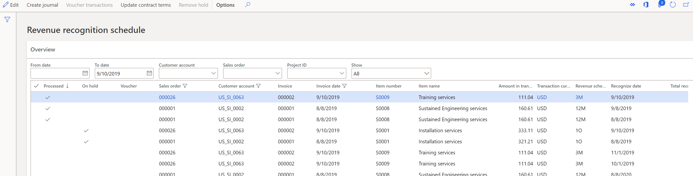
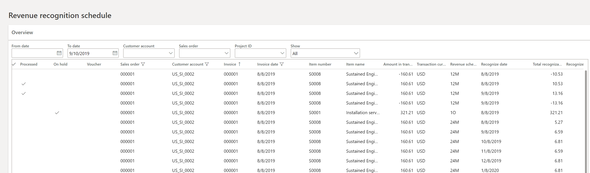

---
# required metadata

title: Recognize deferred revenue 
description: This topic provides information about recognizing revenue using the Revenue recognition feature. 
author: kweekley
manager: aolson
ms.date: 08/24/2018
ms.topic: index-page
ms.prod: 
ms.service: dynamics-ax-applications
ms.technology: 

# optional metadata

ms.search.form:  Customer
audience: Application User
# ms.devlang: 
ms.reviewer: roschlom
ms.search.scope: Core, Operations
# ms.tgt_pltfrm: 
# ms.custom: 
ms.search.region: Global 
# ms.search.industry: 
ms.author: kweekley
ms.search.validFrom: 2018-08-30
ms.dyn365.ops.version: 8.0.4

---
[!include [banner](../includes/banner.md)]
[!include [preview banner](../includes/preview-banner.md)]

# Recognize deferred revenue

[!include [banner](../includes/banner.md)]
[!include [preview banner](../includes/preview-banner.md)]

> [!NOTE]
> The Revenue recognition feature can't yet be turned on through Feature management. Currently, you must use configuration keys to turn it on.

This topic describes the process of recognizing revenue in the revenue recognition schedule.  After an invoice has been posted for a sales order, a revenue recognition schedule is created for each sales order line that contains a revenue schedule.  The revenue schedule on the line is the way to identify which lines’ revenue should be deferred.

## View revenue recognition schedule details

You can open the Revenue recognition schedule details from two locations.  First, the Revenue recognition schedule can be opened directly from an invoiced sales order.  When you open the revenue schedule from this location, the information will be filtered to show the details for the selected sales order only.  This is helpful when validating the schedule details for a sales order. 

You can also open the Revenue recognition schedule from **Revenue recognition > Periodic tasks** page.  It’s common to start from Periodic tasks when recognizing revenue at the end of a period.  

When opened from Periodic tasks, the page opens without any information displayed. Use filters above the grid to define criteria for the schedule details to display. You could choose to filter on the invoice dates by entering a date range, sales order, customer, project ID or state. 

Under the grid is a Financial dimension fast tab that shows the financial dimensions of the sales order line. These dimensions were considered when posting to Deferred revenue and will also be considered when recognizing the revenue. The dimension values used is dependent on the account structure assigned to the revenue and deferred revenue main accounts. 

## Recognize revenue

Revenue is recognized by running the Create journal process from the Recognize revenue page, which can be opened from either the sales order or from periodic tasks. If the process is run from the sales order, it will only recognize revenue for the selected sales order.  Typically, this process is run from Periodic tasks to recognize revenue for all posted sales order invoices.  

Click the **Create journal** button to define the criteria for selecting and posting the revenue.

The Processing date fields are used to determine what posting date will be used when recognizing revenue. If set to **Selected date**, you can enter a posting date into the **Transaction date** field. If set to **Revenue schedule date**, the transaction date isn’t used. Instead it will be posted using the **Recognize date** on each line of the schedule. 

Next enter the recognize revenue as-of date. Any lines of the schedule that have a recognize date on or before that as-of date will be recognized, if they aren’t on hold. 

After the dates are defined, click **OK** in the dialog box to create the journal. An informational message will provide the number of transactions created and the journal in which they were created. The journal does not post automatically, allowing the revenue recognition manager time to validate which lines of the schedule are being recognized. 

After the process is run, the lines on the schedule that were transferred to the journal are marked as **Processed**.  The **Processed** flag means the lines have been transferred to the journal, but they can be posted or unposted. Once the revenue recognition journal is posted, the **Processed** flag remains. If the revenue recognition journal is deleted or a line is deleted, the **Processed** flag will be removed so the line can be recognized when the **Create journal process** is run again. 

Open the **Revenue recognition journal** page (**Revenue recognition > Journal entries > Revenue recognition journal**). Open **Lines** to see the details of what is being recognized.  A separate transaction is always created for each line of the schedule being recognized, even if they all post on the same date with the same ledger accounts. 

The **Account** column shows the deferred revenue ledger account. The ledger account cannot be edited to ensure the correct deferred revenue ledger account is relieved. This ledger account is not validated against the account structure because it may have changed from the time of posting to the referred revenue ledger account. 

The **Offset** account column shows the revenue ledger account. The revenue ledger account defaults from Inventory posting profiles, and the financial dimensions will default from the sales order line. This ledger account is validated against the current account structure, but the user can edit it if the account structure changed and requires additional financial dimensions. 

The default amount is from the corresponding line of the schedule and it cannot be changed. 

If the sales order is multicurrency, the exchange rate will default with the exchange rate from the invoice to ensure the accounting and reporting currency amounts are fully relieved. The exchange rate for the last line of the schedule may be slightly different than the rate on the invoice due to rounding. 

After the revenue recognition journal is posted, the voucher on the schedule will be populated. If there's more than one voucher for the same line of the schedule, the line will display an asterisk (\*). The **Voucher transactions** button can be used to view the voucher(s) that were posted for that line. 

## Modifications to the revenue recognition schedule details

A majority of the data within the revenue schedule details cannot be edited. New lines cannot be added to the schedule and existing lines cannot be deleted. The revenue schedule details for each sales order line must be maintained to ensure an organization recognizes, over time, the same amount that was deferred. 

### Edit schedule lines

Some changes are permitted on the lines of the schedule. The following fields can be changed on the lines:

**On hold** – The On hold flag can be marked or unmarked before the line is processed. Select the row and use the Remove hold button. Revenue cannot be recognized on lines that are placed on hold.  Lines can automatically be placed on hold if the revenue schedule is setup for **Automatic hold**.  

**Recognize date** – The date can be changed before the line is processed. When running the process to create the journal for recognizing revenue, a date is entered in the **Recognize revenue as of date** field. That date is compared to the date in the **Recognize date** field to determine which lines to recognize. 

**Amount to release** – The amount to release can be changed before the line is processed. You can reduce the amount of revenue that’s recognized but cannot increase it. This lets an organization recognize a portion of the revenue on the **Recognize date**. If the amount is changed, the amount in the **Remaining amount** field shows how much revenue must still be recognized.  

**Quantity to release** – If the revenue schedule is set up with 1 occurrence or 1 month, the **Quantity to release** field will display the quantity for that sales order line. This field can also be edited as another way to recognize a portion of the revenue. For example, if the quantity on the line is 5, you can override the quantity to anything less than 5.  The amount in **Amount to release** field will be updated proportionately. 

### Update contract terms

The revenue schedule details are created based on the revenue schedule assigned to the sales order line at the time of posting the invoice. If the revenue schedule is incorrect on the sales order line, it cannot be changed on the sales order after it’s invoiced.  Instead, the **Update contract terms** button can be used to change the revenue schedule. The revenue schedule can be changed before or after revenue has been recognized.  

To change the schedule, place your focus on any schedule line for the item that you're changing.  Here the focus is on the item S0008, which was posted with a 12M revenue schedule. When selecting **Update contract terms**, the contract start- and end-dates, and the revenue schedule are shown.  

Change the contract dates to reflect the correct date range. When you change the date range, the Number of occurrences must match a revenue schedule that’s been defined in the system. Because the contract was changed to a 24-month contract, a twenty-four month revenue schedule must be setup. Because the twenty-four month revenue schedule exists, it’s entered by default, and the contract can be changed.  If a revenue schedule doesn’t exist with the matching number of occurrences, the contract cannot be changed. After the contract terms and revenue schedule are updated, choose **OK** in the dialog box to save the changes.  

After the contract changes are saved, the results to the revenue schedule details are as follows.

If no revenue has been recognized for the product, all the previous schedule details are removed and replaced with the new revenue schedule details. For example, item S0008 originally had 12 lines in the schedule details. Those 12 lines are removed and replaced with 24 lines based on the new revenue schedule. 

If revenue has been recognized for the product, some revenue has been recognized incorrectly because it was based on the incorrect revenue schedule.  Those lines must be reversed and recognized again based on the new schedule.  In this scenario, new revenue schedule lines are created with negative amounts on the original Recognize date.  New lines are then created to recognize the amounts based on the new revenue schedule.  For example, we recognized revenue on August 8, 2019 for $10.53,  and September 8, 2019 for $13.16.  Two new lines are created on the same dates for -$10.53 and -$13.16.  Then 24 new lines are created with the total deferred revenue of $160.61 being allocated across the 24 lines. The reversing lines can be posted by running the Create journal process. 

