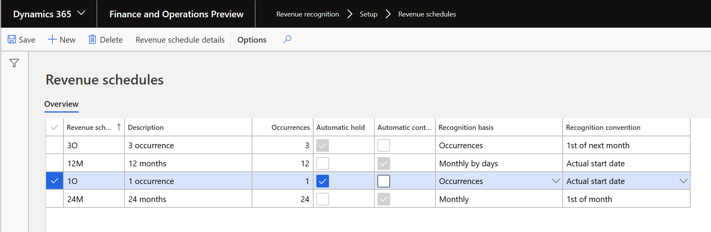

---
# required metadata

title: Revenue recognition setup 
description: 
author: kweekley
manager: aolson
ms.date: 08/24/2018
ms.topic: index-page
ms.prod: 
ms.service: dynamics-ax-applications
ms.technology: 

# optional metadata

ms.search.form:  Customer
audience: Application User
# ms.devlang: 
ms.reviewer: roschlom
ms.search.scope: Core, Operations
# ms.tgt_pltfrm: 
# ms.custom: 
ms.search.region: Global 
# ms.search.industry: 
ms.author: kweekley
ms.search.validFrom: 2018-08-30
ms.dyn365.ops.version: 8.0.4

---
[!include [banner](../includes/banner.md)]
[!include [preview banner](../includes/preview-banner.md)]

# Revenue recognition setup
This topic describes the setup options and their implications for Revenue recognition.  

The Revenue recognition module includes the following setup options. 
- Revenue recognition journals
- Parameters for revenue recognition
- Revenue schedules 
- Inventory setup
 > - Item groups and released products
 > - Defining revenue schedule
 > - Defining revenue price
 >  > - Posting profiles
 >  > - Bundles
 > - Bundle components
 > - Bundle item
- Project setup

A new Revenue recognition module has been added, which includes menu items for all the setup. 

## Revenue recognition journals
A new journal type has been introduced for revenue recognition. The journal is required and will be used in two scenarios. 

The first scenario occurs when after the contractual obligations are complete, the deferred revenue is recognized by creating a revenue recognition journal based on the details on the revenue schedule. The journal contains an accounting entry to move the balance from the deferred revenue ledger account to the revenue ledger account. 

The second scenario occurs when a journal is created after a reallocation occurs. Reallocation occurs when an additional sales order line is added to a previously invoiced sales order, or when a new sales order is created with a line that is part of the original contract. If an invoice has been posted before the new sales order line is added, a correcting accounting entry must be created for the posted customer invoice.

The journal is set up under **Revenue recognition > Setup > Journal names**. The journal type must be defined as Revenue recognition. The revenue recognition journal allows you to select the posting layer to post to. 

## Parameters for revenue recognition
Revenue recognition settings are specified using the General ledger parameters page.  The General ledger parameters page can be opened from **Revenue recognition > Setup > General ledger parameters > Revenue recognition**. Here are the available options. 

**Revenue recognition journal name** – Select the journal created for revenue recognition. The journal is required when recognizing revenue from the revenue schedule or when doing a reallocation on a sales order that has already been invoiced. 

**Enable discount allocation method** – Select Yes to determine the revenue price through allocation of the fair market value defined in the revenue price on each released product. This includes allocation of any line discounts across the items. If this option is set to No, the system will use the median price defined in the revenue price on each released product.  If this option is set to No and no median price is set up on the released products, allocation of the revenue price won’t occur. 

**Include header discounts** – Select Yes to determine the revenue price by allocating header discounts across products. When this option is set to No, the header discount is not included in the revenue price allocation. 

**Disable contract terms** – Select Yes to be able to release products with a revenue type of Post contract support without contract starting and ending dates. Typically, the starting and ending dates for the contract are required for items with a revenue type of Post contract support. Without the contract starting and ending dates, the details of the revenue schedule on the posting are calculated using the number of occurrences and the invoice date.

**Post invoice corrections to Accounts receivable when reallocating** – When doing a reallocation for invoices that have already been posted, the accounting entry for the posted invoice must be corrected. 
-	Select No to limit posting the correcting transaction to General ledger only. When this option is set to No, no additional documents are created in Accounts receivable for the internal accounting correction. When the invoice is paid, the ‘old’ accounting entry will be used by settlement to post any cash discounts, or realized gains or losses. 
-	Select Yes to automatically create a reversing document and new invoice in Accounts receivable for the correcting transaction. Because this is an internal accounting correction, these new documents are not sent or communicated to the customer.  The reversing document is settled to the original invoice and the new corrected invoice is what is paid by the customer. Note that all three documents are displayed on reports, such as the Customer statement. 

## Revenue schedules
A revenue schedule must be created for all occurrences for which revenue can be deferred.  For example, if your organization offers support over a 6-, 12-, 18-, and 24-month time frame, you must create a revenue schedule for each period. The setup of the revenue schedule is used to determine how to allocate the revenue price across the number of periods you select, and is also what dates to default for the revenue schedule created when posting the invoice. 

For recognizing revenue by milestone, we recommend that you create a revenue recognition schedule for the number of milestones, regardless of the recognition dates. After you create the schedules you can edit them to reflect the expected milestone dates. These records can be put on hold until you’re notified that the milestone has been met and revenue can be recognized. 

Create the revenue schedules under **Revenue recognition > Setup > Revenue schedules**. 

Enter descriptive values for the revenue schedule and description. The following additional settings are used to create the revenue schedule upon posting the invoice. 

**Occurrences** – Enter the number of months or occurrences for the revenue deferral. 

**Automatic hold** – Mark this option to automatically place all lines of the revenue schedule on hold when the invoice is posted.  The hold must be manually removed from each line of the schedule before the line’s deferred revenue can be recognized. 

**Automatic contract terms** – Mark this option to have the contract start date and end date automatically populated. The dates will only default for released products defined with a revenue type of Post contract support.  The contract start date will default to the sales order line’s Requested ship date, and the contract end date will default with the start date plus the number of months/occurrences defined in the revenue schedule setup. For example, the product on the sales order line is for a one-year warranty, which has a default revenue schedule of 12M (12 months). The 12-month revenue schedule has Automatic contract terms marked. If the sales order line has a Requested ship date of December 16, 2019, the default entry for the contract start date will be December 16, 2019 and the contract end date will be December 15, 2020.

**Recognition basis** – The recognition basis determines how the revenue price is allocated across the occurrences. 
-	Monthly by dates** – the amount is allocated based on the actual days within each month
-	Monthly – the amount is allocated equally across the number of months defined in the occurrences
-	Occurrences – the amount is allocated equally across the occurrences but may include an extra period if you use actual start date for the recognition convention

**Recognition convention** – The recognition convention determines what dates default on the revenue schedule for the invoice.  
-	Actual start date – The schedule is created using either the contract start date (for post contract support items) or the invoice date (for essential and nonessential items)
-	1st of month – The date on the first schedule line is the contract start date (or invoice date) but all subsequent schedules lines are created for the 1st of the month
-	Mid-month split – The date on the first schedule line is dependent on the invoice date.  If the invoice is posted on the 1st to 15th of the month, the revenue schedule is created using the 1st day of the month.  If the invoice is posted on the 16th or after, the revenue schedule is created using the 1st day of the next month. 
-	1st of next month – The date on the schedule is the 1st day of the next month. 

Click the **Revenue schedule details** button to access the general periods and percentage recognized in each period. By default, the Recognize percentage is equally divided across the number of periods.  If the Recognition basis is either Monthly or Occurrences, the recognition percentage can be changed. As you change the recognition percentage, a warning message will tell you that the total isn’t equal to 100%.  If the message is displayed, you can continue editing additional lines, but the total percentage must equal 100% before you close the form. 

## Inventory setup
You can recognize revenue for released products on sales orders, but not with sales categories on the sales orders or with free text invoices. if no items are included on the document. The selections made when setting up released product determines how the item’s revenue is recognized, including whether the revenue price is allocated and whether the revenue is deferred using a revenue schedule. 

The setup can begin on the Item group (**Revenue recognition > Setup > Inventory and product setup > Item group > Revenue recognition** FastTab). A number of setup fields are located on the Item group. These fields are only used for setting the default entries for new released products created within the system.  As new products are created, the entries you make here will be entered by default on the item group. You can override the default entries on the released products (**Revenue recognition > Setup > Inventory and product setup > Released products**). The default entries on the released products are then carried forward to the sales order.

## Item groups and released products
### Defining revenue schedule
Revenue on the sales order line is deferred if the Released product has a revenue schedule defined, which defaults onto the sales order line.  The revenue schedule can be defined on the Item group (**Revenue recognition > Setup > Inventory and product setup > Item group > Revenue recognition** FastTab) as a way to default the setting to the product. You can also define the setting on the released product in the **Revenue recognition** FastTab (**Revenue recognition > Setup > Inventory setup > Released products > Revenue recognition** FastTab). 
-	**Revenue schedule** – select the revenue schedule that represents the time period over which the revenue must be deferred. The revenue schedule defaults onto the sales order line, and the schedule details are created upon posting the sales order invoice. 

### Defining revenue price
Item groups and released products can be set up using either the median price method or the discount allocation method. Both methods require various settings on the Released products as follows: 

**Is revenue allocation active** – If set to Yes, the released product will be included in the revenue allocation calculation. If set to No, the release product will use the median price method, if it’s defined.  If the median price is not defined, the unit price on the sales order line is used to  post to revenue or deferred revenue. 
**Revenue type** – The released product can be defined with the following revenue types:
-	Essential – Items that are a primary source of an organization’s revenue. This is the default setting.  
-	**Nonessential** – Items that are not a primary source of an organization’s revenue. When using the median price settings, the price is carved to the median price and then allocated. For example, assume an essential item has a fixed price that must be recognized for revenue. If there is a discount, the discount may or may not be carved out of the essential item revenue, but ONLY up to the fixed price amount. The rest of the discount would be taken out of the revenue for the nonessential items.
-	Post contract support – Items that provide support to other elements included in the sale to the customer. The revenue price is distributed across the essential and nonessential products that are included in the sale. Depending on setup,  Post contract support items may or not require a start and end date for the contract be defined on the sales order line. 
**Exclude from carve out** – If set to Yes, this item’s median price cannot be adjusted above or below the minimum or maximum percentage defined. Any revenue price will be derived from the revenue price of another released product that’s included on the sales order.  If set to No, this item’s median price can be adjusted or ‘carved out’.  Note that if you sell more than one item that’s set up as median price, at least one released product must be set up with Exclude from carveout set to No so that any differences in the revenue price can be allocated to at least one item.
**Median price** – If set to Yes, this item’s revenue price is adjusted to equal the median price if it’s above or below the Minimum tolerance and Maximum tolerance, and the ‘carve out’ amount is allocated to lines with products where Exclude from carve out = No. 
-	Maximum tolerance – Enter the percentage over the median price that is permitted
-	Minimum tolerance – Enter the percentage under the median price that is permitted

Once the settings are defined for the released product, the revenue prices need to be defined manually by entering the fair value prices or the median price, if you are using median price method (**Revenue recognition > Setup > Inventory setup > Released products > Sell** tab > **Revenue recognition field group > Revenue prices**). 

The revenue price manually defined on this page will be used to determine the revenue price allocation on each sales order, based on the criteria defined. Each criteria is matched to the sales order line to determine what revenue price will be used in the allocation process. 

**Item code and Item relation** – A revenue price can be defined for an individual product or a group of products.  If you select Table, select the released product in the Item relation field. If you select Group, select the Item group in the Item relation field. 
**Account code and Account/Group number** - A revenue price can be defined for all customers, a group of customers or an individual customer.  If you select All, the price is used for all customers. If you select Table, select the Customer in the Account/Group number field. If you select Group, select the Customer group in the Account/Group number field.
**Currency** – A separate revenue price must be entered for each currency in which you enter a sales order.  For example, if you currently sell in U.S. dollars, Canadian dollars and Euros, you must define a revenue price in all three currencies.  The revenue price won’t translate from one currency, such as the accounting currency, to any other transaction currencies you’re using. 
**Amount or percent of list** - Specify whether the revenue price is set up as an amount or a percentage of list. Selecting Percent of list lets users enter the median price as a percent of the list price instead of an amount.  Percent of list is only used for released products setup as Post contract support. 
**Revenue allocation price** – Enter either an amount or percent, depending on the previous field, to represent the revenue price used to allocate the revenue across the elements on the sales order
**From date/To date** (optional) – Enter a date range for which the revenue price is active. 

If the General ledger parameter is set to use discount allocation method and your released product is setup with the **Revenue type** set to **Post contract support**, then you must also define the **Setup basis** to identify which items are being *supported* by the released product (**Revenue recognition > Setup > Inventory setup > Released products > Sell tab > Revenue recognition field group > Setup basis**).

On the **Setup basis** page, add a record for each item group that the item is providing support to. When the revenue allocation occurs, the revenue price will be distributed across the essential and nonessential portions for the post contract support item. 

### Posting profiles 
Three additional posting types support the ability to defer revenue. The additional posting types are located under **Revenue recognition > Setup > Inventory and product setup > Posting > Sales order** tab:

**Deferred revenue** – Enter the main account for the revenue price that posts to deferred revenue (instead of revenue), the revenue price is deferred if the sales order line contains a revenue schedule
**Deferred cost of goods sold** – Enter the main account for the cost of goods sold amount that will post to deferred cost of goods sold if the revenue is also deferred
**Partial invoice revenue clearing** – Enter the main account for the clearing account that will be used if the sales order is partially invoiced or when a reallocation occurs. The balance in this account will return to zero when the sales order(s) are fully invoiced. 
  
### Bundles 
Bundle items are a unique released product that are set up with components using the BOM functionality. When the bundle item is entered on the sales order, the individual components are used for determining the revenue prices and revenue schedules but the bundle item is what is reflected to the customer on printed documents such as the sales order and invoice.   

### Bundle components 
You must set up the components that will be included in the bundle under **Revenue recognition > Setup >  Inventory and product setup >  Released products**. These are released products and must be set up in the same manner as products that are included in a bill of materials (BOM). For example, a released product can be either an Item type or Service type item, but they must assigned to an Item model group that’s set up with the Stocked product field set to Yes. Refer to the setup document for BOM items for more details. 

The components must also be set up for revenue recognition as if they were products that could be sold individually on a sales order. For example, be sure each component has the correct revenue price defined and the price basis set up for post contract support items. 

### Bundle item
When setting up the bundle item, you must set the following two fields:
-	The item must be setup as a BOM item under **Revenue recognition > Setup > Inventory and product setup > Released products >  Engineer** fast tab **> Production type**. 
-	The item must be marked as a bundle item under **Revenue recognition – Setup -  Inventory and product setup -  Released products - General** FastTab **– Bundle**.  
 
The components must be assigned to the bundle/BOM parent item. This should be done under **Revenue recognition > Setup > Inventory and product setup > Released products > Engineer action** tab **> BOM > **BOM versions**. Refer to the BOM setup documentation for more details. 

If the bundle parent and bundle components are set to allocate, the bundle revenue price will be distributed to the components based on their revenue contribution percentages. 

## Project setup
Revenue recognition can also be used for sales orders created through a time and material project.  The only settings required for sales orders that originate from a project is to define the main accounts on the project posting profiles, used for posting the project invoice. The main accounts are defined on the Ledger posting setup page, (**Revenue recognition – Setup – Project setup – Ledger posting setup**).  

**Deferred invoice revenue (under Revenue accounts)** – Enter the main account for the revenue price that posts to deferred revenue (instead of revenue); the revenue price is deferred if the sales order line contains a revenue schedule.

**Deferred cost (under Cost accounts)** – Enter the main account for the cost of goods sold amount that will post to deferred cost of goods sold if the revenue is also deferred.

