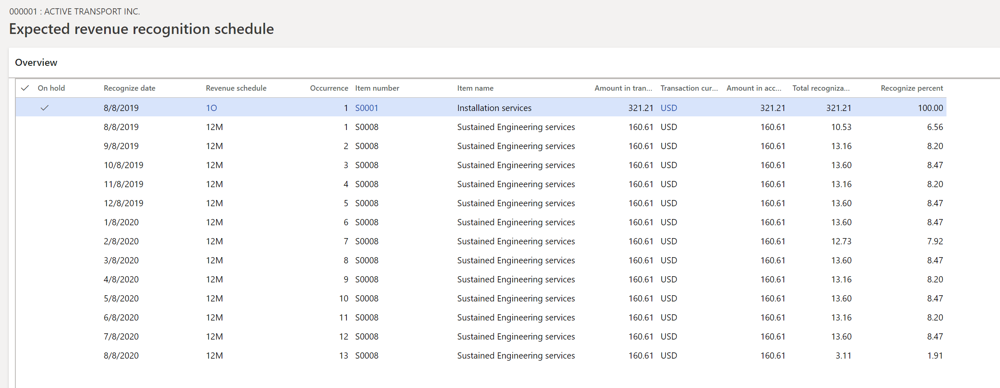

---
# required metadata

title: Revenue recognition on sales orders 
description: This topic describes the basic functionality for recognizing revenue on sales orders and invoices. Revenue recognition is available on the sales order and corresponding invoice that is created from the sales order.
author: kweekley
manager: aolson
ms.date: 08/24/2018
ms.topic: index-page
ms.prod: 
ms.service: dynamics-ax-applications
ms.technology: 

# optional metadata

ms.search.form:  Customer
audience: Application User
# ms.devlang: 
ms.reviewer: roschlom
ms.search.scope: Core, Operations
# ms.tgt_pltfrm: 
# ms.custom: 
ms.search.region: Global 
# ms.search.industry: 
ms.author: kweekley
ms.search.validFrom: 2018-08-30
ms.dyn365.ops.version: 8.0.4

---

# Revenue recognition on sales orders

[!include [banner](../includes/banner.md)]
[!include [preview banner](../includes/preview-banner.md)]

> [!NOTE]
> The Revenue recognition feature can't yet be turned on through Feature management. Currently, you must use configuration keys to turn it on.

This topic describes the basic functionality for recognizing revenue on sales orders and invoices. Revenue recognition is available on the sales order and corresponding invoice that is created from the sales order. The sales order can also be created through a time and material project.

[!Note] Columns have been hidden or added to grids shown in the illustrations in this topic to better illustrate the concepts. Therefore, the pages and data in the illustrations may differ from what you see in your product. 

## Enter sales order 
The following sales order is entered with three items setup for revenue recognition

There are two concepts to revenue recognition.  First is determination of the revenue price, which is calculated based on the setup of the released products. The revenue price is never shown to the customer but is only used for the accounting of the sales order invoice. The sales order lines and documents printed as part of the sale continue to show the unit/list price.

The second concept of revenue recognition is when to recognize revenue, which is determined through the use of a revenue schedule. The first item, S0001, is assigned to a 1O (1 occurrence) revenue schedule.  This represents a milestone-type scenario where the revenue will be recognized after the installation has occurred in the future. The revenue will be deferred until the installation is complete. 

The second item, S0008, is a service item that is set up as a post contract support (PCS) item.  The sustained engineering services are provided to the customer over a 12-month period, so the product defaults with the 12M revenue schedule.  Because this is a PCS type item, a contract start date and end date must be defined. By default, the contract start date and end date are found on Item details – Setup tab. The setup on revenue schedule for ‘12M’ is defined to automatically default the contract terms as shown here:

 
 
The third item, S0012, is hardware and doesn’t default with a revenue schedule. The revenue for the hardware will be recognized as soon as the item is invoiced. 

## Confirm sales order
Additional details about the revenue price and revenue schedule can be found on the action pane of the sales order on the Manage tab.  At this point the sales order is not confirmed, so the buttons used for the recognizing revenue are inactive. The buttons will become active or inactive as the sales order progresses through the stages leading to fulfillment. 

The first three buttons provide revenue price details for the items on the sales order setup for revenue recognition.  
**Revenue price allocation** – The button becomes available after the sales order is confirmed  or after the invoice is posted. Both the confirmation and invoice posting will calculate the Revenue to recognize price that will be recognized or deferred on the accounting entry. Depending on setup, the calculated revenue price can differ from the unit price shown to the customer. 
**Reallocate price** with new order lines – The button becomes available after the sales order is confirmed or after the invoice is posted. The reallocation process is used to recalculate the Revenue to recognize after a new line is added to either the current sales order after it’s invoiced, or added to a new sales order.  In both scenarios, there is a ‘change to the contract’ through the addition of a new item. As a result, the revenue price must be reallocated. 
**Update revenue price allocation** – The button becomes available after the sales order is confirmed but is disabled after the sales order is invoiced. The update is used to run the revenue price allocation again without having to confirm the sales order. After the sales order is invoiced, the revenue price cannot be recalculated. 
The last two buttons provide revenue schedule details for the items on the sales order with a revenue schedule.   
> **Expected revenue recognition schedule** – The button becomes available after the sales order is confirmed but is disabled after the sales order is invoiced.  This button opens a page that shows the expected revenue schedule. The final schedule may change because the expected schedule uses the Requested ship date but the final schedule uses the actual ship date. 

The last two buttons provide revenue schedule details for the items on the sales order with a revenue schedule.   

**Expected revenue recognition schedule** – The button becomes available after the sales order is confirmed but is disabled after the sales order is invoiced.  This button opens a page that shows the expected revenue schedule. The final schedule may change because the expected schedule uses the Requested ship date but the final schedule uses the actual ship date. 

**Revenue recognition schedule** – The button becomes available after the sales order is invoiced. The final revenue recognition schedule is not created upon confirmation or packing slip, but only upon invoicing the sales order.  
Revenue recognition schedule** – The button becomes available after the sales order is invoiced. The final revenue recognition schedule is not created upon confirmation or packing slip, but only upon invoicing the sales order.  

The revenue price allocation occurred when the sales order was confirmed. Even though the revenue prices are allocated differently, it’s important to note that the total amount on the **Revenue to recognize** field must still equal the sum of the sales order lines invoiced to the customer.  For example, the sales order lines summed to $1499 (without tax) so the sum of the **Revenue to recognize** must also total $1499.    

The expected revenue recognition schedule is also created.  The revenue schedule uses the **Revenue to recognize** as the amount to defer. Item S0001 defers $321.21 instead of $300 and item S0008 defers $160.61 instead of $100. Item S0012 isn’t shown in the expected schedule because the revenue isn’t deferred.  Upon posting, item S0012 will post $1017.18 directly to the revenue ledger account. 

## Create the packing slip
Next the packing slip can be created for the sales order.  No revenue is recognized when the packing slip is posted.  If the sales order wasn’t confirmed, the packing slip post will not trigger the revenue price calculation or creation of the expected or final revenue recognition schedule. If the item model group is set up to defer revenue on the packing slip, that will continue to post with the current posting profile ledger accounts, not with the new deferred revenue accounts used on the invoice posting. 

## Create the invoice
The final step is to invoice the sales order.  When looking at the invoice’s voucher, the revenue for items S0001 and S0008 were deferred ($321.21 + 160.61 = 481.82) and the remaining amount for item S0012 is posted to revenue (1017.18).  These add up to $1499, which matches the sum of the sales order lines. 

After the invoice is created, the buttons for Revenue recognition will appear as follows:

The revenue price allocation is still available for visibility into the revenue price calculation.  If nothing changed on the sales order after it was confirmed, posting the invoice will not change the calculated amount in the **Revenue to recognize** field.  

The Expected revenue recognition schedule is removed and replaced with the final revenue recognition schedule.  The revenue schedule details are maintained for each sales order line and are used to release the deferred revenue to actual revenue as the contractual obligation is met. 

