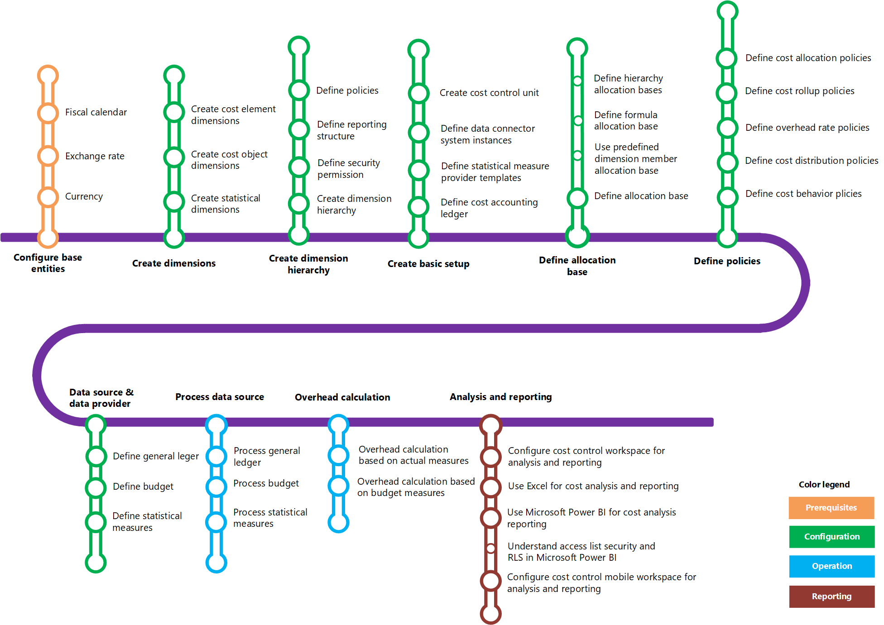

---
# required metadata

title: Cost accounting home page
description: This topic provides a list of the help topics and other resources that are available for Cost accounting.
author: YuyuScheller
manager: AnnBe
ms.date: 08/20/2017
ms.topic: article
ms.prod: 
ms.service: dynamics-ax-applications
ms.technology: 

# optional metadata

# ms.search.form: 
# ROBOTS: 
audience: Application User
# ms.devlang: 
ms.reviewer: yuyus
ms.search.scope: Core, Operations
# ms.tgt_pltfrm: 
ms.custom: 256254
ms.assetid: e1b0a6e3-0c72-4a7d-90e1-20f870c6dbad
ms.search.region: Global
# ms.search.industry: 
ms.author: yuyus
ms.search.validFrom: 2016-11-30
ms.dyn365.ops.version: Version 1611

---

# Cost accounting home page

[!include[banner](../includes/banner.md)]

## Learning map 

The following learning map shows the major concepts and tasks that make up the framework of the Cost accounting module. Click the links in the [Quick links](#quick-links) section to learn how to use the module.

## Quick links
|      |   |
|------|---|
|  [Configure base entities (eLearning)](https://mbspartner.microsoft.com/Home) (requires CustomerSource account)  |[Create dimensions](cost-elements.md)  |
|  [Create dimension hierarchy](dimension-hierarchy.md)  |[Create basic setup](./tasks/define-cost-control-units.md)| 
| [Define allocation base](allocation-bases.md)|[Define policies](./tasks/create-assign-cost-allocation-policy-cost-control-unit.md) | 
| [Data source and data provider](./tasks/manage-data-source-cost-accounting-ledger.md) |                                           [Data source and data provider](./tasks/process-trace-source-data.md)     | 
|[Overhead calculation](overhead-calculation.md)  | [Analysis and reporting](cost-control-workspace.md)   |

## Get started videos 

|  |  |                             |
|------------------------|--------------------|-----------------------------|
| <iframe width="100%"  src="https://www.youtube.com/embed/1pUDtJQZ8FU" frameborder="0" allowfullscreen></iframe>  | <iframe width="100%"  src="https://www.youtube.com/embed/imsuTg8rUVk" frameborder="0" allowfullscreen></iframe>  |   <iframe width="100%" src="https://www.youtube.com/embed/-HKHYdClvx8" frameborder="0" allowfullscreen></iframe>  |
|  |  |                             |

