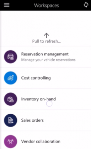

---
# required metadata

title: Expense management mobile workspace

description: This topic provides information about the Expense management mobile workspace. This workspace lets users capture and upload a receipt, so that they can attach it to an expense report later. Users can also quickly create an expense line by using an attached receipt, and create and manage their expense reports. 
author: KimANelson 
manager: AnnBe
ms.date: 12/01/2017
ms.topic: article
ms.prod: 
ms.service: dynamics-ax-applications
ms.technology: 

# optional metadata

# ms.search.form: 
# ROBOTS: 
audience: Application User
# ms.devlang: 
ms.reviewer: sericks
ms.search.scope: Operations
# ms.tgt_pltfrm: 
ms.custom: 274023
ms.assetid: 3605eda1-a7ed-4675-8031-5279c5a8f5e4
ms.search.region: Global
# ms.search.industry: 
ms.author: knelson
ms.dyn365.ops.intro: Version 1611
ms.search.validFrom: 2016-11-30

---

# Expense management mobile workspace

[!include[banner](../includes/banner.md)]

This topic provides information about the **Expense management** mobile workspace. This workspace lets users capture and upload a receipt, so that they can attach it to an expense report later. Users can also quickly create an expense line by using an attached receipt, and create and manage their expense reports. Additionally, approvers can use the **Expense management** mobile workspace to view expense reports that are assigned to them, and either approve or reject those expense reports.

This mobile workspace is intended to be used with the Microsoft Dynamics 365 for Unified Operations mobile app.

## Overview

Many organizations require that a copy of a receipt be attached to a travel-related or business-related expense report that an employee submits for reimbursement. The **Expense management** mobile workspace lets users quickly create new expense lines on the mobile device of their choice by using an attached photo of a receipt. Alternatively, users can capture a photo of a receipt and then attach it to an expense report later. Employees can also create and manage their expense reports, and then submit them for approval and reimbursement by using their mobile device.

Specifically, the **Expense management** mobile workspace lets users perform these tasks:

- Take a photo of a receipt, and upload it to Microsoft Dynamics 365 for Finance and Operations, Enterprise edition. You can then attach that photo to an expense report later.
- Upload a file as a captured receipt. You can then attach that file to an expense report later.
- Create a new expense line by using an attached receipt. You can then add the line item to an expense report later, and submit it for approval and reimbursement.

If you're using Microsoft Dynamics 365 for Finance and Operations, Enterprise edition, you can also use these features:

- Create a new expense report.
- Attach credit card transactions and other previously created expenses to an expense report.
- Create new expenses for an expense report.
- Attach a receipt to any expense for an expense report, either by taking a photo of the receipt or by uploading a file as a captured receipt.
- Depending on the company's expense policy, add the list of guests to an expense.
- Depending on the company's expense policy, itemize expenses.
- Submit an expense report for approval and reimbursement.
- Approve or reject expense reports that you're an assigned approver for.

## Prerequisites
The prerequisites vary, based on the version of Microsoft Dynamics 365 that has been deployed for your organization.

### Prerequisites if you use Microsoft Dynamics 365 for Finance and Operations, Enterprise edition 
If Microsoft Dynamics 365 for Finance and Operations, Enterprise edition has been deployed for your organization, the system administrator must publish the **Expense management** mobile workspace. For instructions, see [Publish a mobile workspace](../../dev-itpro/mobile-apps/publish-mobile-workspace.md).

### Prerequisites if you use Microsoft Dynamics 365 for Operations version 1611 with platform update 3 or later
If Microsoft Dynamics 365 for Operations version 1611 with platform update 3 or later has been deployed for your organization, the system administrator must complete the following prerequisites. 

<table>
<thead>
<tr class="header">
<th>Prerequisite</th>
<th>Role</th>
<th>Description</th>
</tr>
</thead>
<tbody>
<tr class="odd">
<td>Implement KB 4019015.</td>
<td>System administrator</td>
<td>KB 4019015 is an X++ update or metadata hotfix that contains the <strong>Expense management</strong> mobile workspace. To implement KB 4019015, your system administrator must follow these steps.
<ol>
<li><a href="../../dev-itpro/migration-upgrade/download-hotfix-lcs.md">Download the metadata hotfix from Microsoft Dynamics Lifecycle Services (LCS)</a>.</li>
<li><a href="../../dev-itpro/migration-upgrade/install-metadata-hotfix-package.md">Install the metadata hotfix</a>.</li>
<li><a href="../../dev-itpro/deployment/create-apply-deployable-package.md">Create a deployable package</a> that contains the <strong>ApplicationSuite</strong> and <strong>ExpenseMobile</strong> models, and then upload the deployable package to LCS.</li>
<li><a href="../../dev-itpro/deployment/apply-deployable-package-system.md">Apply the deployable package</a>.</li>
</ol></td>
</tr>
<tr class="even">
<td>Publish the <strong>Expense management</strong> mobile workspace.</td>
<td>System administrator</td>
<td>See <a href="../../dev-itpro/mobile-apps/publish-mobile-workspace.md">Publish a mobile workspace</a>.</td>
</tr>
</tbody>
</table>

## Download and install the Dynamics 365 for Operations mobile app
Download and install the Dynamics 365 for Unified Operations mobile app:

- [For Android phones](https://go.microsoft.com/fwlink/?linkid=850662)
- [For iPhones](https://go.microsoft.com/fwlink/?linkid=850663)

## Sign in to the mobile app
1. Start the app on your mobile device.
2. Enter your Dynamics 365 URL.
4. The first time that you sign in, you're prompted for your user name and password. Enter your credentials.
5. After you sign in, the available workspaces for your company are shown. Note that if your system administrator publishes a new workspace later, you will have to refresh the list of mobile workspaces.

## Capture a receipt by using the Expense management mobile workspace

1. On your mobile device, open the **Expense management** workspace.
2. Select **Capture receipt**.
3. Select **Take photo** or **Choose image**.
4. Follow one of these steps:

    - If you selected **Take photo**, follow these steps:

        1. You're taken to the camera on your mobile device, so that you can take a photo of the receipt. When you've finished taking a photo, select **OK** to accept the photo.
        2. Optional: Enter a name for the photo, and enter any notes.

    - If you selected **Choose image**, follow these steps:

        1. Select an image in the list.
        2. Optional: Enter a name for the image, and enter any notes.

5. Select **Done**.

## Quickly enter expenses by using the Expense management mobile workspace
1. On your mobile device, open the **Expense management** workspace.
2. Select **Quick expense entry**.
3. Select the category for the expense. You see a list of expense categories that are loaded into your app for offline use. By default, 50 items are loaded, but a developer can change this number. For more information, developers should see [Mobile platform](../../dev-itpro/mobile-apps/platform/mobile-platform-home-page.md). If your category isn't in the list, select **Search** to do an online search. Search by expense category, or switch to search by expense type.
4. Enter the transaction date of the expense.
5. Optional: Enter the merchant for the expense.
6. Enter the amount of the expense.
7. Select the currency of the expense. You see a list of the currency codes that are loaded into your app for offline use. By default, 400 currencies are loaded, but a developer can change this number. For more information, developers should see [Mobile platform](../../dev-itpro/mobile-apps/platform/mobile-platform-home-page.md). If your currency isn't in the list, select **Search** to do an online search. Search by currency, or switch to search by name.
8. Select **Take photo** or **Choose image**.
9. Follow one of these steps:

    - If you selected **Take photo**, you're taken to the camera on your mobile device, so that you can take a photo of the receipt. When you've finished taking a photo, select **OK** to accept the photo.
    - If you selected **Choose image**, select an image in the list.

10. Select **Done**.

## Approve an expense report by using the Expense management mobile workspace (if you use the July 2017 update)
1. On your mobile device, open the **Expense management** workspace.
2. **Expense approvals** shows the number of expense reports that are assigned to you for approval. The number is updated approximately every 30 minutes. Select **Expense approvals**.

    The list of expense reports that are assigned to you for approval is shown.
    
3. Select an expense report to view the expense details for it.
4. Select an expense to view the details for it. The information that is shown for an expense includes any receipt, guest, and itemization details.
5. Back on the **Expense report** page, select to approve or reject the expense report.
6. Enter any comments for the approval action.
7. Select **Done**.

## Create a new expense report and submit it for approval by using the Expense management mobile workspace (if you use the July 2017 update)
1. On your mobile device, open the **Expense management** workspace.
2. Select **Expense entry**.
3. Select **New report**, or select an existing expense report in the list.
4. For new expense reports, enter the purpose and any additional information that is available. This information varies, depending on that way that expense management is configured for your company.
5. Select **Done**.
6. To add existing expenses, such as credit card transactions, to the expense report, select **Attach**.
7. Select one or more expenses in the list.
8. Select **Done**.
9. To add a new expense to the expense report, select **New expense**.
10. Select the category for the expense. You see a list of expense categories that are loaded into your app for offline use. By default, 50 items are loaded, but a developer can change this number. For more information, developers should see [Mobile platform](../../dev-itpro/mobile-apps/platform/mobile-platform-home-page.md). If your category isn't in the list, select **Search** to do an online search. Search by expense category, or switch to search by expense type.
11. Optional: Enter the merchant for the expense.
12. Enter the transaction date of the expense.
13. Enter the amount of the expense.
14. Select the currency of the expense. You see a list of the currency codes that are loaded into your app for offline use. By default, 400 currencies are loaded, but a developer can change this number. For more information, developers should see [Mobile platform](../../dev-itpro/mobile-apps/platform/mobile-platform-home-page.md). If your currency isn't in the list, select **Search** to do an online search. Search by currency, or switch to search by name.
15. Select **Done**.
16. To add more details to the expense, select **Add more details**. The fields that are available depend on the configuration of expense management for your company.
17. If company policy requires a receipt for the expense, select **Receipts**, and then follow these steps:

    1. Select **Capture receipt** or **Attach receipt**.
    2. Follow one of these steps:

        - If you selected **Capture receipt**, follow these steps:

            1. Select **Take photo** or **Choose image**.
            2. Follow one of these steps:

                - If you selected **Take photo**, follow these steps:

                    1. You're taken to the camera on your mobile device, so that you can take a photo of the receipt. When you've finished taking a photo, select **OK** to accept the photo.
                    2. Optional: Enter a name for the photo, and enter any notes.

                - If you selected **Choose image**, follow these steps:

                    1. Select an image in the list.
                    2. Optional: Enter a name for the image, and enter any notes.

            3.  Select **Done**.

        - If you selected **Attach receipt**, follow these steps:

            1.  Select one or more images in the list.
            2.  Select **Done**.

    3. Select the **Back** button to return to the expense details.

18. If company policy requires guests for the expense, select **Guests**, and then follow these steps:

    1. Select **Guest**, **Previous guests**, or **Coworkers**.
    2. Follow one of these steps:

        - If you selected **Guest**, follow these steps:

            1. Enter the name of the guest.
            2. Optional: Enter the organization and/or country of the guest.
            3. Optional: Enter the title of the guest.
            4. Select **Done**.

        - If you selected **Previous guests**, follow these steps:

            1. Select one or more previous guests in the list. You see a list of previous guests that you've added to previous expense reports that are loaded into your app for offline use. By default, 50 items are loaded, but a developer can change this number. For more information, developers should see [Mobile platform](../../dev-itpro/mobile-apps/platform/mobile-platform-home-page.md). If your previous guest isn't in the list, select **Search** to do an online search. Search by name, or switch to search by organization, country, or title.
            2. Select **Done**.

        - If you selected **Coworkers**, follow these steps:

            1. Select one or more coworkers in the list. You see a list of coworkers that are loaded into your app for offline use. By default, 50 items are loaded, but a developer can change this number. For more information, developers should see [Mobile platform](../../dev-itpro/mobile-apps/platform/mobile-platform-home-page.md). If your coworker isn't in the list, select **Search** to do an online search. Search by name, or switch to search by company or title.
            2. Select **Done**.

    3. Select the **Back** button to return to the expense details.

19. If company policy requires that the expense be itemized, select **Itemize**, and then follow these steps:

    1. Select the first date to itemize.
    2. Select **Add itemization**.
    3. Select the subcategory for the expense itemization. You see a list of expense subcategories that are loaded into your app for offline use. By default, 50 items are loaded, but a developer can change this number. For more information, developers should see [Mobile platform](../../dev-itpro/mobile-apps/platform/mobile-platform-home-page.md). If your subcategory isn't in the list, select **Search** to do an online search. Search by expense subcategory name.
    4. Enter the transaction amount for the itemization.
    5. Edit the transaction date if it's required.
    6. Select **Done**.
    7. Repeat the preceding steps until you've finished adding all itemizations for the selected date.
    8. For additional days, you can select **Copy to next day** to copy the itemizations to the next day. Alternatively, you can select the date to itemize and then add itemizations as you did for the first date.
    9. After you've finished itemizing the expense, select the **Back** button to return to the expense details.

20. Select the **Back** button to return to the **Expense report** page.
21. Repeat the preceding steps until you've finished adding all expenses.
22. Select **Submit**.
23. Enter any comments for the approver.
24. Select **Done**.
