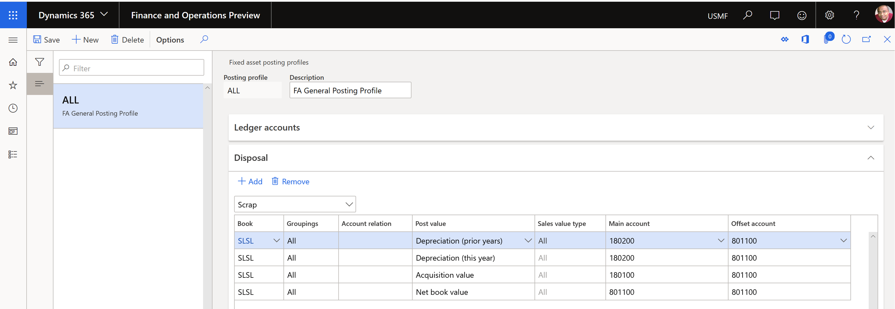
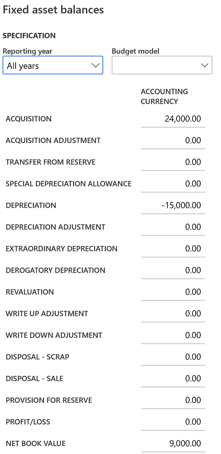
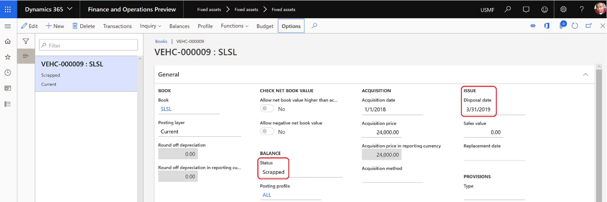

---
# required metadata

title: Dispose of a fixed asset as scrap
description: The topic describes the process of eliminating transactions for a fixed asset that was disposed of as scrap. The transactions that can be eliminated include an asset’s acquisition, accumulated depreciation, as well as other fixed asset transactions. Eliminating these transactions will affect balance sheet accounts such as acquisition adjustment, depreciation adjustment, revaluation, write-up, and write-down.

author: moaamer
manager: Ann Beebe
ms.date: 08/14/2019
ms.topic: article
ms.prod: 
ms.service: dynamics-ax-applications
ms.technology: 

# optional metadata

ms.search.form: TaxTable
# ROBOTS: 
audience: Application User
# ms.devlang: 
ms.reviewer: roschlom
ms.search.scope: Core, Operations, Retail

# ms.tgt_pltfrm: 
ms.custom: 4464
ms.assetid: 5f89daf1-acc2-4959-b48d-91542fb6bacb
ms.search.region: Global
# ms.search.industry: 
ms.author: vstehman
ms.search.validFrom: 2019-08-14
ms.dyn365.ops.version: 10.0.6

---

# Dispose of a fixed asset as scrap

The topic describes the process of eliminating transactions for a fixed asset that was disposed of as scrap. The transaction types that can be eliminated include an asset’s acquisition, accumulated depreciation, as well as other fixed asset transactions. Eliminating these transactions will affect balance sheet accounts such as acquisition adjustment, depreciation adjustment, revaluation, write-up, and write-down. 

| Transaction                         |   | Dr | Cr |
|-------------------------------------|---|----|----|
| Dr. Accumulated depreciation        |   | xx |    |
| Cr. Fixed assets gain/loss          |   |    | xx |
|                                     |   |    |    |
| Dr. Fixed assets gain/loss          |   | xx |    |
| Cr. Fixed asset acquisition account |   |    | xx |
|                                     |   |    |    |
| Dr. Fixed assets gain/loss (NBV)    |   | xx |    |
| Cr. Fixed assets gain/loss (NBV)    |   |    | xx |

[!Note] We recommend working closely with your company's CFO/Controller to identify the correct accounts to use for each transaction type, and to verify that the disposal process and the transactions that it generates, update those accounts correctly.     

When disposing of a fixed asset as scrap, you must have created ledger accounts associated with the asset's acquisition value, depreciation for the current year, depreciation for prior years, and the asset's net book value. The fixed assets transaction types are listed in the Fixed assets posting profile under the **Disposal** FastTab. To view the Fixed assets posting profile, go to **Fixed assets > Setup > Fixed assets posting profile**, then open the **Disposal** FastTab and select **Scrap**. The following illustration shows the **Fixed assets posting profile** form:

For the following example, assume that there is a fixed asset that was acquired on January 1, 2018, and that it will be scrapped on March 31st 2019. 

Acquisition price 	  		= 24,000.00 USD

Service life 		      		= 2 Years

Depreciation method is straight line service line.

Depreciation amount			= 1000.00 USD per month

This fixed asset was acquired and depreciated for 15 months from January 2018 through March 2019. This means the asset's net book value is 9,000.00 USD.

Acquisition price 	= 24,000.00 USD

Depreciation 		    = (15,000.00) USD

Net book value	  	=    9,000.00 USD

To create a disposal journal, go to **Fixed assets > Journal entries > Fixed assets journal** then move to **Lines**, select **Disposal – scrap**, and then select a fixed asset ID. To fully dispose of the asset, do not enter an amount in either the **Debit** or **Credit** fields.  

The fixed asset disposal scrap transaction will change the fixed asset book fields as the following; set the **Fixed asset status** field to **Scrapped** and add the date that the asset was scrapped.  

Fixed asset balance

Posted voucher

