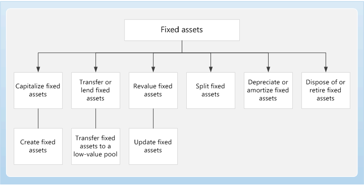

---
# required metadata

title: Fixed assets home page
description: Fixed assets are items of value, such as buildings, vehicles, land, and equipment, which are owned by an individual or organization.
author: twheeloc
manager: AnnBe
ms.date: 08/31/2017
ms.topic: index-page
ms.prod: 
ms.service: dynamics-ax-applications
ms.technology: 

# optional metadata

# ms.search.form: 
# ROBOTS: 
audience: Application User
# ms.devlang: 
ms.reviewer: twheeloc
ms.search.scope: Core, Operations
# ms.tgt_pltfrm: 
ms.custom: 21481
ms.assetid: d6bb2f19-73b9-43fa-8042-b530c75896bf
ms.search.region: Global
# ms.search.industry: 
ms.author: twheeloc
ms.search.validFrom: 2016-02-28
ms.dyn365.ops.version: AX 7.0.0

---

# Fixed assets home page

[!include[banner](../includes/banner.md)]

Fixed assets are items of value, such as buildings, vehicles, land, and equipment, which are owned by an individual or organization. 

You can set up and enter acquisition information for fixed assets, and then manage them by depreciating them and setting a 
capitalization threshold to determine depreciation. You can calculate adjustments to the fixed assets, and also dispose of them. 
When you use General ledger together with Fixed assets, you can view the current value of all fixed assets. The way in which fixed 
assets are handled must correspond to both international accounting standards and the accounting legislation in each country/region. 
Requirements might include rules for recording acquisition and disposal transactions, depreciation, lifetimes, and write-ups and 
write-downs of fixed assets. The Fixed assets functionality incorporates many of these standards and rules.

### Additional resources

#### What's new and in development

Go to the [Microsoft Dynamics 365 Roadmap](https://roadmap.dynamics.com/) to see what new features have been released and what new 
features are in development. 

#### Blogs

You can find opinions, news, and other information about Fixed assets and other solutions on the
[Microsoft Dynamics 365 blog](https://community.dynamics.com/b/msftdynamicsblog?c=Enterprise).

There are many posts about Fixed assets on the [Microsoft Dynamics AX product team blog](https://blogs.msdn.microsoft.com/dax/). 
Although some of these posts were written for the previous version of Accounts payable, the same concepts still apply, and the 
procedures are also similar in the current version.

The [Microsoft Dynamics Operations Partner Community Blog](https://community.dynamics.com/partner/b/operationspartnercommunityblog) 
gives Microsoft Dynamics Partners a single resource where they can learn what is new and trending in MBS Operations.

#### Task guides
Additional help is available as task guides inside Finance and Operations. To access task guides, click the Help button on any page.

#### Videos

Check out the how-to videos that are now available on the 
[Microsoft Dynamics 365 YouTube Channel](https://www.youtube.com/channel/UCJGCg4rB3QSs8y_1FquelBQ).

