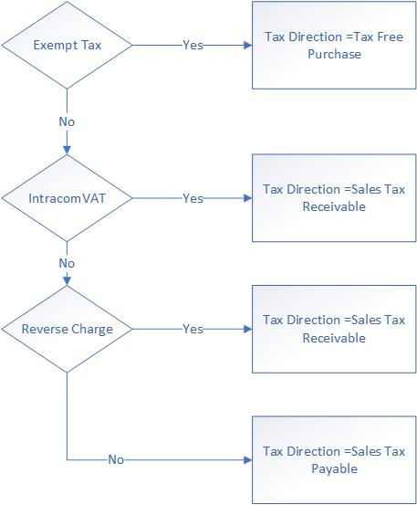

---
# required metadata

title: Sales tax calculation on general journal
description: This article explains the sales tax calculation logic of different account types (vendor, customer, ledger, project) on general journal lines.
author: EricWang
manager: Ann Beebe
ms.date: 08/14/2019
ms.topic: article
ms.prod: 
ms.service: dynamics-ax-applications
ms.technology: 

# optional metadata

ms.search.form: TaxTable
# ROBOTS: 
audience: Application User
# ms.devlang: 
ms.reviewer: roschlom
ms.search.scope: Core, Operations, Retail

# ms.tgt_pltfrm: 
ms.custom: 4464
ms.assetid: 5f89daf1-acc2-4959-b48d-91542fb6bacb
ms.search.region: Global
# ms.search.industry: 
ms.author: vstehman
ms.search.validFrom: 2019-08-14
ms.dyn365.ops.version: 10.0.6

---

# Sales Tax Calculation on General Journal

This topic explains how sales taxes are calculated for different account types (vendor, customer, ledger, project) on general journal lines.

The process can be divided into 3 steps:

1. Determine sales tax direction
2. Determine sales tax amount on the temporary sales tax form
3. Determine sales tax amount and account on the voucher

## Determine Sales Tax Direction

Sales tax direction determination depends on the account type in the voucher. It follows below rule:

1. Account Type = "Project": If a voucher contains line account type ="Project", then no matter sales tax group/item sales tax group is selected on which line, it will always follow Rule 3 "Account Type = Project" in the following article
2. Account Type = "Vendor" : If a voucher contains line account type ="Vendor" and doesn't contain line account type = "Project", then no matter sales tax group/item sales tax group is selected on which line, it will always follow Rule 1 "Account Type = Vendor" in the following article
3. Account Type = "Customer" : If a voucher contains line account type ="Customer" and doesn't contain line account type = "Project", then no matter sales tax group/item sales tax group is selected on which line, it will always follow Rule 2 "Account Type = Customer" in the following article
4. Account Type = "Ledger": If a voucher only contains line account type = "Ledger". It will follow Rule 4 "Account Type = Ledger" in the following article

### Rule 1: Account Type = Vendor

If a voucher has journal line account type ='Vendor', all the journal lines in this voucher will apply the same tax direction, the rule is:

 

### Rule 2: Account Type = Customer

If a voucher has journal line account type ='Customer', all the journal lines in this voucher will apply the same tax direction, the rule is

### Rule 3: Account Type = Project

If a voucher has journal line account type ='Project', all the journal lines in this voucher will apply the same tax direction, the rule is

### Rule 4: Account Type = Ledger

Below logic only applies when there only exists "Ledger" lines in a voucher

### Sales Tax Direction Override

User can override sales tax direction when there only exists "Ledger" lines in a voucher

***Path: General Ledger-> Chart of Accounts -> Accounts -> Main Accounts -> Legal Entity Override***

## Determine sales tax amount on temporary sales tax form

The user usually will have confusion about how the sales tax amount sign is calculated. It should be positive or negative

The generic rule of sales tax amount sign on the temporary sales tax form is

| Journal Line Amount | Sales Tax Direction  | Sales Tax Amount Sign |
| ------------------- | -------------------- | --------------------- |
| Positive            | Sales Tax Receivable | Positive              |
| Positive            | Sales Tax Payable    | Negative              |
| Negative            | Sales Tax Receivable | Negative              |
| Negative            | Sales Tax Payable    | Positive              |

There is a special rule for a voucher contains only "Project"/"Ledger" line and sales tax group/item sales tax group are selected on the "Ledger" line. This rule is controlled by feature management 'Enable independent sales tax calculation of general journal'. When this feature is disabled, “Ledger” line tax amount will use debit/credit direction of “Project” line ; When this feature is enabled, “Ledger” line tax amount will use debit/credit direction of its own

Feature enabled rule

| Journal Line Amount of Project | Sales Tax Direction  | Sales Tax Amount Sign |
| ------------------------------ | -------------------- | --------------------- |
| Positive                       | Sales Tax Receivable | Positive              |
| Negative                       | Sales Tax Receivable | Negative              |

Feature disabled rule

| Journal Line Amount of Ledger | Sales Tax Direction  | Sales Tax Amount Sign |
| ------------------------------ | -------------------- | --------------------- |
| Positive                       | Sales Tax Receivable | Positive              |
| Negative                       | Sales Tax Receivable | Negative              |

## Determine sales tax amount and account on voucher

When posting sales tax, the main account will be retrieved on the "Ledger Posting Group" profile. For sales tax direction = "Receivable", it will use "Sales Tax Receivable" account configured in the profile; For sales tax direction = "Payable", it will use "Sales Tax Payable" account configured in the profile

The generic rule is:

| Sales Tax Direction  | Sales Tax Amount Sign | Sales Tax Account      | Amount on Voucher |
| -------------------- | --------------------- | ---------------------- | ----------------- |
| Sales Tax Receivable | Positive              | Tax Receivable Account | Positive (Debit)  |
| Sales Tax Receivable | Negative              | Tax Receivable Account | Negative(Credit)  |
| Sales Tax Payable    | Positive              | Tax Payable Account    | Negative(Credit)  |
| Sales Tax Payable    | Negative              | Tax Payable Account    | Positive (Debit)  |
