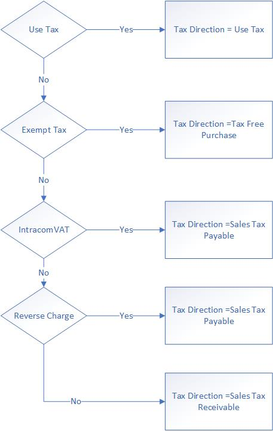
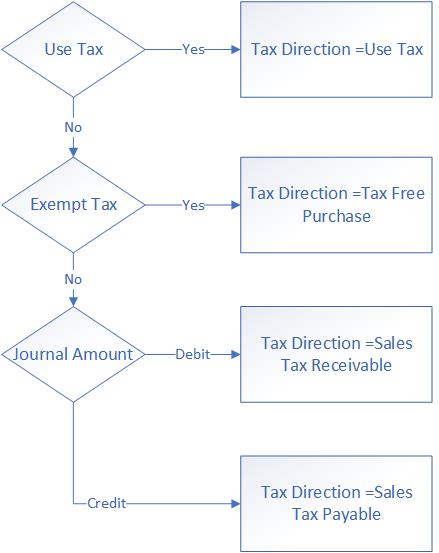

---
# required metadata

title: Sales tax calculation on general journal
description: This topic explains how sales taxes are calculated for different types of accounts, such as vendor, customer, ledger, and project, on general journal lines.
author: EricWang
manager: Ann Beebe
ms.date: 08/14/2019
ms.topic: article
ms.prod: 
ms.service: dynamics-ax-applications
ms.technology: 

# optional metadata

ms.search.form: TaxTable
# ROBOTS: 
audience: Application User
# ms.devlang: 
ms.reviewer: roschlom
ms.search.scope: Core, Operations, Retail

# ms.tgt_pltfrm: 
ms.custom: 4464
ms.assetid: 5f89daf1-acc2-4959-b48d-91542fb6bacb
ms.search.region: Global
# ms.search.industry: 
ms.author: vstehman
ms.search.validFrom: 2019-08-14
ms.dyn365.ops.version: 10.0.6

---

# Sales Tax Calculation on General Journal

This topic explains how sales taxes are calculated for different types of accounts, such as vendor, customer, ledger, and project, on general journal lines.

The process can be divided into 3 steps:

1. Determine sales tax direction
2. Determine sales tax amount on the temporary sales tax form
3. Determine sales tax amount and account on the voucher

## Determine Sales Tax Direction

Determining the sales tax direction depends on the account type in the voucher. Sales tax direction is determined by rules that govern the following combinations. 

1. **Account type = Project** If a voucher contains lines for a Project account type, the sales tax direction is determined as described in rule 3, regardless of which line sales tax group or item sales tax group is selected on.
2. **Account Type = Vendor** If a voucher contains lines for Vendor account types and doesn't contain lines for Project account types  the sales tax direction is determined as described in rule 1, regardless of which sales tax group or item sales tax group is selected on which line.
3. **Account Type = "Customer** If a voucher contains lines for Customer account types and doesn't contain lines for Project account types, the sales tax direction is determined as described in rule 2, regardelss of which sales tax group or item sales tax group is selected on which line.
4. **Account Type = "Ledger** If a voucher only contains Ledger account lines, the sales tax direction is determined as described in rule 4.

Each rule is described in greater detail as follows. 

### Rule 1: Account Type = Vendor

If a voucher has journal line account type ='Vendor', all the journal lines in this voucher will apply the same tax direction, the rule is:

 

### Rule 2: Account Type = Customer

If a voucher has journal line account type ='Customer', all the journal lines in this voucher will apply the same tax direction, the rule is

### Rule 3: Account Type = Project

If a voucher has journal line account type ='Project', all the journal lines in this voucher will apply the same tax direction, the rule is

### Rule 4: Account Type = Ledger

Below logic only applies when there only exists "Ledger" lines in a voucher

### Sales Tax Direction Override

You can override the sales tax direction when the voucher contains only Ledger lines.

***Path: General Ledger-> Chart of Accounts -> Accounts -> Main Accounts -> Legal Entity Override***

## Determine sales tax amount on temporary sales tax form

This section describes how the sales tax amount sign is calculated.

The generic rule for determining the sign of sales tax amounts on the temporary sales tax form is as follows.

| Journal Line Amount | Sales Tax Direction  | Sales Tax Amount Sign |
| ------------------- | -------------------- | --------------------- |
| Positive            | Sales Tax Receivable | Positive              |
| Positive            | Sales Tax Payable    | Negative              |
| Negative            | Sales Tax Receivable | Negative              |
| Negative            | Sales Tax Payable    | Positive              |

There is a special rule for vouchers containing only Project or Ledger lines, and sales tax group or item sales tax group that are selected on the Ledger line. This rule is controlled by Enable independent sales tax calculation feature for general journals. When this feature is not enabled, the Ledger line tax amount will use debit/credit direction of the Project line. When the feature is enabled, the Ledger line tax amount will use its own debit/credit direction, as shown in the following tables. 

Feature enabled rule

| Journal Line Amount of Project | Sales Tax Direction  | Sales Tax Amount Sign |
| ------------------------------ | -------------------- | --------------------- |
| Positive                       | Sales Tax Receivable | Positive              |
| Negative                       | Sales Tax Receivable | Negative              |

Feature disabled rule

| Journal Line Amount of Ledger | Sales Tax Direction  | Sales Tax Amount Sign |
| ------------------------------ | -------------------- | --------------------- |
| Positive                       | Sales Tax Receivable | Positive              |
| Negative                       | Sales Tax Receivable | Negative              |

## Determine sales tax amount and account on voucher

When you post sales taxes, the main account will be retrieved from the Ledger Posting Group profile. When sales taxes are receivable, the sytsem will use the Sales Tax Receivable account configured in the posting profile. For sales taxes that are payable, the sytems will use Sales Tax Payable account specified in the profile.

The generic rule is:

| Sales Tax Direction  | Sales Tax Amount Sign | Sales Tax Account      | Amount on Voucher |
| -------------------- | --------------------- | ---------------------- | ----------------- |
| Sales Tax Receivable | Positive              | Tax Receivable Account | Positive (Debit)  |
| Sales Tax Receivable | Negative              | Tax Receivable Account | Negative(Credit)  |
| Sales Tax Payable    | Positive              | Tax Payable Account    | Negative(Credit)  |
| Sales Tax Payable    | Negative              | Tax Payable Account    | Positive (Debit)  |
