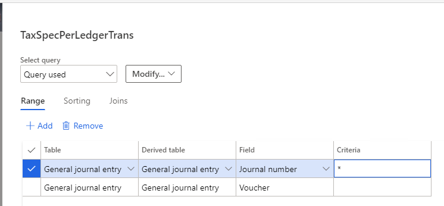

---
# required metadata

title: Sales tax specification by ledger transaction report
description: This topic explains how to use this report to view and print information about ledger transactions for which sales tax is calculated.
author: ericwang
manager: Ann Beebe
ms.date: 08/19/2019
ms.topic: article
ms.prod: 
ms.service: dynamics-ax-applications
ms.technology: 

# optional metadata

ms.search.form: TaxTable
# ROBOTS: 
audience: Application User
# ms.devlang: 
ms.reviewer: roschlom
ms.search.scope: Core, Operations

# ms.tgt_pltfrm: 
ms.custom: 4464
ms.assetid: 5f89daf1-acc2-4959-b48d-91542fb6bacb
ms.search.region: Global
# ms.search.industry: 
ms.author: vstehman
ms.search.validFrom: 2019-08-19
ms.dyn365.ops.version: 10.0.6

---

# Sales tax specification by ledger transaction report

This topic explains how to use this report to view and print information about ledger transactions for which sales tax is calculated.

## Tax Account and Non-Tax Account

This report will show tax transactions for both tax and non-tax accounts. These accounts are categorized as follows:

- The account is considered a tax account when a tax transaction is posted and the main account on the **Sales Tax** journal line is tax account, such as a sales tax payable or a sales tax receivable account.
- The account is considered a non-tax account when a tax transaction is posted and the main account on the original transaction is non-tax account, such as a revenue account or an expense account.

In this report, amounts will be displayed in the report columns **Origin**, **Sales tax receivable**, and **Sales tax payable** for non-tax accounts, and 0 will be displayed for tax accounts.

## How to filter the data on this report

When you generate this report, the following default parameters are displayed. You can use these parameters to filter the data that will be displayed on the report.

|Field|Description|
|-------|-----------------|
|Main accounts only|Shows the tax transaction date range|
|From/To Main account|Shows the main account range|
|From/To sales tax code|Shows the sales tax code range|
|Grouping|Shows that the report is grouped by ledger account or sales tax code|
|Subtotal by sales tax code|Used to display subtotals by sales tax code|
|Totals only|Used to show totals only|
|Main accounts only|Used to include only main accounts on the report|

## How to show Non-Tax Account only in this report

If you want to show only non-tax accounts in this report, set up a filter condition, such as an asterisk (\*) as follows

