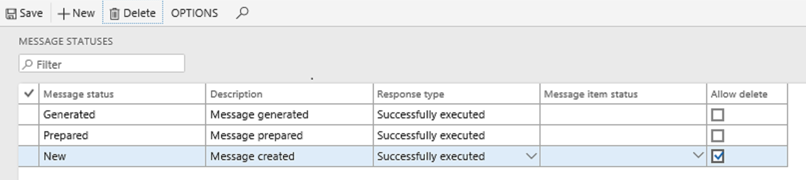
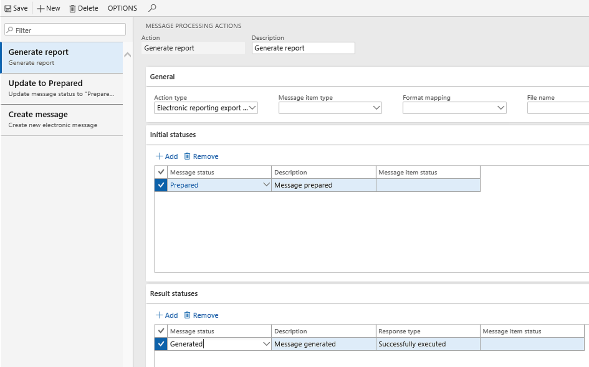
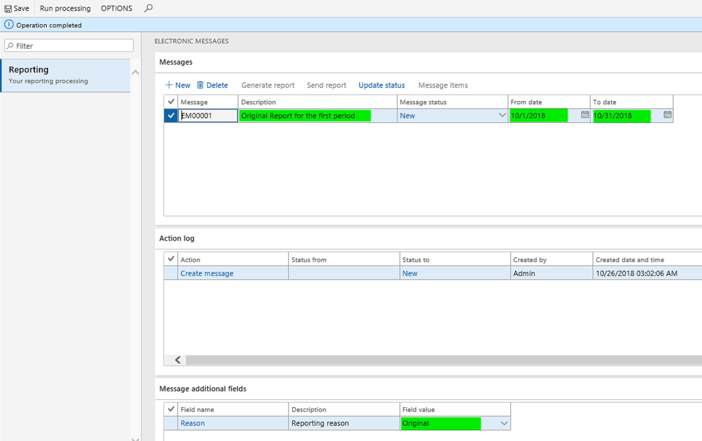
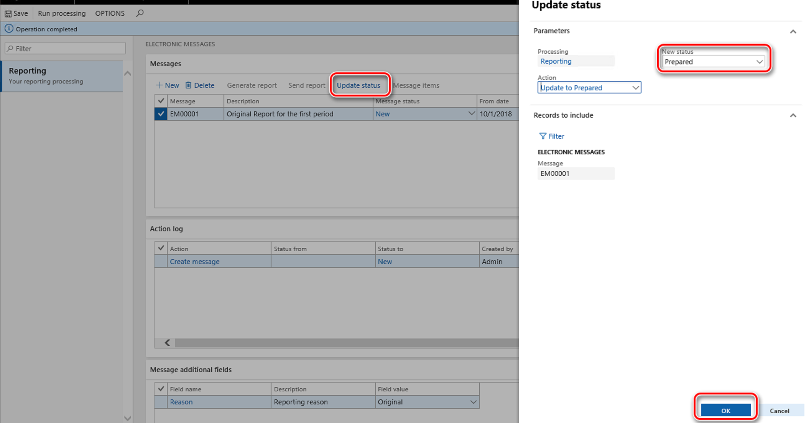

---
# required metadata

title: Electronic messaging
description: This topic provides overview and setup information for electronic messaging in Microsoft Dynamics 365 for Finance and Operations.
author: ShylaThompson
manager: AnnBe
ms.date: 10/02/2018
ms.topic: article
ms.prod: 
ms.service: dynamics-ax-applications
ms.technology: 

# optional metadata

# ms.search.form: 
# ROBOTS: 
audience: Application User
# ms.devlang: 
ms.reviewer: shylaw
ms.search.scope: Core, Operations
# ms.tgt_pltfrm: 
# ms.custom: 
ms.search.region: Global
# ms.search.industry: 
ms.author: shylaw
ms.search.validFrom: 2018-10-28
ms.dyn365.ops.version: 8.1

---

# Electronic messaging

[!include [banner](../includes/banner.md)]

This topic provides overview and setup information for electronic messaging in Microsoft Dynamics 365 for Finance and Operations.

Recently, the governments and legislative authorities of various countries and regions around the world have implemented reporting requirements for companies that are registered in those countries or regions. The purpose of the requirements is to enable data to be obtained from those companies in electronic format, directly from the systems where it was accounted, stored, and processed.

The Electronic messages functionality in Finance and Operations supports various processes for electronic interoperation between Finance and Operations and the systems that governments and legislative authorities offer for reporting, submitting, and receiving official information.

The Electronic messages functionality is integrated with the **Electronic Reporting** (ER) module. Therefore, you can set up ER formats for electronic messages. For more information, see [Electronic reporting (ER)](https://docs.microsoft.com/en-us/dynamics365/unified-operations/dev-itpro/analytics/general-electronic-reporting).

Electronic messaging is based on the following entities:

- **Electronic message** – A report or declaration that should be reported and/or transmitted internally. An example is a report that is sent to a tax office.
- **Electronic message items** – Records that should be included in the message that is reported.
- **Electronic message processing** – A chain of actions, either linked or unlinked, that should be run to collect the required data, generate reports, store data in Microsoft Azure Blob storage, transmit reports outside the system, get responses from outside the system, and update the database, based on the information that is received.

The following illustration shows the flow of data for electronic messaging.

The Electronic messages functionality supports the following scenarios:

- Manually create messages and generate reports that are based on associated exporting ER formats of various types: Microsoft Excel, XML, JavaScript Object Notation (JSON), PDF, text, and Microsoft Word.
- Automatically create and process messages that are based on information that was requested and obtained from an authority via an associated importing ER format.
- Collect and process information from a data source Finance and Operations tables as message items.
- Store additional information, and evaluate various values by calling specifically defined executable classes in relation to messages or message items.
- Aggregate information that is collected in message items, split that information by message, and generate reports that are in associated exporting ER formats.
- Transmit reports that are generated to a web service by using security information that is stored in Azure Key Vault.
- Get a response from a web service, interpret the response, and update data in Finance and Operations as appropriate.
- Store and review all the reports that are generated.
- Store and review all the log information that is related to actions that are run for a message or message item.
- Control the processing through various message statuses and message item statuses.

## Set up electronic messaging

Electronic messaging can help you maintain different electronic reporting processes for different document types. In some complex scenarios, electronic messaging is set up to have a combination of many message statuses, message items statuses, actions, additional fields, and executable classes. For these scenarios, packages of data entities are available for import. If you use these data entity packages, you should import them to a legal entity by using the Data management tool. For more information about how to use the Data management tool, see [Data management](../../dev-itpro/data-entities/data-entities-data-packages.md).

If you don't import a data entity package, you can manually set up the Electronic messages functionality. In this case, you must set up the following elements: 

- [Number sequences](#number-sequences)
- [Message item types and statuses](#message-item-types-and-statuses)
- [Message statuses](#message-statuses)
- [Additional fields](#additional-fields)
- [Executable class settings](#executable-class-settings)
- [Populate records actions](#populate-records-actions)
- [Web service settings](#web-service-settings)
- [Message processing actions](#message-processing-actions)
- [Electronic message processing](#electronic-message-processing)

The following sections provide more information about each of these elements.

### Number sequences

Set up number sequences for both messages and message items. The number sequences are used to automatically number the messages and the message items, and the numbers that are assigned will be used as unique identifiers for the messages and message items in the system. You can set up number sequences for electronic messaging on the **General ledger parameters** page (**General ledger** \> **Ledger setup** \> **General ledger parameters**).

### Message item types and statuses

Message item types identify the types of records that will be used in electronic messages. You can set up message item types on the **Message item types** page (**Tax** \> **Setup** \> **Electronic messages** \> **Message item types**).

Message item statuses identify the statuses that will apply to message items in the processing that you're setting up. You can set up message item types on the **Message item statuses** page (**Tax** \> **Setup** \> **Electronic messages** \> **Message item statuses**).

### Message statuses

Set up the message statuses that should be available in message processing. You can set up message statuses on the **Message statuses** page (**Tax** \> **Setup** \> **Electronic messages** \> **Message statuses**).

### Additional fields

The Electronic messages functionality lets you populate records from a transactional table. In this way, you can prepare the records for reporting and then report them. Sometimes, there isn't enough information in the transactional table to report a record according to the report requirements. You can fill in all the information that must be reported for a record by setting up additional fields. Additional fields can be associated with both messages and message items. You can set up additional fields on the **Additional fields** page (**Tax** \> **Setup** \> **Electronic messages** \> **Additional fields**).

The following table describes the fields on the **Additional fields** page.

| Field                | Description |
|----------------------|-------------|
| Field name           | Enter the name of an additional attribute of message items that are related to the process. This name is shown in the user interface while you work with the process. It can also be used in ER configurations that are related to the process. |
| Description          | Enter a description of the additional attribute of message items that are related to the process. |
| Field value          | Enter the field value to use in relation to a message item during reporting. |
| Field description    | Enter a description of the field value to use in relation to a message item during reporting. |
| Account type         | Some additional fields values might be limited to specific account types. Select one of the following values: **All**, **Customer**, or **Vendor**. |
| Account code         | If you selected **Customer** or **Vendor** in the **Account type** field, you can further limit the use of field values to a specific group or table. |
| Account/Group number | If you selected **Customer** or **Vendor** in the **Account type** field, and if you entered a group or table in the **Account code** field, you can enter a specific group or counteragent in this field. |
| Effective            | Specify the date when the value should start to be considered. |
| Expiration           | Specify the date when the value should stop being considered. |

### Executable class settings

An executable class is an X++ method or class that the electronic message processing can call in relation to an action if some evaluation is required for the process.

You can manually set up an executable class on the **Executable class settings** page (**Tax** \> **Setup** \> **Electronic messages** \> **Executable class settings**). Create a line, and set the following fields.

| Field                 | Description |
|-----------------------|-------------|
| Executable class      | Enter the name that will be used during the setup of a message processing action that this class is called in relation to. |
| Description           | Enter a description of the executable class. |
| Executable class name | Select an X++ executable class. |
| Execution level       | This field is set automatically, because the value should be predefined for the selected executable class. This field limits the level that related evaluation is run on. |
| Class description     | This field is set automatically, because the value should be predefined for the selected executable class. |

### Populate records actions

You use populate records actions to set up actions that add records to the **Massage items** table so that they can be added further to an **Electronic message**. For example, if your electronic message must report customer invoices you need to set up a **Populate records** action with a data source on customer invoice journal. You can set up populate records actions on the **Populate records action** page (**Tax** \> **Setup** \> **Electronic messages** \> **Populate records actions**). Create a new record for every action that should add records to the table, and set the following fields.

| Field       | Description                                                               |
|-------------|---------------------------------------------------------------------------|
| Name        | Enter a name for the action that populates records in your process.       |
| Description | Enter a description of the action that populates records in your process. |

On the **Datasources setup** FastTab, add a line for every data source that is used for the process, and set the following fields.

| Field                  | Description |
|------------------------|-------------|
| Name                   | Enter a name for the data source. |
| Message item type      | Select the type of message item that should be used when records are created for the data source. |
| Account type           | Select the type of account that should be associated with records from the data source. |
| Master table name      | Select the table in Finance and Operations that should be a data source. |
| Document number field  | Select the field that the document number should be taken from in the selected table. |
| Document date field    | Select the field that the document date should be taken from in the selected table. |
| Document account field | Select the field that the document account should be taken from in the selected table. |
| User query             | If this check box is selected, you can set up a query by selecting **Edit query** above the grid. Otherwise, all the records will be populated from the data source. |

### Web service settings

You use web service settings to set up direct data transmission to a web service. You can set up web service settings on the **Web service settings** page (**Tax** \> **Setup** \> **Electronic messages** \> **Web service settings**).

The following table describes the fields on the **Web service settings** page.

| Field                   | Description                                                                                                     |
|-------------------------|-----------------------------------------------------------------------------------------------------------------|
| Web service             | Enter a name for the web service.                                                                               |
| Description             | Enter a description of the web service.                                                                         |
| Internet address        | Enter the internet address of the web service.                                                                  |
| Certificate             | Select a Key Vault certificate that has previously been set up. |
| The response type – XML | Set this option to **Yes** if the response type is XML.                                                         |
| Request method          | Specify the method of the request. HTTP defines a set of request methods to indicate the desired action to be performed for a given resource. It can be 'GET', 'POST' or other HTTP method.                                                                             |
| Request headers         | Specify request headers. A request header is an HTTP header that can be used in an HTTP request, and that doesn't relate to the content of the message.                                                                                        |
| Accept encoding         | Specify the Accept-Encoding. The Accept-Encoding request HTTP header advertises which content encoding, usually a compression algorithm, the client is able to understand.                                                                                    |
| Content type            | Specify the content type. The Content-Type entity header is used to indicate the media type of the resource.                                                                                      |

### Message processing actions

You use message processing actions to create actions for your processes and to set up their parameters. You can set up message processing actions on the **Message processing actions** page (**Tax** \> **Setup** \> **Electronic messages** \> **Message processing actions**).

The following tables describe the fields on the **Message processing actions** page.

#### General FastTab

| Field                   | Description |
|-------------------------|-------------|
| Action type             | Select the type of action. For information about the available options, see the [Action types](#action-types) section. |
| Format mapping          | Select the ER format that should be called for the action. This field is available only for actions of the **Electronic reporting export**, **Electronic reporting import**, and **Electronic reporting export message** types. |
| Message item type       | Select the type of records that the action should be evaluated for. This field is available for actions of the **Message item execution level**, **Electronic reporting export**, and **Electronic reporting import** types, and also some other types. If you leave this field blank, all the message item types that are defined for the message processing are evaluated. |
| Executable class        | Select executable class settings that were previously created. This field is available only for actions of the **Message item execution level** and **Message item execution level** types. |
| Populate records action | Select a populate records action that was previously set up. This field is available only for actions of the **Populate records** type. |

##### Message processing action types

The following options are available in the **Action type** field:

- **Populate records** – A **Populate records** action must be set up previously. Associate it with an action of "Populate records" type to let included it to a processing. It's assumed that this action type is used for the first action in message processing. Therefore, only a result status can be set up for an action of this type. An initial status can't be set up.
- **Create message** – Use this type to let users manually create messages on the **Electronic message** page. An initial status can't be set up for an action of this type.
- **Message execution level** – Use this type to set up an executable class that should be evaluated at the message level.
- **Message item execution level** – Use this type to set up an executable class that should be evaluated at the message item level.
- **Electronic reporting export** – Use this type for actions that should generate a report that is based on an exporting ER configuration at the message item level.
- **Electronic reporting export message** – Use this type for actions that should generate a report that is based on an exporting ER configuration at the message level (for example, when a message doesn't have any message items).
- **Electronic reporting import** – Use this type for actions that should generate a report that is based on an importing ER configuration.
- **Message level user processing** – Use this type for actions that assume some manual actions by the user. For example, the user might update the status of messages.
- **User processing** – Use this type for actions that assume some manual action by the user. For example, the user might update the status of messages items.
- **Web service** – Use this type for actions that should transmit a generated report to a web service. This action type isn't used for Italian Purchase and Sales Invoices Communication reporting.

- **Request verification** – Use this type to request verification from a server.

#### Initial statuses FastTab

> [!NOTE]
> The **Initial statuses** FastTab isn't available for actions that have an initial type of **Populate records** or **Create message**.

| Field               | Description                                                                                         |
|---------------------|-----------------------------------------------------------------------------------------------------|
| Message item status | Select the message item status that the selected message processing action should be evaluated for. |
| Description         | A description of the selected message item status.                                                  |

#### Result statuses FastTab

| Field               | Description |
|---------------------|-------------|
| Message status      | Select the message statuses that the selected message processing action should be evaluated for. This field is available only for message processing actions that are evaluated at the message level. For example, it's available for actions of the **Electronic reporting export** and **Electronic reporting import** types. It isn't available for actions of the **User processing** and **Message item execution level** types. |
| Description         | A description of the selected message status. |
| Response type       | The response type of the selected message status. |
| Message item status | Select the resulting statuses that should be available after the selected message processing action is evaluated. This field is available only for message processing actions that are evaluated at the message item level. For example, it's available for actions of the **User processing** and **Message item execution level** types. For message processing actions that are evaluated at the message level, this field shows the message item status that was set up for the selected message status. |

### Electronic message processing

Electronic message processing is a basic concept of the Electronic messages functionality. It aggregates actions that should be evaluated for the electronic message. The actions can be linked via an initial status and a result status. Alternatively, actions of the **User processing** type can be started independently. On the **Electronic message processing** page (**Tax** \> **Setup** \> **Electronic messages** \> **Electronic message processing**), you can also select additional fields that should be supported for the processing.

The **Action** FastTab lets you add predefined actions to the processing. You can specify whether an action must be run separately (user actions must be run separately only), or whether it can be initiated by the processing.

The **Message item additional fields** FastTab lets you add predefined additional fields that are related to message items. You must add additional fields for each type of message item that the fields are related to.

The **Message additional fields** FastTab lets you add predefined additional fields that are related to messages.

The **Security roles** FastTab lets you set up the security roles that are predefined in the system for specific processing. Users who have a specific role will see only processing that is defined for that role.

The **Batch** FastTab lets you set up processing to work in a batch regime.

## Work with Electronic messages functionality

If you're working at the message level, the **Electronic messages** page (**Tax** \> **Inquiries and reports** \> **Electronic messages** \> **Electronic messages**) is more useful. If you're operating at the data collection (message item) level, the **Electronic message items** page (**Tax** \> **Inquires and reports** \> **Electronic messages** \> **Electronic message items**) is more useful.

### Electronic messages 

The **Electronic messages** page presents the processing that is available to you, based on your role. Security roles are associated with processing in the setup of that processing. For each processing that is available to you, the page shows electronic messages and information that is related to them.

The **Messages** FastTab shows electronic messages for the selected processing. Depending on the status of the selected message and predefined processing, you can run some actions by selecting the buttons above the grid:

- **New** – This button is associated with actions of the **Create message** type.
- **Delete** – This button is available if the **Allow delete** check box is selected for the current status of the selected message.
- **Generate report** – This button is associated with actions of the **Electronic reporting export message** type.
- **Send report** – This button is associated with actions of the **Web service** type.
- **Update status** – This button is associated with actions of the **Message level user processing** type.
- **Message items** – Open the **Electronic message items** page.

The **Action log** FastTab shows information about all the actions that have been run for the selected message.

The **Message additional fields** FastTab shows all the additional fields that are defined for messages in the processing setup. It also shows the values of those additional fields.

The **Message items** FastTab shows all the message items that are related to the selected message.

You can review all the attachments for the selected message. These attachments are reports that have already been generated and received. Select the message to review attachments for, and then select the **Attachment** button on the Action Pane.

The **Attachments** page shows all the attachments that are related to the message. To view a file, select it in the list on the left, and then select **Open** on the Action Pane.

To review an attachment that is related to a specific action that was previously run for a message, select the message on the **Electronic messages** page, and then, on **Action log** FastTab, select the action. Then select the **Attachment** button on the Action Pane.

You can also run either the whole processing or just a specific action by selecting **Run processing** on the Action Pane.

### Electronic message items 

**Electronic message items** page presents all message items and a log of the actions that have been run for each message item. It also shows the additional fields that are defined for the message items, and the values of those additional fields.

The following table describes the fields on the **Message items** tab.

<table>
<thead>
<tr>
<th>Field</th>
<th>Description</th>
</tr>
</thead>
<tbody>
<tr>
<td>Processing</td>
<td>The name of the processing that was used to create the message item.</td>
</tr>
<tr>
<td>Message item</td>
<td>The ID of the message item. This ID is assigned automatically, based on the <strong>Message item</strong> number sequence that is defined on the <strong>General ledger parameters</strong> page.</td>
</tr>
<tr>
<td>Message item date</td>
<td>The date when the message item was created.</td>
</tr>
<tr>
<td>Message item type</td>
<td>The type of message item. Several types of messages items can be set up for the same processing (for example, <strong>Incoming invoices</strong> and <strong>Outgoing invoices</strong>). This field can be filled in automatically only when an invoice is added to the Message items table.</td>
</tr>
<tr>
<td>Message item status</td>
<td>The actual status of the message item. The available statuses vary, depending on the type of message item. Here are some examples:
<ul>
<li><strong>Populated</strong> – A record was added to the Message items table.</li>
<li><strong>Evaluated</strong> – Additional attributes were calculated for the message item.</li>
<li><strong>Reported</strong> – The message item was successfully added to a report.</li>
<li><strong>Excluded</strong> – This status can be useful if you must exclude some message items from a report before it's exported.</li>
</ul>
</td>
</tr>
<tr>
<td>Transmission date</td>
<td>For processing that automatically transmits a generated report outside the system, the date when the message item was transmitted.</td>
</tr>
<tr>
<td>Document number</td>
<td>This field is filled in automatically, based on the setup of the populate records action. This field can be filled in automatically only when an invoice is added to the Message items table.</td>
</tr>
<tr>
<td>Account number</td>
<td>The account number of a customer or vendor (or another field value, depending on the field that is defined on the populate records action). This field can be filled in automatically only when an invoice is added to the Message items table.</td>
</tr>
<tr>
<td>Message</td>
<td>The number of the message. This number is assigned automatically, based on the <strong>Message</strong> number sequence that is defined on the <strong>General ledger parameters</strong> page.</td>
</tr>
<tr>
<td>Message status</td>
<td>The actual status of the electronic message.</td>
</tr>
<tr>
<td>Next action</td>
<td>The next actions that can be initiated for the current status of the message item.</td>
</tr>
</tbody>
</table>

The **Additional fields** tab shows the additional fields for the selected message item, and their values.

#### Run processing

Select **Run processing** on the Action Pane to run the processing for message items. To run a specific action, in the **Run processing** dialog box, set the **Select action** option to **Yes**, and then select an action. To run the whole processing, leave the **Select action** option set to **No**.

#### Generate report

Select **Generate report** on the Action Pane to generate a report. This button is associated with actions of the **Electronic reporting export** type.

#### Update status

Select **Update status** on the Action Pane to update the status of one or more message items. In the **Update status** dialog box, use the **Records to include** FastTab to select message items for update. Make sure that you correctly define the selection criteria, because message items statuses will be updated according to these criteria, the initial status of the selected action, and the **New status** value that you set. After a status update is completed, it will be difficult to determine which items were just updated. Therefore, it will be difficult to roll back status updates.

#### Electronic messages

Select **Electronic message** on the Action Pane to review an electronic message that is related to the selected message item.

You can also review all the files that correspond to the message item. Select the **Message** field of the message item, or select **Electronic message** on the Action Pane. On the **Electronic message** page, select the message to review a report for, and then select the **Attachment** button on the Action Pane.

The **Attachments** page shows all the attachments that are related to the message. To view a file, select it in the list on the left, and then select **Open** on the Action Pane.

#### Original document

Select **Original document** on the Action Pane to open the original document for the selected message item.

## Example

If you have created and mapped to data source(s) and completed your ER format, you can run it using the Electronic reporting workspace to get a generated report. You can then save the generated report locally. If you want to control the following aspects of the reporting process, you need to set up electronic messaging processing:

- log information about who generated the report
- log when the report was generated
- save the reports generated for the previous period(s)

This section provides an example of how you might set up the Electronic messages functionality to build a reporting process.

### Set up and run processing to call a simple ER exporting format to generate an Excel report

This paragraph proposes an example of how you may set up Electronic messaging to run generation of a report based on a ER Excel exporting format. To follow ER Excel exporting format is already created, mapped to data source(s) and completed. It is also supposed that a number sequence for Electronic messages is set up.
Building a processing, it is helpful to define first the processing actions and statuses which are going to be set up. For this example, the processing would look like:

#### Create message statuses

1. Go to **Tax > Setup > Electronic messages > Message statuses**.
2. Create the following message statuses:
  -	New
  -	Prepared
  -	Generated

3. Select the **Allow delete** check box to let the user delete messages in the “New” status.

#### Create additional fields

1. Go to **Tax > Setup > Electronic messages > Additional fields**.
2. Add an Additional field and its values, for example:

3. Select the **User edit** check box to let users edit the field.

#### Create message processing actions
For this example, you'll create the following actions:
  - **Create message**
  - **Update to Prepared**
  - **Generate report**
  - **Update to initial status** (Optional) 

1. Go to **Tax > Setup > Electronic messages > Message processing actions**.
2. Create an action called **Create message** with the following fields completed:
    - Action type = **Create message** 
3. Create an action called **Update to Prepared** with the following fields completed:
    - Action type = **Message level user processing**
    - Initial statuses = **New**
    - Result statuses = **Prepared** with a **Response type** = Successfully executed.
4. Create an action called **Generate report**.
    - Action type = Electronic reporting export
    - Format mapping - Select the ER exporting format. Your options are: **Excel**, **XML**, **JSON**, **Text**, **other**.
    - Initial statuses
    - Result statuses
  
  
  
5. (Optional) To allow the user to re-generate a report several times, you can set up an **Update to initial status** action with the following fields completed:
    - Action type = Message level user processing
    - Initial statuses
    - Result statuses

#### Electronic message processing
In our example all the actions should be set up to run separately as it is supposed that each action will be initialized by user.
1. Go to **Tax > Setup > Electronic messages > Electronic message processing**.
2. Add one record for your processing and add all previously defined actions and an additional field.
3. (Optional) Expand the **Security roles** FastTab to define security roles for your processing to restrict access to a specific reporting. 
4. Go to **Tax > Inquires and reports > Electronic messages > Electronic messages** and click **New** to create a new message. At this point, you can add dates, a description and update the value of the Additional field (if needed):

Action log is filled in automatically, so all the actions done with the message are logged.
Now you may either delete or update message status. To update message status, click on “Update status” button and select new status as “Prepared”:

As a result, the message status is updated to “Prepared” and now you may generate the report. To do so, click on the “Generate report” button. The report will be generated, Message status and Action log updated. You may review generated report by the Attachment button on the Action pane:
Pic.13

