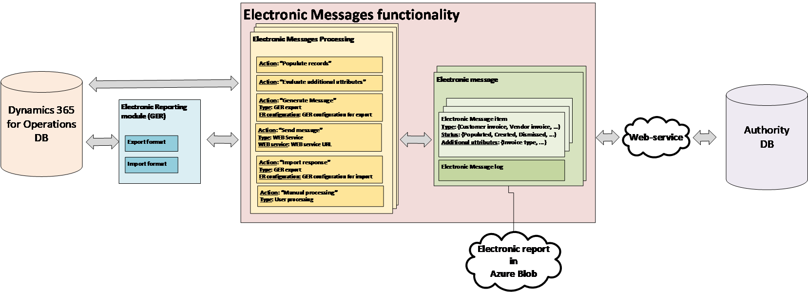

---
# required metadata

title: Electronic messaging
description: This article describes accruals, and provides information about how to set them up and create transactions.
author: ShylaThompson
manager: AnnBe
ms.date: 10/02/2018
ms.topic: article
ms.prod: 
ms.service: dynamics-ax-applications
ms.technology: 

# optional metadata

# ms.search.form: 
# ROBOTS: 
audience: Application User
# ms.devlang: 
ms.reviewer: shylaw
ms.search.scope: Core, Operations
# ms.tgt_pltfrm: 
# ms.custom: 
ms.search.region: Global
# ms.search.industry: 
ms.author: shylaw
ms.search.validFrom: 2018-10-28
ms.dyn365.ops.version: 8.1

---

# Electronic messaging

[!include [banner](../includes/banner.md)]

This topic provides an overview and setup information for electronic messaging in Microsoft Dynamics 365 for Finance and Operations. Recent trends in requirements addressed to the reporting sphere from Government and legislative authority of different countries all over the world are aimed at implementing the possibility of obtaining data from companies registered in the country in electronic format directly from the systems were this data is
accounted, stored and processed. Electronic Messages functionality (EM) supports different processes of electronical interoperation between Microsoft Dynamics 365 for Finance and Operations and systems offered by Governments and legislative authorities for reporting, submission and receiving official information.

EM integrates with the Electronic Reporting (ER) module which allows you to set up electronic report formats. To learn about electronic reporting, see <https://docs.microsoft.com/en-us/dynamics365/unified-operations/dev-itpro/analytics/general-electronic-reporting>.

Electronic messaging is based on the following entities:

-   **Electronic Message** – a report or declaration which should be reported and/or transmitted internally. For example, a report that is sent to a tax office.

-   **Electronic Message items** – records which should be included in the message to be reported.

-   **Electronic message processing** – chain of linked among each other or not linked **Actions** which should be executed to collect necessary data, generate report(s), store it in Azure blob, transmit report to the outside of the system, get a response from outside of the system, update database respectively to the information received.

**Electronic messages** supports the following scenarios:

-   Manually create messages and generate reports basing on associated exported GER format of different types (Microsoft Excel, XML, JSON, PDF, TEXT, Microsoft Word)

-   Automatically create and process messages based on information that was requested and obtained from an authority via an associated importing GER format.

-   Collect and process information from a data source AX tables as Message items.

-   Store additional information and evaluate different values via calling specifically defined executable classes in relation with Messages or Message
    items.

-   Aggregate information collected in Message items split it by Messages, generate report(s) basing on exporting GER formats.

-   Transmit generated reports to a web-service using security information stored in Key Vault.

-   Get response from a web-service, interpret it and update data in AX respectively.

-   Store and review all the generated reports.

-   Store and review all the log information related to actions executed for a Message or Message item.

-   Control the processing basing on different Message statuses and Message items statuses.

## Set up electronic messaging

Electronic messaging can help you maintain different processes of electronic reporting of different document types. For some of the complex scenarios where electronic messaging is set up to have a combination of many different Message statuses, Message items statuses, Actions, Additional fields, and Executable classes, packages of data entities are available for you to import. 

These packages, if you use them, should be imported to a Legal entity using the Data management tool. To know more about how to use Data management tool see, [Data management](../../dev-itpro/data-entities/data-entities-data-packages.md).

If you don't import a data entities package, you can set up **Electronic Messages** functionality manually. To do this, you must set up the following: 

-   [Number sequences](#number-sequences)
-   [Message item types and statuses](#message-item-types-and-statuses)
-   [Message statuses](#message-statuses)
-   [Additional fields](#additional-fields)
-   [Executable class settings](#executable-class-settings)
-   [Populate records actions](#populate-records-actions)
-   [Web services settings](#web-service-settings)
-   [Message processing actions](#message-processing-actions)
-   [Electronic message processing](#electronic-message-processing)

### Number sequences

Set up number sequences for Messages and for Message items.  The number sequences will be used for auto-numbering the messages and the message items and the numbers will be used as the unique identifiers for messages and message items in the table. You can set up number sequences for electronic messaging on the **General Ledger parameters** page.

### Message item types and statuses

Message item types identify the types of records that will be used in Electronic messages. You can set up message item types on the **Message item types** page (**Tax** \> **Setup** \> **Electronic messages** \> **Message item types**).

Message item statuses identify which statuses will be applicable for Message items in the processing you are setting up. You can set up message item types on the **Message item statuses** page (**Tax** \> **Setup** \> **Electronic messages** \> **Message item statuses**).

### Message statuses

Set up the message statuses that you want to be available in message processing. You can set up message statuses on the **Message statuses** page (**Tax** \> **Setup** \> **Electronic messages** \> **Message statuses**).

###  Additional fields

Electronic messages functionality lets you populate records from a transactional table to prepare for reporting and report them. Sometimes there is not enough information in the transactional table to report a record according to report
requirements. You can fill in all the necessary information for the reporting information in relation with a record to be reported, set up additional fields. To do so, open **Tax** \> **Setup** \> **Electronic messages** \>
**Additional fields**. Additional fields may be associated with Messages and/or Message items.

Fields description:

| **Field name**                            | **Field description**                                                                                                                                                                                                            |
|-------------------------------------------|----------------------------------------------------------------------------------------------------------------------------------------------------------------------------------------------------------------------------------|
| Message item additional field name        | Set up a name of an additional attribute of Message items related to the process. This name will be shown in user interface during working with the process and may also be in use in related to the process GER configurations. |
| Message item additional field description | Set up a description of an additional attribute of Message items related to the process                                                                                                                                          |
| Field value                               | Enter a value of a field to be used in relation with a Message item in reporting.                                                                                                                                                |
| Field value description                   | Enter a description of a value of a field to be used in relation with a Message item in reporting.                                                                                                                               |
| Account type                              | Some additional fields values may be restricted for particular Account types. Set up one of the following: All, Customer, Vendor.                                                                                                |
| Account code                              | If you selected Customer or Vendor in the Account type field, you may restrict additional fields value usage by particular group or table.                                                                                       |
| Account/Group number                      | If you selected Customer or Vendor in the Account type field and group or table in Account code filed, you may specify particular group or counteragent in this field.                                                           |
| Effective                                 | Set up a date from which the value should be taken into consideration.                                                                                                                                                           |
| Expiration                                | Set up a date before which the value should be taken into consideration.                                                                                                                                                         |

### Executable class settings

**Executable class** is an X++ method or class which can be called by the Electronic messages processing in relation with an action if some evaluation is needed for the process.

To manually set it up, open **Tax** \> **Setup** \> **Electronic messages** \> **Executable class settings,** create a line and fill in:

| **Field name**            | **Field description**                                                                                                                                                               |
|---------------------------|-------------------------------------------------------------------------------------------------------------------------------------------------------------------------------------|
| **Executable class**      | Set up a name which will be used during setting up of an Electronic message processing action related respective to call this class.                                                |
| **Description**           | Set up a description of an Executable class                                                                                                                                         |
| **Executable class name** | Select an X++ **Executable class**                                                                                                                                                  |
| **Executable level**      | The value will be filled in automatically as it should be predefined for the **Executable class.** The field’s value restricts on with level related evaluation should be executed. |
| **Class description**     | The value will be filled in automatically as it should be predefined for the **Executable class.**                                                                                  |

### Populate records actions

**Populate records actions** should be used to set up actions which adds records to be sent to the Electronic message items table. To do so, open **Tax** \> **Setup** \> **Electronic messages** \> **Populate records actions** and create a new record for each action which should add records to the table:

| **Field name**                          | **Field description**                                                               |
|-----------------------------------------|-------------------------------------------------------------------------------------|
| **Populate records action name**        | Identify a name for to be used for action which populated records in your process   |
| **Populate records action description** | Add a description for to be used for action which populated records in your process |

Add as many lines on the **Datasources setup** FastTab as more data sources are used for the process:

| **Field name**             | **Field description**                                                                                                              |
|----------------------------|------------------------------------------------------------------------------------------------------------------------------------|
| **Name**                   | Specify a name for a data source.                                                                                                  |
| **Message item type**      | Specify message item type which should be used on record creation for the data source.                                             |
| **Account type**           | Specify Account type which should be associated with record form the created data source.                                          |
| **Master table name**      | Specify name of the table in AX which should be a data source.                                                                     |
| **Document number field**  | Specify field name in the selected table from which a Document number should be taken.                                             |
| **Document date field**    | Specify field name in the selected table from which a Document date should be taken.                                               |
| **Document account field** | Specify field name in the selected table from which a Document account should be taken.                                            |
| **Use query**              | If selected? Set up a query by Edit query button on the fast tab. Otherwise all the record will be populated from the data source. |

### Web services settings

**Web services settings** used to setup data transmission directly to a web
service.

| **Field name**              | **Field description**                                                                                               |
|-----------------------------|---------------------------------------------------------------------------------------------------------------------|
| **Web services**            | Specify a name for the Web services.                                                                                |
| **Description**             | Specify a description of the Web service.                                                                           |
| **Internet address**        | Specify an internet address of the Web-service                                                                      |
| **Key Vault certificate**   | Select a previously setup Key Vault certificate. Know more about how to set up Key Vault certificate referring: ??? |
| **The response type - XML** | Mark the check box if the response type is XML                                                                      |
| **Request method**          | Specify the method of the request                                                                                   |
| **Request headers**         | Specify request headers                                                                                             |
| **Accept encoding**         | Specify the accept encoding                                                                                         |
| **Content type**            | Specify the content type                                                                                            |

### Message processing actions

Use **Message processing action** to create actions for you processing and set up their parameters.

**General** fields description:

| **Field name**              | **Field description**  |
|-----------------------------|----------------------------|
| **Action type**             | Set up type of action. For more information, see [Action types](#action-types).|
| **Format mapping**          | This parameter is available for actions of **Electronic reporting export, Electronic reporting import, Electronic reporting export message.** Select a GER format which should be called for the action.|
| **Message item type**       | This parameter is available for actions of **Message item execution level, Electronic reporting export, Electronic reporting import** and some other types of action. Using it you may identify for records of which type the action should be evaluated. If you don’t specify particular message item type in this field, all the message item types of defined for the processing will be evaluated. |
| **Executable class**        | This parameter is available for actions of types **Message item execution level** and **Message item execution level**. In this field, you may specify previously created **Executable class settings**. |
| **Populate records action** | This parameter is available for actions of type **Populate records**. Use this parameter to associate a previously set up **Populate records action**.|

#### Action types
- **Populate records** – use this type of action to associate a previously set up **Populate records action**. It is supposed that this action type is used for an initial action of a processing thus only result status may be setup for an action of this type.

- **Create message** – use this type of action to let user manually create Messages in Electronic message form.

- **Message execution level** – use this type to set up an executable class which should be evaluated on Electronic message level.

- **Message item execution level** – use this action type to set up an execution class evaluation on Message item level.

- **Electronic reporting export** – use this type for actions which should generate a report based on export GER configuration.

- **Electronic reporting import** – use this type for actions which should generate a report based on import GER configuration.

- **Message level user processing** – use this type for actions which suppose some manual actions by user. For example, update status of messages.

- **User processing** – use this type for actions which suppose some manual actions by user. For example, update status of messages items.

- **Web service** – use this type for actions which should provide transmission of a generated report to a web-service. For Italian Purchase and Sales Invoices Communication reporting this type of action is not used.

- **Electronic reporting export message** - use this type for actions which should generate a report based on export GER configuration on a Message level (for example when a Message doesn’t have any Message items).

- **Request verification** – use this type of action to request verification from a server.

#### Initial statuses
The **Initial status** FastTab is not available for actions of initial type: **Populate records, Create message**.

| **Field name**          | **Description**                                                                           |
|-------------------------|-------------------------------------------------------------------------------------------------|
| **Message item status** | Specify Message item statuses for which selected Message processing action should be evaluated. |
| **Description**         | This field shows a description specified for the selected Message item status.                  |

#### Result statuses

| **Field name**          | **Description** |
|-------------------------|--------------------------|
| **Message status**      | This filed is available for Message processing actions which evaluating on Message level. For example, it is available for action types: **Electronic reporting export**, **Electronic reporting import;** and not available for action types: **User processing**, **Message item execution level**.|
| **Description**         | This field shows a description specified for the selected Message status.|
| **Response type**       | This field shows a Response type specified for the selected Message status. |
| **Message item status** | You may specify in this filed Resulting statuses which should be available after the selected action is evaluated for Message processing actions which evaluating on Message item level. For example, for action types: **User processing**, **Message item execution level**. For Message processing actions which evaluate on Message level this field shows Message item status set up for the selected Message status. |

### Electronic message processing

**Electronic message processing** is a basic concept of the **Electronic messages** functionality. It aggregates actions which should be evaluated for the Electronic message. Where actions can be linked via initial and result status or started independently (User processing action type). On **Electronic message processing** page user may also select Additional fields which should be supported for the processing.

**Action fast tab** serves to allow user to add predefined actions to the processing. It is possible to define if an action must be run separately (for user actions it is mandatory) or can be initiated by processing.

**Message item additional fields fast tab** serves to allow user to add predefined Additional fields which will relate to Message items. You need to add Additional fields for each type Message items for which it is applicable.

**Message additional fields fast tab** serves to allow user to add predefined Additional fields which will relate to Messages.

**Security roles fast tab** serves to set up security roles predefined in the system for a specific processing. A user within a role will see processing defined for this role only.

**Batch fast tab** serves to set up a processing to work in batch regime.

## Work with Electronic Messages functionality

If a user operates on message level, then you would use the **Electronic messages** page (**Tax** \> **Inquires and reports** \> **Electronic messages** \> **Electronic messages**) would be more useful. If you're operating on data collection (Message items) level, then the **Electronic message items** page (**Tax** \> **Inquires and reports** \> **Electronic messages** \> **Electronic message items**) will be more useful.

### Electronic messages 

**Electronic messages** form presents processing available to user according to his (her) role associated in the setup of the processing. For each of the processing available for user, the form shows Electronic messages and related to them information.

**Messages fast tab** shows Electronic messages for the selected processing. Depending on status of the selected message and predefined processing, user may run some actions by clicking on “fast” buttons of the grid:

-   **New** – is associated with actions of “Create message” type.
-   **Delete** - is active when for the current status of the selected message, “Allow delete” parameter is marked.
-   **Generate report** – is associated with actions of “Electronic reporting export message” type.
-   **Send report** – is associated with actions of “Web service” type.
-   **Update status** – is associated with actions of “Message level user processing” type.
-   **Message items** – opens Electronic message items form.

**Action log fast tab** shows information about all the actions executed for the selected message.

**Message additional fields fast tab** shows all the defined for messages in processing setup additional fields and their values.

**Message items fast tab** shows all message items related to the selected message.

User may review all the attachments (already generated and received reports) for the selected message. To do so, select a message for which you want to review a report and click on **Attachment** button on the **Main menu**:

Thus, you will see a form where you may review all the attachments related to the message. To see the file, select a file in the list on the left side and click on **Open** button on the **Main menu**:

If you need to review an attachment related to a specific action previously executed with a message, select this message, open **Action log fast tab,** select an action and click on Attachment button as it is shown before.

It is also possible to run the whole processing or by action using generic “Run processing” button on Action pane.

### Electronic message items 

**Electronic message items** form presents all message items, related to each of them Action log and values of Message items addition fields.

**Message items** fields description:

| **Field name**          | **Field description**                                                                                                                                                                                                                             |
|-------------------------|---------------------------------------------------------------------------------------------------------------------------------------------------------------------------------------------------------------------------------------------------|
| **Processing**          | The field shows the name of the processing using which the message item was created.                                                                                                                                                              |
| **Message item**        | The ID of a message item. This ID is assigned automatically according to a **Message item** number sequence in **General ledger parameters.**                                                                                                     |
| **Message item date**   | Date when an electronic message item is created.                                                                                                                                                                                                  |
| **Message item type**   | Identifies type of a message item. Which same processing there may be setup several types of message items (for example: Incoming invoices, Outgoing invoices). This field can be filled in automatically only on adding an invoice to the table. |
| **Message item status** | The field reflects the actual status of the message item in correspondence with its Type. For example:                                                                                                                                            |
| **Transmission date**   | For a processing which implements an automatical transmission of a generated report outside of the system Date of transmission field shows the date when a message item was transmitted.                                                          |
| **Document number**     | This field is filled in automatically basing on the setup in Populate records action. This field can be filled in automatically only on adding an invoice to the register.                                                                        |
| **Account number**      | Account number of a Customer or Vendor (or another fields value depending on field defined in Populate records action). This field can be filled in automatically only on adding an invoice to the register.                                      |
| **Message**             | The number of a message. This number is assigned automatically according to a **Message** number sequence in **General ledger parameters.**                                                                                                       |
| **Message status**      | The field shows actual status of an Electronic message.                                                                                                                                                                                           |
| **Next action**         | This field shows next actions which can be initiated for the current status of a message item.                                                                                                                                                    |

-   **Populated -** When a record was added to the **Message items** table.

-   **Evaluated –** When additional attributes for a message item were calculated.

-   **Reported -** When a message item was successfully added to a report.

-   **Excluded –** This can be useful if a user needs to exclude some message items from a report before it will be exported.

Additional fields fast tab shows additional fields and their values for selected Message item.

Run processing

Click **Run processing** button on Action pane to start execution of **Message items**. Mark **Select action** parameter and select an action if you want to perform a particular action, or leave **Select action** parameter unmarked if you want to start the whole process.

Generate report

This button is associated with actions of “Electronic reporting export” type. Use this function to generate a report.

Update status

Use this function to update status for one or several message items. Use “Records to include” to select Message items for update. Make sure that you correctly define the criteria as Message items statuses will be updated according these criteria, defined for the selected Action initial statuses and selected “New status”. After update is completed it will be difficult to differentiate which items were just updated and roll their statuses back if
needed.

Electronic messages

Use this function to review an **Electronic message** related to the selected message item.

You may also review all the files corresponding to the message item. To do so, click on **Message** field of the message item or **Electronic message** button on the **Menu**. On the **Electronic message** form select a message you for which you want to review a report and click on **Attachment** button on the
**Main menu**:

Thus, you will see a form where you may review all the attachments related to the message. To see the file, select a file in the list and click **Open** on the **Main menu**:

Original document

Use this button to open original document for the selected message item.

## Examples

This section introduces some simple examples of how you might set up EM to build a reporting process:

1.  Set up and run a processing to call a simple GER format to generate an MS
    Excel report.

2.  Add an action to an existing processing to call a simple GER format to
    generate an MS Excel report.
