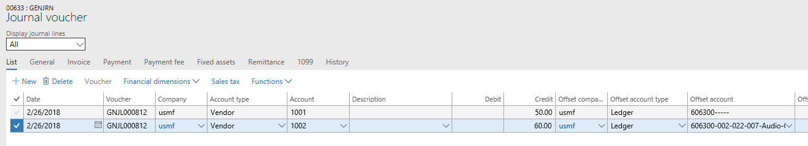
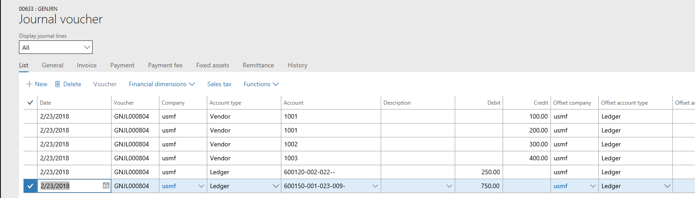
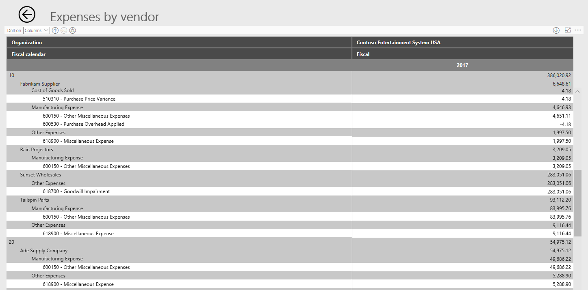

---
# required metadata

title: One voucher
description: One voucher for financial journals (general journal, fixed asset journal, vendor payment journal, and so on) lets you enter multiple subledger transactions in the context of a single voucher.
author: kweekley
manager: AnnBe
ms.date: 10/10/2018
ms.topic: article
ms.prod: 
ms.service: dynamics-ax-applications
ms.technology: 

# optional metadata

ms.search.form: 
# ROBOTS: 
audience: Application User
# ms.devlang: 
ms.reviewer: shylaw
ms.search.scope: Core, Operations
# ms.tgt_pltfrm: 
ms.custom: 14091
ms.assetid: c64eed1d-df17-448e-8bb6-d94d63b14607
ms.search.region: Global
# ms.search.industry: 
ms.author: kweekley
ms.search.validFrom: 2018-03-16
ms.dyn365.ops.version: 8.0.2

---

# One voucher

[!include [banner](../includes/banner.md)]

> [!NOTE]
>  This functionality will be available in Dynamics 365 for Finance and Operations version 8.0, which will be available in the 
Spring '18 release.   

What is "One voucher"?
======================

The existing functionality for financial journals (general journal, fixed asset journal, vendor payment journal, and so on) lets you 
enter multiple subledger transactions (customer, vendor, fixed assets, project, and bank) in the context of a single voucher. We refer to this functionality as "One voucher." You can 
create One voucher by using one of the following methods:

-   Set up the journal name (**General ledger** \> **Journal setup** \>**Journal names**) so that the **New voucher** field is set to 
**One voucher number only**. * Every line that you add to the journal is now included on the same voucher. Because every line is added to 
the same voucher, the voucher can be entered as a multiline voucher, as an account/offset account on the same line, or as a combination.

 
> [!IMPORTANT] 
> *  Note that the definition of ‘One voucher’ does NOT include journal names that are set up as **One voucher number** only and the user then enters a voucher which only includes Ledger account types.  In this document, ‘One voucher’ means that there is one voucher that contains more than one vendor, customer, bank, fixed asset, or project. 

-   Enter a multiline voucher where there is no offset account.

-   Enter a voucher where both the account and the offset account contain a subledger account type, such as vendor/vendor, 
Customer/customer, vendor/customer, or bank/bank.

Issues with One voucher
=======================

The One voucher functionality causes issues during settlement, tax calculation, transaction reversal, reconciliation of a subledger to the general ledger, 
financial reporting, and more. (For example, for more information about issues that can occur during settlement, see [Single voucher 
with multiple customer or vendor records](https://docs.microsoft.com/en-us/dynamics365/unified-operations/financials/accounts-payable/single-voucher-multiple-customer-vendor-records).)
To work and report correctly, these processes and reports require transaction details. Although some scenarios might still work 
correctly, based on your organization's setup, there are often issues when multiple transactions are entered in one voucher.

For example, you post the following multiline voucher.

You then generate the **Expenses by vendor** report in the **Financial Insights** workspace. The report groups expense account balances
under vendor group and then vendor. When generating the report, the system can't determine which vendor groups/vendors incurred the 
expense of 250.00. Because transaction details are missing, the system assumes the whole 250.00 was incurred by the first vendor found
in the voucher. The 250.00, which is included in the balance for main account 600120, is then shown under that vendor group/vendor. 
It’s very likely that the first vendor in the voucher was not the correct vendor, so the report is incorrect.

The future of One voucher
=========================

Because of the issues that were stated earlier, the One voucher functionality will be made obsolete. However, because there are 
functional gaps that depend on this functionality, the functionality won't become obsolete all at once. Instead, we will use the 
following schedule: 

- **Spring 2018 release** – The functionality will be turned off by default through a General ledger parameter. However, you can turn 
  the functionality on if your organization has a scenario that falls in the business scenario gaps that are listed later in this topic. The parameter "Allow multiple transactions within one voucher" is found on the General tab of General ledger parameters.

  -   If a customer has a business scenario that doesn't require One voucher, don't turn the functionality on. We won't fix "bugs" in 
  the areas that were identified later in this topic if this functionality is used even though another solution exists.

  -   Stop using One voucher for integrations into Microsoft Dynamics 365 Finance and Operations, unless the functionality is required
  for one of the functional gaps.

- **Later releases** – All functional gaps will be filled. **After the functional gaps are filled, it will be at least one year after the new features are delivered before the One voucher functionality will be permanently turned off.** Adequate time must be given for customers and ISV's to react to the new functionality, which may include updating their business processes, entities and integrations.

- > [!IMPORTANT]
  > Please note that the **One voucher number only** option has NOT been removed from the Journal name setup.  This option is still supported when the voucher only contains Ledger account types.  Customers must be careful when using this setting because the voucher will not post if they use **One voucher number only** but then enter more than one customer, vendor, bank, fixed asset, or project.  Also, customers can still enter a mix of subledger account types, such as a payment within a single voucher that contains account types of Vendor/Bank.  

Why use One voucher?
====================

Based on conversations with customers, we have compiled the following list of scenarios where customers use the One voucher 
functionality or reasons why they use it. Some of these business requirements can be met only by using One voucher. However, for many 
scenarios, alternatives can meet the same business requirements.

Scenarios that require One voucher
----------------------------------

The following scenarios can be accomplished only by using the One voucher functionality. If your organization has any of these scenarios, you must change the GL parameter to allow entry of multiple transactions within a voucher. These functional gaps will be filled through other features in later releases.

-   **Post vendor or customer payments in summary form to a bank account**

    -   An organization communicates a list of vendors and amounts to its bank, and the bank uses this list to pay the vendors on the 
    organization's behalf. The bank posts the sum of the payments as a single withdrawal on the bank account.

>   Summarization of vendor payments is supported only through One voucher. Each vendor is entered as a separate line to maintain 
detail in the Accounts payable subledger, but the summarized amount for all the payments is offset to a single line for the bank account. Therefore, the withdrawal is shown as a single summarized amount in the bank subledger.

-   An organization deposits customer payments, or the bank deposits customer payments on the organization's behalf, and the deposit is 
shown as a lump sum on the bank account.

>   Summarization of customer payments is typically supported through the deposit functionality. However, if you're using "bridging" on 
the method of payment, this scenario is supported only through One voucher. The customer payments are entered in the same manner that 
is described for vendor payment summarization.

-   **Mechanism to group transactions from a business event**

    -   An organization has a single business event that triggers multiple transactions. However, the Accounting department wants to 
    view the accounting entries together for better auditability.

>   If an organization must view the accounting entries from a business event together, it must use One voucher. 

- **Country-specific features**

  -   The Single Administrative Document (SAD) feature for Poland currently requires that a single voucher be used. Until a grouping 
  option is available for this feature, you must continue to use the One voucher functionality. There may be additional country-specific
  features that require the One voucher functionality.

- **Customer prepayment payment journal that has taxes on multiple "lines"**

  -   A customer makes a prepayment for an order, and the lines of the order have different taxes that must be recorded for the 
  prepayment. The prepayment customer payment is one transaction that simulates the lines of the order, so that the appropriate tax can 
  be recorded for the amount on each line.

In this scenario, the customers in the single voucher are the same customer, because the transaction simulates the lines of a customer 
order. The prepayment must be entered in a single voucher, because the tax calculation must be made on the "lines" of the single 
payment that the customer made.

-   **Fixed asset maintenance: Catch-up depreciation, split asset, calculate depreciation on disposal**

The following fixed asset transactions also create multiple transactions within a single voucher:
-   An additional acquisition is made on an asset and ‘catch-up’ depreciation is calculated.
-   An asset is split.
-   A parameter to calculate depreciation on disposal is enabled and then the asset is disposed.
-   An asset's service date is prior to the acquisition date, which results in a depreciation adjustment being posted.

-   **Customer reimbursement**

If the Reimbursement periodic task is run under Accounts receivable, it will create a tranasction to move the balance from a Customer to a Vendor. This scenario requires the use of One voucher in ordre to reimburse the customer.

-   **Bill of exchange and Promissory notes**

The Bill of exchange and Promissory notes require the use of One voucher because the transactions are moving the customer or vendor balance from one Accounts receivable/Accounts payable to another based on the state of the payment. 

Scenarios that don't require One voucher
----------------------------------------

The following scenarios can be accomplished through other means and should not use One voucher.

-   **Post customer payments in summary form to the bank account**

An organization deposits customer payments, or the bank deposits customer payments on the organization's behalf, and the deposit is 
shown as a lump sum on the bank account.

Summarization of customer payments is supported through the deposit  functionality when bridging isn't used on the method of payment.

-   **Netting**

In netting, the balances for a vendor and customer are netted against each other because the vendor and customer are the same party. 
This approach minimizes the exchange of money between an organization and the customer/vendor party.

Netting can be accomplished by entering the increase and decrease in separate vouchers, and posting the offset to a clearing ledger 
account.

-   **Post in summary to the general ledger**

Organizations often want to post to the general ledger in summary to minimize the amount of data. However, the organizations typically 
still require that the transaction detail be maintained. When posting is done in summary through a single voucher, the transaction 
detail isn't known and can't be maintained.

   -   Because the transaction detail currently can't be maintained, we recommend that One voucher not be used to post in summary.
   -   After support for One voucher is removed, we can implement the Source document and Accounting frameworks into the journals. These frameworks, will then maintain the transaction detail and support summarization into the general ledger.

-   **Settle multiple unposted payments to the same invoice**

This scenario is typically found in retail organizations where customers can use multiple methods of payment to pay for purchases. In 
this scenario, the organization must be able to record multiple unposted payments and settle them against the customer invoice.

A new feature that was added in Microsoft Dynamics 365 for Operations version 1611 (November 2016) enables multiple unposted payments 
to be settled against a single invoice. Multiple customer payments no longer have to be entered in a single voucher.

-   **Import bank statement transactions**

Banks often pay and receive payments on an organization's behalf, and these transactions are recorded in Finance and Operations through 
a file that is received from the bank. Organizations often want to group together those transactions by using the bank statement number 
in the file. Because each transaction is shown in detail on the bank statement, no summarization is required in the bank subledger.

Transactions can be grouped by using other fields on the journal, such as the journal batch number itself or the document number.

-   **Transfer balances**

An organization might have to transfer a balance from one vendor to another vendor, either because of a mistake or because another 
vendor has taken over the liability. Transfers of this type also occur for account types such as customers and bank accounts.

Balance transfers from one account (vendor, customer, bank account, and so on) to another account can be done through separate vouchers,
and the offset can be posted to a clearing ledger account.

-   **Enter beginning balances**

Organizations often enter beginning balances for subledger accounts (vendors, customers, fixed assets, and so on) as one voucher 
transaction. Beginning balances for each subledger account can be entered as separate vouchers, and the offset can be posted to a 
clearing ledger account.

-   **Correct the accounting entry of a posted customer or vendor document**

An organization might have to correct the Accounts receivable or Accounts payable ledger account for an accounting entry of a posted 
invoice, but that invoice can't be reversed or corrected through another mechanism.

If a correction must be made to the accounts receivable or accounts payable ledger account, an adjustment must be made directly to the 
ledger account. The adjustment can't be made by posting through the vendor or customer. This approach requires that the adjustment be 
made during a "down time," so that the ledger account can temporarily allow manual entry.

-   **"The system allows it"**

Organizations often use the One voucher functionality merely because the system lets them use it, without understanding the implications.
