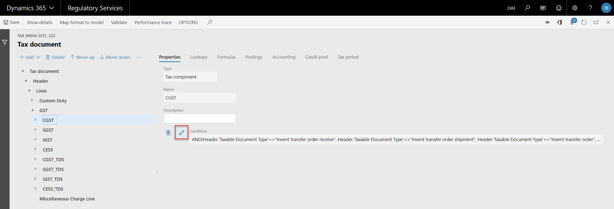
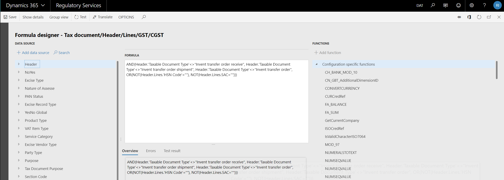
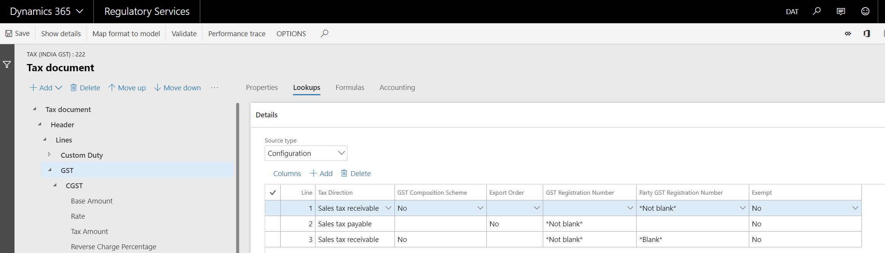

---
# required metadata

title: Tax engine applicability
description: This topic provides information about Tax engine applicability
author: yijialuan
manager: AnnBe
ms.date: 10/07/2018
ms.topic: article
ms.prod: 
ms.service: dynamics-ax-applications
ms.technology: 

# optional metadata

ms.search.form: ERSolutionTable, ERDataModelDesigner, ERModelMappingTable, GTE, Applicability
audience: IT Pro
# ms.devlang: 
ms.reviewer: shylaw
ms.search.scope: Core, Operations
# ms.tgt_pltfrm: 
ms.search.region: India
# ms.search.industry: 
ms.author: riluan
ms.search.validFrom: 2018-10-07
ms.dyn365.ops.version: 7.3

---

# Tax engine applicability

[!include [banner](../includes/banner.md)]

The [Tax engine](tax-engine.md) (also referred to as GTE) lets you configure tax rules that determine tax applicability, calculation, posting, and settlement, based on legal and business requirements. This topic walks you through a tax engine configuration to help you understand how GTE handles tax applibility.

> [!NOTE]
> The Tax engine functionality is only available for legal entities with a primary address in India.

## Prerequisites                                               
This document use Indian GST configuration to explain the tax applicability.

### [Import GTE configuation from LCS](tax-engine-import-configuration.md)

## Overiew
Tax applicability means under what condition will tax type, tax component, tax rate, etc. be applicable. Take India GST as an example, if you sale goods from one state to another state, you need to charge IGST, and the goods you are selling will determine the tax rate. 
Tax engine provides two ways to handle the tax applicability, lookup which is mainly used to handle the dynamic applicability rules, and condition is to handle the static applicability rules.
Following GTE components are relevant to tax applicability.

|GTE component | Lookup/Condition | Comments |
|--------------|------------------|----------|
| Tax type | Lookup & Condition |  |
| Tax component | Lookup & Condition | Both tax component and tax type can have applicability logic, and since tax component is under tax type, system consider both applicability logic to determine whether a specific tax component is applicable |
| Tax measure | Lookup | The measure type should be *Tax rate*, *Percentage* or *Percentage group* |
| Formula | Condition | For a specific transaction type, not all the tax formula are relevant. For example, the formula to calculate the non-deductible tax is only relevant to purchase document |
| Posting | Condition | Different transaction types have different posting logic, condition is used to make sure correct posting profile is used | 
| Accounting | Lookup | Accounting meaning tax accounts. With lookup, you can maintain different sets of tax accounts for different scenarios. For example, different tax registration number have different tax accounts |
| Credit pool | Lookup | Use lookup to determine how to settle tax. For example, you can settle tax per different tax registration numbers |
| Tax period | Lookup | Use lookup to determine which tax period should be used for different scenarios |


## Condition
There is applicability rule which is static, for example GST is not applicable for intra-state inventory transfer in India.  

Open the Tax(India GST) by clicking the button **Designer**. 

Select the tax component CGST, and click the pencil icon, to check the detailed condition. 

The condition is actually an [ER](../../dev-itpro/analytics/general-electronic-reporting.md) expression. It is composed by the fields in the left DATA SOURCE, and the [ER FUNCTIONS](../../dev-itpro/analytics/general-electronic-reporting-formula-designer.md#supported-functions) in the right side. 
The condition below means *Taxable Document Type* cannot be "Invent transfer order receive", "Invent transfer order shipment", or "Invent transfer order", and either HSN Code or SAC should be specified.
```
AND(Header.'Taxable Document Type'<>"Invent transfer order receive",
    Header.'Taxable Document Type'<>"Invent transfer order shipment",
    Header.'Taxable Document Type'<>"Invent transfer order", 
    OR(NOT(Header.Lines.'HSN Code'=""), NOT(Header.Lines.SAC=""))
   )
```
### Enable GST for intra-state inventory transfer order
Suppose Indian government require to calculate GST for intra-state inventory transfer order if the GST registration numbers are different between the ship from and to warehouse. 
#### Structure of the DATA SOURCE in the formula designer
In the left side of the formula desiger, you can find all the fields defined in the taxable document and tax document, and the reference model defined in the taxable document.
```
Header
└───Header fields
└───Lines
|   └───Lines field
|       └───Tax types
|           └───Tax components
|               └───Tax measures
Reference models
```
#### Change the applicability condition
*Header>Lines>GST Registration number* and *Header>Lines>Party GST Registration number* represent the GST Registration numbers of ship from and to warehouse. So we can change the condition to be below.
```
AND(
    OR(
       AND(
           OR(
              Header.'Taxable Document Type'="Invent transfer order receive",
              Header.'Taxable Document Type'="Invent transfer order shipment",
              Header.'Taxable Document Type'="Invent transfer order"
             ),
             'GST Registration Number'<>'Party GST Registration Number'
           ),
       AND(
           Header.'Taxable Document Type'<>"Invent transfer order receive",
           Header.'Taxable Document Type'<>"Invent transfer order shipment",
           Header.'Taxable Document Type'<>"Invent transfer order"
          )
      ), 
    OR(NOT(Header.Lines.'HSN Code'=""), NOT(Header.Lines.SAC=""))
   )
```
> Select the field from the data source, and use **Add data source** to add the field into the formula, unless you are very familiar field name. Make sure to single quote the data source field if there is empty space in its name(like "Taxable Document Type"), and double quote the value if there is empty space (like "Inventory transfer order").

> Test your formula by clicking **Test** after you are done with your editing.

# Lookup
When the static applicability rules are complex, or it is a dynamic applicability rule, you need to use lookup.
## Lookup for static applicability rules
Select GST, click **Lookups**.

Since lookup can handle both static applicability rules and dynamic appplicability rules, the **Source type** dropdown list is for this purpose. Use *Configuration* for static applicability rule, it means the data to be used in the lookups come from the configuration. Use *User data* for dynamic applicability rule, it means the data to be used in the lookups come from the runtime environment, like Finance and Operation.

The lookup is a matrix, the relation of each line is *OR*, and the relation of each column within the line is *AND*. If the value of the cell is empty, it means all the value satisfy the condition. 

In the screenshot above, all the data of the lookup of tax type GST comes from the configuation, so the **Source type** is *Configuration*.
If we convert the lookup of GST into condition, it will be like following.
``` 
OR(
    AND(Exempt=Exempt.No,
        AND('Tax Direction' = "Sales tax receivable",
            'GST Composition Scheme' = NoYes.No,
            'Party GST Registration Number' <> ""
        ),
        AND('Tax Direction' = "Sales tax payable",
            'Export Order' = NoYes.No,
            'GST Registration Number' <> ""
        ),
        AND('Tax Direction' = "Sales tax receivable",
            'GST Composition Scheme' = NoYes.No,
            'GST Registration Number' <> ""
        )
    )
)
```
## Lookup for dynamic applicability rules
Lots of applicability rules depend on the runtime data. For example, some tax components are only applicable for certain good or service, different type of tax transaction results in different tax rate. 

Select CESS, click **Lookups**.

In India, CESS is applicable for certain good and service, and in Finance and Operations, HSN represents good, SAC represents service, so HSN Code and SAC are used in the lookup, and the **Source type** is *User data*, since the real value of HSN Code and SAC come from Finance and Operations.

Now, let's check how the CGST Rate is determined. Select CGST>Rate, click **Lookups**.


It always require runtime data to determine the tax rate, so system hide the **Source type**, and its  value is *User data*.

Different good and service result in different tax rate, so there are *HSN Code* and *SAC*. *Party GST Registration Number* and "Tax Direction* are to handle the scenario of purchasing from GST unregisterd supplier, obviously *Transaction Date from* and *Transaction Date to* are for the purpose of handling different tax rate per period.

### Enable different tax rate for different goods
Different goods can share one HSN code, so the lookup cannot satisfy this scenario. Different lookup column is needed to handle it.
Click **Columns**, in the left side, you can find all the *AVAILABLE COLUMNS*, the stuctrure is the same as the *DATA SOURCE* in the formula designer, except that there are no reference models.

*Item ID* can uniquely determine the goods, select it in the *AVAILABLE COLUMNS*, click right arrow icon to add it into the *SELECTED COLUMNS* side. If HSN is not needed, you can select the *HSN Code* in the  *SELECTED COLUMNS*, and click left arrow icon to remove it. 