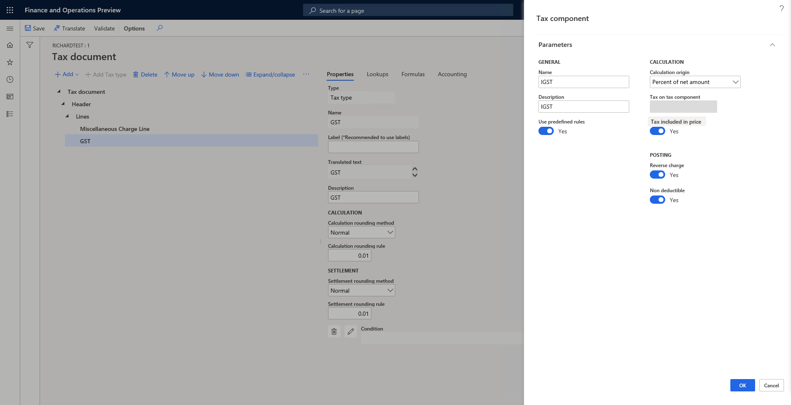

---
# required metadata

title: Tax engine create tax component
description: This topic explains how to create tax component manually and with pre-defined rules 
author: yijialuan
manager: Krstin Fender
ms.date: 07/30/2019
ms.topic: article
ms.prod: 
ms.service: dynamics-ax-applications
ms.technology: 

# optional metadata

ms.search.form: ERSolutionTable, ERDataModelDesigner, ERModelMappingTable
audience: Application User
# ms.devlang: 
ms.reviewer: Kristin Fender 
ms.search.scope: Core, Operations
# ms.tgt_pltfrm: 
ms.search.region: India
# ms.search.industry: 
ms.author: riluan
ms.search.validFrom: 07/30/2019
ms.dyn365.ops.version: 7.3

---

# Tax component

[!include [banner](../includes/banner.md)]

Tax components are like sub-tax types that a tax authority can levy in the same jurisdiction or a different jurisdiction. For example, in the US, sales tax is levied at various levels of jurisdiction, such as the state, county, or city level. Different tax components can have a different treatment from an accounting, tax reporting, tax settlement, or other perspective. Also in India, there are CGST, SGST, IGST which are all GST.

> [!NOTE]
> The Tax engine functionality is only available for legal entities with a primary address in India.

For a quick overview of the tax engine, watch the following video.

- [Tax engine overview (YouTube video)](https://www.youtube.com/watch?v=jAFpEBOtNWI&feature=youtu.be)

## Create tax type
Tax type is analogous to a tax regime, Sales tax, value-added tax (VAT), and GST (Goods and Service tax) are three typical tax type. Tax component should be created under a specific tax type. 
Select Lines, click button ***Add>Tax document>Tax type***, specify the name, description and rounding rule, click button ***OK***.

## Create tax component 
Select the tax type under where you want to create tax component, click button ***Add>Tax document>Tax component***. 

Try to use the predefined rules if it can meet your requirement, system will help create tax measures, formulas and posting profiles.

### Calculation origin
Calculation origin determine the tax base amount.
#### Percent of net amount
The tax base amount will be the net amount of the document line, means *Price * Quantity*.
#### Percent of gross amount
The tax base amount will be the gross amount of the document line, which means *Price * Quantity + Other tax amount it depends on*. So by choosing this option, you have to specify the tax it depends on in ***Tax on tax component***. For example, for import order in India, IGST is calculated based on the *Net Amount + BCD + SWS*, so you should choose both BCD and SWS.
#### Percent of sales tax 
It's tax on tax scenario, which means the tax base amount is the tax amount of another tax. For example, in India, the tax base of SWS is BCD. By choosing this option, you have to specify the tax it depends on in ***Tax on tax component***.
#### Amount per unit
The tax base amount will be the quantity. 
### Tax on tax component
It's editable when the ***Calculation origin*** is *Percent of gross amount* or *Percent of sales tax*.
### Tax included in price
For transaction with price include tax, this checkbox control whether the tax is included in the price. 
### Reverse charge 
By choosing this option, the component will support reverse charge behavior, which means user will be able to specify the condition when reverse charge will be applicable, and tax will be calculate and posted accordingly.
### Non deductible
By choosing this option, the component will support non-deductible behavior, which means user will be able to specify the condition when non-deductible will be applicable, and tax will be calculate and posted accordingly.

After the tax component is created by using predefined rules, you should define the applicability rule for the tax component itself, Rate, Reverse charge, etc. according to [Tax Applicability](tax-engine-applicability.md). You can always manual edit the tax measures, formulas, posting profiles, etc.