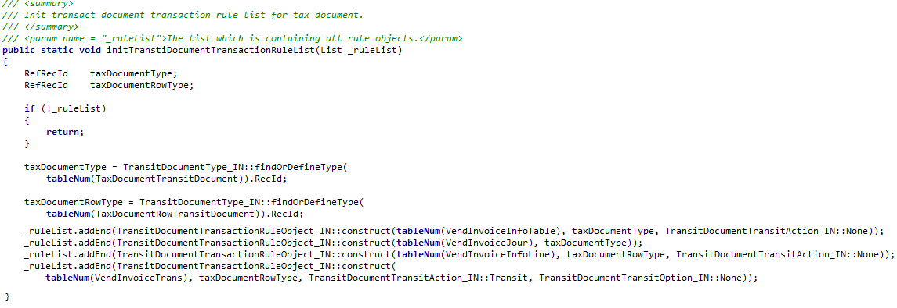
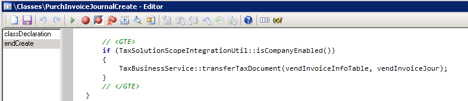
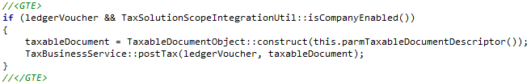
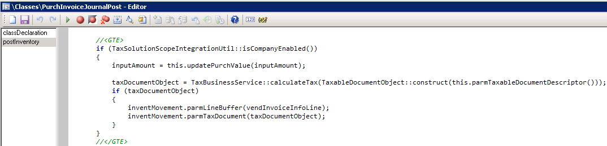
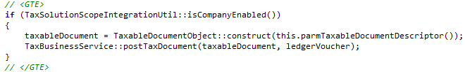
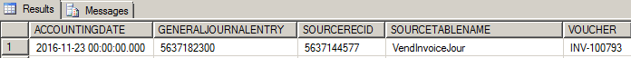
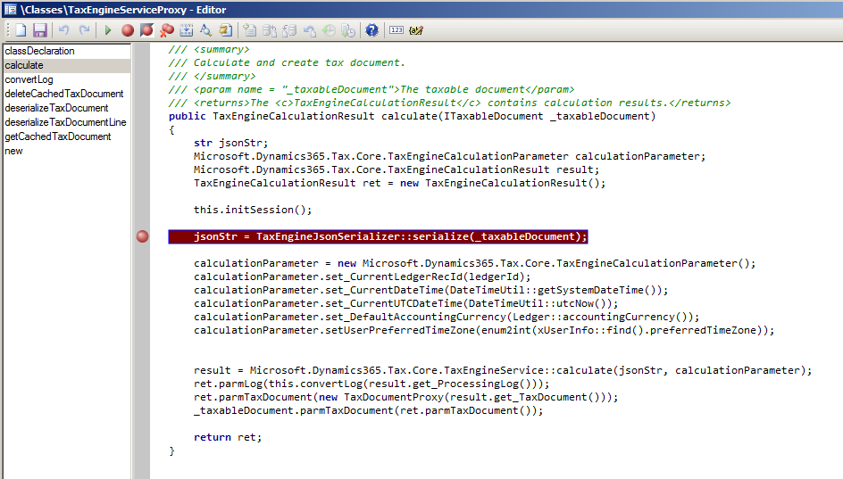

---
# required metadata

title: Tax engine integration
description: This topic provides information about tax engine integration.
author: RichardLuan
manager: AnnBe
ms.date: 10/02/2017
ms.topic: article
ms.prod: 
ms.service: dynamics-ax-applications
ms.technology: 

# optional metadata

#ms.search.form: 
# ROBOTS: 
audience: IT-Pro
# ms.devlang: 
ms.reviewer: shylaw
ms.search.scope: Operations
# ms.tgt_pltfrm: 
ms.search.region: Global
# ms.search.industry: 
ms.author: riluan
#ms.search.validFrom:
#ms.dyn365.ops.version: 

---

# Tax engine integration

[!include[banner](../includes/banner.md)]

Integration of General tax engine (GTE) with Finance and Operations basically involves implementation of X++ code that interacts with GTE for tax calculation (either with or without tax adjustment), and that consumes the results for the display, accounting and posting of tax for voucher and tax transactions. The following illustration shows an overview of the three models for GTE integration in the Finance and Operations application:

GTE interfaces to GTE service

Tax business service

Finance and Operations application integration:

Application integration

Accounting integration

## GTE interfaces to GTE service

As the major part of the GTE integration framework, the GTE interfaces to GTE service model contains all the interfaces that interact with GTE operations:

ITaxEngine and its implementation contain the basic operations with GTE, such as calculating tax through GTE, persisting the calculated result to Microsoft
Dynamics AX tables, retrieving the tax document for the transaction, and deleting the tax document from both the GTE cache and Finance and Operations
tables.

The set of ITaxDocument interfaces and implementations provides a way to read information from a tax document that is calculated and returned by GTE. This set includes ITaxDocument, ITaxDocumentLine, ITaxDocumentField, ITaxDocumentComponentLine, and ITaxDocumentMeasure.

These interfaces also provide methods for retrieving a specified field value (**ITaxDocumentField**) from ITaxDocumentLine and an expected measure value (**ITaxDocumentMeasure**) from ITaxDocumentComponentLine.

The set of ITaxDocumentMetaData interfaces provides a way to read model information from a tax document. This set includes ITaxDocumentMetaData, ITaxDocumentLineMetaData, ITaxDocumentComponentLineMetaData, and ITaxDocumentMeasureMetaData.

The set of ITaxDocumentEnumerator and ITaxDocumentMeataDataEnumerator interfaces provides an enumerator to read a list of tax document–related objects, such as ITaxDocumentLine, ITaxDocumentField, ITaxDocumentComponentLine, and ITaxDocumentMeasure.

**Integration uptake point**

This model is part of the Finance and Operations integration framework. Almost no
uptake is required for partners or customers.

## Tax business service

The tax business service model is the façade for Finance and Operations application interactions with GTE for basic operations. This façade uses both the interface model and the application model for tax calculation, accounting, and posting. The façade provides the following methods:

-	**CalculateTax** – Delete a tax document if it’s marked as **Dirty**, and then
calculate tax.

-	**Input**: Taxable document identifier

-	**Output**: Tax Document object

-	**RecalculateTax** – Explicitly recalculate a tax document,

-	**Input**: Taxable document identifier

-	**Output**: Tax Document object

-	**SaveTaxDocument** – Persist a tax document to the Finance and Operations database.

-	**Input**: Tax Document object

-	**Output**: Not applicable

-	**GetTaxDocumentBySource** – Read a tax document, based on the source transaction identifier.

-	**Input**: Transaction identifier

-	**Output**: Tax document object

-	**GetTaxDocumentLineBySource** – Read a tax document line, based on the source transaction line identifier.

-	**Input**: Transaction line identifier

-	**Output**: Tax document line object

-	**GetTaxDocumentTaxStatus** – Read the status of a tax document for the associated transaction.

-	**Input**: Taxable document identifier

-	**Output**: Tax document status

-	**MarkTaxDocumentTaxStatus** – Mark a tax document as **Dirty** when the underlining transaction has been updated.

**Input**:

Taxable document identifier

Tax document status

**Output**: Not applicable

**DeleteTaxDocument** – Delete a tax document when the transaction is deleted.

**Input**: Taxable document identifier

**Output**: Not applicable

**PostTax** – Post tax for the transaction.

**Input**:

Ledger voucher for the tax that must be posted

Taxable document identifier

**Output**: Not applicable

**TransferTaxDocument** – Transfer a tax document from one transaction that is
supported by the source to another.

**Input**:

Source transaction

Target transaction

**Output**: Not applicable

**PostTaxDocument** – Just change the status of the tax document status to
**Posted**.

**Input**: Taxable document identifier

**Output**: Not applicable

**Integration uptake point**

This model is part of the Finance and Operations integration framework. Almost no uptake is required for partners or customers.

## Finance and Operations application integration

The transaction information in Finance and Operations should be sent to GTE. At the same time, the accounting and posting of tax should be aligned with the Finance and Operations implementation. Therefore, several parts are created in the Finance and Operations application: the taxable document, the GTE tax accounting, and the GTE tax posting. Meanwhile, the integration uses the transit document framework to maintain the relationship between the Microsoft Dynamics AX transaction and the tax document:

### Application integration

#### Taxable document

A taxable document encapsulates transaction information by utilizing a set of data providers. Transaction information is wrapped by a TaxableDocument object. A TaxableDocumentDescriptor object in this object should describe what the transaction is and should list a set of data providers that bind tax model attributes with transaction data.

**TaxableDocumentDescriptor** is the class that implements a set of TaxableDocumentTypeDefinition interfaces and describes what the transaction is. Technically, TaxableDocumentDescriptors are the Finance and Operations table bases, whereas TaxableDocumentTypeDefinitions are more business-driven and are mainly used for tax configuration conditions.

In the following example, TaxableDocDescirptorPurchOrderParm implements three interfaces that share the same Finance and Operations PurchParmTable table.

**Integration uptake point**

If additional attributes are added to a tax configuration, and they are used for lookup, condition, formula, or other configurations, they should be bound with transaction data. Therefore, a transaction’s corresponding data provider classes should be modified to do this type of data binding.

If additional transactions should support GTE, related TaxableDocumentTypeDefinitions, TaxableDocumentDescriptors, and TaxableDocumentDataProviders should be created.

#### Transit document

A transit document is an existing framework in Finance and Operations that is used to achieve two goals:

Maintain the relationship between a transaction and a transit document.

Transfer the document from one transaction to another.

This framework lets you easily find a transaction’s document and also track the
transit history.

For example, a tax document is created from VendInvoiceInfoTable, and then the transit document maintains the relationship between VendInvoiceInfoTable and TaxDocument. When a purchase order is invoiced, the tax document from VendInvoiceInfoTable is transferred to VendInvoiceJour.

**Integration uptake point**

If additional transactions should support GTE, a rule should be defined for the transit document framework to describe which transaction should have a tax document from both the header level and the line level. The rule should also define the transit action from the source transaction to the target transaction.

#### Transaction integration

Transaction integration occurs only on a case-by-case basis. For each transaction and scenario, the tax business service should be called in the appropriate manner for tax calculation, tax assumption, and tax posting. For an example, see the [Finance and Operations integration example – Purchase order invoice](#microsoft-dynamics-ax-integration-example-purchase-order-invoice) section, later in this topic.

### Accounting integration

#### GTE tax accounting

The accounting of Finance and Operations transaction is separated into two parts: source document accounting and non-source document accounting. The same behavior applies for GTE tax accounting, which is integrated with the Microsoft Dynamics AX implementation on both sides:

-	For source document transactions, such as a purchase order or free text invoice, the account information for tax is fetched when the tax document is created.

-	For non-source document transactions, such as a sales order or general journal, the account information is determined when tax is posted.

**Integration uptake point**

If any additional source document transaction requires GTE support, source document–related classes should be created to extend AccountingJournalizationRule and AccountingDistributionRule for the specified business event and monetary amount.

#### GTE tax posting

Currently, GTE tax posting generates TaxTrans, TaxTrans\_IN (if you’re running under the India country/region code), and a related voucher for TaxTrans. In order for the **taxTrans** field to be filled with attributes or measures from the tax document, the mapping should be provided via **TaxAcctTaxTransTaxDocAttrMapping** and **TaxAcctTxTransTaxDocMeasureMapping**.

The following illustration shows how TaxTrans and the voucher are created.

**Integration uptake point**

If the taxTrans fields should be filled with additional fields from the tax document, either the **TaxAcctTaxTransTaxDocAttrMapping** or **TaxAcctTxTransTaxDocMeasureMapping** class, or its extended classes, should be updated in the appropriate manner for data binding.

## Finance and Operations integration example – Purchase order invoice

This section provides an example of Finance and Operations GTE uptake for a purchase order invoice. Related transaction tables include VendInvoiceInfoTable,
VendInvoiceInfoLine, VendInvoiceJour, and VendInvoiceTrans.

## Integration checklist

The following table summarizes all relevant changes that are related to the uptake of a purchase order invoice.

| Transaction uptake checklist | Description    | AX 2012 AOT objects     | AX 2009 AOT objects      | |
|------------------------------|----------------|-------------------------|--------------------------|-----------------------------------------------------------------------------|
| Definition                   | Define a taxable document.                        | Create the taxable document type and description to describe what the transaction is.                                                                                       | TaxableDocTypeDefPurchaseInvoice TaxableDocDescriptorPurchaseInvoice                                              | TaxableDocTypeDefPurchaseInvoice TaxableDocDescriptorPurchaseInvoice        |
|                              | Define data providers.                            | Create data providers to provide transaction data to GTE.                                                                                                                   | TaxableDocTypeDefPurchaseInvoice TaxableDocDescriptorPurchaseInvoice                                              | TaxableDocTypeDefPurchaseInvoice TaxableDocDescriptorPurchaseInvoice        |
| Creation                     | Add the **Tax document** button on a transaction. | Add the **Tax document** button to the transaction forms.                                                                                                                   | VendEditInvoice VendInvoiceInfoListPage                                                                           | PurchEditLines                                                              |
|                              | Integrate with transaction totals.                | Create the tax document when the **Totals** button is clicked.                                                                                                              | PurchTotals\_ParmTrans.calcTax() PurchTotals\_ParmTransEdit.calcTax() PurchTotals\_ParmTransEditInvoice.calcTax() | PurchTotals\_ParmTrans.calcTax() PurchTotals\_ParmTransEdit.calcTax()       |
|                              | Integrate with a source document.                 | Because purchase invoice is a source document transaction, create a source document when tax is calculated.                                                                 | AccDistRuleProductTaxMeasure AccJourRuleVendPaymReqTaxMeasure                                                     | This change isn’t required for AX 2009.                                     |
| Deletion                     | Delete a transaction.                             | Delete the tax document when a transaction is deleted.                                                                                                                      | VendInvoiceInfoTable.delete()                                                                                     | PurchParmTable.delete()                                                     |
|                              | Delete a transaction line.                        | Recalculate tax when a transaction line is deleted.                                                                                                                         | VendInvoiceInfoLine.delete()                                                                                      | PurchParmLine.delete()                                                      |
| Update                       | Update transaction header information.            | Recalculate tax when fields that affect tax are updated at the transaction header level.                                                                                    | VendInvoiceInfoTable.update()                                                                                     | PurchParmTable.update()                                                     |
|                              | Update transaction line information.              | Recalculate tax when fields that affect tax are updated on a transaction line.                                                                                              | VendInvoiceInfoLine.update()                                                                                      | PurchParmLine.update()                                                      |
|                              | Update tax information.                           | Recalculate tax when tax information fields are updated.                                                                                                                    | VendInvoiceInfoLineTaxExtension\_IN.update()                                                                      | PurchParmLine.update()                                                      |
| Posting                      | Define a tax document transition rule.            | Define a rule for the transfer of a tax document from one transaction to another.                                                                                           | TaxDocumentTransitRuleEventHandler.initTransitDocumentTransactionRuleList()                                       | TaxDocumentTransitRuleEventHandler.initTransitDocumentTransactionRuleList() |
|                              | Transfer a tax document.                          | Transfer the tax document from one transaction to another during posting.                                                                                                   | PurchaseInvoiceJournalCreate.endCreate()                                                                          | PurchFormLetter\_Invoice.createJournal()                                    |
|                              | Post tax.                                         | Post tax during transaction posting.                                                                                                                                        | PurchaseInvoiceJournalPost.PostTax()                                                                              | PurchFormLetter\_Invoice.postTax()                                          |
|                              | Add inventory tax.                                | Add tax to inventory if a tax load on inventory is available.                                                                                                               | PurchaseInvoiceJournalPost.PostInventory()                                                                        | PurchFormLetter\_Invoice.updateNow()                                        |
|                              | Post a tax document.                              | Post the tax document after the transaction voucher is posted. As a result, the tax document status is updated to **Posted**, and records are generated in relation tables. | PurchaseInvoiceJournalPost.endUpdate()                                                                            | PurchFormLetter\_Invoice.endUpdate()                                        |
| Inquiry                      | Add the **Tax document** button on a journal.     | Add the **Tax document** button to the journal form for inquiry purposes.                                                                                                   | VendInvoiceJournal                                                                                                | VendInvoiceJournal                                                          |

### Definition – Define a taxable document

**TaxableDocTypeDefPurchaseInvoice** and **TaxableDocDescriptorPurchaseInvoice** are the classes that define a purchase invoice as a taxable document for GTE.

TaxableDocTypeDefPurchaseInvoice is the interface that defines a purchase invoice as a taxable document.

**TaxableDocDescriptorPurchaseInvoice.getDataProvider()** specifies which data provider class is used for a purchase invoice.

### Definition – Define data providers

The following data providers are used to send transaction data to GTE for any tax-related operation.

**TaxableDocPurchaseInvoiceDataProvider.buildQuery()** provides a query for all related transactions, such as VendInvoiceInfoTable and VendInvoiceInfoLine. It also registers each data source with a row data provider. For example, the VendInvoiceInfoTable data source is registered with TableDocVendInvoiceInfoTableRowDP.

TaxableDocVendInvoiceInfoTableRowDP extends the **TaxableDocPurchTableRowDataProvider** class to set up transaction header–related information, whereas TaxableDocVendInvoiceInfoLineRowDP extends **TaxableDocPurchLineRowDataProvider** to set up invoice line–related information.

Here lists the taxable document fields that are mapped in Finance and Operations:

| **Taxable document fields that are mapped in AX** | **Logic in AOT Object**                                  | **Required**              | **Default Value**    |
|---------------------------------------------------|----------------------------------------------------------|---------------------------|----------------------|
| SubLines                                          | TaxableDocumentLineObject.getSubLines                    | Yes                       |                      |
| Fields                                            | TaxableDocumentLineObject.getFields                      | Yes                       |                      |
| ModelFieldName                                    | TaxableDocumentLineObject.parmModelFieldName             | Yes                       |                      |
| RelationLines                                     | TaxableDocumentLineObject.getRelationLines               | No                        |                      |
| TaxAdjustment                                     | TaxableDocumentLineObject.getLineAdjustment              | No                        |                      |
| TableId                                           | TaxableDocumentLineObject.getTransactionLineTableId      | Yes                       |                      |
| RecId                                             | TaxableDocumentLineObject.getTransactionLineRecordId     | Yes                       |                      |
| Taxable Document Type                             | TaxableDocumentDescriptor.createRow                      | Yes                       |                      |
| Skipped (Document level)                          | TaxableDocumentDescriptor.createRow                      | Yes                       | No                   |
| DistributionSide                                  | TaxableDocumentObject.getDistributionSide                | Yes                       | Auto                 |
| ExchangeRates                                     | TaxableDocumentLineObject.parmExchangeRates              | Yes                       |                      |
| ReportingCurrencyExchangeRates                    | TaxableDocumentLineObject.parmReportingCurExchangeRates  | Yes                       |                      |
| Tax Document Purpose                              | TaxableDocumentRowDataProviderLine.fillInFrameworkFields | Yes                       | Transaction          |
|                                                   |                                                          |                           |                      |
|                                                   |                                                          |                           |                      |
| Transaction Currency                              | TaxableDocumentRowDataProviderLine.fillInFrameworkFields | Yes                       |                      |
| Transaction Date                                  | TaxableDocumentRowDataProviderLine.fillInFrameworkFields | Yes                       |                      |
| Skipped (Line level)                              | TaxableDocumentRowDataProviderLine.fillInFrameworkFields | Yes                       | No                   |
| Tax Direction                                     | TaxableDocumentRowDataProviderLine.fillInFrameworkFields | Yes                       | Sales tax receivable |
| Post To Ledger                                    | TaxableDocumentRowDataProviderLine.fillInFrameworkFields | Yes                       | Yes                  |
| Enable Accounting                                 | TaxableDocumentRowDataProviderLine.fillInFrameworkFields | Yes                       | Yes                  |
| Line Type                                         | TaxableDocumentRowDataProviderLine.fillInFrameworkFields | Yes                       | Line                 |
| Import Order                                      | TaxableDocumentRowDataProviderHeader.fillInFields        | Yes                       | No                   |
| Export Order                                      | TaxableDocumentRowDataProviderHeader.fillInFields        | Yes                       | No                   |
| GST Composition Scheme                            | TaxableDocumentRowDataProviderHeader.fillInFields        | Yes                       | No                   |
| Composition Scheme                                | TaxableDocumentRowDataProviderHeader.fillInFields        | No                        | No                   |
| Customer Type                                     | TaxableDocumentRowDataProviderHeader.fillInFields        | Yes                       | None                 |
| Provisional Assessment                            | TaxableDocumentRowDataProviderHeader.fillInFields        | No                        | No                   |
| Ledger Currency                                   | TaxableDocumentRowDataProviderHeader.fillInFields        | Yes                       |                      |
| Exempt                                            | TaxableDocumentRowDataProviderLine.fillInFields          | Yes                       | No                   |
| Purpose                                           | TaxableDocumentRowDataProviderLine.fillInFields          | Yes                       | Transaction          |
| Prices include sales tax                          | TaxableDocumentRowDataProviderLine.fillInFields          | Yes                       | No                   |
| Delivery Date                                     | TaxableDocumentRowDataProviderLine.fillInFields          | No                        |                      |
| DiscountAmount                                    | TaxableDocumentRowDataProviderLine.fillInFields          | No                        |                      |
| Net Amount                                        | TaxableDocumentRowDataProviderLine.fillInFields          | No                        |                      |
| Quantity                                          | TaxableDocumentRowDataProviderLine.fillInFields          | No                        |                      |
| Consumption State                                 | TaxableDocumentRowDataProviderLine.fillInFields          | No                        |                      |
| Return                                            | TaxableDocumentRowDataProviderLine.fillInFields          | Yes                       | No                   |
| Disposition Action                                | TaxableDocumentRowDataProviderLine.fillInFields          | No (Yes for Return)       | Credit               |
| Assessable Value                                  | TaxableDocumentRowDataProviderLine.fillInFields          | Yes                       |                      |
| Inter-State                                       | TaxableDocumentRowDataProviderLine.fillInFields          | Yes                       | No                   |
| Import Custom Tariff Code                         | TaxableDocumentRowDataProviderLine.fillInFields          | No (Yes for import order) |                      |
| Export Custom Tariff Code                         | TaxableDocumentRowDataProviderLine.fillInFields          | No (Yes for export order) |                      |
| IEC Number                                        | TaxableDocumentRowDataProviderLine.fillInFields          | No                        |                      |
| Maximum Retail Price                              | TaxableDocumentRowDataProviderLine.fillInFields          | No                        |                      |
| Party GST Registration Number                     | TaxableDocumentRowDataProviderLine.fillInFields          | Yes                       |                      |
| GST Registration Number                           | TaxableDocumentRowDataProviderLine.fillInFields          | Yes                       |                      |
| HSN Code                                          | TaxableDocumentRowDataProviderLine.fillInFields          | Yes                       |                      |
| SAC                                               | TaxableDocumentRowDataProviderLine.fillInFields          | Yes                       |                      |
| Service Category                                  | TaxableDocumentRowDataProviderLine.fillInFields          | Yes                       | Inward               |
| ITC Category                                      | TaxableDocumentRowDataProviderLine.fillInFields          | Yes                       | Input                |
| Is Scrap                                          | TaxableDocumentRowDataProviderLine.fillInFields          | No (Yes for SO)           | No                   |

### Creation – Add the Tax document button on a transaction

One way to trigger tax calculation in GTE is to add a **Tax document** button on the transaction. When this button is clicked, transactional data is sent to GTE as a predefined taxable document object, and tax calculation is triggered in GTE. The button is usually added to a transaction form, such as **VendEditInvoice**. Immediately after tax is calculated, the result appears in the tax document user interface.

### Creation – Integrate with transaction totals

The **Totals** button is used to show a transaction’s financial information, such as the tax amount, discount amount, and total amounts. The tax amount shown in the total form will also bed added up to the invoiced amount of the journal.

For an existing implementation of Finance and Operations, a set of **PurchTotals** classes is created to handle this functionality. Therefore, GTE-related code is inserted into the class’s **calcTax** method to help guarantee that the expected tax total amount is initiated.

For alignment with the existing logic, the existing **taxTotal** parameter is used to show the tax amount for the entire transaction. A new parameter that is named **taxTotalGTE** is used to show the tax that is posted to the vendor. In some cases, such as a reverse charge, the **taxTotal** value doesn’t equal the **taxTotalGTE** value. Therefore, **taxTotal** will be used for journal posting whereas **taxTotalGTE** will be used in **Totals** forms to show the total tax amount.

### Creation – Integrate with a source document

A purchase invoice is a source document transaction. Therefore, the calculated tax result from GTE should be integrated with the existing source document framework in Finance and Operations. The main logic is already completed and handled by the GTE integration framework. However, for each source document transaction, the distribution and journalization rule should still be defined for accounting purposes.

Two classes are created for a purchase invoice: **AcctDistRuleProdcutTaxMeasure** and **AccJourRuleVendPaymReqTaxMeasure**.

When the source document classes are created correctly, calculated tax, together with the component label, tax amount, and ledger account, should be shown in the distribution form.

### Deletion – Delete a transaction

When a purchase invoice is deleted, the associated tax document should also be deleted. To delete an associated tax document, call TaxBusinessService in the **delete** method of VendInvoiceInfoTable.

### Deletion – Delete a transaction line

When a transaction line is deleted, the tax document should be recalculated. For performance reasons, GTE doesn’t recalculate tax immediately after a transaction line is deleted. Instead, it updates the tax document’s status to **Dirty**. When a tax document is retrieved so that it can be viewed or posted, GTE checks whether the status is **Dirty**. Depending on the status, recalculation occurs.

### Update – Update transaction header information

Some transaction header information can affect tax calculation. Examples include the transaction date and currency. Therefore, when this type of information is updated to a different value, the tax document should be marked as **Dirty**, so that it can be recalculated later.

The following method lists fields that might affect tax calculation for a purchase invoice.

## Update – Update transaction line information

Similarly, the update of some transaction line fields also affects tax calculation.

### Update – Update tax information

The tax information of a transaction line has a major effect on tax calculation. The logic is maintained on the Application Object Tree (AOT) **TransTaxInformation** form. This form might not require further uptake.

### Posting – Define a tax document transit rule

A rule should be defined to associate a purchase invoice and journal with the tax document This rule should include a transit action from the transaction to the journal. In **TaxDocumentTransitRuleEventHandler::initTransitDocumentRuleList()**, rules are defined for VendInvoiceInfoTable, VendInvoiceInfoLine, VendInvoiceJour, and VendInvoiceTrans.

### Posting – Transfer a tax document

When a journal is created from a transaction, the tax document should be transferred to the journal. The following code transfers a tax document from a purchase invoice to a purchase invoice journal.

### Posting – Post tax

Tax posting occurs when the purchase invoice journal is posted. Therefore, **TaxBusinessService::PostTax()** is called in the **FormLetterJournalPost.postTax()** base class for purchase invoice journal posting.

### Posting – Add inventory tax

Tax that must be posted to inventory should be added to an inventory transaction. The following logic sends a tax document to the inventory framework, so that the expected tax transaction amount and accounting amount will be added to the inventory cost.

### Posting – Post a tax document

After tax is posted, the tax document should be updated to a status that indicates that the tax document has been posted.

When the preceding method is called, an additional record is created in the TaxDocumentGeneralJournalEntryLink table to maintain the relationship between GeneralJournalEntry and the journal transaction. This record will help GTE easily fetch the tax document at the GeneralJournalEntry level.

## Debugging

Debugging of GTE is done mainly on the validation of transaction data and the calculated tax document result. Both the transaction data and the calculated result are in JavaScript Object Notation (JSON) string format.

### Debugging on transaction data

Put a breakpoint in **TaxEngineServiceProxy.calculate()** as shown in the following illustration.

JsonStr contains all the transaction data information that is prepared by data providers. By using any online JSON viewer, you can easily identify whether data is correctly set for tax model attributes.

### Debugging on the tax document result

If GTE returns any error for a calculation, all the results will be set to the **‘RET’** attribute in the preceding method. By using a quick watch on the attribute, you can easily understand the full error from GTE. If GTE returns no issues, the tax document result will be persisted into the following three tables:

-	TaxDocument

-	TaxDocumentRow

-	TaxDocumentJason

By querying these tables to obtain the JSON string, you can easily check the result details via any online JSON viewer.

