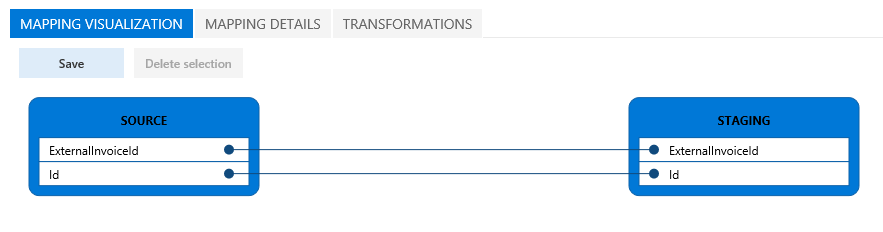

---
# required metadata

title: Import the Chinese Golden Tax data entity
description: This topic explains how to import the Chinese Golden Tax data entity into Microsoft Microsoft Dynamics 365 for Finance and Operations, Enterprise edition.
author: ShylaThompson
manager: AnnBe
ms.date: 06/20/2017
ms.topic: article
ms.prod: 
ms.service: dynamics-ax-applications
ms.technology: 

# optional metadata

# ms.search.form: 
# ROBOTS: 
audience: IT Pro
# ms.devlang: 
ms.reviewer: shylaw
ms.search.scope: Core, Operations, UnifiedOperations
# ms.tgt_pltfrm: 
ms.custom: 261394
ms.search.region: China (PRC)
# ms.search.industry: 
ms.author: shylaw
ms.search.validFrom: 2016-11-30
ms.dyn365.ops.version: Version 1611

---

# Import the Chinese Golden Tax data entity

[!include[banner](../includes/banner.md)]

This topic explains how to import the Chinese Golden Tax data entity into Microsoft Microsoft Dynamics 365 for Finance and Operations, Enterprise edition.

To import the Chinese Golden Tax data entity, complete the following steps.

1.  Go to **System administration** &gt; **Data management**.
2.  Click the **Import** tile to create a new import project.
3.  Enter a name for the project.
4.  Select the source data format **XML-Element**.
5.  In the **Entity name** field, select **Tax integration import** entity.
6.  Click upload and then browse to the location of your golden tax data file.
7.  Click **View map** on the **Tax integration import** tile.
8.  On the **Transformations** tab, click **New**.
9.  Click **Upload file** and browse to the location of the .xlst file.

For specific steps that show how to import a data entity, refer to [Importing data by using entities](../../dev-itpro/data-entities/build-consuming-data-entities.md). To practice the Chinese Golden Tax data entity import using the demo data company CNMF, download the following files from [CustomerSource](https://mbs.microsoft.com/customersource/global/ax/learning/samplefilestaximportchina).

-   **ImportSampleFile.xml** - This file is the Chinese Golden Tax data entity composite.
-   **Tax-Import-to-XML.xslt** - This file is used as the transformational file mapping.

The following screenshot shows an example mapping visualization for the Chinese Golden Tax data entity.       

For more information, see [Golden tax integration export setup](./tasks/golden-tax-integration-export-setup.md).

