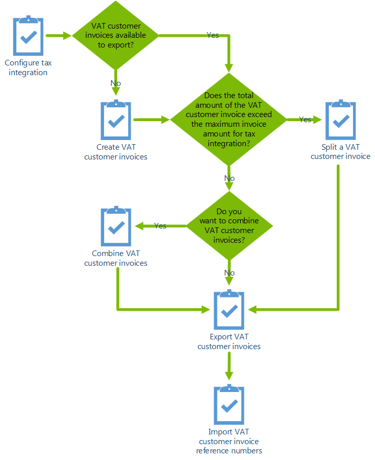

---
# required metadata

title: Configure tax integration for China
description: This topic describes the process for configuring tax integration for China.
author: ShylaThompson
manager: AnnBe
ms.date: 06/20/2017
ms.topic: article
ms.prod: 
ms.service: dynamics-ax-applications
ms.technology: 

# optional metadata

ms.search.form: CustParameters, VATInvoiceDescTable_CN, TaxProfileTable_CN
audience: Application User
# ms.devlang: 
ms.reviewer: shylaw
ms.search.scope: Core, Operations
# ms.tgt_pltfrm: 
ms.custom: 265264
ms.assetid: e5dbbbe1-935f-4fb4-a014-447916051628
ms.search.region: China (PRC)
# ms.search.industry: 
ms.author: leguo
ms.search.validFrom: 2016-11-30
ms.dyn365.ops.version: Version 1611

---

# Configure tax integration for China

[!include [banner](../includes/banner.md)]

This topic describes the process for configuring tax integration for China 

## Prerequisites for version 10.0 and later
In order to the system may output this code in the exported file, the following settings should be completed in order:

|Prequisite |Description |Additional info|
|------------|------------------------------|---------------------------------|
|Set up a hierarchy of product classification | You must set up a category hierarchy for the classification of goods and services and relate product items (good or service) with category node. Using this functionality, it is possible to set up any hierarchy, which necessary in a company.| [Create a hierarchy of product classification](../supply-chain/pim/tasks/create-hierarchy-product-classification.md)|
|Assign the new hierarchy to a tax integration profile | Go to **Account receivable > Tax integration > Tax integration profile** and then select the new category in the **Commodity code hierarchy** field.||
|Select a commodity code for invoice lines|For invoice lines that are not related to product items, such as free text invoice lines and project invoice lines or invoice lines created on the base of hour, expense and fee journals, you can set up a **Commodity code** in **Tax integration profile** page that will be used by default.||
|Identify the model mapping to use for import files | Go to **Account receivable > Periodic tasks > VAT invoice integration** and then click **Import**. Select the model mapping for import file from one or another provider (Aisino or BaiWang) depending on which provider software the company integrates exported invoices with. This selection should be made only one time (the system saves selected value).  To import txt file (<file name>_invoicing result.TXT) a user should set Import BaiWang txt file option to **Yes** and select **BaiWang – txt file mapping** in the **Model mapping** field.  To import txt file from Aisino or xml file from BaiWang (exported files from BaiWang software) a user should set **Import BaiWang txt file** option to **No** and select Aisino  or BaiWang – xml file mapping in the **Model mapping** field. ||
|Import LCS configurations|For integration with Aisino software it is necessary to import the following configuration from LCS:   - GoldenTax model  -	GST Export model mapping (CN)  -	GTS Export format (Aisino) (CN)  -	GTS Import model mapping (CN)  -	GTS Import format (Aisino) (CN)    For integration with BaiWang software it is necessary to import the following configuration from LCS:  -	GoldenTax model  -	GST Export model mapping (CN)  -	GTS Import model mapping (CN)  -	GTS Export format (BaiWang) (CN)  -	GTS Import format (BaiWang)-txt) (CN)  -	GTS Import format (BaiWang-xml) (CN)|[Download Electronic reporting configurations from Lifecycle Services](../../dev-itpro/analytics/download-electronic-reporting-configuration-lcs.md) |

   > [!NOTE] 
   > 
 A user may import txt file, received as response after import to BaiWang software or or xml files, exported from BaiWang software.

## Prerequisite for versions earlier than 10.0
Before you can configure tax integration, you must enable tax integration by selecting **Yes** for the **Integration with tax system** option on the **Accounts receivable parameters** page (**Accounts receivable** > **Setup** > **Accounts receivable parameters** > **Ledger and sales tax** > **General** tab).

## Configure tax ingtegration for China 

To configure tax integration for China, complete the following tasks.

1.  Create a new VAT invoice description on the **VAT invoice description** page. For example, you may need to set  the following parameters:
    -   **VAT invoice description ID** to InvoiceDescID01
    -   **Description** to 设备
    -   **Unit** to Box

2.  Create a new tax integration profile on the **Tax integration profiles** page. You can set up tax integration profiles to use when invoices are imported or exported. In the tax integration profile, you can specify the following:
    -   Sales tax code
    -   Maximum invoice amount
    -   Default description and unit for the golden tax invoice
    -   Whether to include non-deductible VAT invoices

The tax integration process is illustrated in the following diagram.

## Additional resources

- [Import the Chinese Golden Tax data entity (Not applicable for version 10.0 and later)](apac-chn-import-golden-tax-data-entity.md)
   
- [Chinese tax integration modification for VAT customer invoices FAQ](apac-chn-tax-integration-vat-customer-invoices.md)

- [Set up basic tax integration for China](./tasks/set-up-basic-tax-integration-profile-china.md)

