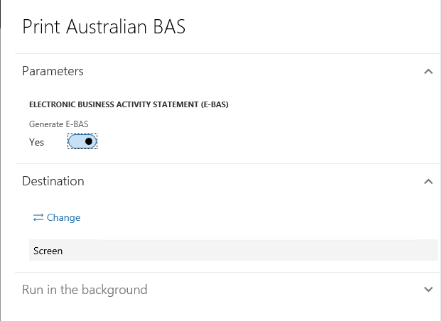

# Create a business vertical

1. Click **Tax > Setup > Sales tax > Business verticals**
2. Click **New** to create a record
3. Enter a name, description, and entity code for the new business vertical
4. Click **Close**

