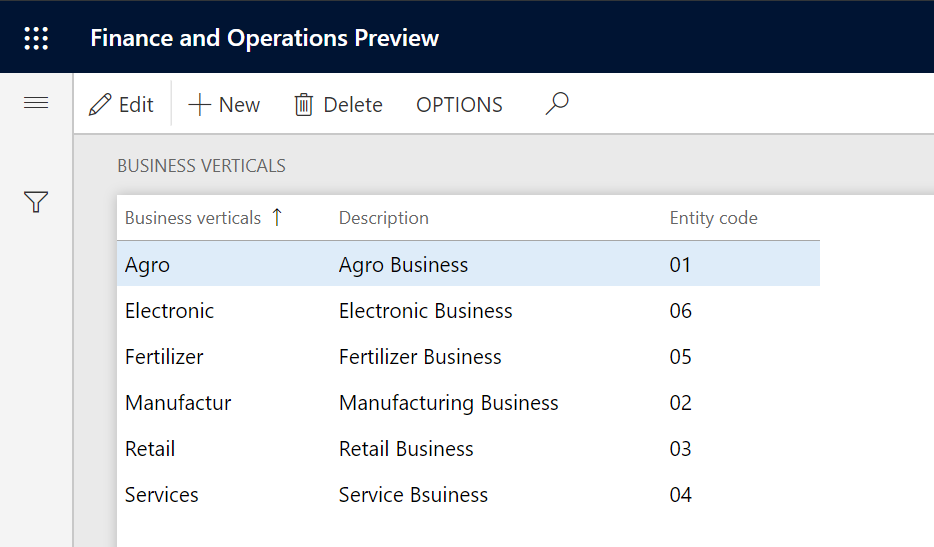

To enable India localization solution for GST in Dynamics 365 for finance and operation, below master data setup configurations are required:

- Define business vetical
- Update the state code and union territory
- Create a GSTIN master
- Define GSTIN numbers for the legal entity, warehouse, vendor, or customer masters
- HSN codes and Service accounting codes
- Create main accounts for the GST posting type
- Create a tax settlement period
- Attach the GSTIN to a tax registration group

This topic describes how to define business vertical

## Create a business vertical

1. Click **Tax > Setup > Sales tax > Business verticals**
2. Click **New** to create a record
3. Enter a name, description, and entity code for the new business vertical
4. Click **Close**

